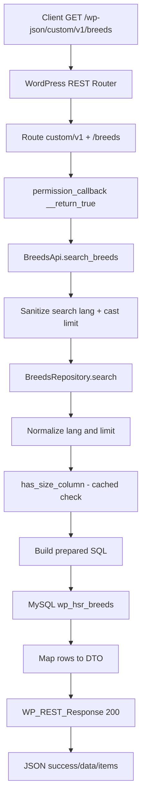

# Documentação Técnica Oficial
## Rota: GET /wp-json/custom/v1/breeds

Data da análise: 2026-08-06
Escopo da análise: implementação existente no plugin WordPress headless-secure-registration.

## 1. Visão Geral

### Objetivo da rota
Fornecer uma lista de raças de pets cadastradas em banco (`wp_hsr_breeds`), com suporte a:
- busca textual (`search`)
- seleção de idioma para campo principal de exibição (`lang`)
- limitação de quantidade (`limit`)

### Responsabilidade
A rota é responsável apenas por leitura de dados de raças e montagem de resposta REST padronizada (`success/data/items`).

Não identificado na implementação:
- autenticação específica para essa rota
- paginação por cursor/página
- retorno de metadados de paginação
- uso de serviço intermediário (`Service`) dedicado
- uso de model/entidade (`Model`) dedicada

### Fluxo completo (resumo)
1. WordPress recebe requisição REST.
2. Plugin registra a rota em `rest_api_init`.
3. Callback `search_breeds` recebe query params.
4. Callback sanitiza parâmetros.
5. Callback delega busca ao `BreedsRepository`.
6. Repositório normaliza idioma e limite.
7. Repositório monta SQL parametrizado (`$wpdb->prepare`).
8. Banco retorna linhas da tabela `wp_hsr_breeds`.
9. Repositório normaliza/mapeia linhas para DTO de saída.
10. Callback retorna `WP_REST_Response` com HTTP 200.

## 2. Endpoint

### Método HTTP
`GET` (registrado como `\WP_REST_Server::READABLE`).

### URL
`/wp-json/custom/v1/breeds`

### Query Parameters aceitos
1. `search`
2. `lang`
3. `limit`

### Obrigatórios
Nenhum.

### Opcionais
- `search` (string)
- `lang` (string)
- `limit` (inteiro)

### Valores padrão efetivos
- `search`: `""` (string vazia)
- `lang`: qualquer valor diferente de `en` cai para `pt`
- `limit`: se `<= 0`, callback define `10`; no repositório é limitado ao intervalo `[1, 500]`

### Tipos e validações
- `search`
  - entrada: qualquer tipo convertido para string
  - sanitização: `sanitize_text_field`
  - validação de conteúdo: não há regex/whitelist
- `lang`
  - entrada: qualquer tipo convertido para string
  - sanitização: `sanitize_text_field`
  - normalização: `strtolower($lang) === 'en' ? 'en' : 'pt'`
- `limit`
  - entrada: cast para inteiro `(int)`
  - regra 1 (API): se `<= 0` => `10`
  - regra 2 (Repository): `max(1, min(500, limit))`

### Exemplo de chamada
```bash
curl "http://localhost:8080/wp-json/custom/v1/breeds?search=maltes&lang=pt-br&limit=12"
```

Observação importante de regra:
- `lang=pt-br` resulta em idioma efetivo `pt`, pois somente `en` é reconhecido explicitamente.

## 3. Headers

### Headers observados no exemplo
- `Accept: */*`
- `Origin: http://localhost:5173`
- `Referer: http://localhost:5173/`

### Headers realmente obrigatórios para essa rota
Nenhum.

### Headers usados diretamente pela implementação da rota
Não identificado na implementação.

A função `search_breeds` não lê headers do request.

### Headers ignorados pela implementação da rota
- `Accept`
- `Origin`
- `Referer`

(ignorados no código da rota/callback; podem ser processados por camadas globais do WordPress servidor/proxy, fora do callback.)

### Observação de CORS no plugin
Existe filtro global:
- `add_filter('rest_allowed_cors_headers', [$this, 'allow_rest_cors_headers'])`
- adiciona `x-session-token` à lista de headers permitidos.

Esse comportamento não é consumido diretamente por `/custom/v1/breeds`, mas existe no mesmo plugin.

## 4. Fluxo Interno Completo

### 4.1 Bootstrap e registro de rota (ciclo de vida do plugin)
1. Arquivo principal do plugin é carregado pelo WordPress.
2. `HSR_Autoloader::register()` registra autoload das classes namespace `HSR\`.
3. Hook `plugins_loaded` instancia `HSR\Plugin` e executa `Plugin::boot()`.
4. `Plugin::boot()` chama `OnboardingSchema::ensure()`.
5. `OnboardingSchema::ensure()` verifica versão e existência da tabela `hsr_breeds`; se necessário executa `migrate()`.
6. `Plugin::boot()` instancia `BreedsRepository`.
7. `Plugin::boot()` instancia `BreedsApi` com `BreedsRepository`.
8. `Plugin::boot()` registra `add_action('rest_api_init', [$breedsApi, 'register_routes'])`.
9. Quando `rest_api_init` dispara, `BreedsApi::register_routes()` registra:
   - namespace: `custom/v1`
   - route: `/breeds`
   - methods: `READABLE`
   - callback: `search_breeds`
   - permission_callback: `__return_true`

### 4.2 Execução por requisição
1. Cliente chama `GET /wp-json/custom/v1/breeds?...`.
2. WordPress faz match da rota `custom/v1/breeds`.
3. `permission_callback` (`__return_true`) aprova acesso sem autenticação.
4. WordPress chama `BreedsApi::search_breeds(WP_REST_Request $request)`.
5. `search_breeds` lê params:
   - `search = sanitize_text_field((string) $request->get_param('search'))`
   - `lang = sanitize_text_field((string) $request->get_param('lang'))`
   - `limit = (int) $request->get_param('limit')`
6. `search_breeds` aplica fallback:
   - se `limit <= 0`, define `limit = 10`
7. `search_breeds` chama `BreedsRepository::search($search, $lang, $limit)`.
8. `BreedsRepository::search` normaliza:
   - idioma: `en` ou `pt`
   - coluna de ordenação/nome: `name_en` ou `name_pt`
   - limite final: `[1, 500]`
9. `BreedsRepository::search` detecta coluna opcional `size` via `has_size_column()`.
10. `BreedsRepository::search` monta SQL:
    - com busca (`search != ''`): `WHERE name_pt LIKE ? OR name_en LIKE ?`
    - sem busca: sem `WHERE`
    - `ORDER BY` na coluna correspondente ao idioma
    - `LIMIT ?`
11. Repositório executa `get_results(..., ARRAY_A)`.
12. Se retorno não for array, retorna `[]`.
13. Se retorno for array, aplica `array_map` para montar itens:
    - `id` inteiro
    - `name` conforme idioma selecionado
    - `name_pt` e `name_en`
    - `size` normalizado para `small|medium|large`, senão string vazia
14. `search_breeds` constrói `WP_REST_Response` com status 200:
```json
{
  "success": true,
  "data": {
    "items": [ ... ]
  }
}
```
15. WordPress envia JSON ao cliente.

## 5. Arquivos Envolvidos

1. `pawbowl-wp/wp/wp-content/plugins/headless-secure-registration/headless-secure-registration.php`
- Ponto de entrada do plugin.
- Registra activation hook.
- Registra boot em `plugins_loaded`.

2. `pawbowl-wp/wp/wp-content/plugins/headless-secure-registration/includes/class-hsr-autoloader.php`
- Resolve classes `HSR\*` para arquivos `src/class-*.php`.
- Necessário para carregar `BreedsApi`, `BreedsRepository`, `Plugin`, etc.

3. `pawbowl-wp/wp/wp-content/plugins/headless-secure-registration/src/class-plugin.php`
- Composição de dependências.
- Instancia `BreedsRepository` e `BreedsApi`.
- Conecta `register_routes` ao hook `rest_api_init`.
- Define filtro global de CORS headers (`x-session-token`).

4. `pawbowl-wp/wp/wp-content/plugins/headless-secure-registration/src/class-breeds-api.php`
- Classe de API/controller da rota.
- Registra endpoint REST.
- Implementa callback `search_breeds`.

5. `pawbowl-wp/wp/wp-content/plugins/headless-secure-registration/src/class-breeds-repository.php`
- Acesso a banco para raças.
- Monta SQL de busca/listagem.
- Normaliza dados de saída.
- Possui método privado de detecção de coluna opcional.

6. `pawbowl-wp/wp/wp-content/plugins/headless-secure-registration/src/class-onboarding-schema.php`
- Garante migração de schema.
- Cria tabela `hsr_breeds` e índices.
- Chama importador de raças na migração.

7. `pawbowl-wp/wp/wp-content/plugins/headless-secure-registration/src/class-breeds-importer.php`
- Importa seed CSV quando tabela está vazia.
- Normaliza encoding e campo `size`.
- Pode afetar dados retornados pela rota.

8. `pawbowl-wp/wp/wp-content/plugins/headless-secure-registration/data/wp_hsr_breeds_corrigido.csv`
- Fonte de dados inicial para tabela de raças.

## 6. Funções Executadas

### 6.1 Funções diretamente no caminho da rota

1. `Plugin::boot(): void`
- Parâmetros: nenhum.
- Retorno: `void`.
- Responsabilidade:
  - garantir schema
  - montar dependências
  - registrar hooks REST

2. `OnboardingSchema::ensure(): void`
- Parâmetros: nenhum.
- Retorno: `void`.
- Responsabilidade:
  - verificar versão/migração
  - assegurar existência de tabela de raças

3. `BreedsApi::__construct(BreedsRepository $repository)`
- Parâmetros: instância de repositório.
- Retorno: construtor.
- Responsabilidade: injeção de dependência.

4. `BreedsApi::register_routes(): void`
- Parâmetros: nenhum.
- Retorno: `void`.
- Responsabilidade: registrar `GET /custom/v1/breeds`.

5. `BreedsApi::search_breeds(WP_REST_Request $request): WP_REST_Response`
- Parâmetros: request REST.
- Retorno: resposta REST 200 com `success/data/items`.
- Responsabilidade:
  - extrair/sanitizar query params
  - aplicar fallback de `limit`
  - delegar busca ao repositório
  - montar resposta JSON

6. `BreedsRepository::__construct(?wpdb $db = null)`
- Parâmetros: instância opcional de `wpdb`.
- Retorno: construtor.
- Responsabilidade:
  - resolver conexão de banco (`global $wpdb` por padrão)
  - definir tabela alvo `${prefix}hsr_breeds`

7. `BreedsRepository::search(string $search = '', string $lang = 'pt', int $limit = 10): array`
- Parâmetros:
  - `search`: termo de busca
  - `lang`: idioma
  - `limit`: limite máximo solicitado
- Retorno: array de itens de raça.
- Responsabilidade:
  - normalizar idioma e limite
  - montar e executar SQL parametrizado
  - mapear linhas para formato de API

8. `BreedsRepository::has_size_column(): bool` (privada)
- Parâmetros: nenhum.
- Retorno: `bool`.
- Responsabilidade:
  - verificar uma única vez se coluna `size` existe
  - cachear resultado em propriedade privada

### 6.2 Outras funções no mesmo repositório (não executadas por esta rota)

1. `BreedsRepository::find_size_by_name(string $breedName): string`
- Não faz parte do caminho de execução de `GET /breeds`.
- É usada em outro fluxo (`OnboardingService`) para inferência de porte.

### 6.3 Funções WordPress/PHP utilizadas no callback e repositório
- `sanitize_text_field`
- `esc_sql`
- `$wpdb->prepare`
- `$wpdb->esc_like`
- `$wpdb->get_results`
- `$wpdb->get_var`
- `array_map`
- `strtolower`
- `trim`
- `in_array`

## 7. Banco de Dados

### Tabela principal consultada
`{prefix}hsr_breeds` (ex.: `wp_hsr_breeds`)

### Colunas relevantes para a rota
- `id` (bigint unsigned, PK)
- `name_pt` (varchar 191)
- `name_en` (varchar 191)
- `size` (varchar 50, nullable; pode não existir em instalações antigas)
- `created_at` (datetime)
- `updated_at` (datetime)

### Índices definidos em migração
- `PRIMARY KEY (id)`
- `KEY idx_name_pt (name_pt)`
- `KEY idx_name_en (name_en)`

### Joins
Não identificado na implementação.

### SQL executado pela rota

#### 1) Verificação da coluna opcional `size`
```sql
SHOW COLUMNS FROM {prefix}hsr_breeds LIKE 'size'
```

#### 2) Consulta com busca (`search != ''`)
```sql
SELECT id, name_pt, name_en, size
FROM {prefix}hsr_breeds
WHERE name_pt LIKE :like OR name_en LIKE :like
ORDER BY {name_column} ASC
LIMIT :limit
```

Observações:
- `:like = "%{search_escapado}%"` (busca parcial em qualquer posição)
- `{name_column}` é `name_pt` ou `name_en`
- se coluna `size` não existir, SELECT usa `'' AS size`

#### 3) Consulta sem busca (`search == ''`)
```sql
SELECT id, name_pt, name_en, size
FROM {prefix}hsr_breeds
ORDER BY {name_column} ASC
LIMIT :limit
```

### WP_Query
Não identificado na implementação.

### Observações de uso de índice/performance
- Busca com `LIKE '%termo%'` tende a reduzir benefício de índice B-Tree.
- Ordenação por `name_pt`/`name_en` pode usar índice dependendo do plano e da combinação com filtro.

## 8. Regras de Negócio

1. Endpoint público (`permission_callback = __return_true`).
2. `lang` aceita efetivamente:
- `en` => nome principal em inglês
- qualquer outro valor => português (`pt`)
3. Busca sempre compara `name_pt` e `name_en`, independentemente do `lang`.
4. Ordenação é pela coluna do idioma efetivo (`name_pt` ou `name_en`).
5. `limit` não pode ser menor que 1 nem maior que 500 no repositório.
6. `limit <= 0` no callback vira 10 antes de chamar repositório.
7. Campo `size` é opcional no schema histórico:
- se coluna não existir, retorno traz `size: ""`
8. `size` no payload final só aceita valores:
- `small`, `medium`, `large`
- qualquer outro valor é convertido para `""`
9. Falha de leitura de banco (`get_results` não-array) resulta em lista vazia, não erro.
10. Resposta de sucesso mantém formato fixo com `success: true` mesmo quando `items` vazio.

## 9. Estrutura da Resposta

### JSON retornado (shape)
```json
{
  "success": true,
  "data": {
    "items": [
      {
        "id": 1,
        "name": "Labrador Retriever",
        "name_pt": "Labrador Retriever",
        "name_en": "Labrador Retriever",
        "size": "large"
      }
    ]
  }
}
```

### Campos e tipos
- `success`: `boolean`
- `data`: `object`
- `data.items`: `array`
- `data.items[].id`: `number` (inteiro)
- `data.items[].name`: `string`
- `data.items[].name_pt`: `string`
- `data.items[].name_en`: `string`
- `data.items[].size`: `string` (`small|medium|large|""`)

### Pode ser null?
- Pelo código da rota/repositório, os campos retornados são forçados para tipos primitivos; `null` não é emitido nesses campos.

### Pode vir vazio?
- `data.items` pode vir `[]`.
- Strings (`name`, `name_pt`, `name_en`, `size`) podem vir vazias em registros incompletos/legados.

## 10. Tratamento de Erros

### Erros explícitos da implementação da rota
Não identificado na implementação.

A rota não retorna `WP_Error` e não possui validações que gerem `4xx` próprias.

### Possíveis respostas por comportamento do WordPress/infra
- `400`: Não identificado na implementação específica desta rota.
- `401`: Não identificado na implementação específica desta rota (rota pública).
- `403`: Não identificado na implementação específica desta rota (rota pública).
- `404`: possível se rota não estiver registrada/ativa no momento da requisição (`rest_no_route`).
- `405`: Não identificado na implementação; o WordPress pode responder "no route for URL and method" para método não suportado.
- `500`: Não identificado retorno explícito; pode ocorrer em falhas inesperadas (ex.: fatal error fora do fluxo normal).

### Estratégia interna em falha de consulta
Se `get_results` não retorna array, a implementação degrada para sucesso com lista vazia (`200` + `items: []`).

## 11. Performance

### Cache
- Cache de aplicação/transient para esta rota: Não identificado na implementação.
- Cache interno local no repositório:
  - resultado de `has_size_column()` é memorizado na propriedade `$hasSizeColumn` por instância.

### Consultas por requisição
- Comportamento típico por requisição:
  1. 1 consulta `SHOW COLUMNS` (somente na primeira chamada por instância, por causa do cache local).
  2. 1 consulta `SELECT` principal.

### Complexidade
- Mapeamento em PHP: `O(n)` com `n = quantidade de linhas retornadas` (até `limit`).
- Consulta SQL sem busca: custo dependente de cardinalidade e índice de ordenação.
- Consulta SQL com busca `%termo%`: tendência a scan mais amplo.

### Gargalos potenciais
- `LIKE '%texto%'` em duas colunas.
- ausência de paginação estruturada (cursor/page) para catálogo grande.

## 12. Dependências

### WordPress
- REST API (`register_rest_route`, `WP_REST_Request`, `WP_REST_Response`)
- Hook system (`add_action`, `add_filter`)
- DB API (`wpdb`)
- Sanitização (`sanitize_text_field`)

### Plugin local
- `HSR\Plugin`
- `HSR\BreedsApi`
- `HSR\BreedsRepository`
- `HSR\OnboardingSchema`
- `HSR\BreedsImporter`
- `HSR_Autoloader`

### Banco
- tabela `{prefix}hsr_breeds`

### WooCommerce
Não identificado na implementação da rota.

### APIs externas
Não identificado na implementação da rota.

### Helpers/Traits/Filters/Actions específicos da rota
- Helpers dedicados: Não identificado na implementação.
- Traits: Não identificado na implementação.
- Filters específicos da rota: Não identificado na implementação.
- Actions específicas da rota: registro em `rest_api_init`.

## 13. Sequência de Execução (Mermaid)



## 14. Requisitos para Migração para Node.js

### 14.1 Componentes mínimos
1. Route
- `GET /api/v1/breeds` (ou manter `/wp-json/custom/v1/breeds` no gateway de compatibilidade).

2. Controller
- extrair `search`, `lang`, `limit` da query
- sanitizar/normalizar
- delegar ao service/repository
- retornar contrato JSON idêntico

3. Service
- opcional mas recomendado para concentrar regras de negócio (`lang`, `limit`, contrato de saída)

4. Repository
- executar SQL parametrizado
- mapear DTO
- implementar fallback de `size` quando ausente

5. DTO/Schema
- `BreedItemDto`
- `BreedsResponseDto`

6. Validator
- query schema (`zod`, `joi`, `class-validator`):
  - `search`: string opcional
  - `lang`: string opcional
  - `limit`: inteiro opcional

7. Error handler middleware
- padronizar 4xx/5xx
- decidir política equivalente ao WP (retornar lista vazia vs lançar erro)

8. Migration SQL
- criar tabela `hsr_breeds`
- índices em `name_pt` e `name_en`

9. Seed/import
- importar CSV inicial equivalente
- normalizar encoding e `size`

10. Tipos/Interfaces
- TypeScript interfaces para request e response

### 14.2 Regras obrigatórias para compatibilidade funcional
1. `lang`:
- somente `en` mantém inglês
- qualquer outro valor cai para `pt`

2. `limit`:
- se `<=0`, default 10
- clamp final `[1,500]`

3. busca:
- pesquisar em `name_pt` OU `name_en`
- usar `%termo%`

4. ordenação:
- por coluna do idioma efetivo

5. payload:
- manter estrutura:
```json
{
  "success": true,
  "data": { "items": [] }
}
```

6. `size`:
- restringir saída para `small|medium|large`
- demais valores => `""`

### 14.3 Sugestão de contratos (Node)
```ts
type BreedSize = 'small' | 'medium' | 'large' | '';

interface BreedItemDto {
  id: number;
  name: string;
  name_pt: string;
  name_en: string;
  size: BreedSize;
}

interface BreedsResponseDto {
  success: true;
  data: {
    items: BreedItemDto[];
  };
}
```

### 14.4 Índices e tuning recomendados
- manter índices B-Tree em `name_pt`, `name_en`
- se catálogo crescer muito e busca parcial for crítica, avaliar:
  - fulltext index
  - trigram/GIN (PostgreSQL)
  - mecanismo de busca dedicado

## 15. Melhorias Sugeridas

1. Adicionar validação declarativa dos parâmetros no registro da rota (`args` em `register_rest_route`).
2. Retornar metadados de paginação (`total`, `limit`, `offset/page`).
3. Implementar cache de leitura para consultas frequentes sem `search`.
4. Definir política explícita para falhas de banco (hoje pode mascarar erro retornando `items: []`).
5. Adicionar logs estruturados e métricas (latência, cardinalidade, cache hit).
6. Padronizar internacionalização de `lang` (`pt-BR`, `en-US`) com mapeamento explícito.
7. Criar testes automatizados de contrato da rota (snapshot JSON + cenários de limite/idioma).
8. Considerar endpoint de detalhe por `id` e paginação robusta para catálogos maiores.

## 16. Inventário de Itens Não Identificados

- Service dedicado para a rota: Não identificado na implementação.
- Model/Entity dedicada para raça: Não identificado na implementação.
- Trait relacionada à rota: Não identificado na implementação.
- Hook/filter exclusivo para pós-processar resposta da rota: Não identificado na implementação.
- Uso de `WP_Query`: Não identificado na implementação.
- Chamadas para API externa: Não identificado na implementação.
- Controle de autorização específico na rota: Não identificado na implementação.
- Cache de transients para resposta da rota: Não identificado na implementação.

## 17. Referência de Código Auditado

- `pawbowl-wp/wp/wp-content/plugins/headless-secure-registration/headless-secure-registration.php`
- `pawbowl-wp/wp/wp-content/plugins/headless-secure-registration/includes/class-hsr-autoloader.php`
- `pawbowl-wp/wp/wp-content/plugins/headless-secure-registration/src/class-plugin.php`
- `pawbowl-wp/wp/wp-content/plugins/headless-secure-registration/src/class-breeds-api.php`
- `pawbowl-wp/wp/wp-content/plugins/headless-secure-registration/src/class-breeds-repository.php`
- `pawbowl-wp/wp/wp-content/plugins/headless-secure-registration/src/class-onboarding-schema.php`
- `pawbowl-wp/wp/wp-content/plugins/headless-secure-registration/src/class-breeds-importer.php`
- `pawbowl-wp/wp/wp-content/plugins/headless-secure-registration/data/wp_hsr_breeds_corrigido.csv`
