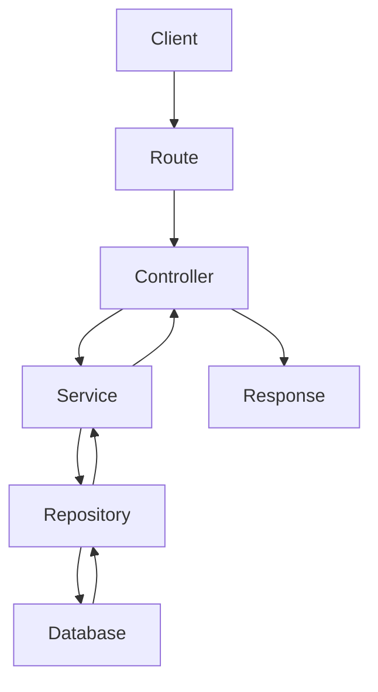

# Prompt para Documentar uma Rota WordPress e Migrar para Node.js

## Objetivo

Gerar uma documentação técnica extremamente detalhada de uma rota existente no WordPress para que ela possa ser reimplementada posteriormente em Node.js (Express ou Fastify).

---

## Contexto

Rota:

```
GET /wp-json/custom/v1/breeds
```

Exemplo:

```bash
curl "http://localhost:8080/wp-json/custom/v1/breeds?search=maltes&lang=pt-br&limit=12"
```

---

## Instruções

Analise toda a implementação da rota.

Não analise apenas o controller.

Procure por todos os componentes envolvidos:

- register_rest_route
- Callback
- Controller
- Service
- Repository
- Model
- Helpers
- Traits
- Filters
- Actions
- SQL
- WP_Query
- APIs externas
- Funções privadas
- Classes auxiliares

A documentação deve explicar todo o fluxo da requisição.

---

# Estrutura esperada

## 1. Visão Geral

- Objetivo
- Responsabilidade
- Fluxo resumido

---

## 2. Endpoint

- Método
- URL
- Query Params
- Body
- Headers
- Validações

---

## 3. Fluxo Completo

Explique toda a execução desde a chegada da requisição até a resposta final.

---

## 4. Arquivos Envolvidos

Liste todos os arquivos utilizados e explique suas responsabilidades.

---

## 5. Métodos Executados

Documente todas as funções chamadas.

Para cada função informe:

- parâmetros
- retorno
- responsabilidade

---

## 6. Banco de Dados

Documente:

- tabelas
- colunas
- índices
- joins
- SQL
- WP_Query

---

## 7. Regras de Negócio

Documente todas as regras encontradas.

---

## 8. Estrutura da Resposta

Mostre um JSON de exemplo.

Explique todos os campos.

Informe tipos.

Campos opcionais.

Campos nulos.

---

## 9. Tratamento de Erros

Documente todos os retornos de erro.

---

## 10. Performance

Documente:

- cache
- consultas
- otimizações

---

## 11. Dependências

Liste:

- Plugins
- Helpers
- Services
- APIs
- Hooks
- Filters
- Banco

---

## 12. Fluxograma

Gerar um diagrama Mermaid representando o fluxo.

Exemplo:



---

## 13. Guia de Migração para Node.js

Explicar como implementar a rota em Node.js.

Incluir:

- Controllers
- Services
- Repository
- DTO
- Validators
- Schemas
- Interfaces
- Tipagens
- Rotas
- Middlewares
- Tratamento de Erros
- Migrations
- Índices

---

## 14. Melhorias Sugeridas

Listar possíveis melhorias arquiteturais.

---

## Regras

- Não inventar informações.
- Quando algo não existir, escrever:
  > Não identificado na implementação.
- A documentação deve ser suficientemente detalhada para que outro desenvolvedor consiga reimplementar a rota sem consultar o projeto WordPress.
- Sempre incluir exemplos de requisição e resposta quando possível.
