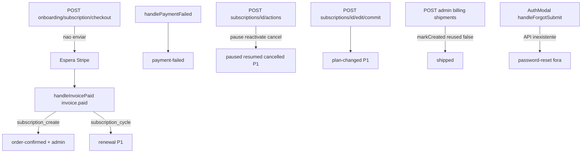

# Pontos de disparo dos e-mails Eden

O preview em [`previews/index.html`](./previews/index.html) é o visual. Este documento diz **onde** cada carta entra no código.

Não disparar no checkout (`POST /api/v1/onboarding/subscription/checkout`): o pagamento ainda pode estar em SCA/3DS. A confirmação espera `invoice.paid`.

## Mapa

| Carta | Evento | Ponto | Estado |
|---|---|---|---|
| OTP | register / otp resend | [`auth.service.js`](../../src/services/auth.service.js) | ligado |
| Convite staff | criar / reenviar usuário | [`admin-users.service.js`](../../src/services/admin-users.service.js) | ligado |
| Privacidade | send-verification | [`privacy.service.js`](../../src/services/privacy.service.js) | ligado |
| Pedido confirmado | `invoice.paid` + `billing_reason=subscription_create` | [`stripe-webhook.service.js`](../../src/services/stripe-webhook.service.js) `handleInvoicePaid` | **P0 ligado** |
| Admin nova assinatura | o mesmo `invoice.paid` | mesmo sítio; destinatários `MAIL_OPS_TO` | **P0 ligado** |
| Falha de pagamento | `invoice.payment_failed` / `payment_intent.payment_failed` | `handlePaymentFailed` (antes do early return `active`/`trialing`) | **P0 ligado** |
| Enviado + rastreio | staff cria label UPS | [`ups-shipment.service.js`](../../src/services/ups-shipment.service.js) após `markCreated`, só se `reused: false` | **P0 ligado** |
| Renovação | `invoice.paid` + `subscription_cycle` | `handleInvoicePaid` | P1 |
| Pausa / retomar / cancel | `POST /api/v1/subscriptions/:id/actions` | [`subscriptions-actions.repository.js`](../../src/infrastructure/repositories/subscriptions-actions.repository.js) após Stripe OK | P1 |
| Mudança de plano | `POST .../edit/commit` | [`subscriptions-edit-commit.service.js`](../../src/services/subscriptions-edit-commit.service.js) se não `edit_payment_pending`; senão `handleInvoicePaid` com `promotedPending` | P1 |
| Reset de senha | — | UI stub em `AuthModal.handleForgotSubmit`; sem rota/token | **fora** (precisa de API nova) |

`ADMIN_EMAILS` é allowlist de papel, **não** destinatário. Ops: `MAIL_OPS_TO`. CTAs da loja: `STORE_APP_URL` (default `http://localhost:5173`).

## Idempotência

Dois níveis:

1. **Evento Stripe** — [`insertIfNew`](../../src/infrastructure/repositories/stripe-webhook-events.repository.js) (`UNIQUE event_id`). Retry do mesmo `evt_…` não reprocessa o webhook.
2. **Carta** — tabela `subscription_mail_claims` (`UNIQUE subscription + template + reference_id`). `claimMailSend` faz `INSERT`; duplicate key → não envia. `sent_at` só depois do SMTP OK.

Pagamento no ledger e “e-mail enviado” são estados **separados**. Ordem: upsert do pagamento **commitado** → claim → SMTP → `sent_at`. Falha de e-mail não desfaz o pagamento nem o label UPS.

Não usar “invoice já pago no checkout” como proxy de e-mail enviado.

## Limitação conhecida (P0)

Se o SMTP falhar **depois** do claim, o webhook já respondeu 200 e o `evt_…` já está persistido. O Stripe **não** reentrega. O claim fica com `sent_at` NULL — visível no banco, sem botão no painel.

## TODO P1

Reenvio manual no admin para claims com `sent_at` NULL (sem reprocessar o pagamento). Também: renovação, pausa, retomar, cancelamento, mudança de plano, API de reset de senha.

## Envs

| Variável | Uso |
|---|---|
| `STORE_APP_URL` | CTA `/dashboard/plans` |
| `MAIL_OPS_TO` | Lista de e-mails da operação (vírgula). Vazio = skip do aviso admin |
| `ADMIN_APP_URL` | Link no e-mail admin (já existia) |
| SMTP `AUTH_*` | Transporte compartilhado com OTP |
