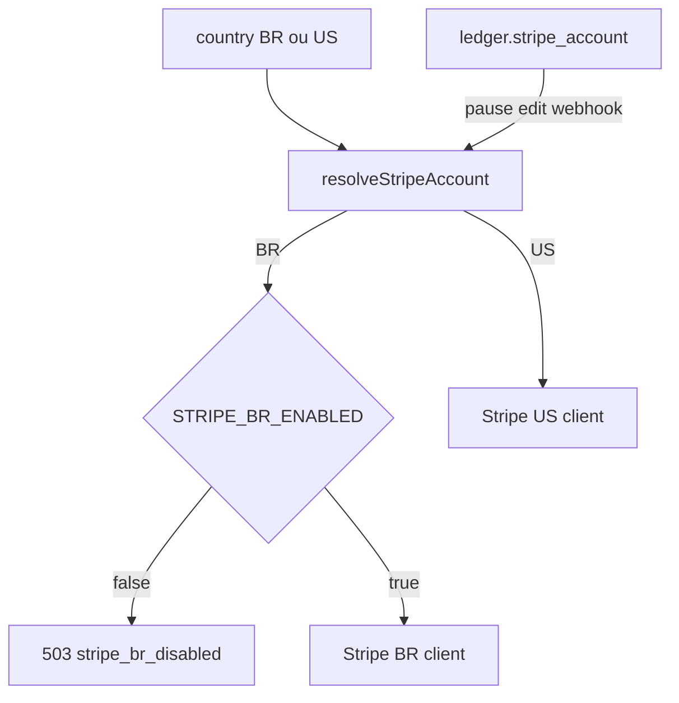

# PAY-01 — Separar Stripe BR e Stripe US

**Status do código:** os todos do plano acima estão **completed**. Cutover (secrets, catálogo BR, cupons BR, webhooks, flag): [o-que-alterar-para-funcionar.md](./o-que-alterar-para-funcionar.md). Como pegar keys / cadastrar webhooks US e BR: [COMO-CONFIGURAR-STRIPE.md](./COMO-CONFIGURAR-STRIPE.md). O que ficou fora ou incompleto: [definicoes-nao-desenvolvidas.md](./definicoes-nao-desenvolvidas.md).

Escopo: duas contas Stripe independentes (não Connect). Checkout, catálogo, cupons, webhook e admin passam a escolher a conta pelo país. **PIX/boleto e CPF ficam fora.** Assinaturas já existentes na secret atual são backfill `us`.

Criação de objetos BR em produção só com `STRIPE_BR_ENABLED=true` (kill switch). Sem isso, checkout BR não chama a conta BR — evita `cus_`/`sub_` órfãos irreversíveis.

Roteamento:

- **Criação** (checkout, preview, payment methods, catalog sync, cupom 1ª compra): `address.country` ou [`parseRequestMarket`](eden-bowls-backend/src/api/validators/market.validator.js) (`body/query/header` + domínio).
- **Mutação posterior** (pause/resume/cancel/edit/PDF/timeline): **sempre** `stripe_subscriptions.stripe_account` persistido. Não recalcular pelo país atual do usuário.
- BR = BRL na conta BR. US = USD + `automatic_tax` na conta US.

Objetos `cus_`, `pm_`, `price_`, `sub_`, `promo_`, `prod_` não atravessam contas. `confirmCardPayment` só funciona se o Elements usou a publishable key da mesma conta que gerou o `client_secret`.

---

## 1. Backend — registry, env, apiVersion, kill switch

Arquivos: [`src/config/env.js`](eden-bowls-backend/src/config/env.js), [`.env.example`](eden-bowls-backend/.env.example), [`.env.qa.example`](eden-bowls-backend/.env.qa.example), compose, [`src/index.js`](eden-bowls-backend/src/index.js).

Novas vars (US herda as atuais se as `_US` estiverem vazias):

- `STRIPE_BR_SECRET_KEY` / `STRIPE_US_SECRET_KEY` (fallback: `STRIPE_SECRET_KEY` → US)
- `STRIPE_BR_WEBHOOK_SECRET` / `STRIPE_US_WEBHOOK_SECRET` (fallback: `STRIPE_WEBHOOK_SECRET` → US)
- `STRIPE_BR_SHIPPING_PRODUCT_ID` / `STRIPE_US_SHIPPING_PRODUCT_ID` (fallback: `STRIPE_SHIPPING_PRODUCT_ID` → US)
- `STRIPE_US_AUTOMATIC_TAX` permanece só no client US
- `STRIPE_BR_ENABLED` (`false` por default). `true` só depois de secrets + catalog sync + cupons BR mapeados
- `STRIPE_API_VERSION` **obrigatória e compartilhada** pelos dois clients (hoje `2025-09-30.clover` em [`.env.example`](eden-bowls-backend/.env.example)). Conta BR nova no Dashboard pode nascer com outra API version; o SDK **não** herda a default da conta — passa `apiVersion` explícita em `createStripeSdk` nos dois. Sem omitir.

Criar `src/core/stripe-account.js` (`br` | `us`) e `src/infrastructure/stripe/stripe-accounts.js`: dois `StripeBillingClient` + `get(account)`. Cada client guarda `account` para logs.

Kill switch na **criação** BR (checkout, preview tax Stripe, catalog sync BR, criar cupom BR). Mutação de `sub_` já persistida como `br` continua usando o client BR mesmo com a flag off (pause/webhook não podem ficar mudos). Sem secret BR configurada + flag on → 503 `stripe_br_not_configured`. Sem canary por % de tráfego: um % misturaria contas no mesmo usuário. Rollout = QA → flag on em prod.

Hoje um único client é injetado em checkout, preview, payment methods, actions, edit, detail, catalog, coupons, webhook, billing admin e cancelamento de perfil. Trocar por `getStripe(account)`.

---

## 2. Backend — persistência (mesmo MySQL; sem WP-CLI)

`wp_usermeta` **não** é outro banco WordPress. O Node já é dono da tabela no **mesmo** `DB_NAME`: TypeORM DataSource em [`src/infrastructure/db.js`](eden-bowls-backend/src/infrastructure/db.js), schema criado por [`1700000000003-create-auth-user-tables.js`](eden-bowls-backend/src/infrastructure/migrations/1700000000003-create-auth-user-tables.js), store em [`stripe-customer-store.js`](eden-bowls-backend/src/infrastructure/stripe/stripe-customer-store.js). A 0014 faz `UPDATE` de `meta_key` nessa tabela, no mesmo fluxo das outras migrations. **Não** há script PHP/WP-CLI.

Nova migration `1700000000014`:

| Tabela / meta | Mudança |
|---|---|
| `stripe_subscriptions` | coluna `stripe_account` `varchar(8)` NOT NULL default `'us'` |
| `stripe_webhook_events` | PK composta `(event_id, stripe_account)` — `evt_` é único **por conta** |
| `stripe_first_purchase_promos` | PK `(stripe_account, term_months)`; copiar linhas atuais para `us` |
| `wp_usermeta` (mesmo MySQL) | `_hsr_stripe_customer_id` → `_hsr_stripe_customer_id_us`; chave `_hsr_stripe_customer_id_br` nasce vazia no uso |

Rollback da 0014: drop coluna / restaurar PK; `UPDATE wp_usermeta SET meta_key='_hsr_stripe_customer_id' WHERE meta_key='_hsr_stripe_customer_id_us'`. Objetos já criados na conta BR **não** voltam — daí o kill switch.

Atualizar entities/repos: [`stripe-subscription.entity.js`](eden-bowls-backend/src/infrastructure/entities/stripe-subscription.entity.js), [`stripe-webhook-event.entity.js`](eden-bowls-backend/src/infrastructure/entities/stripe-webhook-event.entity.js), [`stripe-first-purchase-promo.entity.js`](eden-bowls-backend/src/infrastructure/entities/stripe-first-purchase-promo.entity.js), [`stripe-customer-store.js`](eden-bowls-backend/src/infrastructure/stripe/stripe-customer-store.js), [`subscription-ledger.repository.js`](eden-bowls-backend/src/infrastructure/repositories/subscription-ledger.repository.js).

`StripeCustomerStore.get/save` passam a exigir `account`. Sem isso, `ensureCustomer` (já cria outro `cus_` se a moeda não bate) **sobrescreve** o id da outra conta.

Gravar `stripe_account` também em `checkout_reference` no POST de checkout.

Catálogo: manter [`_stripe_price_ids_by_currency`](eden-bowls-backend/src/infrastructure/repositories/onboarding-subscription-checkout.repository.js) (`brl`/`usd` 1:1 com conta). Passar `_stripe_product_id` único para mapa por moeda/conta (`_stripe_product_ids_by_currency`), senão o sync BR reusa `prod_` da conta US.

---

## 3. Backend — fluxos que chamam Stripe

| Fluxo | Como resolve a conta |
|---|---|
| Checkout / preview / ACK | `address.country` (já lido em [`onboarding-subscription-checkout.service.js`](eden-bowls-backend/src/services/onboarding-subscription-checkout.service.js)); BR só se `STRIPE_BR_ENABLED` |
| Payment methods salvos | mercado do request (`parseRequestMarket`) + customer id daquela conta |
| Pause / resume / cancel / edit / detail | `ledger.stripe_account` (ignora kill switch) |
| Catalog sync | `market` já existe em [`admin-catalog.service.js`](eden-bowls-backend/src/services/admin-catalog.service.js) (`BR`/`US`) → client correspondente; sync BR respeita a flag |
| Cupons 1ª compra | query/body `account=br\|us`; rotas em [`admin.routes.js`](eden-bowls-backend/src/api/routes/admin.routes.js) |
| Profile cancel leftover | conta de cada `sub_` no ledger |
| Admin billing `dashboardUrl` | secret da conta da linha, não `this.secretKey` único ([`admin-billing.service.js`](eden-bowls-backend/src/services/admin-billing.service.js)) |

Checkout/preview devem devolver `stripe_account` no JSON para a loja confirmar a pk.

`previewSubscriptionInvoice` hoje força `country: 'US'` em [`stripe-billing-client.js`](eden-bowls-backend/src/infrastructure/stripe/stripe-billing-client.js) (~L374). Preview BR usa o client BR **sem** `automatic_tax` e com o país real.

### Observabilidade

Pino já está em [`src/core/logger.js`](eden-bowls-backend/src/core/logger.js). Toda operação/erro Stripe inclui `stripe_account` (`br`|`us`) no payload estruturado: checkout, webhook (`eventId`, `type`, `account`), catalog sync, cupom, actions/edit. `HttpError.details.stripe_account` nas falhas 502/503. Redact continua cobrindo secrets; **não** logar `sk_`/`whsec_`. Sem Sentry no repo hoje — o campo no JSON do Pino basta para o coletor que já consome stdout.

---

## 4. Backend — webhooks

Dois paths explícitos (secret óbvio, sem tentar os dois):

- `POST /stripe/v1/webhook/br`
- `POST /stripe/v1/webhook/us`
- Manter `POST /stripe/v1/webhook` como alias US só no cutover

[`stripe-webhook.routes.js`](eden-bowls-backend/src/api/routes/stripe-webhook.routes.js) + [`stripe-webhook.service.js`](eden-bowls-backend/src/services/stripe-webhook.service.js): `handle({ account, rawBody, signature })` usa o client/secret da conta, persiste `stripe_account` no evento e no upsert do ledger. `invoice.created` injeta frete com o `STRIPE_*_SHIPPING_PRODUCT_ID` da mesma conta. Assinatura inválida → 400 (não tenta o outro secret).

Atualizar script `stripe:listen` / docs [`ROTA_STRIPE_WEBHOOK.md`](eden-bowls-backend/docs/other-routers/ROTA_STRIPE_WEBHOOK.md) para dois forwards.

---

## 5. Loja — duas publishable keys

Arquivos: [`Checkout.tsx`](eden-bowls/src/pages/checkout/Checkout.tsx), [`EditSubscription.tsx`](eden-bowls/src/pages/dashboard/pages/EditSubscription.tsx), [`vite-env.d.ts`](eden-bowls/src/vite-env.d.ts), README, Dockerfile, `docker-compose.frontend.yml`.

- `VITE_STRIPE_PUBLISHABLE_KEY_BR` / `VITE_STRIPE_PUBLISHABLE_KEY_US` (fallback: `VITE_STRIPE_PUBLISHABLE_KEY` → US)
- Extrair helper `loadStripeForCountry(country)` — **não** `loadStripe` no topo do módulo com uma key só
- `Elements` e `createPaymentMethod` / `confirmCardPayment` usam a pk do `postalCountry` (já existe no checkout)
- Se o POST devolver `stripe_account` diferente da pk carregada, abortar com erro de config (evita `pm_` de uma conta no `sk_` da outra)
- Cartões salvos: listar só os `pm_` da conta do mercado atual
- `VITE_STRIPE_US_AUTOMATIC_TAX` continua só no preview US
- Se o backend recusar BR (`stripe_br_disabled`), mostrar erro de pagamento indisponível — não cair no Elements US

Edit de assinatura: a conta vem do detalhe (`stripe_account`); não usar o país do browser.

---

## 6. Admin — conta visível

Painel interno: reutilizar `PageFrame`, `FiltersBar`, badges de status. Sem paleta da loja.

- [`BillingPage.tsx`](eden-bowls-admin/src/pages/BillingPage.tsx): filtro + coluna Conta (`BR`/`US`)
- [`SubscriptionDetailPage.tsx`](eden-bowls-admin/src/pages/SubscriptionDetailPage.tsx): badge da conta; “Ver no Stripe” já usa `dashboardUrl` do backend (passa a apontar para a dashboard certa)
- [`CouponsPage.tsx`](eden-bowls-admin/src/pages/CouponsPage.tsx): seletor de conta; GET/PUT/POST de `/admin/stripe/first-purchase-promos*` e `promotion-codes` com `account=br|us`. Health `missing_in_stripe` por conta
- Catálogo: sync já tem `market`; o backend passa a gravar `price_`/`prod_` na conta do mercado. UI de detalhe pode mostrar os dois ids se já listar `stripePriceIdsByCurrency`

Contrato: backend devolve `stripeAccount` / `dashboardUrl` já corretos. Admin não escolhe secret.

**Mapa 1/3/6 meses duplicado é decisão consciente, não dívida.** `promo_`/`coupon_` são da conta; um id US não aplica no checkout BR. Não unificar depois sem fundir as merchant accounts. A UI replica o mapa por conta de propósito.

---

## 7. Testes (só o subconjunto afetado)

Backend (Jest `--runTestsByPath` / `--findRelatedTests`):

- Novo: resolver de conta + customer store por conta + `STRIPE_BR_ENABLED` bloqueia criação BR
- [`tests/stripe-webhook.routes.test.js`](eden-bowls-backend/tests/stripe-webhook.routes.test.js), [`stripe-webhook.service.test.js`](eden-bowls-backend/tests/stripe-webhook.service.test.js)
- **Isolamento de assinatura (obrigatório):** payload assinado com `STRIPE_BR_WEBHOOK_SECRET` em `POST /stripe/v1/webhook/us` → 400 e nenhum persist/dispatch; o inverso BR. Não tenta o outro secret. Isso é segurança, não só roteamento.
- [`onboarding-subscription-checkout.service.test.js`](eden-bowls-backend/tests/onboarding-subscription-checkout.service.test.js) — BR vs US escolhe clients diferentes
- [`stripe-coupon.service.test.js`](eden-bowls-backend/tests/stripe-coupon.service.test.js) + migration de promos
- [`stripe-subscription-ledger.migration.test.js`](eden-bowls-backend/tests/stripe-subscription-ledger.migration.test.js) + rename de `wp_usermeta`
- catalog sync por market (teste admin-catalog se existir)

Loja: Vitest do checkout / `EditSubscription` com as duas pks; não suíte Playwright inteira.

Admin: [`CouponsPage.test.tsx`](eden-bowls-admin/src/pages/CouponsPage.test.tsx), [`BillingPage.test.tsx`](eden-bowls-admin/src/pages/BillingPage.test.tsx), [`SubscriptionDetailPage.test.tsx`](eden-bowls-admin/src/pages/SubscriptionDetailPage.test.tsx).

---

## 8. Fora do git (checklist operacional)

Não bloqueia o código, mas o cutover precisa:

- Conta Stripe Brasil (KYC/CNPJ) + secrets test/live
- Recriar Products/Prices/Shipping product/Promotion Codes na conta BR (o sync admin cobre prices se o roteamento estiver certo)
- Dois webhooks em cada Dashboard (test+live × br+us)
- Não migrar `sub_` entre contas; backfill `stripe_account=us` nas linhas atuais
- Ligar `STRIPE_BR_ENABLED` só depois de sync + cupons BR verdes em QA
- **NF-e / obrigações fiscais BR:** fora deste ticket. Stripe Brasil cobra em BRL; emissão de nota **não** vem pronta no SDK. Confirmar **antes do go-live BR** que ISS/NF-e está coberto em outro fluxo (contábil, app fiscal, ou ticket próprio). PAY-01 não implementa nota fiscal.

---

## Ordem de implementação

O risco real não é `new Stripe(secret)`: é mutar uma `sub_` / confirmar PI / processar webhook com a secret errada. Por isso persistência, registry, pin de `apiVersion` e kill switch vêm antes da loja.
