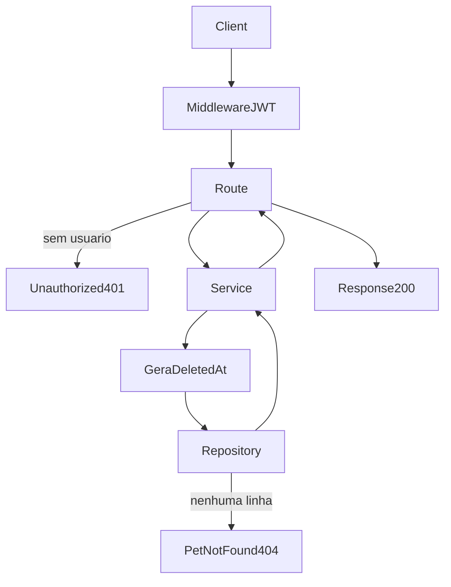

# Analise Tecnica - Rota Onboarding Delete Pet (versao atual Node.js)

## Escopo

Rota atual no backend Node:

- DELETE /api/v1/onboarding/pets/:petId

Origem no front-end:

- eden-bowls/src/services/onboardingApi.ts (`deletePetInApi`)

Arquivos analisados:

- eden-bowls-backend/src/api/routes/onboarding-pets-delete.routes.js
- eden-bowls-backend/src/services/onboarding-pets-delete.service.js
- eden-bowls-backend/src/infrastructure/repositories/onboarding-pets-delete.repository.js
- eden-bowls-backend/src/infrastructure/entities/onboarding-pet.entity.js
- eden-bowls-backend/src/infrastructure/migrations/1700000000004-create-user-owned-onboarding-tables.js
- eden-bowls-backend/src/api/middleware/bearer-token.middleware.js
- eden-bowls-backend/src/app.js
- eden-bowls-backend/tests/onboarding-pets-delete.routes.test.js
- eden-bowls-backend/tests/onboarding-pets-mutations.repository.test.js
- eden-bowls/src/services/onboardingApi.ts
- eden-bowls/src/pages/onboarding/Onboarding.tsx
- eden-bowls/src/pages/dashboard/pages/MyPets.tsx

## Responsabilidade da rota

A rota remove um pet da conta do usuario autenticado.

A exclusao e suave: preenche `deleted_at` na linha de `onboarding_pets`. Nao apaga o registro fisicamente e nao procura o pet em outras sessoes.

## Endpoint, Controller e permissao

### Endpoint

- Path: /api/v1/onboarding/pets/:petId
- Method: DELETE
- Registro: `registerOnboardingPetDeleteRoutes`
- Callback: handler inline em `onboarding-pets-delete.routes.js`

### Controller

- Exige `request.currentUser.id`
- Le `petId` de `request.params`
- Chama `OnboardingPetDeleteService.deletePet({ userId, petId })`
- Retorna envelope `{ success: true, data }` com status 200

### Regra de acesso

A rota exige JWT de usuario:

1. `Authorization: Bearer <jwt>`
2. o token precisa expor `data.user.id`
3. o pet precisa pertencer a esse usuario e ainda estar ativo

Erros de acesso comuns:

- 401 `unauthorized`
- 403 `jwt_auth_bad_auth_header`
- 403 `jwt_auth_invalid_token`
- 404 `pet_not_found`
- 503 service/banco indisponivel

## Parametros recebidos

Path params:

- petId: string

Headers:

- Authorization: Bearer token (obrigatorio)

Body:

- nenhum

## Validacoes que existem hoje

### 1) Autenticacao

- JWT obrigatorio
- `userId` obrigatorio no service

Erro:

- `Authentication is required.` -> 401

### 2) Pet alvo

O UPDATE so marca exclusao se:

- `id = petId`
- `user_id = userId`
- `deleted_at IS NULL`

Se `affectedRows !== 1`, o service responde:

- `Pet not found.` -> 404
- corpo: `{ success: false, message: "Pet not found." }`

Isso cobre:

- pet inexistente
- pet de outro usuario
- pet ja removido

### 3) Sem fallback entre sessoes

O WordPress tentava achar o pet em outra sessao do mesmo usuario. Essa busca nao existe mais. Sem match na conta autenticada, a rota termina em 404.

## Fluxo da requisicao

1. DELETE /api/v1/onboarding/pets/:petId chega na rota
2. middleware JWT popula `request.currentUser`
3. controller rejeita se nao houver usuario
4. service gera `deletedAt` com `new Date().toISOString()`
5. repository executa UPDATE de `deleted_at`
6. se nenhuma linha for afetada, retorna 404
7. repository monta `removed_pet` com metadados de auditoria
8. controller responde 200 com `{ success: true, data: { removed_pet } }`

## Estrutura de resposta

Envelope HTTP:

```json
{
  "success": true,
  "data": {
    "removed_pet": {
      "id": "pet-1",
      "deleted_at": "2026-08-15T22:52:00.000Z",
      "deleted_by_user_id": 7,
      "deleted_reason": "user_request"
    }
  }
}
```

Campos de `removed_pet`:

- `id`: pet removido
- `deleted_at`: timestamp ISO gerado no service
- `deleted_by_user_id`: id do usuario autenticado
- `deleted_reason`: sempre `user_request`

A resposta atual nao inclui `session`.

O frontend nao usa esse payload para renderizar. `deletePetInApi` so confirma o status HTTP e remove o pet do estado local.

## Regras de negocio atuais

1. Soft delete
- a linha permanece na tabela com `deleted_at` preenchido.

2. Ownership estrito
- so o dono consegue remover.
- nao ha fallback para outra sessao.

3. Idempotencia limitada
- uma segunda exclusao do mesmo pet retorna 404, porque `deleted_at` ja nao e nulo.

4. Auditoria parcial
- `deleted_at` e persistido
- `deleted_by_user_id` e `deleted_reason` existem so na resposta; a tabela nao tem essas colunas

5. Sem cleanup de imagem
- a rota nao apaga arquivo nem limpa `image_url`.

6. Listagem posterior omite o pet
- GET /api/v1/onboarding/pets filtra `deleted_at IS NULL`.

7. Sync pode reativar
- `POST /api/v1/onboarding/pets/sync` faz `ON DUPLICATE KEY UPDATE ... deleted_at = NULL`
- um sync com o mesmo `local_id` pode reabrir um pet soft-deleted

## Banco, queries e modelo

### Tabela

`onboarding_pets`

Coluna alterada:

- `deleted_at` (datetime, nullable)

Colunas de auditoria que o WordPress gravava e o Node nao persiste:

- `deleted_by_user_id`
- `deleted_reason`

### Query

```sql
UPDATE `onboarding_pets`
SET `deleted_at` = ?
WHERE `id` = ? AND `user_id` = ? AND `deleted_at` IS NULL
```

## Arquitetura Node atual

Controller:

- `registerOnboardingPetDeleteRoutes`

Service:

- `OnboardingPetDeleteService.deletePet`

Repository:

- `OnboardingPetDeleteRepository.deletePet`

Entity:

- `OnboardingPet`

Nao ha validator de body; a rota nao recebe payload.

## Consumo no frontend

Funcao:

- `deletePetInApi(petId)`

Quando acontece:

- hub do Onboarding, ao remover um pet ja persistido
- MyPets, ao remover um pet da conta

O front exige token em memoria (`requireAuthToken`) e nao envia `sessionId`.

## O que mudou em relacao ao WordPress

| Antes (WP) | Hoje (Node) |
|---|---|
| DELETE /custom/v1/onboarding/session/:sessionId/pets/:petId | DELETE /api/v1/onboarding/pets/:petId |
| acesso por sessao | acesso por JWT + ownership do pet |
| fallback em outras sessoes do usuario | sem fallback |
| soft delete no snapshot da sessao | soft delete na linha de `onboarding_pets` |
| `deleted_by_user_id` e `deleted_reason` persistidos | so `deleted_at` persistido |
| resposta `session` + `removed_pet` | resposta so `removed_pet` |
| cleanup de imagem compartilhada | nao implementado |

## Fluxograma



## Testes existentes

1. soft delete do pet do usuario autenticado devolve `removed_pet`
2. 401 sem Bearer
3. repository so atualiza pet ativo do `user_id`
4. pet estrangeiro ou inexistente retorna `null` no repository, virando 404 no service

## Status

- Rota migrada e em uso no Node.js.
- Contrato atual e user-owned com soft delete.
- Documentacao gerada a partir da implementacao atual, nao da analise WordPress.
