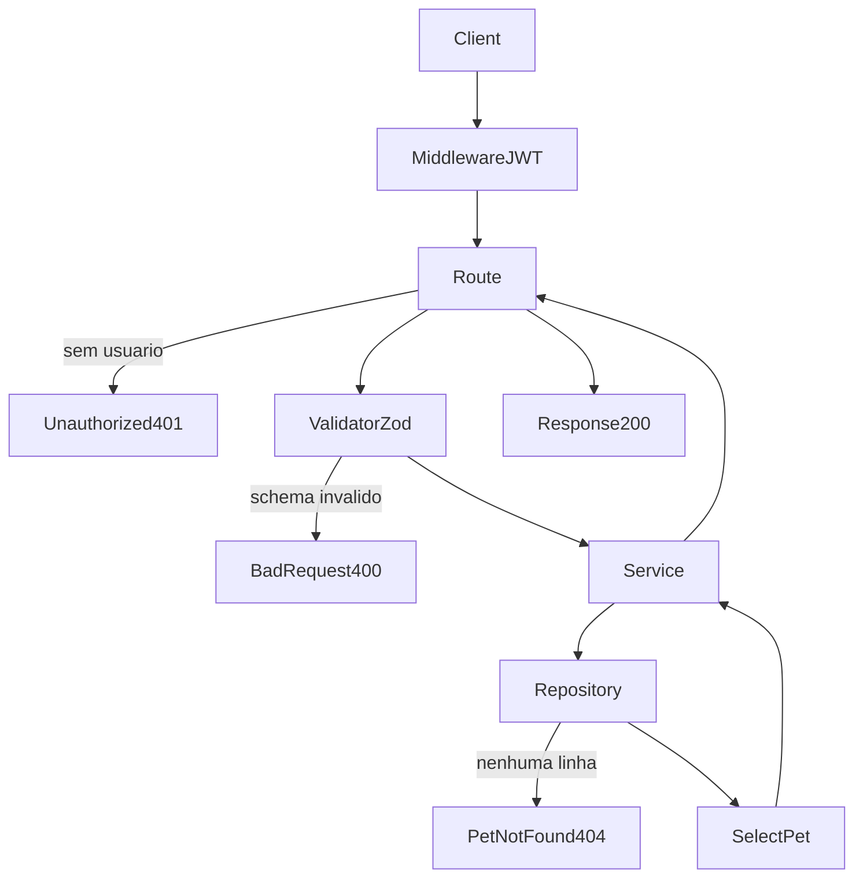

# Analise Tecnica - Rota Onboarding Update Pet (versao atual Node.js)

## Escopo

Rota atual no backend Node:

- PATCH /api/v1/onboarding/pets/:petId

Origem no front-end:

- eden-bowls/src/services/onboardingApi.ts (`updatePetInApi`)

Arquivos analisados:

- eden-bowls-backend/src/api/routes/onboarding-pets-update.routes.js
- eden-bowls-backend/src/api/validators/onboarding-pets-update.validator.js
- eden-bowls-backend/src/services/onboarding-pets-update.service.js
- eden-bowls-backend/src/infrastructure/repositories/onboarding-pets-update.repository.js
- eden-bowls-backend/src/infrastructure/entities/onboarding-pet.entity.js
- eden-bowls-backend/src/infrastructure/migrations/1700000000004-create-user-owned-onboarding-tables.js
- eden-bowls-backend/src/api/middleware/bearer-token.middleware.js
- eden-bowls-backend/src/app.js
- eden-bowls-backend/tests/onboarding-pets-update.routes.test.js
- eden-bowls-backend/tests/onboarding-pets-mutations.repository.test.js
- eden-bowls/src/services/onboardingApi.ts
- eden-bowls/src/pages/onboarding/Onboarding.tsx

## Responsabilidade da rota

A rota atualiza um pet existente pertencente ao usuario autenticado.

Ela aplica apenas os campos enviados (patch parcial), persiste na tabela `onboarding_pets` e devolve o pet atualizado. Nao ha POST multipart equivalente e nao ha troca/limpeza de imagem.

## Endpoint, Controller e permissao

### Endpoint

- Path: /api/v1/onboarding/pets/:petId
- Method: PATCH
- Registro: `registerOnboardingPetUpdateRoutes`
- Callback: handler inline em `onboarding-pets-update.routes.js`

Nao existe hoje o POST /pets/:petId que o WordPress usava para upload.

### Controller

- Exige `request.currentUser.id`
- Le `petId` de `request.params`
- Faz parse do body com `parseOnboardingPetUpdateInput`
- Chama `OnboardingPetUpdateService.updatePet({ userId, petId, payload })`
- Retorna envelope `{ success: true, data: { pet } }` com status 200

### Regra de acesso

A rota exige JWT de usuario:

1. `Authorization: Bearer <jwt>`
2. o token precisa expor `data.user.id`
3. o pet precisa pertencer a esse usuario e estar ativo (`deleted_at IS NULL`)

Erros de acesso comuns:

- 401 `unauthorized`
- 403 `jwt_auth_bad_auth_header`
- 403 `jwt_auth_invalid_token`
- 404 `pet_not_found`
- 400 payload invalido (Zod)
- 503 service/banco indisponivel

## Parametros recebidos

Path params:

- petId: string

Headers:

- Authorization: Bearer token (obrigatorio)
- Content-Type: application/json

Body aceito (todos opcionais):

- name?: string
- breed?: string
- age_years?: string | number
- age_months?: string | number
- weight?: string | number
- weight_unit?: `kg` | `lb`
- size?: `small` | `medium` | `large`
- activity_level?: `low` | `medium` | `high`
- pet_condition?: `underweight` | `ideal` | `overweight`
- neutered?: boolean

Aliases aceitos no validator:

- `ageYears` -> `age_years`
- `ageMonths` -> `age_months`
- `weightUnit` -> `weight_unit`
- `activityLevel` -> `activity_level`
- `weightCondition` -> `pet_condition`

O frontend atual envia snake_case via `buildPetPayload`. Os aliases existem para compatibilidade.

Campos que o WordPress aceitava e esta rota nao processa:

- `image`
- `image_url`

## Validacoes que existem hoje

### 1) Autenticacao

- JWT obrigatorio
- `userId` obrigatorio no service

Erro:

- `Authentication is required.` -> 401

### 2) Schema Zod

Campos presentes precisam respeitar tipo/enum. `name` e `breed`, quando enviados, nao podem ser string vazia.

Erro:

- 400 `{ success: false, message: "Invalid request payload.", details: ZodIssue[] }`

### 3) Pet alvo

O UPDATE so atinge a linha se:

- `id = petId`
- `user_id = userId`
- `deleted_at IS NULL`

Se `affectedRows !== 1`, o service responde:

- `Pet not found.` -> 404
- corpo: `{ success: false, message: "Pet not found." }`

Isso cobre pet inexistente, pet de outro usuario e pet ja removido.

### 4) Payload vazio

Se nenhum campo mapeado vier no body, o repository nao executa UPDATE. Ele apenas relê o pet.

- se o pet existir e estiver ativo, devolve o pet atual
- se nao existir, o service responde 404

Nao ha o erro WordPress `invalid_pet_update` para body vazio.

### 5) Validacoes que nao existem mais

- faixa de idade
- faixa de peso
- revalidacao do pet consolidado
- limpeza de `size` quando `breed` muda
- upload/substituicao de imagem

## Fluxo da requisicao

1. PATCH /api/v1/onboarding/pets/:petId chega na rota
2. middleware JWT popula `request.currentUser`
3. controller rejeita se nao houver usuario
4. validator normaliza aliases e converte numeros
5. service chama o repository
6. repository monta SET dinamico so com campos enviados
7. `weight` e gravado na coluna `weight_input`
8. `neutered` e gravado como `1` ou `0`
9. se nenhuma linha for afetada, retorna 404
10. repository relê o pet e devolve o DTO
11. controller responde 200 com `{ success: true, data: { pet } }`

## Estrutura de resposta

Envelope HTTP:

```json
{
  "success": true,
  "data": {
    "pet": {
      "id": "pet-1",
      "name": "Milo",
      "breed": "Labrador",
      "age_years": 3,
      "age_months": 0,
      "age": 3,
      "weight_input": 12,
      "weight_unit": "kg",
      "weight": 12,
      "size": "large",
      "activity_level": "high",
      "pet_condition": "ideal",
      "neutered": true,
      "image_url": ""
    }
  }
}
```

O frontend consome principalmente `data.pet.image_url`.

A resposta atual nao inclui `session`.

## Regras de negocio atuais

1. Atualizacao parcial
- so os campos enviados entram no UPDATE.

2. Ownership estrito
- nao ha fallback para outra sessao ou outro usuario.

3. Soft-deleted nao pode ser editado
- a clausula `deleted_at IS NULL` impede mutacao.

4. Peso no formato do pais escolhido
- `weight` do payload vira `weight_input` como enviado
- a resposta converte `weight` / `weight_unit` para o mercado (`kg` no BR, `lb` no US)
- pais chega por body, query, `X-Eden-Country` ou `X-Eden-Domain`

5. Aliases camelCase
- o validator aceita os nomes usados em formularios antigos.

6. Sem troca de imagem
- `image_url` so e lido; nao pode ser enviado nem limpo por esta rota.

7. Sem recomputo de porte
- mudar `breed` nao limpa nem recalcula `size`.

## Banco, queries e modelo

### Tabela

`onboarding_pets`

Colunas atualizaveis por esta rota:

- `name`
- `breed`
- `age_years`
- `age_months`
- `weight_input` (a partir de `payload.weight`)
- `weight_unit`
- `size`
- `activity_level`
- `pet_condition`
- `neutered`

### Queries

Update dinamico:

```sql
UPDATE `onboarding_pets`
SET `name` = ?, `weight_input` = ?
WHERE `id` = ? AND `user_id` = ? AND `deleted_at` IS NULL
```

Leitura posterior:

```sql
SELECT `id`, `name`, `breed`, `age_years`, `age_months`, `weight_input`, `weight_unit`,
`size`, `activity_level`, `pet_condition`, `neutered`, `image_url`
FROM `onboarding_pets`
WHERE `id` = ? AND `user_id` = ? AND `deleted_at` IS NULL
LIMIT 1
```

## Arquitetura Node atual

Controller:

- `registerOnboardingPetUpdateRoutes`

Validator:

- `parseOnboardingPetUpdateInput`

Service:

- `OnboardingPetUpdateService.updatePet`

Repository:

- `OnboardingPetUpdateRepository.updatePet`
- `OnboardingPetUpdateRepository.findPet`

Entity:

- `OnboardingPet`

## Consumo no frontend

Funcao:

- `updatePetInApi(petId, pet)`

Quando acontece:

- ao editar um pet existente no Onboarding, com usuario autenticado

O front exige token em memoria (`requireAuthToken`) e envia o payload completo do `PetDraft` em JSON, mesmo a rota aceitando patch parcial.

## O que mudou em relacao ao WordPress

| Antes (WP) | Hoje (Node) |
|---|---|
| PATCH e POST /session/:sessionId/pets/:petId | apenas PATCH /api/v1/onboarding/pets/:petId |
| acesso por sessao | acesso por JWT + ownership do pet |
| body vazio -> 422 | body vazio relê o pet |
| validacao forte do consolidado | so valida tipo/enum dos campos enviados |
| unidade de peso por pais | sem checagem de pais |
| upload e limpeza de imagem | sem upload |
| `breed` sem `size` limpa porte | `size` permanece como esta |
| resposta `session` + `pet` | resposta so `pet` |

## Fluxograma



## Testes existentes

1. atualiza pet do usuario autenticado e normaliza aliases (`ageYears`, `weightUnit`)
2. 401 sem Bearer
3. repository so atualiza pet ativo do `user_id`
4. pet de outro usuario ou inexistente retorna `null` no repository, virando 404 no service

## Status

- Rota migrada e em uso no Node.js.
- Contrato atual e user-owned, PATCH parcial e JSON-only.
- Documentacao gerada a partir da implementacao atual, nao da analise WordPress.
