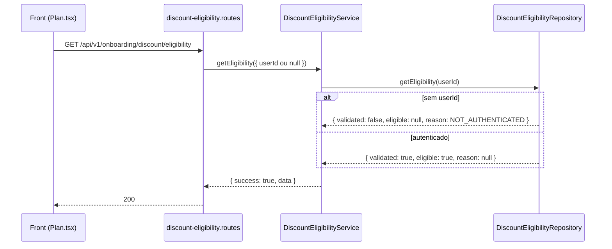

# Rota atual: Onboarding Discount Eligibility

## Escopo

Rota atual no backend Node:

- `GET /api/v1/onboarding/discount/eligibility`

Origem no front-end:

- `eden-bowls/src/services/onboardingApi.ts` (`fetchDiscountEligibilityFromApi`)
- `eden-bowls/src/pages/plan/Plan.tsx`

Arquivos principais:

- `src/api/routes/onboarding-discount-eligibility.routes.js`
- `src/services/onboarding-discount-eligibility.service.js`
- `src/infrastructure/repositories/onboarding-discount-eligibility.repository.js`
- `tests/onboarding-discount-eligibility.routes.test.js`

Rota legado WordPress (substituida):

- `GET /custom/v1/onboarding/session/:sessionId/discount/eligibility`

## Responsabilidade

Informar se o usuario autenticado e elegivel ao desconto de primeiro pedido, sem calcular preco.

Contrato de negocio (mesmo shape do legado):

- `validated`: boolean
- `eligible`: boolean | null
- `reason`: string | null

O front usa isso para:

1. seguir checkout com desconto
2. esperar validacao
3. remover desconto por inelegibilidade

Esta rota **nao aplica** o desconto. Preview e checkout e que usam o resultado.

## Estado de implementacao

HTTP, auth e envelope estao prontos. O repository **ainda e stub** e sempre devolve:

```json
{ "validated": true, "eligible": true, "reason": null }
```

Nao ha hoje:

- consulta a historico de pedidos
- consulta a assinatura Stripe (`active` / `trialing`)
- exclusao de pedido atual da sessao
- fallback por email
- consulta real de historico; sem JWT o stub devolve `NOT_AUTHENTICATED`

## Endpoint, controller e permissao

### Registro

- Path: `/api/v1/onboarding/discount/eligibility`
- Method: `GET`
- Registrar: `registerOnboardingDiscountEligibilityRoutes`

### Controller

1. Exige service injetado (`503`).
2. Chama `getEligibility({ userId })`.
   - `userId` vem de `request.currentUser.id` se houver JWT.
   - Sem JWT, `userId` e `null` e o stub devolve `NOT_AUTHENTICATED`.
3. Responde `200` com o envelope.

Em `HttpError` com `details.code`, a rota devolve tambem `details` no JSON (diferente de recommendation/snapshot, que omitem `details`).

## Autenticacao

JWT e opcional.

```http
Authorization: Bearer <jwt-de-usuario>
```

Sem JWT a rota **nao** devolve `401`. Devolve `200` com o estado legado:

- `validated=false`
- `eligible=null`
- `reason=NOT_AUTHENTICATED`

Nao ha `x-session-token`. O front chama a rota com ou sem Bearer.

## Fluxo da requisicao



1. Front chama `fetchDiscountEligibilityFromApi(authToken)`.
2. Rota autentica.
3. Service valida repository e `userId`.
4. Repository devolve elegivel.
5. Front valida tipos (`validated` boolean, `eligible` boolean|null, `reason` string|null).

## Parametros

Nenhum path/body. Contexto: `userId` do JWT + mercado da Home (`country` / `domain` / `X-Eden-Country` / `X-Eden-Domain`). O contrato de elegibilidade nao muda por pais; pais invalido retorna 400.

## Validacoes

| Camada | Regra | Status |
|---|---|---|
| Rota | service injetado | 503 |
| Rota / service | `userId` opcional | sem JWT devolve `NOT_AUTHENTICATED` |
| Service | repository injetado | 503 |
| Negocio | historico de pedido / assinatura ativa | **nao implementado** |

## Estrutura de resposta

Sucesso `200` (comportamento atual do stub):

```json
{
  "success": true,
  "data": {
    "validated": true,
    "eligible": true,
    "reason": null
  }
}
```

Reasons previstas pelo contrato legado (ainda nao produzidas pelo Node):

| reason | validated | eligible | Significado legado |
|---|---|---|---|
| `null` | true | true | elegivel |
| `NOT_AUTHENTICATED` | false | null | usuario nao resolvido |
| `HAS_PREVIOUS_PURCHASE` | true | false | ja teve pedido (pending/on-hold/processing/completed) |
| `HAS_ACTIVE_SUBSCRIPTION` | true | false | assinatura `active` ou `trialing` |

Precedencia legado (nao implementada): `HAS_PREVIOUS_PURCHASE` vence `HAS_ACTIVE_SUBSCRIPTION`.

## Camadas

| Camada | Classe / funcao | Papel |
|---|---|---|
| Route | `registerOnboardingDiscountEligibilityRoutes` | auth + delegacao |
| Service | `OnboardingDiscountEligibilityService.getEligibility` | envelope |
| Repository | `OnboardingDiscountEligibilityRepository.getEligibility` | sempre elegivel |

Wiring em `src/index.js` sem DataSource:

```js
const onboardingDiscountEligibilityRepository = new OnboardingDiscountEligibilityRepository();
const onboardingDiscountEligibilityService = new OnboardingDiscountEligibilityService(onboardingDiscountEligibilityRepository);
```

## Banco e fontes de dados

Nenhuma query.

No WordPress as fontes eram:

- `wp_hsr_onboarding_sessions` (`linked_user_id`, `checkout_order_id`)
- pedidos WooCommerce
- `wp_hsr_stripe_subscriptions`

Essas consultas nao existem no repository Node.

## Consumo no front

```ts
export async function fetchDiscountEligibilityFromApi(authToken?: string) {
  const response = await fetch(`${base}/api/v1/onboarding/discount/eligibility`, {
    method: 'GET',
    headers: buildAuthHeaders(authToken),
  })
  const data = (await response.json())?.data
  // valida validated / eligible / reason
  return { validated: data.validated, eligible: data.eligible, reason: data.reason }
}
```

Com o stub atual, o front sempre recebe usuario elegivel quando autenticado.

## Diferencas em relacao ao WordPress

| Tema | WordPress | Node atual |
|---|---|---|
| URL | `/session/:sessionId/discount/eligibility` | `/discount/eligibility` |
| Auth | token de sessao | JWT de usuario |
| Sem usuario | `200` + `NOT_AUTHENTICATED` | `200` + `NOT_AUTHENTICATED` |
| Pedido previo | inelegivel | nao consultado |
| Assinatura ativa | inelegivel (userId depois email) | nao consultado |
| Exclui pedido da sessao | sim (`checkout_order_id`) | nao se aplica (sem sessao) |
| Resultado atual | regra real | sempre elegivel |

## Testes existentes

`tests/onboarding-discount-eligibility.routes.test.js`:

1. Usuario autenticado recebe `{ validated: true, eligible: true, reason: null }`.
2. Sem Bearer retorna `200` com `{ validated: false, eligible: null, reason: "NOT_AUTHENTICATED" }`.
