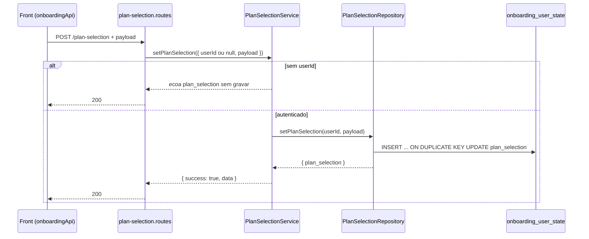

# Rota atual: Onboarding Plan Selection

## Escopo

Rota atual no backend Node:

- `POST /api/v1/onboarding/plan-selection`

Origem no front-end:

- `eden-bowls/src/services/onboardingApi.ts` (`syncLocalPlanSelectionToApi`)

Arquivos principais:

- `src/api/routes/onboarding-plan-selection.routes.js`
- `src/services/onboarding-plan-selection.service.js`
- `src/infrastructure/repositories/onboarding-plan-selection.repository.js`
- `src/infrastructure/entities/onboarding-user-state.entity.js`
- `src/infrastructure/migrations/1700000000004-create-user-owned-onboarding-tables.js`
- `tests/onboarding-plan-selection.routes.test.js`

Rota legado WordPress (substituida):

- `POST /custom/v1/onboarding/session/:sessionId/plan-selection`

## Responsabilidade

Validar (hoje, so autenticacao) e **persistir** a selecao de plano no estado do usuario.

Diferenca essencial para `plan/preview`:

- `plan-selection` grava `onboarding_user_state.plan_selection`.
- `plan/preview` so simula preco e cria quote.

O valor persistido e lido depois por fluxos como subscription preview (`getFallbackPriceIds` le `plan_selection.pets[].price_ids`).

## Estado de implementacao

A persistencia e real (UPSERT TypeORM/SQL). Nao ha:

- validator Zod (diferente de preview)
- checagem contra recommendation
- resolucao de catalogo / `catalog_pricing`
- normalizacao de sabores
- recusa de payload vazio no backend

O repository espalha o body recebido, acrescenta `updated_at` e grava o JSON.

## Endpoint, controller e permissao

### Registro

- Path: `/api/v1/onboarding/plan-selection`
- Method: `POST`
- Registrar: `registerOnboardingPlanSelectionRoutes`

### Controller

1. Exige service injetado (`503`).
2. Chama `setPlanSelection({ userId, payload: request.body || {} })`.
   - `userId` vem de `request.currentUser.id` se houver JWT.
   - Sem JWT, `userId` e `null`: a rota ecoa o payload e **nao** grava no banco.
3. Responde `200` com o envelope.

Nao ha rate limit dedicado alem do global (300 req/min).

## Autenticacao

JWT e opcional.

```http
Authorization: Bearer <jwt-de-usuario>
```

Sem JWT a rota aceita o body e devolve `200` sem persistir. Com JWT, faz UPSERT em `onboarding_user_state.plan_selection`. O front envia Bearer quando houver.

## Fluxo da requisicao



1. Front normaliza pets habilitados (sabores + pesos) e envia `subscription_term_months` + `pets`.
2. Rota autentica o usuario.
3. Service exige repository e `userId`.
4. Repository monta `{ ...payload, updated_at }` e faz UPSERT em `onboarding_user_state`.
5. Resposta devolve o JSON gravado, sem `session_id`.

## Parametros

### Headers

- `Content-Type: application/json`
- `Authorization: Bearer <jwt>` (obrigatorio)

### Body (o que o front envia hoje)

```json
{
  "subscription_term_months": 1,
  "pets": [
    {
      "pet_id": "pet-1",
      "pet_name": "Milo",
      "enabled": true,
      "selected_flavors": ["chicken"],
      "flavor_weights": [500]
    }
  ]
}
```

O backend aceita qualquer objeto. Campos extras no body tambem sao persistidos.

O service acrescenta `country` e `currency` do mercado da Home (`.com` = US/USD, `.com.br` = BR/BRL) antes de gravar. Pais pode vir no body, query, `X-Eden-Country` ou `X-Eden-Domain`.

No legado o service montava `catalog_pricing`, `flavors_by_pet` e `validated_with`. Isso **nao** e reconstruido no Node: so o que o cliente mandar e gravado.

## Validacoes

| Camada | Regra | Status |
|---|---|---|
| Rota / service | `userId` opcional | sem JWT ecoa e nao persiste |
| Service | repository injetado | 503 |
| Repository | DataSource inicializado | 503 |
| Payload | termo 1/3/6, pets, pesos | **nao implementado** |
| Negocio | recommendation / catalogo | **nao implementado** |

## Persistencia

Tabela `onboarding_user_state` (migration `1700000000004`):

| Coluna | Tipo | Papel nesta rota |
|---|---|---|
| `user_id` | PK, FK `wp_users.ID` | dono do estado |
| `plan_selection` | JSON | snapshot gravado |
| `recurrence` | JSON | nao tocado |
| `address` | JSON | nao tocado |
| `shipping` | JSON | nao tocado |
| `payment_reference` | JSON | nao tocado |
| `checkout_reference` | JSON | nao tocado |

SQL:

```sql
INSERT INTO `onboarding_user_state` (`user_id`, `plan_selection`)
VALUES (?, ?)
ON DUPLICATE KEY UPDATE `plan_selection` = VALUES(`plan_selection`)
```

O UPSERT **nao apaga** os outros JSON da linha. Se o usuario ainda nao tem linha, cria so com `user_id` + `plan_selection`.

Valor gravado:

```js
{
  ...payload,
  updated_at: new Date().toISOString()
}
```

## Estrutura de resposta

Sucesso `200`:

```json
{
  "success": true,
  "data": {
    "plan_selection": {
      "subscription_term_months": 1,
      "pets": [
        {
          "pet_id": "pet-1",
          "pet_name": "Milo",
          "enabled": true,
          "selected_flavors": ["chicken"],
          "flavor_weights": [500]
        }
      ],
      "updated_at": "2026-08-15T23:52:00.000Z"
    }
  }
}
```

O teste afirma que `data.session_id` **nao existe**.

Sem JWT a resposta e `200` com o mesmo envelope, sem gravar no banco.

## Camadas

| Camada | Classe / funcao | Papel |
|---|---|---|
| Route | `registerOnboardingPlanSelectionRoutes` | auth + delegacao |
| Service | `OnboardingPlanSelectionService.setPlanSelection` | envelope |
| Repository | `OnboardingPlanSelectionRepository.setPlanSelection` | UPSERT real |

Wiring em `src/index.js`:

```js
const onboardingPlanSelectionRepository = new OnboardingPlanSelectionRepository(dataSource);
const onboardingPlanSelectionService = new OnboardingPlanSelectionService(onboardingPlanSelectionRepository);
```

## Uso downstream

`OnboardingSubscriptionPreviewRepository.getFallbackPriceIds(userId)` le `plan_selection` e coleta `pets[].price_ids` com prefixo `price_`.

O payload que o front envia hoje **nao inclui** `price_ids`. Sem esse campo, o preview de assinatura so funciona se o cliente mandar `price_ids` no proprio request de preview.

Checkout e subscription preview dependem desse JSON persistido. Payload incompleto aqui vira `session_incomplete` / `invalid_price_id` mais adiante.

## Consumo no front

```ts
export async function syncLocalPlanSelectionToApi(payload, authToken: string) {
  const response = await fetch(`${base}/api/v1/onboarding/plan-selection`, {
    method: 'POST',
    headers: buildAuthHeaders(authToken, true),
    body: JSON.stringify({
      subscription_term_months: payload.subscriptionTermMonths,
      pets: normalizedPets,
    }),
  })
  await assertOk(response, 'Unable to save plan selection')
}
```

O front nao usa o body de resposta; so confirma o `2xx`.

## Diferencas em relacao ao WordPress

| Tema | WordPress | Node atual |
|---|---|---|
| URL | `/session/:sessionId/plan-selection` | `/plan-selection` |
| Auth | token de sessao | JWT opcional; persistencia so com JWT |
| Persistencia | `plan_selection_json` da sessao | `onboarding_user_state.plan_selection` por `user_id` |
| Pricing | service monta `catalog_pricing` | nao monta; grava o body |
| Snapshot vs recommendation | 422 mismatch | nao validado |
| Validator de payload | `validate_plan_selection` | ausente |
| `session_id` na resposta | sim | removido |
| Desconto | base persistida; checkout revalida | so persistencia bruta |

## Testes existentes

`tests/onboarding-plan-selection.routes.test.js`:

1. Usuario autenticado persiste o payload; resposta sem `session_id`; service chamado com `{ userId, payload }`.
2. Sem Bearer retorna `200` e o service e chamado com `{ userId: null, payload }`.
