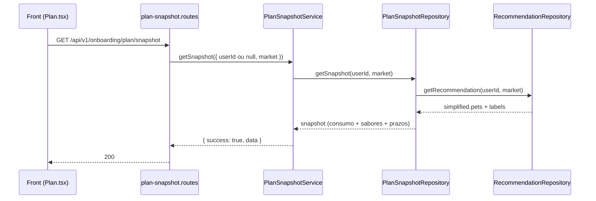

# Rota atual: Onboarding Plan Snapshot

## Escopo

Rota atual no backend Node:

- `GET /api/v1/onboarding/plan/snapshot`

Origem no front-end:

- `eden-bowls/src/services/onboardingApi.ts` (`fetchPlanSnapshotFromApi`)
- `eden-bowls/src/pages/plan/Plan.tsx`

Arquivos principais:

- `src/api/routes/onboarding-plan-snapshot.routes.js`
- `src/services/onboarding-plan-snapshot.service.js`
- `src/infrastructure/repositories/onboarding-plan-snapshot.repository.js`
- `src/core/nutrition-recommendation.js`
- `src/core/simplified-consumption.js`
- `src/core/flavors.js`
- `tests/onboarding-plan-snapshot.routes.test.js`
- `tests/onboarding-plan-snapshot.repository.test.js`

Rota legado WordPress (substituida):

- `GET /custom/v1/onboarding/session/:sessionId/plan/snapshot`

## Responsabilidade

Devolver o snapshot autoritativo para montar a tela de plano:

1. Mercado: `country`, `currency`
2. Consumo simplificado por pet (`labels`, `consumption`, `pets`) — **o mesmo** de `GET /recommendation` (`simplified`)
3. Catalogo de sabores (`flavor_options`)
4. Tabela de prazos e desconto (`plan_terms`)

E uma agregacao de recomendacao + catalogo + politica de desconto por prazo. O preview e a selecao usam esses dados depois.

Esta rota **nao** devolve preco. Preco mensal e `POST /plan/preview`.

## Estado de implementacao

O consumo diario/mensal/packs **deixa de ser stub**. O snapshot reutiliza o repository de recommendation.

| Parte | Status |
|---|---|
| Endpoint publico + JWT opcional | implementado |
| Consumo via calculo nutricional real | implementado |
| `flavor_options` do catalogo atual (beef/fish/pork/turkey) | implementado |
| `plan_terms` 1/3/6 com 10/25/40 | implementado |
| Sem JWT | `200` com consumo vazio + catalogo |
| Catalogo CMPB / 502 se sabores vazios | nao aplicado (catalogo local nao fica vazio) |
| Hidratacao de questionario em GET | sem escrita |

## Endpoint, controller e permissao

### Registro

- Path: `/api/v1/onboarding/plan/snapshot`
- Method: `GET`
- Registrar: `registerOnboardingPlanSnapshotRoutes`

### Controller

1. Exige service injetado (`503`).
2. Resolve o mercado.
3. Chama `onboardingPlanSnapshotService.getSnapshot({ userId, market })`.
   - `userId` vem de `request.currentUser.id` se houver JWT.
   - Sem JWT, `userId` e `null`.
4. Responde `200` com o envelope.

## Autenticacao

JWT e opcional. A rota **nao** devolve `401` sem Bearer.

```http
Authorization: Bearer <jwt-de-usuario>
```

Sem JWT a rota segue com `userId = null`, devolve sabores/`plan_terms` e consumo vazio. Nao ha `x-session-token`.

O front envia o token via `buildAuthHeaders` quando houver. Se a rota responder `404`, `405` ou `501`, o cliente trata como "snapshot indisponivel" e retorna `null` (fallback local).

## Fluxo da requisicao



1. Front chama `fetchPlanSnapshotFromApi(authToken?)`.
2. Rota resolve mercado e `userId` opcional.
3. Snapshot pede o mesmo `simplified` da recommendation.
4. Acrescenta `flavor_options` e `plan_terms`.
5. Front valida o contrato e usa `flavor_options`, `plan_terms` e consumo por pet.

## Parametros

Nenhum path/body. Contexto: `userId` do JWT (opcional) + mercado da Home.

Query / headers:

- `country=US|BR` ou `domain=com|com.br`
- `X-Eden-Country` / `X-Eden-Domain`

Regra: `.com` = US/USD; `.com.br` = BR/BRL. Dominio vence pais. Sem contexto, fallback US.

## Validacoes

| Camada | Regra | Status |
|---|---|---|
| Rota | service injetado | 503 |
| Rota / service | `userId` opcional | — |
| Service | repository injetado | 503 |
| Recommendation | pets do usuario quando ha JWT | consumo calculado |
| Negocio | pets existentes, catalogo nao vazio (`502`) | **nao aplicado** |

## Estrutura de resposta

Sucesso `200` com JWT e um pet (exemplo):

```json
{
  "success": true,
  "data": {
    "country": "BR",
    "currency": "BRL",
    "labels": {
      "daily": "Diário",
      "monthly": "Mensal",
      "packs": "Packs"
    },
    "consumption": {
      "labels": {
        "daily": "Diário",
        "monthly": "Mensal",
        "packs": "Packs"
      },
      "pets": [
        {
          "pet_id": "pet-1",
          "pet_name": "Luna",
          "daily": { "value": 133, "unit": "g/dia", "grams": 133, "formatted": "133 g/dia" },
          "monthly": { "value": 3.99, "unit": "kg/mês", "grams": 3990, "formatted": "3,99 kg/mês" },
          "packs": {
            "count": 8,
            "pack_size_grams": 500,
            "pack_size_value": 500,
            "pack_size_unit": "g",
            "formatted": "8 packs de 500 g/mês"
          }
        }
      ]
    },
    "pets": [
      {
        "pet_id": "pet-1",
        "pet_name": "Luna",
        "daily": { "value": 133, "unit": "g/dia", "grams": 133, "formatted": "133 g/dia" },
        "monthly": { "value": 3.99, "unit": "kg/mês", "grams": 3990, "formatted": "3,99 kg/mês" },
        "packs": {
          "count": 8,
          "pack_size_grams": 500,
          "pack_size_value": 500,
          "pack_size_unit": "g",
          "formatted": "8 packs de 500 g/mês"
        }
      }
    ],
    "flavor_options": [
      { "key": "beef", "label": "Bovino" },
      { "key": "fish", "label": "Peixe" },
      { "key": "pork", "label": "Porco" },
      { "key": "turkey", "label": "Peru" }
    ],
    "plan_terms": [
      { "subscription_term_months": 1, "discount_percent": 10 },
      { "subscription_term_months": 3, "discount_percent": 25 },
      { "subscription_term_months": 6, "discount_percent": 40 }
    ]
  }
}
```

`pets` e espelho de `consumption.pets`, como no legado.

O teste afirma que `data.session_id` **nao existe**.

Onde o front le o consumo:

```
data.consumption.labels
data.consumption.pets[]     // identico a recommendation.simplified.pets[]
data.labels / data.pets     // aliases
```

## Camadas

| Camada | Classe / funcao | Papel |
|---|---|---|
| Route | `registerOnboardingPlanSnapshotRoutes` | mercado + delegacao |
| Service | `OnboardingPlanSnapshotService.getSnapshot` | envelope |
| Snapshot repo | `OnboardingPlanSnapshotRepository.getSnapshot` | agrega consumo + catalogo |
| Recommendation repo | `OnboardingRecommendationRepository.getRecommendation` | calculo diario das racoes |
| Flavors | `listFlavorOptions(market)` | sabores localizados |

Wiring em `src/index.js`:

```js
const onboardingRecommendationRepository = new OnboardingRecommendationRepository(onboardingPetsRepository);
const onboardingPlanSnapshotRepository = new OnboardingPlanSnapshotRepository({
  recommendationRepository: onboardingRecommendationRepository
});
```

## Banco e fontes de dados

Consumo: mesma leitura de `onboarding_pets` da recommendation (so com JWT).

Catalogo: `src/core/flavors.js` (sem query). `plan_terms` hardcoded, igual ao WordPress.

## Consumo no front

```ts
export async function fetchPlanSnapshotFromApi(authToken?: string) {
  const response = await fetch(`${base}/api/v1/onboarding/plan/snapshot`, {
    method: 'GET',
    headers: buildAuthHeaders(authToken),
  })
  if ([404, 405, 501].includes(response.status)) return null
  const json = await response.json()
  return assertPlanSnapshotContract(json?.data)
}
```

O front exige `flavor_options` (ou equivalente). Sem sabores, trata como contrato invalido. Consumo por pet e casado por `pet_id` / nome; se o snapshot vier sem o pet (fluxo anonimo), a UI mostra `--`.

## Diferencas em relacao ao WordPress

| Tema | WordPress | Node atual |
|---|---|---|
| URL | `/session/:sessionId/plan/snapshot` | `/plan/snapshot` |
| Auth | token de sessao obrigatorio | JWT opcional |
| `session_id` | presente | removido |
| GET com escrita | hidrata questionnaire | sem escrita |
| Consumo | `get_recommendation()` da sessao | mesma calculadora; pets do usuario se JWT |
| Sem pets | `422 pets_required` | `200` com `consumption.pets = []` |
| Catalogo CMPB | obrigatorio; vazio = 502 | catalogo local beef/fish/pork/turkey |
| Country/currency | BR/BRL ou US/USD | mercado da Home; fallback US/USD |
| `plan_terms` | 10 / 25 / 40 | igual |

## Testes existentes

`tests/onboarding-plan-snapshot.routes.test.js`:

1. Usuario autenticado recebe snapshot sem `session_id`, com `currency`.
2. Sem Bearer retorna `200` e o service e chamado com `{ userId: null, market }`.
3. Mercado BR devolve BRL, labels `Diário` e consumo vazio neste teste (sem pets mockados).
4. Mercado US devolve sabores em ingles.

`tests/onboarding-plan-snapshot.repository.test.js`:

1. Com pets do usuario, `consumption.pets` e `pets` repetem o `simplified` da recommendation, com gramas/dia calculadas.
