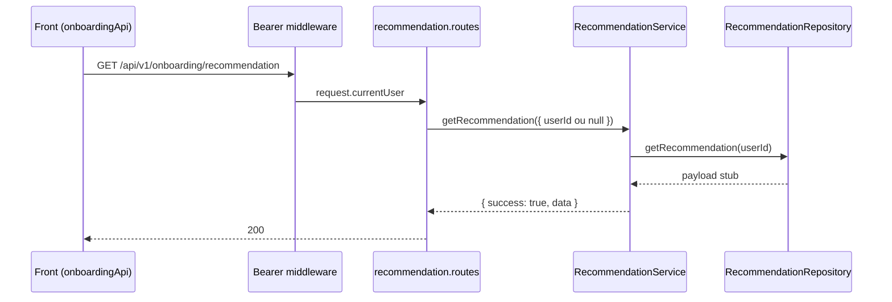

# Rota atual: Onboarding Recommendation

## Escopo

Rota atual no backend Node:

- `GET /api/v1/onboarding/recommendation`

Origem no front-end:

- `eden-bowls/src/services/onboardingApi.ts` (`fetchOnboardingRecommendation`)

Arquivos principais:

- `src/api/routes/onboarding-recommendation.routes.js`
- `src/services/onboarding-recommendation.service.js`
- `src/infrastructure/repositories/onboarding-recommendation.repository.js`
- `tests/onboarding-recommendation.routes.test.js`

Rota legado WordPress (substituida):

- `GET /custom/v1/onboarding/session/:sessionId/recommendation`

## Responsabilidade

Devolver a recomendacao nutricional do usuario autenticado, com tres blocos:

1. `recommendations` — detalhe por pet (kcal, gramas/dia, porte, especie)
2. `packaging` — frequencia e mix de embalagens
3. `simplified` — consumo diario/mensal/packs para a UI

O front da tela Plan usa apenas `data.simplified` como fallback de consumo.

## Estado de implementacao

A rota, o service e o contrato HTTP existem e estao cobertos por teste. O repository **ainda e stub**: ignora `userId` e devolve um payload fixo (pet `Milo`, pais `US`).

Nao ha hoje:

- leitura de `onboarding_pets`
- calculo nutricional real
- hidratacao de questionario
- resolucao de SKU / checkout items
- persistencia em GET

## Endpoint, controller e permissao

### Registro

- Path: `/api/v1/onboarding/recommendation`
- Method: `GET`
- Registrar: `registerOnboardingRecommendationRoutes` em `src/app.js`

### Controller

1. Exige `dependencies.onboardingRecommendationService` (senao `503`).
2. Chama `onboardingRecommendationService.getRecommendation({ userId })`.
   - `userId` vem de `request.currentUser.id` se houver JWT.
   - Sem JWT, `userId` e `null`.
4. Responde `200` com o envelope do service.

Nao ha `session_id` na URL nem no body.

## Autenticacao

Header:

```http
Authorization: Bearer <jwt-de-usuario>
```

JWT e opcional. Sem header, a rota segue com `userId = null` e devolve o stub. Token malformado ou invalido cai no error handler de auth.

Diferenca do legado: nao existe mais `x-session-token` nem vinculo token-sessao.

## Fluxo da requisicao



1. Front chama `fetchOnboardingRecommendation(authToken)`.
2. Middleware valida JWT e preenche `request.currentUser`.
3. Rota recusa se nao houver `id`.
4. Service valida repository e `userId`.
5. Repository devolve o contrato fixo.
6. Service envelopa `{ success: true, data }`.
7. Front extrai `json.data.simplified`.

## Parametros

Path / body: nenhum.

Query / headers de mercado (regra da Home):

- `country=US|BR` ou `domain=com|com.br`
- `X-Eden-Country` / `X-Eden-Domain`

Contexto injetado:

- `userId` = `request.currentUser.id`
- `market` resolvido do pais/dominio escolhido (`.com` = US, `.com.br` = BR)

## Validacoes

| Camada | Regra | Status |
|---|---|---|
| Rota | service injetado | 503 |
| Rota / service | `userId` opcional | — |
| Service | repository injetado | 503 |
| Negocio | sessao existente, pets obrigatorios, questionario | **nao implementado** |

## Estrutura de resposta

Sucesso `200`:

```json
{
  "success": true,
  "data": {
    "country": "US",
    "recommendations": [
      {
        "pet_id": "pet-1",
        "pet_name": "Milo",
        "energy_kcal_dia": 500,
        "quantidade_g_dia": 300,
        "porte": "medium",
        "especie": "dog"
      }
    ],
    "packaging": {
      "selected_frequency": "monthly",
      "period_days": 30,
      "suggested_frequency": "monthly",
      "suggested_period_days": 30,
      "package_sizes_grams": [300, 500],
      "total_target_grams": 300,
      "suggested_bags_by_size": {
        "300": 1,
        "500": 0
      }
    },
    "simplified": {
      "country": "US",
      "period_days": 30,
      "labels": {
        "daily": "Per day",
        "monthly": "Per month",
        "packs": "Packs"
      },
      "pets": [
        {
          "pet_id": "pet-1",
          "pet_name": "Milo",
          "daily": { "value": 200, "unit": "g", "grams": 200, "formatted": "200 g" },
          "monthly": { "value": 6000, "unit": "g", "grams": 6000, "formatted": "6,000 g" },
          "packs": {
            "count": 2,
            "pack_size_grams": 500,
            "pack_size_value": 2,
            "pack_size_unit": "pack",
            "formatted": "2 packs"
          }
        }
      ]
    },
    "version": "v1"
  }
}
```

O teste de rota afirma explicitamente que `data.session_id` **nao existe**. Sem JWT a rota tambem devolve `200` com o stub.

## Camadas

| Camada | Classe / funcao | Papel |
|---|---|---|
| Route | `registerOnboardingRecommendationRoutes` | auth + delegacao |
| Service | `OnboardingRecommendationService.getRecommendation` | envelope `{ success, data }` |
| Repository | `OnboardingRecommendationRepository.getRecommendation` | payload fixo |

Wiring em `src/index.js`:

```js
const onboardingRecommendationRepository = new OnboardingRecommendationRepository();
const onboardingRecommendationService = new OnboardingRecommendationService(onboardingRecommendationRepository);
```

O repository **nao recebe DataSource**. Nao consulta `onboarding_pets`.

## Banco e fontes de dados

Nenhuma query nesta rota.

Dados de pets reais ja existem em `onboarding_pets` (criados pelas rotas de pets), mas recommendation ainda nao os usa.

## Consumo no front

```ts
export async function fetchOnboardingRecommendation(authToken?: string) {
  const response = await fetch(`${base}/api/v1/onboarding/recommendation`, {
    method: 'GET',
    headers: { Authorization: `Bearer ${authToken}` },
  })
  const json = await response.json()
  return json?.data?.simplified || null
}
```

`Plan.tsx` usa esse `simplified` como fallback quando o snapshot nao cobre o pet.

## Diferencas em relacao ao WordPress

| Tema | WordPress | Node atual |
|---|---|---|
| URL | `/onboarding/session/:sessionId/recommendation` | `/onboarding/recommendation` |
| Auth | token de sessao | JWT opcional |
| `session_id` na resposta | sim | removido |
| Pets obrigatorios | `422 pets_required` | nao validado |
| GET com side effect | hidrata `questionnaire_json` e salva | sem escrita |
| Calculadora nutricional | `NutritionRecommendationService` | stub |
| Packaging / SKU | algoritmo 300g/500g + WooCommerce | payload fixo, sem `checkout_items` |
| Pais / labels | BR/US a partir da sessao | mercado da Home; fallback `US` |

## Testes existentes

`tests/onboarding-recommendation.routes.test.js`:

1. Usuario autenticado recebe `200`, sem `session_id`, e o service e chamado com `{ userId }`.
2. Sem Bearer retorna `200` e o service e chamado com `{ userId: null }`.
