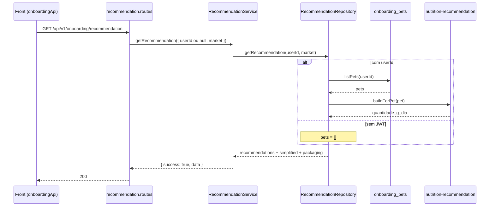

# Rota atual: Onboarding Recommendation

## Escopo

Rota atual no backend Node:

- `GET /api/v1/onboarding/recommendation`

Origem no front-end:

- `eden-bowls/src/services/onboardingApi.ts` (`fetchOnboardingRecommendation`)

Arquivos principais:

- `src/api/routes/onboarding-recommendation.routes.js`
- `src/services/onboarding-recommendation.service.js`
- `src/infrastructure/repositories/onboarding-recommendation.repository.js`
- `src/core/nutrition-recommendation.js`
- `src/core/simplified-consumption.js`
- `tests/onboarding-recommendation.routes.test.js`
- `tests/onboarding-recommendation.repository.test.js`
- `tests/nutrition-recommendation.test.js`
- `tests/simplified-consumption.test.js`

Rota legado WordPress (substituida):

- `GET /custom/v1/onboarding/session/:sessionId/recommendation`

## Responsabilidade

Devolver a recomendacao nutricional, com tres blocos:

1. `recommendations` — detalhe por pet (kcal, gramas/dia, porte, especie)
2. `packaging` — frequencia sugerida e mix 300 g / 500 g no periodo de 30 dias
3. `simplified` — consumo diario/mensal/packs para a UI (**Por dia / Por mes / Pacotes**)

O front da tela Plan usa apenas `data.simplified` como fallback de consumo. A tela de plano prefere o mesmo consumo via `GET /plan/snapshot`.

## Estado de implementacao

O calculo diario das racoes **esta implementado**. Nao e mais stub.

| Parte | Status |
|---|---|
| Endpoint publico + JWT opcional | implementado |
| Calculo nutricional (`fator * peso_kg^0.75`) | implementado |
| Bloco `simplified` (30 dias, packs 300/500) | implementado |
| Leitura de `onboarding_pets` quando ha JWT | implementada |
| Sem JWT | `200` com `pets` vazio (nao exige autenticacao) |
| Hidratacao persistida de questionario | nao feita; usa campos do proprio pet |
| Resolucao de SKU / `checkout_items` | nao implementada |

Sem usuario autenticado a rota continua publica e devolve o contrato vazio de consumo. Com JWT, calcula a partir dos pets gravados em `onboarding_pets`.

## Endpoint, controller e permissao

### Registro

- Path: `/api/v1/onboarding/recommendation`
- Method: `GET`
- Registrar: `registerOnboardingRecommendationRoutes` em `src/app.js`

### Controller

1. Exige `dependencies.onboardingRecommendationService` (senao `503`).
2. Resolve o mercado (`country` / `domain` / headers).
3. Chama `onboardingRecommendationService.getRecommendation({ userId, market })`.
   - `userId` vem de `request.currentUser.id` se houver JWT.
   - Sem JWT, `userId` e `null`.
4. Responde `200` com o envelope do service.

Nao ha `session_id` na URL nem no body.

## Autenticacao

JWT e opcional. A rota **nao** devolve `401` sem Bearer.

```http
Authorization: Bearer <jwt-de-usuario>
```

Sem header, a rota segue com `userId = null` e devolve `simplified.pets = []`. Token malformado ou invalido cai no error handler de auth.

Diferenca do legado: nao existe mais `x-session-token` nem vinculo token-sessao.

## Fluxo da requisicao



1. Front chama `fetchOnboardingRecommendation(authToken?)`.
2. Rota resolve mercado e `userId` opcional.
3. Repository lista pets so quando ha `userId`.
4. Para cada pet, `buildForPet` calcula energia e gramas/dia.
5. `simplified` formata Por dia / Por mes / Pacotes com periodo fixo de 30 dias.
6. Front extrai `json.data.simplified`.

## Parametros

Path / body: nenhum.

Query / headers de mercado (regra da Home):

- `country=US|BR` ou `domain=com|com.br`
- `X-Eden-Country` / `X-Eden-Domain`

Contexto injetado:

- `userId` = `request.currentUser.id` ou `null`
- `market` resolvido do pais/dominio (`.com` = US, `.com.br` = BR)

## Validacoes

| Camada | Regra | Status |
|---|---|---|
| Rota | service injetado | 503 |
| Rota / service | `userId` opcional | sem JWT devolve consumo vazio |
| Service | repository injetado | 503 |
| Pets repo | DataSource inicializado (so com JWT) | 503 |
| Negocio | `422 pets_required` | **nao aplicado** (rota publica) |

## Logica de calculo

Origem de `quantidade_g_dia` (igual ao WordPress):

```
energia_kcal_dia = fator * peso_kg^0.75
quantidade_g_dia = round((energia_kcal_dia / nem_kcal_kg) * 1000)
```

O fator sai da tabela de combinacao castrado + atividade + score corporal (e heuristicas de raca/idade/especie). Peso em `lb` e convertido para kg antes do calculo. NEM padrao: 3600 kcal/kg (cao), 3800 (gato).

Bloco `simplified` (periodo **sempre 30 dias**):

```
grams_per_day   = max(0, quantidade_g_dia)
monthly_grams   = grams_per_day * 30
usa_pack_500    = (monthly_grams / 300) > 8
pack_size_grams = usa_pack_500 ? 500 : 300
pack_count      = ceil(monthly_grams / pack_size_grams)
```

Nao mistura tamanhos neste bloco. O front deve exibir `*.formatted` sem recalcular packs.

Formatacao:

| Campo | BR | US |
|---|---|---|
| `daily.formatted` | `{n} g/dia` | `{n} oz/day` |
| `monthly.formatted` | `{n} kg/mês` (virgula) | `{n} oz/month` |
| `packs.formatted` | `{n} packs de {size} g/mês` | `{n} × {size} oz/month` |

Packs US equivalentes: 300 g → 10.6 oz; 500 g → 17.6 oz.

Labels de consumo (independentes de `market.labels` da Home):

- BR: `Diário` / `Mensal` / `Packs`
- US: `Daily` / `Monthly` / `Packs`

## Estrutura de resposta

Sucesso `200` com JWT e um pet (exemplo):

```json
{
  "success": true,
  "data": {
    "country": "BR",
    "recommendations": [
      {
        "pet_id": "pet-1",
        "pet_name": "Luna",
        "energia_kcal_dia": 478,
        "quantidade_g_dia": 133,
        "porte": "pequeno",
        "especie": "dog"
      }
    ],
    "packaging": {
      "selected_frequency": "monthly",
      "period_days": 30,
      "suggested_frequency": "monthly",
      "suggested_period_days": 30,
      "package_sizes_grams": [300, 500],
      "total_grams_per_day": 133,
      "total_target_grams": 3990,
      "suggested_bags_by_size": { "300": 0, "500": 8 }
    },
    "simplified": {
      "country": "BR",
      "period_days": 30,
      "labels": {
        "daily": "Diário",
        "monthly": "Mensal",
        "packs": "Packs"
      },
      "pets": [
        {
          "pet_id": "pet-1",
          "pet_name": "Luna",
          "daily": { "value": 133, "unit": "g/dia", "grams": 133, "formatted": "133 g/dia" },
          "monthly": { "value": 3.99, "unit": "kg/mês", "grams": 3990, "formatted": "3,99 kg/mês" },
          "packs": {
            "count": 8,
            "pack_size_grams": 500,
            "pack_size_value": 500,
            "pack_size_unit": "g",
            "formatted": "8 packs de 500 g/mês"
          }
        }
      ]
    },
    "version": "v1"
  }
}
```

O teste de rota afirma explicitamente que `data.session_id` **nao existe**. Sem JWT a rota tambem devolve `200`, com `recommendations` e `simplified.pets` vazios.

## Camadas

| Camada | Classe / funcao | Papel |
|---|---|---|
| Route | `registerOnboardingRecommendationRoutes` | mercado + delegacao |
| Service | `OnboardingRecommendationService.getRecommendation` | envelope `{ success, data }` |
| Repository | `OnboardingRecommendationRepository.getRecommendation` | pets + calculo |
| Core | `buildForPet` / `calculateFood` | motor nutricional |
| Core | `buildSimplifiedRecommendation` | Por dia / Por mes / Pacotes |
| Pets repo | `OnboardingPetsRepository.listPets` | SQL em `onboarding_pets` |

Wiring em `src/index.js`:

```js
const onboardingRecommendationRepository = new OnboardingRecommendationRepository(onboardingPetsRepository);
const onboardingRecommendationService = new OnboardingRecommendationService(onboardingRecommendationRepository);
```

## Banco e fontes de dados

Com JWT: `SELECT` em `onboarding_pets` (`user_id`, `deleted_at IS NULL`).

Sem JWT: nenhuma query.

Campos usados no calculo: `weight_input`, `weight_unit`, `activity_level`, `pet_condition`, `neutered`, `size`, `breed`, `age_years`, `age_months`.

## Consumo no front

```ts
export async function fetchOnboardingRecommendation(authToken?: string) {
  const response = await fetch(`${base}/api/v1/onboarding/recommendation`, {
    method: 'GET',
    headers: { Authorization: `Bearer ${authToken}` },
  })
  const json = await response.json()
  return json?.data?.simplified || null
}
```

`Plan.tsx` usa esse `simplified` como fallback quando o snapshot nao cobre o pet. Sem JWT o fallback vem vazio e a UI mostra `--` ate o usuario autenticar (pets ainda nao estao no servidor).

## Diferencas em relacao ao WordPress

| Tema | WordPress | Node atual |
|---|---|---|
| URL | `/onboarding/session/:sessionId/recommendation` | `/onboarding/recommendation` |
| Auth | token de sessao obrigatorio | JWT opcional |
| Sem pets | `422 pets_required` | `200` com arrays vazios |
| `session_id` na resposta | sim | removido |
| GET com side effect | hidrata `questionnaire_json` e salva | sem escrita; usa campos do pet |
| Calculadora nutricional | `NutritionRecommendationService` | `src/core/nutrition-recommendation.js` (mesma formula) |
| Packaging / SKU | algoritmo + WooCommerce | 30 dias, sem `checkout_items` |
| Pais / labels | BR/US a partir da sessao | mercado da Home; labels de consumo Diário/Daily |

## Testes existentes

`tests/onboarding-recommendation.routes.test.js`:

1. Usuario autenticado recebe `200`, sem `session_id`, e o service e chamado com `{ userId, market }`.
2. Sem Bearer retorna `200` e o service e chamado com `{ userId: null, market }`.
3. Mercado BR devolve labels `Mensal` e `pets` vazio (sem pets no banco deste teste).

`tests/onboarding-recommendation.repository.test.js`:

1. Sem `userId` nao consulta pets e devolve consumo vazio.
2. Com `userId` calcula `quantidade_g_dia` e `simplified` a partir do pet.

`tests/nutrition-recommendation.test.js` e `tests/simplified-consumption.test.js` cobrem a tabela de fatores, a formula `peso^0.75` e a formatacao BR/US.
