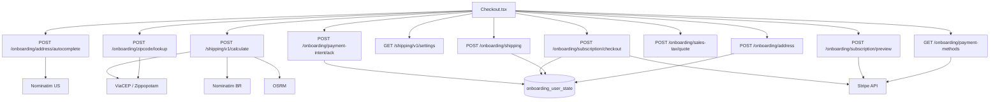

# Aplicacao do checkout no backend Node

Como a logica WordPress (`headless-secure-registration` + `pawbowl-stripe-billing`) entra no Express atual: **JWT**, **sem sessao**, persistencia em `onboarding_user_state` por `user_id`.

Fonte PHP (projeto original):

- `pawbowl-wp/wp/wp-content/plugins/headless-secure-registration/`
- `pawbowl-wp/wp/wp-content/plugins/pawbowl-stripe-billing/`

Analises WP: `docs/checkout/`. Contratos Node atuais: [README.md](./README.md) e [CHECKOUT_RULES.md](./CHECKOUT_RULES.md).

Este arquivo e o guia de transicao. Nao copiar PHP. Nao recriar `session_id` / `account-link` / `x-session-token`.

## 1. O que ja existe no Node e o que falta

O front (`onboardingApi.ts` / `shippingApi.ts`) ja chama os paths novos. O Express registra a maioria. Varias ainda sao stub ou 404.

| Responsabilidade | WP (hoje, codigo vivo) | Node (hoje) | Node (alvo) |
|---|---|---|---|
| Identidade | `session_id` + token de sessao | JWT `currentUser.id` | permanece JWT |
| Lookup CEP/ZIP | ViaCEP + Zippopotam, HTTP 200 + `data.status` | stub SF | mesmos provedores, rota **publica** |
| Autocomplete rua US | Nominatim `limit=6` | stub Springfield | Nominatim com UA, rota **publica** |
| Gravar endereco | `session.zipcode` | UPSERT `onboarding_user_state.address` | manter; alinhar normalize BR (so digitos) |
| Cotar frete BR | `POST /shipping/v1/calculate` publico | **404** | mesma URL ou `/api/v1/shipping/calculate` + mudar front |
| Tarifa US | `GET /shipping/v1/settings?country=US` | **404** | mesma URL ou `/api/v1/shipping/settings` |
| Quote autenticado | `POST .../shipping/quote` (sessao) | nao existe | **nao migrar** (front nao chama) |
| Gravar frete | `plan_selection.shipping` + recota product_tax | UPSERT `shipping` so | gravar snapshot; recotar tax no checkout, nao no select |
| Sales tax US | Woo `WC_Tax` ou Stripe Tax se flag | stub CA 10% / subtotal 20 | Stripe Tax (preview) como fonte; Woo **nao** |
| Preview imposto Stripe | `StripeSubscriptionService::preview_subscription_invoice` | totais fixos 25/2.5/27.5 | Invoice Preview real, so US, JWT |
| Cartoes salvos | Stripe Customer do pedido/usuario | Visa fake `pm_123` | Stripe `paymentMethods.list` pelo customer do `user_id` |
| Place Order | Woo order + Stripe sub | stub 29.99 | Stripe Subscription no Node, sem `wc_create_order` |
| ACK PaymentIntent | meta do pedido Woo, snake_case | UPDATE JSON, **camelCase** | snake_case (`order_id`, ...) |
| Webhook pago | `hsr_stripe_invoice_paid_confirmed` | nao existe | webhook Stripe ja previsto em `pawbowl-stripe-billing`; portar depois do checkout real |

## 2. Decisoes em relacao ao PHP

| Tema | WP | Decisao no Node |
|---|---|---|
| Path onboarding | `/wp-json/custom/v1/onboarding/session/:id/...` | `/api/v1/onboarding/...` (front ja usa) |
| Path frete publico | `/wp-json/shipping/v1/calculate` e `/settings` | criar no Express nos **mesmos paths** que `shippingApi.ts` chama hoje (`/shipping/v1/...` no `VITE_API_BASE_URL`), para nao quebrar o front |
| Auth lookup/autocomplete | sessao obrigatoria + rate limit por sessao | **publicas** (ja e o contrato do front) |
| Auth escritas / cobranca | sessao; checkout exige `linked_user_id` + `account-link` | JWT; checkout/ACK usam `assertCriticalOperationAllowed` no lugar de `account-link` |
| Envelope | `{ success, data }` + `session_id` | `{ success, data }` **sem** `session_id` |
| Persistencia | `wp_hsr_onboarding_sessions` JSON | `onboarding_user_state` colunas JSON |
| WooCommerce no checkout | `wc_create_order`, zonas, `WC_Tax` | **nao portar**. Catalogo/preco ja e Node (`plan/preview`). Imposto US = Stripe. Pedido = Stripe + `checkout_reference` |
| `POST .../shipping/quote` | cotacao autenticada (BR calcula, US fixo, resto Woo) | **nao migrar**. Front cotiza em `/shipping/v1/*` e grava em `POST /onboarding/shipping` |
| `POST .../account-link` | liga sessao ao WP user | **nao migrar**. JWT ja e o usuario |
| Nominatim autocomplete | sem User-Agent (403 frequente) | **enviar UA** (o client de frete WP ja usa `EdenBowlShipping/1.0`) |
| Status de negocio lookup | HTTP 200 + `incomplete`/`invalid`/`found`/`not_found`/`error` | manter; 503 interno vira `status=error` |
| ACK response | snake_case | **snake_case** (corrigir o repository camelCase) |
| Settings de frete | option `hsr_shipping_settings` (admin WP) | env + JSON em `data/` (igual MaxMind); admin depois |

## 3. Arquitetura no projeto atual

Padrao: `route → service → repository`. HTTP externo (ViaCEP, Nominatim, OSRM, Stripe) fica em `src/infrastructure/`, regras puras em `src/core/`.



Identidade em todas as rotas autenticadas:

```js
userId: request.currentUser && request.currentUser.id ? request.currentUser.id : null
```

Sem JWT nas publicas: lookup, autocomplete, calculate, settings.

## 4. Rotas: WP agora → Node alvo

### 4.1 `POST /api/v1/onboarding/zipcode/lookup` (publica)

WP (`OnboardingService::lookup_zipcode` + `lookup_zipcode_br` / `_us`):

1. Exige sessao (404 se nao existir). **Node nao replica.**
2. Caracteres invalidos → `invalid` HTTP 200.
3. Pais: body `US`/`BR` ou inferencia (5/9 digitos US, 8 digitos BR).
4. Incompleto → `incomplete`.
5. BR: `GET https://viacep.com.br/ws/{8digitos}/json/` timeout 5s. `erro` ou JSON ruim → `not_found`. HTTP != 200 → `error`.
6. US: `GET https://api.zippopotam.us/us/{5digitos}` timeout 5s. 404 → `not_found`. Mapeia `state abbreviation` + `place name`. `street`/`neighborhood` vazios.
7. Sem city/state apos map → `not_found`.
8. Rate limit WP: 30 / 300s por sessao.

Alvo Node: substituir `OnboardingZipcodeLookupRepository` stub pelo HTTP real. Manter o service de validacao local (ja existe). Envelope 200 para status de negocio. Rate limit: global ja cobre; opcional bucket por IP depois.

Arquivos: `src/infrastructure/geo/via-cep-client.js`, `src/infrastructure/geo/zippopotam-client.js`. Reusar ViaCEP no calculate BR.

### 4.2 `POST /api/v1/onboarding/address/autocomplete` (publica)

WP (`autocomplete_address` + `autocomplete_address_us`): so US; query `mb_strlen` >= 4; Nominatim `countrycodes=us&limit=6&addressdetails=1`; filtro street+city+state+postcode; fallback country da sessao.

Alvo Node: repository deixa de inventar Springfield. Client Nominatim **com User-Agent**. Default country sem body: `US` (ja e o Node; nao ha sessao). Zod ja recusa `USA`. HTTP 200 para `unsupported_country` / `incomplete` / `not_found` / `error`.

Unificar com o Nominatim de frete BR (`countrycodes=br`, `limit=1`) num client so, dois use cases.

### 4.3 `POST /api/v1/onboarding/address` (JWT)

WP `set_zipcode` e o Node `OnboardingZipcodeService.setZipcode` ja sao quase iguais (country, zip, state+city obrigatorios, aliases street/postal_code).

Ajustes:

- BR: normalizar **removendo nao-digitos** antes de validar 8 (WP `normalize_postal_code`). Hoje `01310-100` no lookup Node pode falhar; no save o service ja corta digitos.
- Nao gravar `session_id`. Continuar UPSERT `address`.
- Front ignora o body; manter `{ success, data: { zipcode } }`.

### 4.4 Frete publico — **criar no Node** (hoje 404)

Front: `eden-bowls/src/services/shippingApi.ts`.

WP vivo:

- `ShippingApi::calculate` → `CalculateShippingUseCase::execute`
- `ShippingApi::public_settings` → option `hsr_shipping_settings`

Registrar em `src/app.js` (paths **sem** `/api/v1` se o front continuar assim):

```
POST /shipping/v1/calculate
GET  /shipping/v1/settings
```

Auth: publica (`permission = true` no WP). JWT ausente nao bloqueia. Incluir no skip do middleware **ou** nao prefixar `/api/v1` (o middleware so age em `/api/v1`).

**Calculate BR** (copiar a formula, nao o PHP):

1. `country !== BR` → 400 `country_not_supported`
2. settings BR `enabled` false → 422 `shipping_disabled`
3. CEP 8 digitos → senao 400 `invalid_zipcode`
4. CD `lat`/`lng` zerados → 422 `route_failed`
5. ViaCEP (cache 7d) → Nominatim BR geocode (cache 60d, UA obrigatorio) → OSRM driving (cache 14d chave `version+lat4,lng4`)
6. OSRM falha → Haversine × `road_factor` (default 1.3), `distance_source=haversine_fallback`
7. `billableKm = meters/1000`; se haversine, multiplica `road_factor`; round 2
8. se `max_distance_km` (500) e distancia maior → 422 `out_of_coverage`
9. `raw = distanceKm * per_km` (default 0.95); aplica `min_fee` / `max_fee`
10. `delivery_days = ceil(distanceKm / km_per_day)` clamp `min_days`..`max_days` (2..10), minimo 1

Resposta `data` = contrato `DistanceShippingQuote` do front.

**Settings US**: `cost` 12.90, FedEx, `currency USD`. BR no GET devolve `per_km` (front BR nao usa este GET para cotar).

Settings alvo: `SHIPPING_*` no `env.js` + arquivo `data/shipping-settings.json` (CD lat/lng). Sem option WP.

Nao persistir cotacao. Persistencia continua `POST /api/v1/onboarding/shipping`.

### 4.5 `POST /api/v1/onboarding/shipping` (JWT)

WP `select_shipping`: valida rate, monta snapshot, **recalcula product_tax** via `ProductTaxService` e grava em `plan_selection.shipping` + `plan_selection.product_tax`.

Node hoje: so coluna `shipping`. Nao toca tax. **Manter assim** no select: o front ja cotou; tax e preview/checkout.

Alvo extra (opcional, paridade UX): se US, o select pode disparar o mesmo calculo de tax que `sales-tax/quote`, gravando em `plan_selection` JSON (hoje `plan_selection` e outra coluna). Nao e bloqueante para o front atual (`syncShippingSelectionToApi` ignora o body).

Corrigir `quoted_at` default hardcoded (`2026-08-09`) → `new Date().toISOString()` como o WP (`gmdate('c')`).

### 4.6 `POST .../shipping/quote` — nao migrar

WP autentica sessao, le `session.zipcode`, BR reusa `CalculateShippingUseCase`, US `GetFixedShippingQuote::forUs`, outros paises Woo zones. O front **nao chama**. Cotacao = 4.4. Select = 4.5.

### 4.7 Imposto: `sales-tax/quote` + `subscription/preview`

WP:

- `get_sales_tax_quote`: Woo `WC_Tax::find_rates` US; se `STRIPE_US_AUTOMATIC_TAX` → tax 0 e deixa Stripe calcular; **grava** `plan_selection.product_tax`. Subtotal vem do plano da sessao, nao de constante 20.
- `get_subscription_preview`: so US; `price_ids` do body ou `catalog_pricing.line_items[].stripe_price_id`; `StripeSubscriptionService::preview_subscription_invoice`.

Alvo Node:

- **Fonte de verdade US = Stripe Invoice Preview** (`subscription/preview`). JWT. Ler `price_ids` do body ou `plan_selection` (ja le `pets[].price_ids`; WP lia `line_items` — aceitar os dois).
- `sales-tax/quote`: fallback do front. Sem Woo. Se Stripe Tax estiver ligado, devolver tax 0 + jurisdiction (paridade `is_automatic_tax_enabled`). Senao, ou chamar o mesmo preview, ou 422 `sales_tax_unavailable` — **nao** manter CA 10% fake.
- Subtotal: `plan_selection.catalog_pricing.subtotal` do usuario, nunca `20`.
- Sem `session_id` na resposta.

### 4.8 `GET /api/v1/onboarding/payment-methods` (JWT)

WP: resolve Stripe customer em `_hsr_stripe_customer_id` do pedido da sessao ou pedidos do `linked_user_id`; `paymentMethods->all({ customer, type: card })`; `is_default` = `invoice_settings.default_payment_method`. Sem customer → `data: []`.

Alvo Node: customer Stripe persistido no usuario (usermeta ou tabela billing ja usada por `pawbowl-stripe-billing`). Sem customer → `[]`, nao o Visa 4242. 502 se Stripe falhar (WP faz isso).

### 4.9 `POST /api/v1/onboarding/subscription/checkout` (JWT + conta ativa)

WP `CheckoutService::checkout`:

1. Woo obrigatorio.
2. `linked_user_id` + usuario **active** (equivale a `assertCriticalOperationAllowed`).
3. Sessao completa: pets, questionnaire, `plan_selection.catalog_pricing.line_items`, recurrence, zipcode, shipping.
4. Revalida eligibility (pedido pago anterior / sub ativa).
5. Aplica promotion 1a compra.
6. Reusa pedido se fingerprint igual.
7. Cria `wc_create_order`, lines, shipping, tax, sync Stripe.
8. `present_checkout` snake_case **com** `session_id` (Node **omite** `session_id`).

Alvo Node (sem Woo):

1. JWT + conta ativa (ja existe).
2. Validar estado do usuario: pets em `onboarding_pets`, `plan_selection`, `address`, `shipping`, recurrence — hoje o stub **nao valida**. Portar `validate_session_for_checkout` para `user_id` (`422 session_incomplete` / equivalentes). Questionnaire: se o Node nao persiste mais, nao exigir.
3. Eligibility + cupom: service ja faz.
4. Criar Subscription Stripe (plugin `StripeSubscriptionService` / client Node). Gravar ids em `checkout_reference`.
5. Totais reais: catalogo + shipping da coluna `shipping` + tax Stripe. Acabar com `29.99` / `subtotal 25`.
6. Default do front e `order_first` (nao manda `checkout_mode`). O stub **nao** devolve `stripe_client_secret` nesse modo — o Place Order real precisa devolver `stripe_client_secret` quando o PaymentIntent exigir confirmacao, senao o `confirmCardPayment` do front nunca roda.
7. `payment_state` copiar `resolve_payment_state` (paid / sync_error / failed / requires_confirmation / pending_sync / pending_payment_method). O stub usa `requires_payment_method` (WP usa `pending_payment_method` nesse ramo). Alinhar com o que `Checkout.tsx` trata.

### 4.10 `POST /api/v1/onboarding/payment-intent/ack` (JWT)

WP devolve:

```json
{
  "order_id": 101,
  "stripe_payment_intent_id": "pi_...",
  "stripe_payment_intent_status": "succeeded",
  "payment_state": "paid",
  "acked": true
}
```

`paid` se status `succeeded` | `processing` | `requires_capture` (e pedido Woo processing/completed). Node hoje so marca paid em `succeeded`/`processing` — incluir `requires_capture`.

Mismatch de PI: WP **409** `payment_intent_mismatch`; Node **404** `payment_intent_not_found`. Preferir 409 para nao confundir com “nao existe”.

Resposta: **mapear snake_case** no service/repository. O front le `ack.payment_state`.

## 5. Arquivos a criar e a alterar

### 5.1 Criar (frete + HTTP geo)

```text
src/api/routes/shipping.routes.js
src/services/shipping.service.js
src/core/shipping-fee.js          # apply, deliveryDays, billableDistanceKm (copia da classe PHP)
src/infrastructure/shipping/shipping-settings.js
src/infrastructure/geo/via-cep-client.js
src/infrastructure/geo/zippopotam-client.js
src/infrastructure/geo/nominatim-client.js
src/infrastructure/geo/osrm-client.js
tests/shipping.routes.test.js
tests/shipping-fee.test.js
tests/onboarding-zipcode-lookup.service.test.js
```

### 5.2 Alterar (substituir stubs)

```text
src/infrastructure/repositories/onboarding-zipcode-lookup.repository.js
src/infrastructure/repositories/onboarding-address-autocomplete.repository.js
src/infrastructure/repositories/onboarding-payment-methods.repository.js
src/infrastructure/repositories/onboarding-sales-tax-quote.repository.js
src/services/onboarding-sales-tax-quote.service.js
src/infrastructure/repositories/onboarding-subscription-preview.repository.js
src/infrastructure/repositories/onboarding-subscription-checkout.repository.js
src/services/onboarding-subscription-checkout.service.js
src/infrastructure/repositories/onboarding-payment-intent-ack.repository.js
src/api/middleware/bearer-token.middleware.js   # so se calculate/settings forem /api/v1
src/app.js
src/index.js
src/config/env.js                               # SHIPPING_*, STRIPE_*, Nominatim UA
```

### 5.3 Nao criar

- rotas `/onboarding/session/...`
- `account-link`
- `shipping/quote` autenticado
- tabelas Woo so para checkout
- `x-session-token` no CORS (ja nao esta)

## 6. Ordem de implementacao sugerida

A tela quebra hoje na ordem do usuario: Address (lookup stub aceitavel) → Shipping (**404 calculate/settings**) → Payment (cartao fake) → Place Order (stub sem client_secret).

1. **Frete publico** (`/shipping/v1/calculate` + `/settings`) — desbloqueia o painel Shipping.
2. **Lookup real** ViaCEP/Zippopotam — Address deixa de preencher SF.
3. **Autocomplete Nominatim** com UA.
4. ACK snake_case + `requires_capture` → `paid` (corrigir contrato, barato).
5. `quoted_at` agora, nao data fixa.
6. Payment methods Stripe reais (`[]` se nao houver customer).
7. Subscription preview Stripe Tax.
8. Checkout Stripe real + validacao de estado do usuario + `stripe_client_secret` no fluxo que o front usa.
9. Webhook de invoice paid + dashboard de assinatura (ainda nao convertido). Guia: [docs/other-routers](../../docs/other-routers/README.md).

## 7. Env sugerido (alvo)

Alem do JWT/Stripe coupon ja existente:

| Variavel | Uso | Default WP |
|---|---|---|
| `SHIPPING_US_COST` | tarifa fixa US | `12.90` |
| `SHIPPING_US_LABEL` / `CARRIER` / `DELIVERY` | settings US | FedEx 3–5 business days |
| `SHIPPING_BR_PER_KM` | calculate | `0.95` |
| `SHIPPING_BR_ROAD_FACTOR` | haversine | `1.3` |
| `SHIPPING_BR_MAX_DISTANCE_KM` | cobertura | `500` |
| `SHIPPING_BR_KM_PER_DAY` / `MIN_DAYS` / `MAX_DAYS` | prazo | 80 / 2 / 10 |
| `SHIPPING_BR_CENTER_LAT` / `LNG` | CD | obrigatorio em prod; 0 → 422 |
| `NOMINATIM_USER_AGENT` | autocomplete + geocode BR | `EdenBowlShipping/1.0 (...)` |
| `STRIPE_SECRET_KEY` | preview, cartoes, checkout | ja no plugin Stripe |
| `STRIPE_US_AUTOMATIC_TAX` | sales-tax quote vira 0 | flag WP |

## 8. Testes minimos na transicao

Nao rodar a suíte inteira. Por fatia:

```bash
npx jest --runTestsByPath tests/shipping-fee.test.js
npx jest --runTestsByPath tests/shipping.routes.test.js
npx jest --findRelatedTests src/services/onboarding-zipcode-lookup.service.js
npx jest --findRelatedTests src/infrastructure/repositories/onboarding-payment-intent-ack.repository.js
npx jest --findRelatedTests src/services/onboarding-subscription-checkout.service.js
```

Cobrir: CEP incompleto → `incomplete`; ViaCEP `erro` → `not_found`; country US no calculate → 400; distancia > 500 → 422; ACK snake_case; checkout sem JWT → 401; checkout sem `plan_selection` → 422 (quando a validacao existir).
