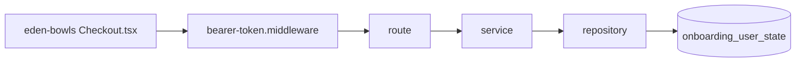

# Checkout no backend Node

Documentacao das rotas atuais do `eden-bowls-backend` usadas pela tela `/checkout`.

A origem de negocio (paineis, validacao de endereco, Place Order, Stripe ACK) esta em:

- `eden-bowls/src/pages/checkout/CHECKOUT_RULES.md`

Este diretorio descreve o mesmo fluxo **no Node**. Nao ha sessao de onboarding. Identidade e **JWT**. Persistencia e `onboarding_user_state` por `user_id`.

Analises WP legado: `docs/checkout/`.

Transicao WP → Node (codigo vivo do plugin + o que criar/alterar): [APLICACAO_CHECKOUT.md](./APLICACAO_CHECKOUT.md).

## Mudanca de modelo

| Aspecto | WordPress (legado) | Node (atual) |
|---|---|---|
| Identidade | `session_id` na URL | `userId` do JWT (`request.currentUser.id`) |
| Auth | `x-session-token` ou Bearer de sessao | `Authorization: Bearer <jwt>` |
| Persistencia | `wp_hsr_onboarding_sessions` + JSON columns | `onboarding_user_state` (PK `user_id`) |
| Envelope | `{ success, data }` com `session_id` | `{ success, data }` **sem** `session_id` |
| Lookup / autocomplete | exigiam sessao valida | **publicas** (JWT opcional; o front nao envia) |
| Save address / shipping / payment / checkout / ACK | sessao | JWT **obrigatorio** |
| Cotacao de frete BR/US | `POST/GET /shipping/v1/*` no WP | **nao implementada** no Node |

O front (`eden-bowls/src/services/onboardingApi.ts`) ja chama os paths novos, sem `sessionId`.

## Rotas cobertas

| Rota | Metodo | Auth | Persistencia | Estado | Documento |
|---|---|---|---|---|---|
| `/api/v1/onboarding/zipcode/lookup` | POST | Publica | Nenhuma | stub (sempre "found") | [ROTA_ONBOARDING_ZIPCODE_LOOKUP.md](./ROTA_ONBOARDING_ZIPCODE_LOOKUP.md) |
| `/api/v1/onboarding/address/autocomplete` | POST | Publica | Nenhuma | stub (sugestao fake US) | [ROTA_ONBOARDING_ADDRESS_AUTOCOMPLETE.md](./ROTA_ONBOARDING_ADDRESS_AUTOCOMPLETE.md) |
| `/api/v1/onboarding/address` | POST | JWT obrigatorio | `onboarding_user_state.address` | persistencia real | [ROTA_ONBOARDING_ADDRESS.md](./ROTA_ONBOARDING_ADDRESS.md) |
| `/api/v1/onboarding/shipping` | POST | JWT obrigatorio | `onboarding_user_state.shipping` | persistencia real (nao cotiza) | [ROTA_ONBOARDING_SHIPPING.md](./ROTA_ONBOARDING_SHIPPING.md) |
| `/shipping/v1/calculate` | POST | Publica (WP) | Nenhuma | **ausente no Node** | [ROTA_SHIPPING_CALCULATE.md](./ROTA_SHIPPING_CALCULATE.md) |
| `/shipping/v1/settings` | GET | Publica (WP) | Nenhuma | **ausente no Node** | [ROTA_SHIPPING_CALCULATE.md](./ROTA_SHIPPING_CALCULATE.md) |
| `/api/v1/onboarding/sales-tax/quote` | POST | JWT obrigatorio | Nenhuma | stub (CA 10%, resto 0) | [ROTA_ONBOARDING_SALES_TAX_QUOTE.md](./ROTA_ONBOARDING_SALES_TAX_QUOTE.md) |
| `/api/v1/onboarding/subscription/preview` | POST | JWT obrigatorio | Le `plan_selection` | stub (totais fixos, so US) | [ROTA_ONBOARDING_SUBSCRIPTION_PREVIEW.md](./ROTA_ONBOARDING_SUBSCRIPTION_PREVIEW.md) |
| `/api/v1/onboarding/payment-methods` | GET | JWT obrigatorio | Nenhuma | stub (Visa 4242) | [ROTA_ONBOARDING_PAYMENT_METHODS.md](./ROTA_ONBOARDING_PAYMENT_METHODS.md) |
| `/api/v1/onboarding/subscription/checkout` | POST | JWT obrigatorio + conta ativa | `checkout_reference` (+ `plan_selection` se houver) | stub Stripe; desconto 1a compra real | [ROTA_ONBOARDING_SUBSCRIPTION_CHECKOUT.md](./ROTA_ONBOARDING_SUBSCRIPTION_CHECKOUT.md) |
| `/api/v1/onboarding/payment-intent/ack` | POST | JWT obrigatorio + conta ativa | atualiza `checkout_reference` | persistencia real | [ROTA_ONBOARDING_PAYMENT_INTENT_ACK.md](./ROTA_ONBOARDING_PAYMENT_INTENT_ACK.md) |

Regras de tela (paineis, Place Order, fonte de verdade de total): [CHECKOUT_RULES.md](./CHECKOUT_RULES.md).

Cupom de primeira compra no checkout: [../coupons/STRIPE_COUPONS_FIRST_PURCHASE.md](../coupons/STRIPE_COUPONS_FIRST_PURCHASE.md).

Preview de plano (totais que o front leva para `/checkout`): [../Plan/ROTA_ONBOARDING_PLAN_PREVIEW.md](../Plan/ROTA_ONBOARDING_PLAN_PREVIEW.md).

## Arquitetura comum



1. `createApp` registra as rotas em `src/app.js`.
2. `buildBearerTokenMiddleware` valida JWT em `/api/v1/*`. Sem `Authorization`, segue sem `request.currentUser`.
3. Rotas publicas de checkout (lookup, autocomplete) nao exigem usuario.
4. Rotas de escrita / cobranca exigem `request.currentUser.id` e respondem `401` sem JWT.
5. Checkout e ACK ainda chamam `authService.assertCriticalOperationAllowed(userId)`: conta `pending` / `inactive` / `suspended` / `banned` vira `403 account_operation_not_allowed`.

Nao ha `x-session-token`. Nao ha `session_id` na URL nem no envelope Node.

## Envelope de erro padrao

Definido no error handler de `src/app.js`:

```json
{
  "success": false,
  "message": "Authentication is required.",
  "details": { "code": "unauthorized" }
}
```

- Payload Zod invalido: `400` com `details` = `error.issues`.
- `HttpError` com `details.code` nas rotas de checkout: a propria rota devolve `{ success: false, message }` (varias tambem devolvem `details`).
- JWT malformado / invalido: `403` (`jwt_auth_bad_auth_header` / `jwt_auth_invalid_token`) no middleware, antes da rota.
- Demais erros: status do `HttpError` ou `500` com mensagem generica.

## Fonte de verdade de total

O front recebe `grandTotal` / `firstMonthTotal` / `discount` via `navigate(state)` da tela Plan (preview). A cobranca no Place Order **nao** relê esse state: o checkout Node aplica desconto de primeira compra a partir de `plan_selection` + eligibility do `user_id`.

Regra: o valor cobrado pertence ao back-end. Ver [CHECKOUT_RULES.md](./CHECKOUT_RULES.md).

## Fontes no codigo

- Bootstrap e wiring: `src/index.js`
- Registro de rotas e CORS/JWT: `src/app.js`
- Auth: `src/api/middleware/bearer-token.middleware.js`
- Tabela: `onboarding_user_state` (`src/infrastructure/entities/onboarding-user-state.entity.js`)
- Consumidor: `eden-bowls/src/services/onboardingApi.ts` e `eden-bowls/src/services/shippingApi.ts`
