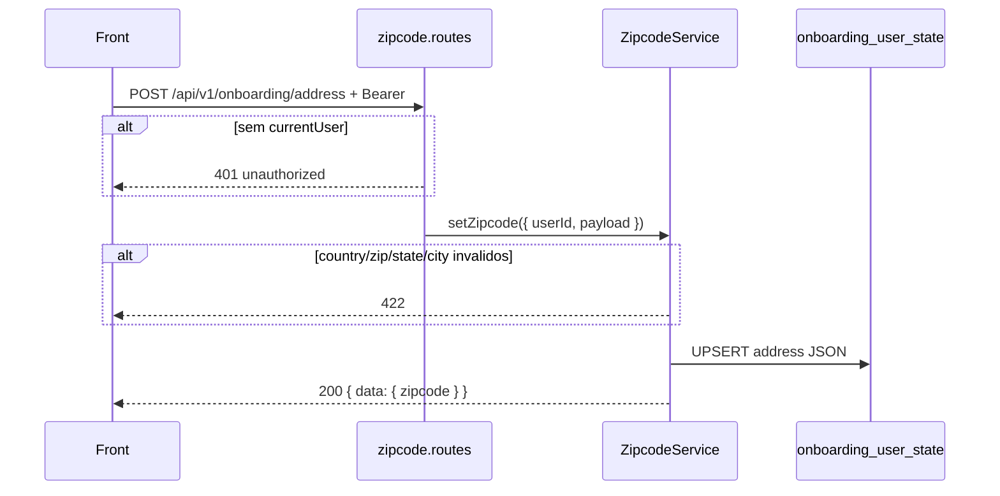

# Rota atual: Onboarding Address (save zipcode)

## Escopo

Rota atual no backend Node:

- `POST /api/v1/onboarding/address`

Origem no front-end:

- `eden-bowls/src/services/onboardingApi.ts` (`syncZipcodeToApi`)
- Continue do painel Address em `Checkout.tsx`

Arquivos principais:

- `src/api/routes/onboarding-zipcode.routes.js`
- `src/services/onboarding-zipcode.service.js`
- `src/infrastructure/repositories/onboarding-zipcode.repository.js`
- `src/infrastructure/entities/onboarding-user-state.entity.js`
- `tests/onboarding-zipcode.repository.test.js`

Rota legado WordPress (substituida):

- `POST /custom/v1/onboarding/session/:sessionId/zipcode`

Nao ha `session_id`. JWT **obrigatorio**. Esta e a rota que **grava** o endereco.

## Responsabilidade

Normalizar e persistir o endereco de entrega em `onboarding_user_state.address` para o `user_id` do JWT.

Nao faz lookup. Nao cotiza frete.

## Estado de implementacao

| Parte | Status |
|---|---|
| JWT obrigatorio | implementado |
| Validacao country / zipcode / state+city | implementada |
| UPSERT JSON `address` | implementada |
| Exigir number/neighborhood (BR) | **nao** (so o front exige) |

## Endpoint, controller e permissao

- Path: `/api/v1/onboarding/address`
- Method: `POST`
- Registrar: `registerOnboardingZipcodeRoutes`
- Service: `OnboardingZipcodeService.setZipcode`

Controller:

1. Service injetado (`503`).
2. Sem `request.currentUser.id` → `401 unauthorized`.
3. `setZipcode({ userId, payload })`.
4. `200` `{ success: true, data }`.

## Autenticacao

```http
Authorization: Bearer <jwt-de-usuario>
```

Sem JWT: `401`. JWT invalido: middleware `403` antes da rota.

## Fluxo



Validacoes (`422` + `details.code`):

| Condicao | code |
|---|---|
| country nao e `US`/`BR` | `invalid_country` |
| zipcode vazio apos normalize | `invalid_zipcode` |
| BR nao e 8 digitos | `invalid_zipcode` |
| US nao e `NNNNN` ou `NNNNN-NNNN` | `invalid_zipcode` |
| state ou city vazios | `invalid_location` |

Normalize:

- BR zip: so digitos, trunca em 8
- US zip: remove tudo que nao e digito/hifen
- aliases: `postal_code` / `postalCode`; `street` / `address_line1`; `complement` / `address_line2`

Payload gravado (JSON da coluna `address`):

```json
{
  "zipcode": "01310100",
  "postal_code": "01310100",
  "country": "BR",
  "state": "SP",
  "city": "Sao Paulo",
  "street": "Av Paulista",
  "number": "1000",
  "neighborhood": "Bela Vista",
  "complement": "",
  "phone": "",
  "phone_country": "BR",
  "delivery_instructions": "",
  "address_line1": "Av Paulista",
  "address_line2": ""
}
```

## Persistencia

```sql
INSERT INTO `onboarding_user_state` (`user_id`, `address`)
VALUES (?, ?)
ON DUPLICATE KEY UPDATE `address` = VALUES(`address`)
```

A linha e por usuario. UPSERT **nao** preserva `shipping` / `plan_selection` se a linha ainda nao existir — so escreve `user_id` + `address`. Se a linha ja existe (PK), as outras colunas permanecem.

Resposta:

```json
{
  "success": true,
  "data": {
    "zipcode": { "...payload normalizado..." }
  }
}
```

O front ignora o body em sucesso (`assertOk`).

## Request do front

```json
{
  "zipcode": "01310-100",
  "country": "BR",
  "state": "SP",
  "city": "Sao Paulo",
  "street": "Av Paulista",
  "number": "1000",
  "neighborhood": "Bela Vista",
  "complement": "",
  "phone": "",
  "phone_country": "BR",
  "delivery_instructions": ""
}
```

`country` no front: payload ou fallback `navigator.language` (`pt-br` → BR, senao US).

## O que mudou em relacao ao WordPress

| Antes (WP) | Hoje (Node) |
|---|---|
| `.../session/:id/zipcode` | `/api/v1/onboarding/address` |
| token de sessao | JWT de usuario |
| `zipcode_json` da sessao | `onboarding_user_state.address` |
| `session_id` na resposta | ausente |
