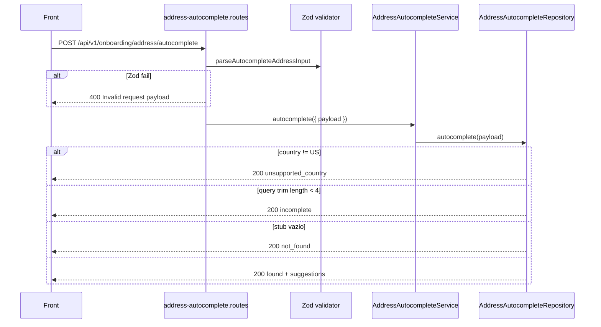

# Rota atual: Onboarding Address Autocomplete

## Escopo

Rota atual no backend Node:

- `POST /api/v1/onboarding/address/autocomplete`

Origem no front-end:

- `eden-bowls/src/services/onboardingApi.ts` (`autocompleteAddressInApi`)
- `eden-bowls/src/pages/checkout/Checkout.tsx` (debounce 350ms, minimo 4 chars)

Arquivos principais:

- `src/api/routes/onboarding-address-autocomplete.routes.js`
- `src/api/validators/onboarding-address-autocomplete.validator.js`
- `src/services/onboarding-address-autocomplete.service.js`
- `src/infrastructure/repositories/onboarding-address-autocomplete.repository.js`
- `tests/onboarding-address-autocomplete.routes.test.js`

Rota legado WordPress (substituida):

- `POST /custom/v1/onboarding/session/:sessionId/address/autocomplete`

Analise WP detalhada: `docs/checkout/address-autocomplete/01-onboarding-address-autocomplete.md`.

Nao ha `session_id`. Nao ha `x-session-token`. A rota e **publica**. **Nao persiste** endereco.

## Responsabilidade

Sugerir ruas a partir de texto livre, **somente Estados Unidos**. Persistencia e outra rota: `POST /api/v1/onboarding/address`.

Nao confundir com:

- `POST /onboarding/zipcode/lookup` — autocomplete por CEP/ZIP
- `POST /onboarding/address` — grava `onboarding_user_state.address`
- Nominatim de frete BR — nao existe no Node; no WP era outro client

## Estado de implementacao

| Parte | Status |
|---|---|
| Endpoint publico + Zod | implementado |
| `unsupported_country` / `incomplete` / `found` | implementado no repository |
| Nominatim (OpenStreetMap) | **nao ligado** |
| User-Agent / timeout 5s / limit=6 | **nao** (WP tinha; Node stub) |
| Fallback `session.country` | **removido** (nao ha sessao) |

O stub monta uma sugestao unica (`{query} Street`, Springfield IL `62704`) se a query passar nas regras.

## Endpoint, controller e permissao

### Registro

- Path: `/api/v1/onboarding/address/autocomplete`
- Method: `POST`
- Registrar: `registerOnboardingAddressAutocompleteRoutes`
- Validator: `parseAutocompleteAddressInput` (Zod)
- Service: `OnboardingAddressAutocompleteService.autocomplete`

O middleware JWT **pula** o path legado `/api/v1/onboarding/session/.../address/autocomplete` (`isSessionAutocompleteRoute`). O path novo **nao** e public-skip especial: sem Bearer, o middleware segue sem `currentUser`, e a rota nao exige usuario.

### Controller

1. Exige service injetado (`503`).
2. Parse Zod do body (`400` se invalido).
3. Chama `autocomplete({ payload })` — **sem** `userId`.
4. Responde `200` com `{ success: true, data }`.

Envelope `success: true` mesmo quando `data.status` e `unsupported_country`, `incomplete` ou `not_found`.

## Autenticacao

JWT **nao e exigido**. Testes cobrem autocomplete sem autenticacao.

O front nao envia `Authorization`.

## Fluxo da requisicao



Resolucao de pais (Node):

```
input = uppercase(payload.country)
country = (input === 'US' || input === 'BR') ? input : 'US'
```

Diferenca vs WP: la havia fallback `session.country`. Aqui, body omitido → default `US`. Sessao BR sem `country` no body **nao existe** mais; o front precisa mandar `country: "BR"` para receber `unsupported_country`.

`USA` (tres letras) nao passa no Zod (`z.enum(['US','BR'])`) → HTTP `400`, nao `unsupported_country`.

Query: `trim`, minimo 4 caracteres (JS `length`, nao `mb_strlen`). Abaixo → `incomplete`, HTTP 200.

Contexto opcional (`city`, `state`, `zipcode`): concatenado na query interna do stub. Nao bloqueia. Alias `postal_code` **nao** existe (igual WP).

## Contrato

### Request

```http
POST /api/v1/onboarding/address/autocomplete
Content-Type: application/json
```

```json
{
  "query": "350 5th Ave",
  "country": "US",
  "zipcode": "10118",
  "state": "NY",
  "city": "New York"
}
```

| Campo | Obrigatorio | Notas |
|---|---|---|
| `query` | efetivo (>= 4) | opcional no Zod; vazio vira `incomplete` |
| `country` | recomendado | so `US`/`BR`. Default repository: `US` |
| `city` / `state` / `zipcode` | opcional | enriquecem o `q` do stub |

### Response

Shape fixo:

| Campo | Tipo | Semantica |
|---|---|---|
| `status` | string | `unsupported_country` \| `incomplete` \| `not_found` \| `found` (`error` reservado; stub nao emite) |
| `country` | string | pais resolvido |
| `query` | string | query ecoada (trim) |
| `suggestions` | array | `[]` quando nao `found` |
| `message` | string | texto livre |

Suggestion:

| Campo | Stub atual |
|---|---|
| `id` | `"autocomplete-1"` |
| `label` / `street` | `"{query} Street"` (query ja concatenada) |
| `city` | `Springfield` |
| `state` | `IL` |
| `zipcode` | `62704` |
| `country` | `US` |
| `neighborhood` / `complement` | `""` |

BR:

```json
{
  "success": true,
  "data": {
    "status": "unsupported_country",
    "country": "BR",
    "query": "Avenida Paulista",
    "suggestions": [],
    "message": "Autocomplete is currently supported only for US addresses."
  }
}
```

## O que mudou em relacao ao WordPress

| Antes (WP) | Hoje (Node) |
|---|---|
| sessao + token | publica, JWT opcional e ignorado |
| Nominatim real, limit 6, timeout 5s | stub 1 sugestao |
| fallback `session.country` | default `US` se country omitido/invalido |
| `USA` → unsupported (normalize A-Z) | `USA` → Zod 400 |
| rate limit 60/300s por sessao | so global 300/min |
| `mb_strlen` Unicode | `String.length` JS |
| nao persistia | continua nao persistindo |

Pontos da analise WP que ainda valem quando ligar Nominatim: HTTP 200 para `error`/`not_found`; nao persistir; so US; minimo 4 chars; UA identificavel; filtro street+city+state+postcode; preferir ISO `US-NY` → `NY` se for correcao consciente.

## Consumo no frontend

Selecao de sugestao preenche o form. Continue grava via [ROTA_ONBOARDING_ADDRESS.md](./ROTA_ONBOARDING_ADDRESS.md). Fluxo BR nao usa esta rota (`unsupported_country`); a rua vem do lookup.
