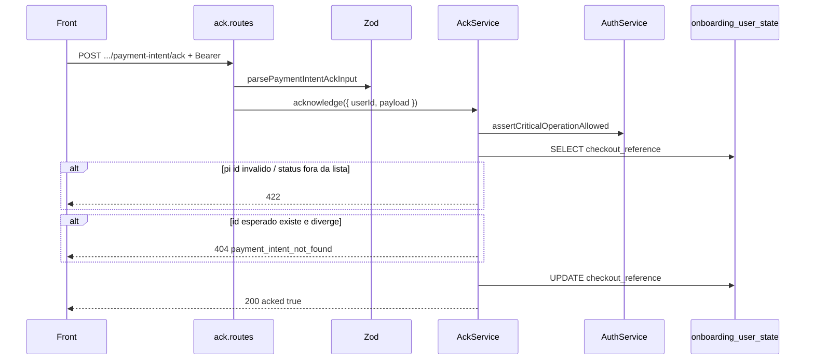

# Rota atual: Onboarding Payment Intent ACK

## Escopo

Rota atual no backend Node:

- `POST /api/v1/onboarding/payment-intent/ack`

Origem no front-end:

- `eden-bowls/src/services/onboardingApi.ts` (`acknowledgeSubscriptionPaymentIntent`)
- apos `retrievePaymentIntent` / `confirmCardPayment` em `Checkout.tsx`

Arquivos principais:

- `src/api/routes/onboarding-payment-intent-ack.routes.js`
- `src/api/validators/onboarding-payment-intent-ack.validator.js`
- `src/services/onboarding-payment-intent-ack.service.js`
- `src/infrastructure/repositories/onboarding-payment-intent-ack.repository.js`
- `tests/onboarding-payment-intent-ack.routes.test.js`
- `tests/onboarding-payment-intent-ack.repository.test.js`

Rota legado WordPress:

- `POST /custom/v1/onboarding/session/:sessionId/payment-intent/ack`

JWT **obrigatorio** + `assertCriticalOperationAllowed`. Persiste em `checkout_reference`.

## Responsabilidade

Receber o status final do PaymentIntent validado no front e consolidar `payment_state` no estado do usuario.

Nao confirma cartao. Nao chama Stripe. Confia no par `payment_intent_id` + `status` autenticado.

Regra de UI: se ACK falhar apos pagamento ja confirmado no Stripe, a tela mantem sucesso. Nao ha webhook Node para convergir depois.

## Estado de implementacao

| Parte | Status |
|---|---|
| JWT + conta ativa + Zod | implementado |
| Validacao `pi_*` + status allowlist | implementada |
| Match com `checkout_reference.stripe_payment_intent_id` | implementado (404 se divergir) |
| UPDATE JSON | implementado |
| Shape da resposta | **camelCase** no repository (`orderId`, ...) vs snake_case no type TS do front |

## Endpoint, controller e permissao

- Path: `/api/v1/onboarding/payment-intent/ack`
- Method: `POST`
- Registrar: `registerOnboardingPaymentIntentAckRoutes`
- Validator: `parsePaymentIntentAckInput`
- Service: `OnboardingPaymentIntentAckService.acknowledge`

Sem usuario → `401`. Zod fail → `400`. HttpError com code nesta rota **nao** inclui `details` no JSON (so `success` + `message`).

## Autenticacao

Igual ao checkout: Bearer + conta nao bloqueada (`403 account_operation_not_allowed`).

## Fluxo



Allowlist de status:

`succeeded` | `processing` | `requires_capture` | `requires_payment_method` | `requires_action` | `requires_confirmation` | `canceled`

`payment_state` gravado:

- `succeeded` ou `processing` → `paid`
- demais → `pending`

Tambem grava `stripe_payment_intent_id`, `stripe_payment_intent_status`, `payment_acknowledged_at`.

Se `checkout_reference` nao tiver intent id, o ACK **aceita** o id enviado (nao 404).

## Request

Aliases aceitos: `payment_intent_id` / `paymentIntentId`, `payment_intent_status` / `paymentIntentStatus`.

```json
{
  "payment_intent_id": "pi_123",
  "payment_intent_status": "succeeded"
}
```

O validator normaliza para `{ paymentIntentId, paymentIntentStatus }` antes do service.

Id que nao comeca com `pi_` → `422 invalid_payment_intent_id`.  
Status fora da lista → `422 invalid_payment_intent_status`.

## Response

O repository devolve:

```json
{
  "orderId": 101,
  "stripePaymentIntentId": "pi_123",
  "stripePaymentIntentStatus": "succeeded",
  "paymentState": "paid",
  "acked": true
}
```

O type do front espera snake_case:

```ts
{
  order_id: number
  stripe_payment_intent_id: string
  stripe_payment_intent_status: string
  payment_state: string
  acked: boolean
}
```

`Checkout.tsx` le `ack.stripe_payment_intent_id`, `ack.stripe_payment_intent_status`, `ack.payment_state`. Com o shape camelCase atual, esses campos ficam `undefined` e a UI pode nao marcar `paid` pelo ACK — ainda pode marcar sucesso pelo status Stripe local.

Ao alinhar o contrato, preferir snake_case (paridade WP + type TS) ou adaptar o front.

## Persistencia

```sql
SELECT `checkout_reference` FROM `onboarding_user_state` WHERE `user_id` = ? LIMIT 1
UPDATE `onboarding_user_state` SET `checkout_reference` = ? WHERE `user_id` = ?
```

UPDATE em usuario **sem** linha nao insere. Place Order precisa ter gravado `checkout_reference` antes.

## O que mudou em relacao ao WordPress

| Antes (WP) | Hoje (Node) |
|---|---|
| sessao + token | JWT + conta ativa |
| snake_case no `data` | camelCase no repository |
| `session_id` | ausente |
