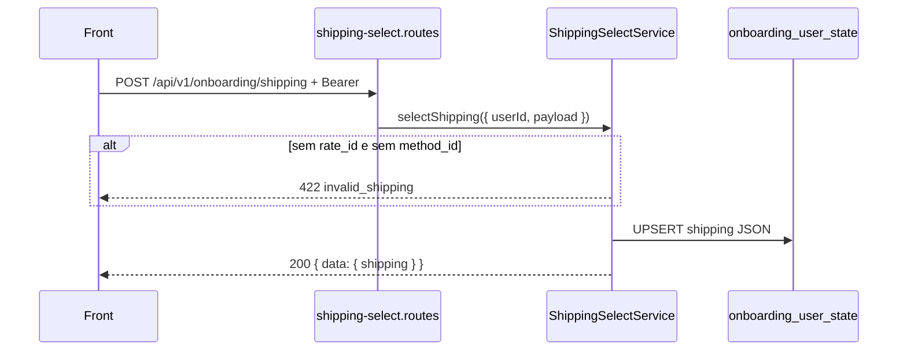

# Rota atual: Onboarding Shipping Select

## Escopo

Rota atual no backend Node:

- `POST /api/v1/onboarding/shipping`

Origem no front-end:

- `eden-bowls/src/services/onboardingApi.ts` (`syncShippingSelectionToApi`)
- Continue do painel Shipping e de novo no Place Order (`Checkout.tsx`)

Arquivos principais:

- `src/api/routes/onboarding-shipping-select.routes.js`
- `src/services/onboarding-shipping-select.service.js`
- `src/infrastructure/repositories/onboarding-shipping-select.repository.js`
- `tests/onboarding-shipping-select.routes.test.js`
- `tests/onboarding-shipping-select.repository.test.js`

Rota legado WordPress (substituida):

- `POST /custom/v1/onboarding/session/:sessionId/shipping/select`

JWT **obrigatorio**. Esta rota **persiste** o snapshot; **nao cotiza**.

Cotacao BR/US ainda e WP (`/shipping/v1/*`). Ver [ROTA_SHIPPING_CALCULATE.md](./ROTA_SHIPPING_CALCULATE.md).

## Responsabilidade

Normalizar o rate escolhido pelo front e gravar em `onboarding_user_state.shipping`.

Nao chama OSRM, ViaCEP, Nominatim nem settings. Confia nos numeros do payload (`cost`, `distance`, `per_km`, ...).

## Estado de implementacao

| Parte | Status |
|---|---|
| JWT + UPSERT `shipping` | implementado |
| Recalculo de tarifa no server | **nao** |
| Validacao contra quote anterior | **nao** |
| `quoted_at` default hardcoded | `2026-08-09T00:00:00.000Z` se o front omitir |

## Endpoint, controller e permissao

- Path: `/api/v1/onboarding/shipping`
- Method: `POST`
- Registrar: `registerOnboardingShippingSelectRoutes`
- Service: `OnboardingShippingSelectService.selectShipping`

Sem `currentUser.id` → `401`. Service ausente → `503`.

## Autenticacao

```http
Authorization: Bearer <jwt-de-usuario>
```

## Fluxo



Normalize (`normalizeShippingPayload`):

- `rate_id` fallback `method_id` e vice-versa. Ambos vazios → `422 invalid_shipping`.
- Numeros: `cost`, `tax_total`, `total` (default `cost + tax_total`), `instance_id`, `delivery_days`, `transit_business_days`, `distance`, `per_km` — nao negativos.
- `snapshot: true` sempre.
- `distance_source` default `'manual'`.
- `estimate_label`: `"{N} business days"` ou `"Immediate"`.

Snapshot persistido (campos principais):

```json
{
  "rate_id": "distance_km:br-default",
  "method_id": "distance_km",
  "instance_id": 0,
  "label": "Entrega Eden Bowl",
  "cost": 18.5,
  "tax_total": 0,
  "total": 18.5,
  "transit_business_days": 3,
  "delivery_days": 3,
  "delivery_days_min": 3,
  "delivery_days_max": 3,
  "estimate_label": "3 business days",
  "selected_at": "2026-08-17T00:00:00.000Z",
  "quoted_at": "2026-08-17T00:00:00.000Z",
  "distance": 12.4,
  "distance_source": "osrm",
  "per_km": 1.5,
  "zipcode": "01310100",
  "snapshot": true
}
```

US tipico do front: `rate_id: "fixed_us:default"`, `method_id: "fixed_us"`, cost da settings WP (default 12.90).

## Persistencia

```sql
INSERT INTO `onboarding_user_state` (`user_id`, `shipping`)
VALUES (?, ?)
ON DUPLICATE KEY UPDATE `shipping` = VALUES(`shipping`)
```

Mesma ressalva do address: INSERT inicial so preenche `user_id` + `shipping`.

O front ignora o body em sucesso.

## Request do front

Campos enviados: `rate_id`, `method_id`, `label`, `cost`, `tax_total`, `total`, `instance_id`, `delivery_days`, `transit_business_days`, `distance`, `distance_source`, `per_km`, `quoted_at`, `zipcode`.

`carrier` / `delivery` / `minimumApplied` existem no draft local e **nao** vao neste POST.

## O que mudou em relacao ao WordPress

| Antes (WP) | Hoje (Node) |
|---|---|
| `.../session/:id/shipping/select` | `/api/v1/onboarding/shipping` |
| token de sessao | JWT |
| JSON na sessao | `onboarding_user_state.shipping` |
| podia cotar no mesmo plugin | cotacao continua fora do Node |
