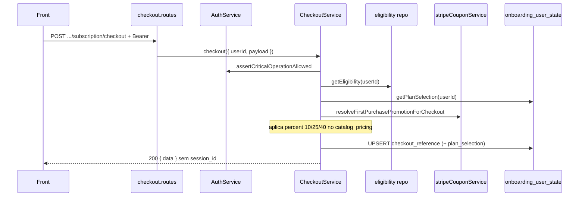

# Rota atual: Onboarding Subscription Checkout

Guia de implementacao (JWT, sem sessao, sem Woo, unico fluxo Stripe-first): [../subscription-checkout/README.md](../subscription-checkout/README.md).

## Escopo

Rota atual no backend Node:

- `POST /api/v1/onboarding/subscription/checkout`

Origem no front-end:

- `eden-bowls/src/services/onboardingApi.ts` (`runSubscriptionCheckout`)
- Place Order em `Checkout.tsx`

Arquivos principais:

- `src/api/routes/onboarding-subscription-checkout.routes.js`
- `src/services/onboarding-subscription-checkout.service.js`
- `src/infrastructure/repositories/onboarding-subscription-checkout.repository.js`
- `src/core/first-purchase-discount.js`
- `tests/onboarding-subscription-checkout.routes.test.js`
- `tests/onboarding-subscription-checkout.repository.test.js`
- `tests/onboarding-subscription-checkout.service.test.js`

Rota legado WordPress:

- `POST /custom/v1/onboarding/session/:sessionId/subscription/checkout`

JWT **obrigatorio**. Conta precisa estar apta (`assertCriticalOperationAllowed`). Nao ha `session_id` na resposta (teste cobre isso).

Cupom 1a compra: [../coupons/STRIPE_COUPONS_FIRST_PURCHASE.md](../coupons/STRIPE_COUPONS_FIRST_PURCHASE.md).

## Responsabilidade

Criar/atualizar a referencia de checkout do usuario, aplicar desconto de primeira compra (eligibility + prazo) e devolver estado de pagamento para o front seguir Stripe se houver `stripe_client_secret`.

Fonte de verdade de cobranca: esta rota, nao o `grandTotal` do `navigate(state)`.

## Estado de implementacao

| Parte | Status |
|---|---|
| JWT + conta ativa | implementado |
| Eligibility + `stripeCouponService.resolveFirstPurchasePromotionForCheckout` | implementado no service |
| Regrava `catalog_pricing.discounted_first_month_total` | implementado |
| UPSERT `checkout_reference` | implementado |
| `StripeBillingClient.createOnboardingSubscription` | implementado (`default_incomplete` + `client_secret`) |
| Ledger `incomplete` | implementado |
| Webhook Stripe | implementado em `/stripe/v1/webhook` |
| Idempotencia / reuse / `pm_` obrigatorio / `order_id: 0` | **falta** — ver [../subscription-checkout](../subscription-checkout/README.md) |

O front **nao** envia `checkout_mode`. O service ainda defaulta `order_first` no JSON, mas **sempre** cria Subscription Stripe. Alvo: persistir `subscription_first` e ignorar o campo.

## Endpoint, controller e permissao

- Path: `/api/v1/onboarding/subscription/checkout`
- Method: `POST`
- Registrar: `registerOnboardingSubscriptionCheckoutRoutes`
- Service: `OnboardingSubscriptionCheckoutService.checkout`

Controller: service `503` → JWT `401` → `checkout({ userId, payload })`.

## Autenticacao

```http
POST /api/v1/onboarding/subscription/checkout
Authorization: Bearer <jwt-de-usuario>
Content-Type: application/json
```

Alem do JWT:

1. `authService.assertCriticalOperationAllowed(userId)`
2. usuario inexistente ou `activation_status` em `pending` | `inactive` | `suspended` | `banned` → `403 account_operation_not_allowed`

Sem `discountEligibilityRepository` ou `stripeCouponService` injetados → `503`.

## Fluxo



Percent aplicado:

- promotion Stripe resolvida → `promotion.discount_percent`
- senao, se `eligible` → `expectedPercentForTerm(plan_selection.subscription_term_months)` (`1→10`, `3→25`, `6→40`)
- senao `0`

`payment_method_id` aceita alias `paymentMethodId`.

## Request do front

```json
{
  "billing": {
    "email": "jane@example.com",
    "phone": "",
    "first_name": "Jane",
    "last_name": "Doe",
    "company": ""
  },
  "payment_method_id": "pm_123"
}
```

O front re-sincroniza shipping **antes** deste POST.

## Response

Campos que o front consome (`SubscriptionCheckoutResponse`). Node **nao** devolve `session_id`. Totais vem da invoice Stripe (`amount_due` / `total`), nao de constantes `29.99`.

Shape alvo e gaps: [../subscription-checkout/01-onboarding-subscription-checkout.md](../subscription-checkout/01-onboarding-subscription-checkout.md) secao 3.3.

Com `payment_method_id` (`pm_`): `payment_state = requires_confirmation`, `has_payment_method = true`, `stripe_client_secret` preenchido.

Sem payment method: alvo **422** `invalid_payment_method` (hoje o client ainda aceita vazio).

`checkout_mode` no body e ignorado no fluxo real. Residual: o JSON ainda pode gravar `order_first` — corrigir para `subscription_first`.

## Persistencia

Se houver `plan_selection` no payload interno:

```sql
INSERT INTO `onboarding_user_state` (`user_id`, `checkout_reference`, `plan_selection`)
VALUES (?, ?, ?)
ON DUPLICATE KEY UPDATE
  `checkout_reference` = VALUES(`checkout_reference`),
  `plan_selection` = VALUES(`plan_selection`)
```

Senao, so `checkout_reference`.

## Uso na tela

1. Inicia confirmacao Stripe se `stripe_client_secret` existir.
2. Atualiza mensagens conforme `payment_state`.
3. ACK: [ROTA_ONBOARDING_PAYMENT_INTENT_ACK.md](./ROTA_ONBOARDING_PAYMENT_INTENT_ACK.md).

## O que mudou em relacao ao WordPress

| Antes (WP) | Hoje (Node) |
|---|---|
| sessao + token | JWT + conta ativa |
| Woo order + Stripe reais | Stripe Subscription + `checkout_reference` + ledger; sem Woo |
| `session_id` na resposta | **proibido** (teste) |
| desconto Woo coupon | Stripe promotion 1a compra no service |
