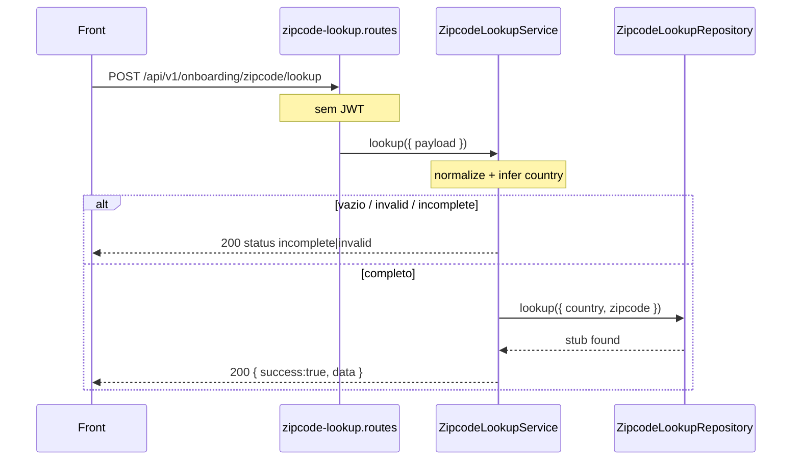

# Rota atual: Onboarding Zipcode Lookup

## Escopo

Rota atual no backend Node:

- `POST /api/v1/onboarding/zipcode/lookup`

Origem no front-end:

- `eden-bowls/src/services/onboardingApi.ts` (`lookupZipcodeInApi`)
- `eden-bowls/src/pages/checkout/Checkout.tsx` (debounce 500ms)

Arquivos principais:

- `src/api/routes/onboarding-zipcode-lookup.routes.js`
- `src/services/onboarding-zipcode-lookup.service.js`
- `src/infrastructure/repositories/onboarding-zipcode-lookup.repository.js`
- `tests/onboarding-zipcode-lookup.routes.test.js`

Rota legado WordPress (substituida):

- `POST /custom/v1/onboarding/session/:sessionId/zipcode/lookup`

Nao ha `session_id` na URL. Nao ha `x-session-token`. A rota e **publica**.

## Responsabilidade

Validar formato de CEP/ZIP e devolver dados de endereco para preencher o formulario.

**Nao persiste.** Gravacao e `POST /api/v1/onboarding/address`.

Nao confundir com autocomplete (rua livre, so US) nem com cotacao de frete.

## Estado de implementacao

| Parte | Status |
|---|---|
| Endpoint publico | implementado |
| Validacao local (vazio / invalid / incomplete) | implementada no service |
| ViaCEP (BR) | **nao ligado** |
| Zippopotam (US) | **nao ligado** |
| Repository | stub: sempre `found` (San Francisco / Market St) |

## Endpoint, controller e permissao

### Registro

- Path: `/api/v1/onboarding/zipcode/lookup`
- Method: `POST`
- Registrar: `registerOnboardingZipcodeLookupRoutes`
- Service: `OnboardingZipcodeLookupService.lookup`

### Controller

1. Exige service injetado (`503`).
2. Chama `lookup({ payload: request.body || {} })`. **Nao** le `currentUser`.
3. Responde `200` com o envelope.

Nao ha validator Zod. Nao ha rate limit dedicado alem do global (300 req/min).

## Autenticacao

JWT **nao e exigido**. O teste da rota afirma lookup sem autenticacao.

O front nao envia `Authorization` neste call.

## Fluxo da requisicao



Pipeline local, nesta ordem:

| # | Regra | `data.status` | Chama repository? |
|---|---|---|---|
| 1 | input vazio apos trim | `incomplete` | nao |
| 2 | caracteres invalidos ou formato errado | `invalid` | nao |
| 3 | pais inferido mas CEP incompleto | `incomplete` | nao |
| 4 | completo | o que o repository devolver (`found` no stub) | sim |

Aliases de input: `zipcode` | `postal_code` | `postalCode`.

Inferencia de pais (`inferCountry`):

1. `payload.country` exatamente `US` ou `BR` (uppercase).
2. Senao regex US (`NNNNN` ou `NNNNN-NNNN`).
3. Senao 8 digitos → `BR`.
4. Senao `''`.

Completude:

- US: `^\d{5}(-\d{4})?$` ou `^\d{9}$`
- BR: `^\d{8}$` (o service normaliza removendo espacos, **nao** remove hifen antes do teste BR — `01310-100` nao passa em `^\d{8}$` e cai em `invalid`)

## Contrato

### Request

```http
POST /api/v1/onboarding/zipcode/lookup
Content-Type: application/json
```

```json
{
  "zipcode": "94105",
  "country": "US"
}
```

`country` e opcional. Sem ele, o service infere.

### Response (HTTP 200 mesmo em incomplete/invalid)

```json
{
  "success": true,
  "data": {
    "status": "found",
    "country": "US",
    "zipcode_input": "94105",
    "zipcode": "94105",
    "is_complete": true,
    "state": "CA",
    "city": "San Francisco",
    "street": "Market St",
    "neighborhood": "Downtown",
    "complement": "",
    "message": "Address found."
  }
}
```

Shape fixo. `status` no stub apos validacao local: `found`. Mensagens locais:

- vazio: `"Postal code is required."`
- invalid: `"Postal code contains invalid characters."`
- incomplete: `"Postal code is incomplete."`

Submit de Address no front exige `found` para o CEP atual.

## O que mudou em relacao ao WordPress

| Antes (WP) | Hoje (Node) |
|---|---|
| path com `sessionId` | path sem sessao |
| `x-session-token` obrigatorio | publica |
| ViaCEP / Zippopotam reais | stub SF |
| rate limit por sessao | so global 300/min |
| `session_id` no envelope | ausente |

## Consumo no frontend

`lookupZipcodeInApi({ zipCode, country? })`. Cache em memoria e debounce 500ms sao so UI.

Depois de `found` e preenchimento, o Continue chama [ROTA_ONBOARDING_ADDRESS.md](./ROTA_ONBOARDING_ADDRESS.md).
