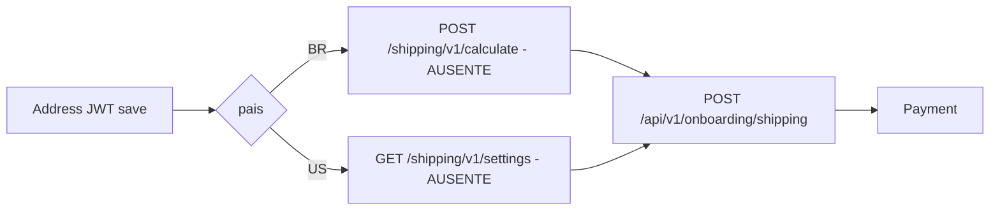

# Rotas de cotacao de frete (`/shipping/v1/*`)

## Escopo

O front de checkout **ainda chama** estas URLs no `VITE_API_BASE_URL` (Node):

- `POST /shipping/v1/calculate` — `calculateDistanceShipping` (BR)
- `GET /shipping/v1/settings?country=US` — `fetchUsFixedShippingSettings` (US)

Elas **nao estao registradas** em `src/app.js`. Nao ha `src/api/routes` de shipping v1. Com o front apontando para o Node, essas chamadas caem no `404 Route not found.`

Analise WP (origem):

- `docs/checkout/shipping/02-shipping-v1-calculate.md`
- `docs/checkout/shipping/03-shipping-v1-settings.md`

No WP eram publicas (`permission = true`), sem sessao e sem JWT. Nao persistiam. O snapshot persistido e outra rota: [ROTA_ONBOARDING_SHIPPING.md](./ROTA_ONBOARDING_SHIPPING.md).

## O que o front espera

### BR — `POST /shipping/v1/calculate`

Body:

```json
{ "zipCode": "01310-100", "country": "BR" }
```

`data` esperado (`DistanceShippingQuote`):

- `distance`, `shipping`, `delivery_days`, `currency`
- `distance_source` (`osrm` | `haversine_fallback`)
- `quoted_at`, `label`
- `breakdown.per_km`, `distance_km`, `minimum_applied`, ...
- `destination.zipcode` / `city` / `state`

O front mapeia para selection (`rateId: distance_km:br-default`) e so depois chama `POST /api/v1/onboarding/shipping`.

### US — `GET /shipping/v1/settings?country=US`

`data` esperado:

- `country: "US"`, `enabled`, `cost` (default UI 12.90 se o parse falhar)
- `label`, `carrier`, `delivery`, `currency`

Mapeia para `rateId: fixed_us:default`.

## Contrato alvo no Node (quando for implementado)

| Item | Valor |
|---|---|
| Auth | publica (igual WP; lookup de CEP ja e publico) |
| Persistencia | nenhuma |
| Path sugerido | manter `/shipping/v1/calculate` e `/shipping/v1/settings` **ou** prefixar `/api/v1/shipping/...` e mudar `shippingApi.ts` |
| BR | geocode destino + distancia ate CD + `per_km` |
| US | tarifa fixa configuravel (hoje option WP `hsr_shipping_settings`) |

Nao copiar cotacao para dentro de `POST /onboarding/shipping`. Select continua sendo snapshot client-side ate o back-end passar a recotar na gravacao.

## Relacao com o fluxo



Enquanto o gap existir, o painel Shipping no ambiente so-Node nao consegue montar rate BR/US a partir da API.

## Logica WP extraida (alvo Node)

Codigo vivo: `pawbowl-wp/wp/wp-content/plugins/headless-secure-registration/src/shipping/`.

Nao autenticar. Nao persistir. Nao copiar `POST .../shipping/quote` (front nao chama; BR/US ja saem daqui).

### Calculate — pipeline

`CalculateShippingUseCase::execute($zipCode, $country, true)`:

1. so `BR` (outro pais → 400 `country_not_supported`)
2. `hsr_shipping_settings.br.enabled` (default true)
3. CEP 8 digitos
4. CD `lat`/`lng` (0,0 → 422)
5. ViaCEP cache 7d → Nominatim BR (`limit=1`, UA `EdenBowlShipping/1.0`) cache 60d → OSRM `router.project-osrm.org/route/v1/driving/{lng,lat;lng,lat}` cache 14d
6. OSRM falha → Haversine; km *= `road_factor` 1.3; `distance_source=haversine_fallback`
7. distancia > `max_distance_km` 500 → 422 `out_of_coverage`
8. `shipping = round(distanceKm * per_km, 2)` com `min_fee` / `max_fee` (`per_km` default 0.95)
9. `delivery_days = clamp(ceil(distanceKm / 80), 2, 10)` minimo 1

Defaults US em settings: cost `12.90`, carrier FedEx, label `FedEx 3–5 business days`.

Implementacao alvo e wiring: [APLICACAO_CHECKOUT.md](./APLICACAO_CHECKOUT.md) secao 4.4.
