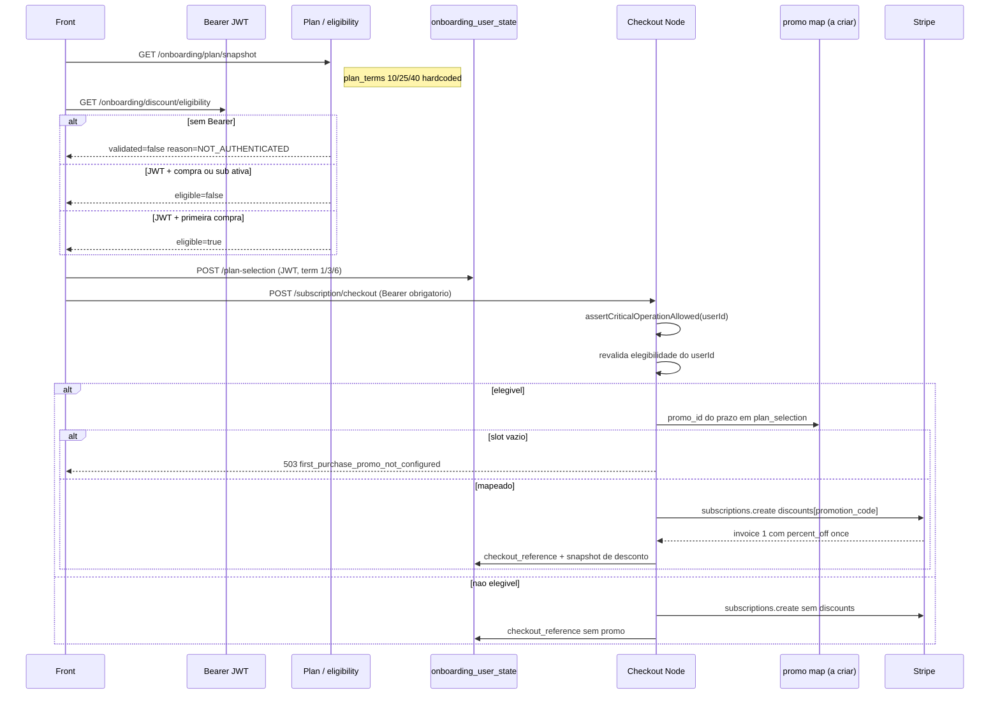

# Coupons Stripe (1a compra) no backend Node

Documentacao da logica de cupom de **primeira compra** no `eden-bowls-backend`.

Este documento descreve o contrato Node. Nao ha sessao de onboarding. Identidade, persistencia e checkout usam **JWT + `user_id`**.

Escopo: desconto automatico de primeira compra, aplicado so na **primeira fatura mensal** da assinatura. O cliente nao envia codigo. Cupons WooCommerce nao entram nesta logica.

Perguntas que este arquivo responde:

1. Qual regra de negocio o Node precisa preservar.
2. O que as rotas ja fazem hoje (JWT, stubs, persistencia).
3. O que falta criar/alterar para o apply real na Stripe.

Base: `{API}/api/v1` (local `http://localhost:3000`).

---

## 1) Identidade e auth (JWT, sem sessao)

O middleware `buildBearerTokenMiddleware` (`src/api/middleware/bearer-token.middleware.js`) roda em `/api/v1/*`.

- Sem header `Authorization`: segue sem `request.currentUser`. As rotas de plano aceitam isso.
- Com `Authorization: Bearer <jwt>`: valida o token e preenche `request.currentUser` a partir de `verified.data.user`.
- JWT invalido / header malformado: o middleware rejeita (nao cai no stub de eligibility).

Identidade nas rotas deste fluxo:

```js
userId: request.currentUser && request.currentUser.id ? request.currentUser.id : null
```

| Rota | Sem JWT | Com JWT |
|---|---|---|
| recommendation, snapshot, eligibility, preview, plan-selection | `200`, `userId = null` | `userId` do token |
| `POST /onboarding/subscription/checkout` | `401 unauthorized` | `userId` obrigatorio + `authService.assertCriticalOperationAllowed(userId)` |
| `POST /subscriptions/:id/edit/preview` | `401 unauthorized` | `userId` obrigatorio |

Nao existe:

- `session_id` na URL ou no envelope
- `x-session-token`
- `POST /onboarding/account-link`
- `linked_user_id`

Login/signup e `POST /api/v1/auth/token` (e rotas de register/OTP). Depois disso o front manda Bearer. Estado autenticado fica em `onboarding_user_state` por `user_id`.

---

## 2) O que o sistema precisa fazer

O desconto **nao** e um cupom WooCommerce e **nao** e um campo do body de checkout.

Tres camadas:

1. **Catalogo de percentuais (hardcoded)** — UI mostra 10% / 25% / 40% conforme o prazo (1 / 3 / 6 meses). Hoje: `PLAN_TERMS` em `onboarding-plan-snapshot.repository.js`.
2. **Elegibilidade** — so usuario com JWT, sem pedido previo e sem assinatura `active`/`trialing`. Hoje: stub (`userId` presente = elegivel).
3. **Apply real (Stripe)** — se elegivel, o checkout anexa `promotion_code` (`promo_...`) na criacao da Subscription. A Stripe calcula o desconto na primeira invoice (`duration = once`). Hoje: **nao existe** (sem SDK Stripe, sem mapa `promo_`).

A Stripe permanece a fonte de verdade do valor cobrado. O Node guarda o mapeamento prazo → `promo_id` e um snapshot em `onboarding_user_state.checkout_reference`.

Regra:

> Desconto de 1a compra aplica-se somente a primeira fatura mensal. Nos planos de 3 e 6 meses, os meses seguintes cobram o preco cheio. O percentual maior (25%/40%) e beneficio de compromisso, nao desconto sobre o valor total do contrato.

Modulos Node alvo:

| Papel | Onde hoje | Alvo |
|---|---|---|
| Percentuais 10/25/40 | `PLAN_TERMS` no snapshot | `src/core/first-purchase-discount.js` (compartilhado) |
| Elegibilidade | `OnboardingDiscountEligibilityService` + repository stub | mesmo service; repository com DataSource |
| Apply no checkout | `OnboardingSubscriptionCheckoutService` (fake) | revalidar + resolver `promo_` + Stripe `discounts` |
| Mapa prazo → `promo_` | nao existe | `StripeCouponService` + persistencia |

---

## 3) Modelo Stripe vs Node

### 3.1 Objetos Stripe (inalterados)

Ao criar um cupom de 1a compra, o backend chama a Stripe duas vezes:

| Objeto | Papel | Campos relevantes |
|---|---|---|
| **Coupon** (`coupons.create`) | regra de desconto | `percent_off`, `duration = once`, metadata `pawbowl_purpose=first_purchase`, `pawbowl_term_months` |
| **Promotion Code** (`promotionCodes.create`) | identificador aplicado na subscription | `code` (ex. `FIRST_1M`), `coupon` = id do cupom, `active = true`, `restrictions.first_time_transaction = true`, mesmo metadata |

O checkout **nao** envia o Coupon id. Envia o **Promotion Code id** (`promo_...`) em:

```json
{ "discounts": [ { "promotion_code": "promo_xxx" } ] }
```

O front **nunca** escolhe esse id. O Node resolve pelo prazo persistido em `plan_selection.subscription_term_months`.

### 3.2 Mapeamento prazo → `promo_` (ainda nao existe)

Nao ha tabela, settings, env nem service. `package.json` nao declara o SDK `stripe`. `src/config/env.js` nao tem `STRIPE_*`.

Alvo:

```json
{
  "1": "promo_...",
  "3": "promo_...",
  "6": "promo_..."
}
```

Regras:

- persistir so ids que comecam com `promo_`;
- slots em `1` / `3` / `6`;
- usuario **elegivel** com slot vazio: checkout `503 first_purchase_promo_not_configured`;
- usuario **inelegivel**: checkout segue sem desconto, mesmo com mapa incompleto;
- metrica de falha (equivalente ao contador de misconfig): incrementada quando o slot falta no checkout.

Sugestao de persistencia: tabela `stripe_first_purchase_promos` (ou JSON em settings) + `StripeCouponService` com `getPromotionCodeIdForTerm`, `mappingHealth`, `incrementMisconfigMetric`.

Sem esse mapa, o checkout de usuario elegivel **nao pode** ter paridade.

### 3.3 Tabela de percentuais

| `subscription_term_months` | `discount_percent` |
|---|---|
| 1 | 10 |
| 3 | 25 |
| 6 | 40 |
| qualquer outro | 0 |

Fonte Node **hoje** (unica):

- `src/infrastructure/repositories/onboarding-plan-snapshot.repository.js` → `PLAN_TERMS`

Checkout e eligibility **nao** leem essa tabela. Quando o apply existir, o percentual precisa sair de **um unico modulo** (`src/core/first-purchase-discount.js`), usado por snapshot, checkout e criacao admin do cupom. A criacao admin recusa cupom cujo `percent_off` nao bata com a tabela.

---

## 4) Relacao das rotas (tela `/plan` + checkout)

As rotas da tela `/plan` **nao aplicam** o cupom Stripe. So eligibility fala de desconto, e so de **elegibilidade**.

| Rota Node | JWT | Liga com coupon? | O que faz hoje |
|---|---|---|---|
| `GET /onboarding/recommendation` | opcional | Nao | Consumo nutricional. Sem preco, sem prazo, sem coupon. |
| `GET` / `POST /onboarding/plan/snapshot` | opcional | So informativo | `plan_terms` 10/25/40. Nao consulta Stripe, nao valida eligibility. |
| `GET /onboarding/discount/eligibility` | opcional | Contrato de elegibilidade | Shape pronto. Stub: com JWT = `eligible: true`. Sem JWT = `NOT_AUTHENTICATED`. |
| `POST /onboarding/plan/preview` | opcional | Nao aplica | Preco cheio. `discounted_first_month_total = subtotal`. |
| `POST /onboarding/plan-selection` | opcional | Nao | Sem JWT: ecoa. Com JWT: UPSERT em `plan_selection`. Nao grava `promo_id`. |
| `POST /onboarding/subscription/checkout` | **obrigatorio** | **Deveria aplicar** | Stub: `checkout_reference` fake, sem Stripe, sem revalidacao, sem `promo_`. |

Fluxo alvo:

```
GET  /onboarding/plan/snapshot                 → UI dos prazos (10/25/40)
GET  /onboarding/discount/eligibility          → eligible true/false (ou NOT_AUTHENTICATED)
POST /onboarding/plan/preview                  → preco cheio (desconto NAO entra)
POST /onboarding/plan-selection                → grava prazo em onboarding_user_state (precisa JWT)
POST /auth/token                               → emite JWT (se o usuario ainda nao estiver autenticado)
POST /onboarding/subscription/checkout         → JWT obrigatorio; revalida + resolve promo_ + cria subscription Stripe
```

Rotas de plano fora do recorte coupon: `docs-new/Plan/`.

---

## 5) Rota a rota

### 5.1 `GET /api/v1/onboarding/recommendation`

Arquivos: `onboarding-recommendation.routes.js` → service → repository.

**Sem ligacao com coupons.** Calcula recomendacao nutricional por pet (`simplified` / `packaging`). JWT opcional: sem token, consumo vazio se nao houver pets no body/query.

`plan/snapshot` reusa o repository de recommendation. O payload nao tem desconto.

**Alterar?** Nao, para este fluxo.

### 5.2 `GET` / `POST /api/v1/onboarding/plan/snapshot`

Arquivos:

- `src/api/routes/onboarding-plan-snapshot.routes.js`
- `src/services/onboarding-plan-snapshot.service.js`
- `src/infrastructure/repositories/onboarding-plan-snapshot.repository.js`

JWT opcional. Devolve consumo + sabores + catalogo de prazos:

```json
"plan_terms": [
  { "subscription_term_months": 1, "discount_percent": 10 },
  { "subscription_term_months": 3, "discount_percent": 25 },
  { "subscription_term_months": 6, "discount_percent": 40 }
]
```

Percentuais sao constantes JS. O snapshot **nao** inclui `eligible`, `reason`, `promotion_code_id` nem preco com desconto.

Uso no front: cards 1/3/6 meses com o selo de percentual. O desconto cobrado so existe se, no checkout, o usuario for elegivel **e** o slot `promo_` daquele prazo estiver mapeado.

**Alterar:**

- extrair `PLAN_TERMS` para `src/core/first-purchase-discount.js`;
- snapshot continua so informativo (nao consultar Stripe, nao misturar eligibility).

### 5.3 `GET /api/v1/onboarding/discount/eligibility`

Arquivos:

- `src/api/routes/onboarding-discount-eligibility.routes.js`
- `src/services/onboarding-discount-eligibility.service.js`
- `src/infrastructure/repositories/onboarding-discount-eligibility.repository.js`
- `tests/onboarding-discount-eligibility.routes.test.js`

Rota isolada: `docs-new/Plan/ROTA_ONBOARDING_DISCOUNT_ELIGIBILITY.md`.

HTTP e envelope prontos. `200`:

```json
{
  "success": true,
  "data": {
    "validated": true,
    "eligible": true,
    "reason": null
  }
}
```

#### Resolucao do usuario

1. JWT valido → `userId = request.currentUser.id`.
2. Sem Bearer → `userId = null` → `NOT_AUTHENTICATED`. **Nao** e `401`.

Nao ha segundo passo de “vincular sessao”. O JWT **e** a identidade.

#### Regras alvo

| `validated` | `eligible` | `reason` | Quando |
|---|---|---|---|
| `false` | `null` | `NOT_AUTHENTICATED` | sem JWT |
| `true` | `false` | `HAS_PREVIOUS_PURCHASE` | existe pedido do `userId` com status `pending`, `on-hold`, `processing` ou `completed` (exceto o `order_id` atual em `checkout_reference`, se houver) |
| `true` | `false` | `HAS_ACTIVE_SUBSCRIPTION` | existe assinatura `status IN ('active','trialing')` para o `user_id` **ou** o email do usuario |
| `true` | `true` | `null` | passou nas duas checagens |

Precedencia: `HAS_PREVIOUS_PURCHASE` vence `HAS_ACTIVE_SUBSCRIPTION`. Inelegibilidade **nao** gera 4xx; o front le `data.eligible`.

#### O que o Node faz hoje

```js
// OnboardingDiscountEligibilityRepository.getEligibility
if (!userId) {
  return { validated: false, eligible: null, reason: 'NOT_AUTHENTICATED' };
}
return { validated: true, eligible: true, reason: null };
```

Wiring em `src/index.js` **sem DataSource**. Nenhuma query.

Observacoes (ainda nao implementadas):

- Pedido `pending` **conta** como compra previa. Um checkout abandonado com order criada pode impedir o desconto.
- A rota **nao** consulta o mapa `promo_`. Elegivel ainda pode falhar no checkout se o slot estiver vazio.
- A rota **nao** persiste o resultado. Snapshot de eligibility entra no `checkout_reference` so no checkout.
- Excluir o pedido atual: ler `onboarding_user_state.checkout_reference.order_id` daquele `user_id`. Nao ha `checkout_order_id` de sessao.

**Alterar (obrigatorio para paridade):**

1. Injetar DataSource no repository.
2. `HAS_PREVIOUS_PURCHASE` contra fonte de pedidos (tabela Node de orders **ou** `wp_posts` Woo enquanto o checkout nativo nao existir). Sem fonte, autenticado continua falso-positivo.
3. `HAS_ACTIVE_SUBSCRIPTION` contra ledger Stripe (tabela Node **ou** `wp_hsr_stripe_subscriptions` se o DB for compartilhado), com fallback pelo email em `wp_users`.
4. Excluir `checkout_reference.order_id` do proprio usuario.
5. Testes de repository: `NOT_AUTHENTICATED`, `HAS_PREVIOUS_PURCHASE` (inclui pending), exclusao do pedido atual, `HAS_ACTIVE_SUBSCRIPTION`, elegivel.

### 5.4 `POST /api/v1/onboarding/plan/preview`

JWT opcional. Calcula preco de catalogo (`unit_price × packs`) em `src/core/plan-catalog-pricing.js`:

```js
discounted_first_month_total: roundedSubtotal
```

O percentual de prazo **nao e aplicado**. `first_month_total = grand_total_monthly`.

Isso e **proposital**. **Nao alterar** o preview para aplicar 10/25/40. Qualquer UI de "voce paga X no 1o mes" calcula no front com `eligible` + `plan_terms`, ou espera o checkout.

Detalhe: `docs-new/Plan/ROTA_ONBOARDING_PLAN_PREVIEW.md`.

### 5.5 `POST /api/v1/onboarding/plan-selection`

JWT opcional.

- sem JWT: ecoa o payload, **nao** grava;
- com JWT: UPSERT em `onboarding_user_state.plan_selection` (PK `user_id`).

Guarda `subscription_term_months` se o front enviar. **Nao** grava `promo_id`. **Nao** chama Stripe. **Nao** calcula `catalog_pricing`.

**Alterar (opcional para coupon):**

- nao precisa gravar `promo_id` aqui;
- quando o checkout for real, ele le `plan_selection.subscription_term_months` para o slot `promo_`. O front precisa continuar persistindo o prazo **com JWT** antes do checkout.

Nao copiar percentual de preferencia para user meta: isso nao e o percentual aplicado na Stripe.

### 5.6 `POST /api/v1/onboarding/subscription/checkout` — ponto de apply

Arquivos:

- `src/api/routes/onboarding-subscription-checkout.routes.js`
- `src/services/onboarding-subscription-checkout.service.js`
- `src/infrastructure/repositories/onboarding-subscription-checkout.repository.js`
- `tests/onboarding-subscription-checkout.routes.test.js`
- `tests/onboarding-subscription-checkout.service.test.js`

#### O que o Node faz hoje

1. Sem JWT → `401 unauthorized`.
2. `authService.assertCriticalOperationAllowed(userId)` (conta ativa).
3. Repository monta checkout **fake** (`order_id: 101`, `stripe_subscription_id: sub_123|sub_456`).
4. UPSERT de JSON em `onboarding_user_state.checkout_reference`.
5. Nao le `plan_selection`, nao revalida eligibility, nao resolve `promo_`, nao chama Stripe.

Body aceito (aliases): `payment_method_id` / `paymentMethodId`, `checkout_mode` / `flow` (default `order_first`), `billing`. **Nao ha campo de cupom.**

O envelope **nao** inclui `session_id` (os testes afirmam `data.session_id` undefined).

#### Passos de desconto que o checkout precisa ganhar

1. `revalidateDiscountEligibilityForCheckout` — mesmas regras da rota eligibility, sempre com `userId` do JWT. Sem usuario ja caiu em `401`.
2. Se elegivel, `applied_discount_percent` = 10/25/40 conforme `plan_selection.subscription_term_months` daquele `user_id`; senao `0`.
3. Recalcular no estado do usuario `catalog_pricing.discounted_first_month_total = subtotal * (1 - percent/100)` (preview da 1a fatura; a cobranca real e da Stripe).
4. `resolveFirstPurchasePromotionForCheckout`:
   - nao elegivel ou percent `0` → `null` (checkout segue sem desconto);
   - prazo fora de 1/3/6 → `503 first_purchase_promo_not_configured`;
   - slot `promo_` vazio → mesmo `503` + incrementa metrica de misconfig.
5. Criar a subscription Stripe:

**A. `subscription_first`** (o front ja envia `checkout_mode`)

- Payload com `promotion_code_id`, `discount_percent`, `discount_duration = once`.
- Stripe: `subscriptions.create` com `discounts: [{ promotion_code }]`.
- Persistir snapshot em `checkout_reference`.

**B. `order_first`** (default atual do service)

- Enquanto nao houver order nativa, o caminho A e o alvo.
- Se order-first for mantido, gravar o mesmo snapshot em `checkout_reference` (e na order, quando existir):
  - `discount_eligibility`
  - `discount_applied_percent`
  - `stripe_promotion_code_id`
  - `stripe_discount_duration = once`
- Se percent > 0 e nao ha `promo_` mapeado, abortar com `503`.

**Alterar (obrigatorio):** corpo do service/repository de checkout. Ver secao 11.

### 5.7 Edit de assinatura (apos a 1a compra)

`POST /api/v1/subscriptions/:subscriptionId/edit/preview`

JWT **obrigatorio** (`401` sem Bearer). `SubscriptionsEditPreviewRepository` ja devolve o contrato correto (precos ainda stub):

```json
"discount": {
  "eligible": false,
  "reason": "edit_no_first_purchase_promo",
  "percent": 0
}
```

Troca de plano / prazo em assinatura existente **nao** reaplica cupom de 1a compra.

**Alterar:** manter essa regra quando o preview deixar de ser stub.

### 5.8 Rotas que **nao** participam

| Rota Node | Motivo |
|---|---|
| `POST /onboarding/shipping/select` | endereco/frete |
| `POST /onboarding/sales-tax/quote` | imposto US |
| `POST /onboarding/subscription/preview` | preview de imposto/assinatura, sem promotion code (stub) |
| REST de cupons WooCommerce | nao existe no Node |
| Admin WP de cupons | nao migrado |

---

## 6) Fluxo ponta a ponta (alvo Node)



Hoje o diagrama quebra em dois pontos: eligibility com JWT sempre devolve `eligible: true`, e o checkout nunca chama Stripe.

---

## 7) Persistencia

Tabela `onboarding_user_state` (`src/infrastructure/entities/onboarding-user-state.entity.js`):

| Coluna | Papel neste fluxo |
|---|---|
| `user_id` | PK. Identidade do JWT. Substitui qualquer sessao. |
| `plan_selection` | JSON do plano; pode conter `subscription_term_months` se o front enviar com JWT |
| `checkout_reference` | JSON do checkout. Hoje fake, **sem** campos de desconto |
| `payment_reference` | fora deste recorte |

Nao ha tabela Node de orders. `SubscriptionsRepository.listMine` ainda devolve fixture.

### Alvo no `checkout_reference`

```json
{
  "discount_eligibility": { "validated": true, "eligible": true, "reason": null },
  "discount_applied_percent": 25,
  "stripe_promotion_code_id": "promo_...",
  "stripe_coupon_id": "coupon_...",
  "stripe_discount_percent": 25,
  "stripe_discount_amount": 12.5,
  "stripe_discount_duration": "once"
}
```

O checkout le o prazo de `plan_selection` do mesmo `user_id`. Pode atualizar `plan_selection` no mesmo UPSERT, ou so `checkout_reference`.

Para eligibility, o “pedido atual a excluir” e `checkout_reference.order_id` desse usuario — nao um id de sessao.

---

## 8) Admin / criacao de cupons

No Node **nao ha** endpoint REST, pagina admin nem CLI.

Precisa de um destes:

1. rotas internas autenticadas (admin JWT / API key), por exemplo:
   - `GET /api/v1/admin/stripe/first-purchase-promos` — mapa + `mappingHealth` + metrica;
   - `PUT /api/v1/admin/stripe/first-purchase-promos` — salvar slots `promo_`;
   - `POST /api/v1/admin/stripe/first-purchase-coupons` — criar Coupon + Promotion Code na Stripe;
   - `GET /api/v1/admin/stripe/promotion-codes` — listar;
2. **ou** env dos tres slots (`STRIPE_FIRST_PURCHASE_PROMO_1M` etc.) se a criacao continuar no dashboard Stripe.

Avisos: mapeamento incompleto bloqueia **so** o checkout de elegiveis; misconfig > 0 indica falhas reais.

Nao ha endpoint publico para o front da loja criar/listar esses cupons. O cliente nunca envia o codigo.

---

## 9) Contratos de erro ligados a coupon

| HTTP | code | Onde | Node hoje | Alvo |
|---|---|---|---|---|
| 200 | — | eligibility | JWT = elegivel; sem JWT = `NOT_AUTHENTICATED` | reasons reais (`HAS_PREVIOUS_PURCHASE` / `HAS_ACTIVE_SUBSCRIPTION`) |
| 401 | `unauthorized` | checkout / edit preview | **ja** 401 sem JWT | manter |
| 422 | `invalid_promotion_code_id` | create subscription | nao existe | implementar na camada Stripe |
| 503 | `first_purchase_promo_not_configured` | checkout | nao existe | implementar |
| 503 | service unavailable | qualquer rota deste fluxo | service nao injetado | manter |

Nao recriar `404 session_not_found` nem `422 customer_required`. Sem JWT no checkout e `401`. Elegibilidade nao gera 4xx por compra previa / sub ativa.

---

## 10) O que o front precisa saber (tela `/plan`)

Contrato de consumo nas rotas atuais (`eden-bowls/src/services/onboardingApi.ts`):

1. `GET /onboarding/recommendation` — so consumo. Ignorar para desconto.
2. `GET /onboarding/plan/snapshot` → `data.plan_terms[]` — rotulos 10/25/40. Nao significa que o cliente vai pagar com desconto.
3. `GET /onboarding/discount/eligibility` — sem Bearer: `validated=false` / `NOT_AUTHENTICATED` = “ainda nao sabemos”, nao “sem desconto”.
4. `POST /onboarding/plan/preview` — preco cheio. Nao usar `first_month_total` como preco de 1a compra.
5. `POST /onboarding/plan-selection` — persistir o prazo **com JWT** antes do checkout.
6. O desconto so e cobrado na Stripe no `POST /onboarding/subscription/checkout` (Bearer obrigatorio), e so na primeira invoice.

Exemplo sem Bearer:

```json
{
  "success": true,
  "data": {
    "validated": false,
    "eligible": null,
    "reason": "NOT_AUTHENTICATED"
  }
}
```

Isso **ja funciona**. O JWT autentica o **usuario**, nao uma sessao de onboarding.

**Cuidado atual:** com JWT, o stub devolve sempre `eligible: true`. A tela `/plan` mostra desconto de 1a compra para **qualquer** usuario logado, inclusive quem ja comprou. Esse e o gap mais visivel ate a eligibility deixar de ser stub.

---

## 11) Pontos de atencao

1. Percentuais: hoje uma constante (`PLAN_TERMS`). Ao implementar checkout, **nao** duplicar a tabela — extrair modulo unico.
2. Preview/snapshot **nao** aplicam o desconto. UI de "voce paga X no 1o mes" usa `eligible` + `plan_terms` no front, ou espera o checkout.
3. `HAS_PREVIOUS_PURCHASE` inclui `pending`. Orders de tentativa de checkout podem queimar a 1a compra. No Node isso so vale depois que o checkout criar pedido/assinatura de verdade; o stub **nunca** queima.
4. Stripe `first_time_transaction` no Promotion Code e uma segunda barreira. O backend tambem checa historico. As duas precisam estar alinhadas.
5. Edit de assinatura nunca reaplica o cupom (contrato ja presente no stub; JWT obrigatorio).
6. Sem mapeamento completo, **so o cliente elegivel** e bloqueado. Cliente recorrente checkouta sem desconto.
7. Nao ha cupom avulso (codigo livre). Cupom novo de 1a compra precisa existir na Stripe e no slot do prazo.
8. `plan-selection` sem JWT nao persiste. Checkout que depender do prazo no banco exige que o front tenha gravado o plano **depois** do login.

---

## 12) O que tera que ser alterado

Prioridade: o apply so e seguro depois de eligibility real **e** mapa `promo_`. Sem isso, um checkout “completo” daria 10/25/40% para todo mundo com JWT.

### 12.1 Ja ok — nao mexer para este fluxo

| Item | Arquivo | Motivo |
|---|---|---|
| HTTP + envelope eligibility | `onboarding-discount-eligibility.routes.js` | contrato |
| `NOT_AUTHENTICATED` sem JWT | `onboarding-discount-eligibility.repository.js` | identidade JWT |
| JWT opcional nas rotas de plano | `bearer-token.middleware.js` + rotas | sem sessao |
| `plan_terms` 10/25/40 | `onboarding-plan-snapshot.repository.js` | catalogo da UI |
| Preview preco cheio | `plan-catalog-pricing.js` | desconto nao entra no preview |
| Plan-selection sem `promo_id` | `onboarding-plan-selection.*` | checkout resolve o slot |
| Checkout exige JWT + conta ativa | `onboarding-subscription-checkout.routes.js` / `.service.js` | `401` + `assertCriticalOperationAllowed` |
| Envelope de checkout sem `session_id` | testes da rota | modelo JWT |
| Edit nunca reaplica | `subscriptions-edit-preview.repository.js` | `edit_no_first_purchase_promo` |
| Recommendation | `onboarding-recommendation.*` | fora do coupon |
| Sem campo de cupom no body do checkout | rotas atuais | o front nao escolhe `promo_id` |

### 12.2 Alterar codigo existente

| Item | Arquivo | Mudanca |
|---|---|---|
| Eligibility real | `onboarding-discount-eligibility.repository.js` + `src/index.js` | injetar DataSource; pedidos + assinaturas do `userId`; reasons reais |
| Tabela de percentuais unica | `onboarding-plan-snapshot.repository.js` | importar de `src/core/first-purchase-discount.js` |
| Checkout apply | `onboarding-subscription-checkout.service.js` e `.repository.js` | ler `plan_selection` do `user_id`; revalidar; resolver `promo_`; Stripe `discounts`; persistir snapshot; `503` |
| Checkout tests | `tests/onboarding-subscription-checkout.*.test.js` | elegivel+slot, elegivel+slot vazio, inelegivel sem discounts |
| Eligibility tests | `tests/onboarding-discount-eligibility.routes.test.js` + testes de repository | hoje so cobrem o stub |

### 12.3 Criar (nao existe no Node)

| Item | Notas |
|---|---|
| `src/core/first-purchase-discount.js` | `expectedPercentForTerm(1\|3\|6)`, `PLAN_TERMS` |
| `StripeCouponService` | mapa, health, misconfig, create coupon+promo, list |
| Persistencia do mapa `promo_` | tabela ou settings JSON |
| Metrica misconfig | incrementada no checkout |
| SDK `stripe` + envs `STRIPE_SECRET_KEY` | `package.json` hoje nao tem a dependencia |
| `StripeSubscriptionService.createSubscription` | `discounts: [{ promotion_code }]`; validar prefixo `promo_` |
| Fonte de pedidos para eligibility | tabela Node **ou** leitura Woo `wp_posts` |
| Fonte de assinaturas ativas | ledger Node **ou** `wp_hsr_stripe_subscriptions` se o DB for compartilhado |
| Admin REST (ou env dos 3 slots) | sem UI WP |
| Snapshot de desconto | campos em `checkout_reference` / orders |

Dependencia de dados: eligibility **nao pode** ser fiel enquanto pedidos e assinaturas forem stub. `SubscriptionsRepository.listMine` e o checkout ainda devolvem fixtures.

Sem fonte de historico, **nao** promover o stub a “sempre elegivel” em producao — tratar ausencia de ledger como inelegivel, nunca como `true` silencioso.

### 12.4 Ordem de implementacao sugerida

1. Modulo `TERM_PERCENT_MAP` compartilhado (snapshot passa a importa-lo). Sem mudanca de contrato.
2. Tabela/settings do mapa `promo_` + service de leitura. Pode ser preenchido no banco/env no comeco.
3. Eligibility real contra as fontes de pedido/assinatura do `userId` (e email). Sem fonte, nao deixar `eligible: true` por default.
4. Checkout: ler `plan_selection` do usuario JWT; revalidacao + resolve promo + `503` de misconfig. Ainda pode ser sem Stripe se o create continuar stub, mas a **decisao** de aplicar ou bloquear ja fica correta.
5. Stripe SDK: `subscriptions.create` com `discounts`.
6. Admin ou processo operacional para criar Coupon + Promotion Code e preencher os tres slots.
7. Webhook de invoice para preencher `stripe_coupon_id` / `stripe_discount_amount` / `stripe_amount_paid` no `checkout_reference`.

---

## 13) Testes de referencia

### Node (hoje)

- `tests/onboarding-discount-eligibility.routes.test.js` — Bearer → `{ validated: true, eligible: true }`; sem Bearer → `NOT_AUTHENTICATED` com `userId: null`. Nao cobre compra previa nem assinatura.
- `tests/onboarding-plan-snapshot.repository.test.js` — afirma `plan_terms` 10/25/40.
- `tests/onboarding-subscription-checkout.routes.test.js` — Bearer cria checkout; sem Bearer `401`; `data.session_id` ausente.
- `tests/onboarding-subscription-checkout.service.test.js` — `assertCriticalOperationAllowed(userId)` antes do repository.
- `tests/subscriptions-edit-preview.routes.test.js` — `discount.reason = edit_no_first_purchase_promo`.

### Node (a escrever quando a logica sair do stub)

- repository de eligibility: `NOT_AUTHENTICATED`, `HAS_PREVIOUS_PURCHASE` (inclui pending), exclusao de `checkout_reference.order_id`, `HAS_ACTIVE_SUBSCRIPTION` (userId e email), elegivel.
- coupon mapping: so persiste `promo_`; health incompleto; `expectedPercentForTerm`.
- checkout: elegivel + slot ok anexa `promotion_code`; elegivel + slot vazio → 503 e incrementa metrica; inelegivel cria subscription sem `discounts`; prazo invalido → 503; sem JWT → 401.

```bash
npx jest --runTestsByPath tests/onboarding-discount-eligibility.routes.test.js
npx jest --runTestsByPath tests/onboarding-plan-snapshot.repository.test.js
npx jest --runTestsByPath tests/onboarding-subscription-checkout.service.test.js
npx jest --runTestsByPath tests/onboarding-subscription-checkout.routes.test.js
npx jest --runTestsByPath tests/subscriptions-edit-preview.routes.test.js
```
