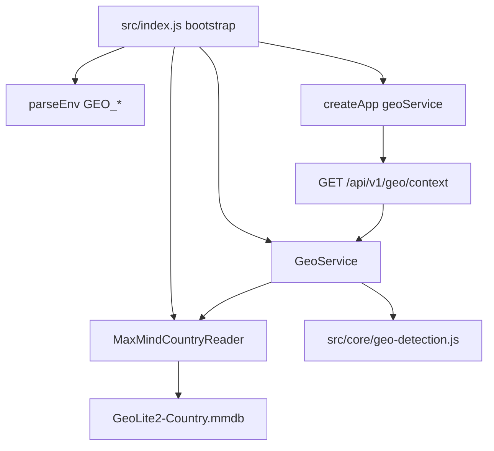
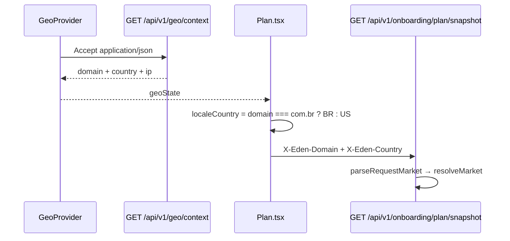

# Aplicacao da logica geo context no backend Node

Como a implementacao WordPress (`GeoApi` + `GeoDetectionService`) se encaixa no Express atual, sem copiar PHP e sem inventar um segundo modelo de mercado.

## 1. O que ja existe no Node e o que falta

O backend ja trata **mercado** (US/USD vs BR/BRL). Ainda nao trata **deteccao geografica** (de onde veio a request).

| Responsabilidade | WP (hoje) | Node (hoje) | Node (alvo) |
|---|---|---|---|
| Inferir `com` / `com.br` pelo host da request | `GeoApi::resolve_domain_from_request` | nao existe | `src/core/geo-detection.js` |
| Resolver IP do visitante | `GeoDetectionService::detect_request_ip` (e um segundo metodo divergente em `GeoApi`) | nao existe | um unico helper, politica unificada |
| Lookup MaxMind Country | `maxmind-db/reader` + `.mmdb` | nao existe | reader injetado, arquivo local |
| Normalizar pais `US\|BR\|OTHER\|UNKNOWN` | `normalize_country` | `market.normalizeCountry` so aceita `US\|BR` | funcao **separada** em geo-detection |
| Devolver `{ domain, country, ip, region, source, presetId }` | `GET /custom/v1/geo/context` | 404 | `GET /api/v1/geo/context` |
| Usar dominio/pais **ja conhecidos** em onboarding | — | `parseRequestMarket` + `resolveMarket` | permanece igual |

Nao reutilizar `parseRequestMarket` nesta rota. Esse validator le `query` / `body` / `X-Eden-Country` / `X-Eden-Domain` — valores que o **cliente declara**. A rota geo e a origem desses valores: ela infere host e IP, nao confia no header de mercado.

## 2. Decisoes em relacao ao PHP

| Tema | WP | Decisao no Node |
|---|---|---|
| Path | `/wp-json/custom/v1/geo/context` | `/api/v1/geo/context` (prefixo ja usado por breeds, products, onboarding) |
| Auth | `permission_callback = __return_true` | publica; JWT ausente ou invalido **nao** bloqueia |
| Envelope | `{ success, data }` | o mesmo (error handler de `src/app.js`) |
| `region` / `presetId` | sempre `null` | sempre `null` |
| `source` | `"backend"` | `"backend"` |
| `/geo/redirect` | existe no mesmo controller | **nao migrar** |
| Politica de proxy (IP lookup vs campo `ip`) | duas regras diferentes | **uma regra so** (ver secao 6) |
| `HSR_GEO_REAL_DETECTION_ENABLED` | nao usada por esta rota | nao criar equivalente |
| Abertura do `.mmdb` | `new Reader` + `close()` por request | abrir **uma vez** no bootstrap (`src/index.js`) |
| Banco / migration | nenhum | nenhum |
| Falha MaxMind | 200 + `country: UNKNOWN` | igual; a rota nao devolve 5xx por `.mmdb` ausente |

## 3. Arquitetura no projeto atual

O padrao das rotas existentes e `route → service → repository`. Geo nao tem tabela. O "repository" e um reader de arquivo.



Camadas, alinhadas ao que o repo ja faz:

| Camada | Arquivo alvo | Analogia no codigo atual |
|---|---|---|
| Registro HTTP | `src/api/routes/geo.routes.js` | `breeds.routes.js` (GET publico, service injetado) |
| Orquestracao | `src/services/geo.service.js` | `BreedsService` (monta `{ success, data }`) |
| Regras puras | `src/core/geo-detection.js` | `src/core/market.js` (sem I/O) |
| I/O externo | `src/infrastructure/geo/maxmind-country-reader.js` | `otp-mailer.js` (infra sem TypeORM) |
| Config | `src/config/env.js` | `AUTH_SMTP_*`, `CORS_ORIGINS` |
| Wiring | `src/app.js` + `src/index.js` | `registerBreedsRoutes` |
| Auth | `src/api/middleware/bearer-token.middleware.js` | paths publicos de auth |
| Testes | `tests/geo-detection.test.js`, `tests/geo.routes.test.js`, `tests/geo.service.test.js` | `tests/breeds.routes.test.js`, `tests/market.test.js` |

## 4. Arquivos a criar e a alterar

### 4.1 Criar

```text
src/api/routes/geo.routes.js
src/services/geo.service.js
src/core/geo-detection.js
src/infrastructure/geo/maxmind-country-reader.js
tests/geo.routes.test.js
tests/geo.service.test.js
tests/geo-detection.test.js
```

Sem entity, sem repository TypeORM, sem migration.

### 4.2 Alterar

| Arquivo | Mudanca |
|---|---|
| `src/app.js` | `registerGeoRoutes(app, dependencies)` |
| `src/index.js` | instanciar reader + `GeoService`, passar `geoService` para `createApp` |
| `src/config/env.js` | `GEO_MAXMIND_DB_PATH`, `GEO_TRUST_PROXY_HEADERS` |
| `.env.example` | as duas envs |
| `src/api/middleware/bearer-token.middleware.js` | tratar `GET /api/v1/geo/context` como rota publica (mesmo com `Authorization` lixo) |
| `package.json` | dependencia `maxmind` (lookup Country no `.mmdb`) |

Nao alterar `src/core/market.js` nem `parseRequestMarket`. Eles continuam sendo o consumidor do mercado **depois** que o front ja tem `geoState`.

## 5. Esboco das pecas (CommonJS, no estilo do repo)

### 5.1 Rota — `src/api/routes/geo.routes.js`

Mesmo formato de `breeds.routes.js`: handler inline, `503` se o service nao foi injetado, `next(error)` para o error handler de `app.js`.

```js
const { HttpError } = require('../../core/http-error');

function registerGeoRoutes(app, dependencies = {}) {
  app.get('/api/v1/geo/context', async (request, response, next) => {
    try {
      if (!dependencies.geoService) {
        throw new HttpError(503, 'Geo service is not available.');
      }

      const payload = await dependencies.geoService.getContext(request);
      response.status(200).json(payload);
    } catch (error) {
      next(error);
    }
  });
}

module.exports = { registerGeoRoutes };
```

Sem query, sem body, sem Zod de input. O WP tambem nao valida input.

### 5.2 Service — `src/services/geo.service.js`

```js
class GeoService {
  constructor({ detection, countryReader } = {}) {
    this.detection = detection;
    this.countryReader = countryReader;
  }

  async getContext(request) {
    const domain = this.detection.detectDomainFromRequest(request);
    const ip = this.detection.detectRequestIp(request);
    const country = ip
      ? this.detection.normalizeCountry(await this.countryReader.lookupIsoCode(ip))
      : 'UNKNOWN';

    return {
      success: true,
      data: {
        domain,
        country,
        ip: ip || '',
        region: null,
        source: 'backend',
        presetId: null
      }
    };
  }
}

module.exports = { GeoService };
```

O service nao conhece Express alem do objeto `request` (headers + `socket`/`ip`). Testes passam um request fake, como `tests/market.test.js` faz com `parseRequestMarket`.

### 5.3 Deteccao pura — `src/core/geo-detection.js`

Funcoes exportadas:

| Funcao | Entrada | Saida |
|---|---|---|
| `extractHost(value)` | URL ou `host:port` | hostname lowercase |
| `detectDomainFromRequest(request)` | headers | `'com'` ou `'com.br'` |
| `detectRequestIp(request, { trustProxy })` | headers + `REMOTE` | IP ou `''` |
| `isPublicIp(ip)` | string | boolean |
| `normalizeGeoCountry(iso)` | ISO MaxMind | `'US'\|'BR'\|'OTHER'\|'UNKNOWN'` |

**Nao** chamar `normalizeCountry` de `src/core/market.js`: la `PT` vira `''` e o fallback de mercado e US. Aqui `PT` precisa virar `OTHER` para o modal de regiao do front.

Prioridade de host (igual ao WP):

1. `Origin`
2. `Referer`
3. `X-Forwarded-Host`
4. `Host` (`request.headers.host`)

Regra: hostname termina em `.com.br` (case-insensitive) → `com.br`; qualquer outro (incluindo `localhost`, IP, `edenbowls.com`) → `com`.

### 5.4 Reader MaxMind — `src/infrastructure/geo/maxmind-country-reader.js`

- Construtor recebe `{ dbPath }`.
- `open()` no bootstrap; se o arquivo nao existir, o reader fica em modo degradado e `lookupIsoCode` devolve `''`.
- `lookupIsoCode(ip)` le `country.isoCode` (ou equivalente da lib) e engole excecao → `''`.
- Nao faz HTTP. Nao usa DataSource.

Pacote sugerido: `maxmind` (Reader sincrono/aberto uma vez). Alternativa oficial `@maxmind/geoip2-node`. Uma so; nao as duas.

### 5.5 Wiring — `src/index.js` e `src/app.js`

Em `createApp`, no mesmo bloco dos `register*Routes`:

```js
registerGeoRoutes(app, dependencies);
```

No bootstrap, **antes** de `createApp`:

```js
const countryReader = new MaxMindCountryReader({ dbPath: env.GEO_MAXMIND_DB_PATH });
await countryReader.open();

const geoService = new GeoService({
  detection: {
    detectDomainFromRequest,
    detectRequestIp: (request) => detectRequestIp(request, {
      trustProxy: env.GEO_TRUST_PROXY_HEADERS
    }),
    normalizeCountry: normalizeGeoCountry
  },
  countryReader
});
```

Passar `geoService` no objeto de `createApp`, ao lado de `breedsService` / `productsService`.

Nao chamar `app.set('trust proxy', 1)` so por causa desta rota. O IP do geo deve ser lido **explicitamente** dos headers (como o PHP), para nao mudar a chave do `express-rate-limit` global de `src/app.js`.

### 5.6 Auth — middleware

Hoje `buildBearerTokenMiddleware` deixa passar qualquer `/api/v1/*` **sem** `Authorization`. O front desta rota so envia `Accept: application/json`, entao ja funcionaria.

Ainda assim, registrar o path como publico: um `Authorization` malformado (extensao, preview) nao pode transformar geo em 403. Sugestao:

```js
function isPublicGeoRoute(request) {
  return request.method === 'GET' && request.path === '/api/v1/geo/context';
}
```

Incluir na condicao de early `next()` junto com `isPublicAuthRoute`.

Nao exigir cookie, JWT nem `x-session-token`. CORS ja permite `Origin` (`src/app.js`).

## 6. Politica unificada de IP (correcao da divergencia WP)

No PHP:

- lookup de pais: default **confia** em proxy se a constante nao existe;
- campo `ip` da resposta: default **nao confia** se a constante nao existe.

No Node, um unico caminho:

| `GEO_TRUST_PROXY_HEADERS` | Ordem |
|---|---|
| `true` | `CF-Connecting-IP` → primeiro IP valido de `X-Forwarded-For` → `request.socket.remoteAddress` |
| `false` (default seguro) | so `request.socket.remoteAddress` |

Depois da lista, preferir o primeiro IP **publico**. Se so houver privado/vazio → `ip = ''` e `country = UNKNOWN`.

Default sugerido:

- `development` / `test`: `false` (evita spoof em `localhost`);
- atras de Caddy/Cloudflare em QA/prod: `true`.

`toBoolean` de `src/config/env.js` ja cobre `'1' | 'true' | 'yes' | 'on'`.

## 7. Config

Acrescentar em `rawEnvSchema` / retorno de `parseEnv`:

| Env | Default | Papel |
|---|---|---|
| `GEO_MAXMIND_DB_PATH` | `./data/GeoLite2-Country.mmdb` | path do GeoLite2 Country |
| `GEO_TRUST_PROXY_HEADERS` | `false` | confiar em `X-Forwarded-For` / `CF-Connecting-IP` |

Nao portar `HSR_GEO_REAL_DETECTION_ENABLED`. Essa constante so afetava seed de sessao WP, nao esta rota.

`.env.example`:

```env
GEO_MAXMIND_DB_PATH=./data/GeoLite2-Country.mmdb
GEO_TRUST_PROXY_HEADERS=false
```

O binario `.mmdb` **nao** entra no git. Deploy precisa copiar o arquivo (MaxMind license) e renovar periodicamente. Sem o arquivo a API sobe; `country` fica `UNKNOWN`.

## 8. Relacao com `market.js` e as rotas de plano

Fluxo real depois da migracao:



| Dado | Quem produz | Quem consome |
|---|---|---|
| `data.domain` | geo context | `Plan.tsx`, i18n, `X-Eden-Domain` |
| `data.country` (MaxMind) | geo context | modal / auto-redirect de regiao **somente** |
| mercado efetivo do plano | front, a partir de **domain** | snapshot, recommendation, products |

Isso e a mesma regra critica do WP: a tela `/plan` usa `geoState.domain`, nao o ISO MaxMind. Um visitante BR em `.com` (antes do redirect) continua vendo mercado US.

`resolveMarket` em `src/core/market.js` ja replica isso: dominio vence pais; fallback US. Nao duplicar essa tabela dentro do geo service.

## 9. CORS, rate limit, health

- CORS atual ja libera `Origin` e `Accept`. Nao precisa de header extra.
- Rate limit global (`300/min` em `src/app.js`) cobre a rota. Nao copiar o limiter extra de products.
- `/health`, `/liveness`, `/readiness` atuais **nao** checam o `.mmdb`. Melhoria opcional: `GET /api/v1/geo/health` ou campo em `/readiness` (`maxmind: open|missing`). Fora do escopo minimo da paridade WP.

## 10. Testes (Jest, so o recorte)

Sem MySQL. Sem `RUN_DB_INTEGRATION_TESTS`.

```bash
npx jest --runTestsByPath tests/geo-detection.test.js
npx jest --runTestsByPath tests/geo.service.test.js
npx jest --runTestsByPath tests/geo.routes.test.js
```

Cobertura minima:

| Arquivo | Casos |
|---|---|
| `geo-detection.test.js` | host `.com.br` → `com.br`; `localhost` → `com`; ISO `DE` → `OTHER`; vazio → `UNKNOWN`; prioridade Origin > Referer > X-Forwarded-Host > Host |
| `geo.service.test.js` | reader mockado; IP vazio → `UNKNOWN`; falha do reader → `UNKNOWN`; `region`/`presetId` null |
| `geo.routes.test.js` | `createApp({ geoService, corsOrigins })` + supertest; 200 envelope; 503 sem service; GET sem Authorization |

Padrao de rota: `tests/breeds.routes.test.js` (service fake injetado em `createApp`).

Nao abrir o `.mmdb` real nos testes de rota. O reader e mock.

## 11. Fora de escopo desta aplicacao

- Migrar `GET /geo/redirect`.
- Preencher `region` (subdivision MaxMind). O front aceita, mas o contrato atual e `null`.
- Seed de onboarding session (WP usava `GeoDetectionService` em `start_session`). O Node de onboarding e user-owned + JWT; nao reintroduzir sessao geo.
- Flag tipo `validationsEnabled` / simular pais no backend. Simulacao continua no front (`VITE_GEO_SIM_FORCE_ENABLED` + `localStorage['eden:geo-sim']`).
- Query params para forcar pais (isso quebraria a ideia de deteccao e permitiria spoof do mercado).

## 12. Criterio de pronto

1. `GET http://localhost:3000/api/v1/geo/context` devolve HTTP 200 com o envelope da secao 8 de [ROTA_GEO_CONTEXT.md](./ROTA_GEO_CONTEXT.md).
2. Sem `.mmdb` / IP privado: `success: true`, `country: "UNKNOWN"`.
3. Host `*.com.br` → `domain: "com.br"`; resto → `"com"`.
4. Nenhuma migration.
5. Front apontando para o Node (ver [ROTA_GEO_CONTEXT_FRONTEND.md](./ROTA_GEO_CONTEXT_FRONTEND.md)) deixa de depender de `/wp-json`.
