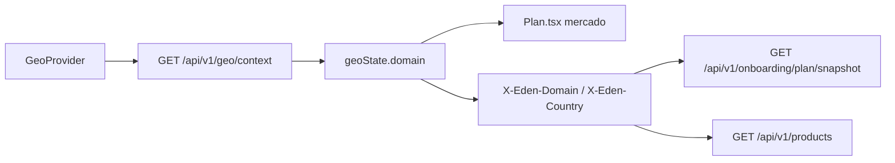

# Geo no backend Node

Documentacao de como a rota WordPress `GET /wp-json/custom/v1/geo/context` sera aplicada no `eden-bowls-backend` (Express, CommonJS).

A analise de origem esta em:

- `docs/geo/DOCUMENTACAO_TECNICA_ROTA_CUSTOM_V1_GEO_CONTEXT.md`
- `docs/geo/ROTA_GEO_CONTEXT_FRONTEND.md`

Este diretorio descreve o desenho **para o Node atual**. A rota **ainda nao existe** em `src/`. Nao ha `GET /api/v1/geo/context` registrado em `src/app.js`.

## Estado atual

| Camada | Situacao |
|---|---|
| WordPress | rota viva em `headless-secure-registration` |
| Node Express | **nao implementada** |
| `src/core/market.js` | ja resolve mercado US/BR a partir de `domain`/`country` **depois** que o front ja sabe o dominio |
| Frontend | `fetchBackendGeoState()` ainda chama `/custom/v1/geo/context` (prefixo WP) |
| Banco | esta rota nao usa MySQL; so arquivo MaxMind `.mmdb` |

Com `VITE_API_BASE_URL=http://localhost:3000` e simulacao geo desligada, o front cai no fallback `.com` / `UNKNOWN`.

## Documentos

| Documento | Conteudo |
|---|---|
| [APLICACAO_GEO_CONTEXT.md](./APLICACAO_GEO_CONTEXT.md) | Como a logica WP entra na arquitetura atual (arquivos, wiring, decisoes) |
| [ROTA_GEO_CONTEXT.md](./ROTA_GEO_CONTEXT.md) | Contrato da rota Node `GET /api/v1/geo/context` |
| [ROTA_GEO_CONTEXT_FRONTEND.md](./ROTA_GEO_CONTEXT_FRONTEND.md) | O que o front precisa mudar para consumir o Node |

## Rota coberta

| Rota | Metodo | Auth | Persistencia | Documento |
|---|---|---|---|---|
| `/api/v1/geo/context` | GET | Publica (sem JWT) | Nenhuma (arquivo GeoLite2) | [ROTA_GEO_CONTEXT.md](./ROTA_GEO_CONTEXT.md) |

A irma WP `GET /custom/v1/geo/redirect` **nao** sera migrada. O redirect de dominio continua no frontend (`resolveScenario` / `getAutoRedirectPreset`).

## Papel no fluxo da tela `/plan`

`/geo/context` so detecta dominio + pais + IP. Nao monta o plano. As rotas de snapshot, recommendation e products ja existem no Node e leem mercado via `parseRequestMarket` (`src/api/validators/market.validator.js`).
