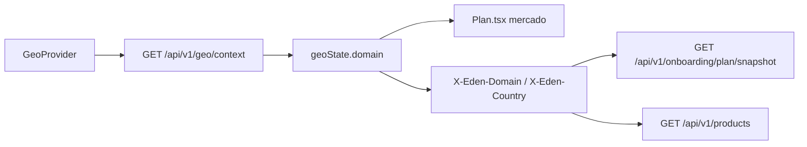

# Geo no backend Node

Contrato da rota atual `GET /api/v1/geo/context` no `eden-bowls-backend` (Express, CommonJS). `registerGeoRoutes` em `src/app.js` registra essa rota.

A analise historica da migracao esta em `docs/archive/wordpress-migration/geo/`. Nao e modelo de implementacao.

## Estado atual

| Camada | Situacao |
|---|---|
| Node Express | `GET /api/v1/geo/context` registrada |
| `src/core/market.js` | resolve mercado US/BR a partir de `domain`/`country` depois que o front ja sabe o dominio |
| Frontend | `fetchBackendGeoState()` chama `/api/v1/geo/context` |
| Banco | esta rota nao usa MySQL; so arquivo MaxMind `.mmdb` |

Com `VITE_API_BASE_URL=http://localhost:3000` e simulacao geo desligada, o front cai no fallback `.com` / `UNKNOWN`.

## Documentos

| Documento | Conteudo |
|---|---|
| [APLICACAO_GEO_CONTEXT.md](./APLICACAO_GEO_CONTEXT.md) | Como a logica WP entra na arquitetura atual (arquivos, wiring, decisoes) |
| [ROTA_GEO_CONTEXT.md](./ROTA_GEO_CONTEXT.md) | Contrato da rota Node `GET /api/v1/geo/context` |
| [ROTA_GEO_CONTEXT_FRONTEND.md](./ROTA_GEO_CONTEXT_FRONTEND.md) | O que o front precisa mudar para consumir o Node |

## Rota coberta

| Rota | Metodo | Auth | Persistencia | Documento |
|---|---|---|---|---|
| `/api/v1/geo/context` | GET | Publica (sem JWT) | Nenhuma (arquivo GeoLite2) | [ROTA_GEO_CONTEXT.md](./ROTA_GEO_CONTEXT.md) |

A irma WP `GET /custom/v1/geo/redirect` **nao** sera migrada. O redirect de dominio continua no frontend (`resolveScenario` / `getAutoRedirectPreset`).

## Papel no fluxo da tela `/plan`

```mermaid
flowchart LR
  FE[GeoProvider] --> GEO["GET /api/v1/geo/context"]
  GEO --> ST[geoState.domain]
  ST --> PLAN[Plan.tsx mercado]
  ST --> HDR["X-Eden-Domain / X-Eden-Country"]
  HDR --> SNAP["GET /api/v1/onboarding/plan/snapshot"]
  HDR --> FLAV["GET /api/v1/products"]
```

`/geo/context` so detecta dominio + pais + IP. Nao monta o plano. As rotas de snapshot, recommendation e products ja existem no Node e leem mercado via `parseRequestMarket` (`src/api/validators/market.validator.js`).
