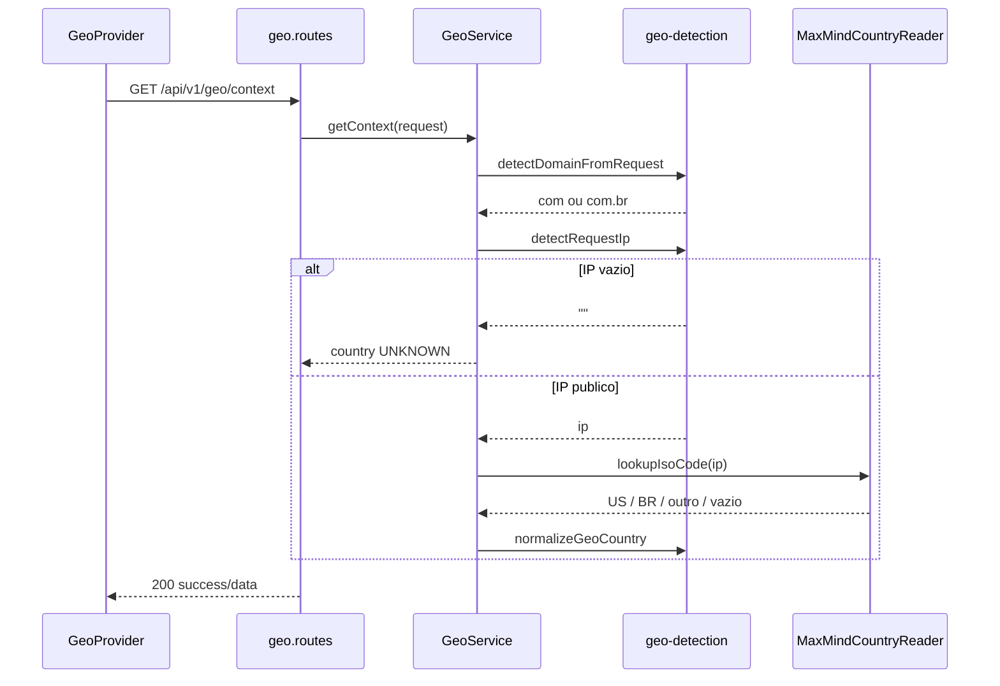

# Rota Node: Geo Context

## Escopo

Rota alvo no backend Node:

- `GET /api/v1/geo/context`

Origem no front-end:

- `eden-bowls/src/lib/geo/backendGeo.ts` (`fetchBackendGeoState`)
- `eden-bowls/src/contexts/GeoContext.tsx` (`GeoProvider`)
- `eden-bowls/src/pages/plan/Plan.tsx` (consome `geoState.domain`)

Arquivos alvo no Node:

- `src/api/routes/geo.routes.js`
- `src/services/geo.service.js`
- `src/core/geo-detection.js`
- `src/infrastructure/geo/maxmind-country-reader.js`
- `src/config/env.js`
- `src/app.js`
- `src/index.js`
- `tests/geo.routes.test.js`
- `tests/geo.service.test.js`
- `tests/geo-detection.test.js`

Rota legado WordPress (substituida):

- `GET /wp-json/custom/v1/geo/context`

Analise WP + front: `docs/geo/DOCUMENTACAO_TECNICA_ROTA_CUSTOM_V1_GEO_CONTEXT.md`.

Como encaixar no repo: [APLICACAO_GEO_CONTEXT.md](./APLICACAO_GEO_CONTEXT.md).

## Responsabilidade

Resolver o contexto geografico do visitante para o frontend decidir mercado, idioma, moeda, catalogo e (quando couber) redirect entre `.com` e `.com.br`.

A rota so faz:

1. detectar o dominio atual da request (`com` ou `com.br`);
2. detectar o pais pelo IP via MaxMind GeoLite2;
3. devolver IP, dominio e pais em JSON.

Nao faz:

- autenticacao;
- query params / body;
- persistencia em banco;
- preenchimento de `region` (sempre `null`);
- preenchimento de `presetId` (sempre `null`);
- redirect HTTP;
- escolha de catalogo ou preco (isso e snapshot / products, usando o dominio que o front reenvia).

## Estado de implementacao

| Parte | Status |
|---|---|
| Endpoint no Express | **nao implementado** |
| Contrato JSON (paridade WP) | definido abaixo |
| MaxMind no Node | **nao implementado** |
| Uso de `market.js` nesta rota | propositalmente **nao** |

## Endpoint, controller e permissao

### Registro

- Path: `/api/v1/geo/context`
- Method: `GET`
- Registrar: `registerGeoRoutes`
- Local: `src/app.js`, junto das demais `register*Routes`

### Controller

1. Exige `geoService` injetado (`503` se faltar, mesmo padrao de breeds).
2. Chama `geoService.getContext(request)`.
3. Responde `200` com o envelope. Falha de MaxMind **nao** vira 5xx: vira `country: "UNKNOWN"`.

### Autenticacao

Rota publica.

```http
GET /api/v1/geo/context
Accept: application/json
```

Nao enviar JWT, `x-session-token` nem cookie. O middleware de Bearer deve short-circuit neste path (ver aplicacao).

## Fluxo da requisicao



1. Front chama no mount do `GeoProvider` (se a simulacao estiver desligada).
2. Rota infere dominio pelos headers de host.
3. Rota infere IP (politica unica de proxy).
4. Reader consulta o `.mmdb` local.
5. Normaliza ISO e devolve JSON.
6. Front publica `geoState`. `/plan` usa **domain** para mercado.

## Headers

### Obrigatorios

Nenhum. O front envia so `Accept: application/json`.

### Usados para dominio (nesta ordem)

1. `Origin`
2. `Referer`
3. `X-Forwarded-Host`
4. `Host`

### Usados para IP

Se `GEO_TRUST_PROXY_HEADERS=true`:

1. `CF-Connecting-IP`
2. `X-Forwarded-For` (primeiro IP valido da lista)
3. endereco do socket

Se `false`: so o socket (`request.socket.remoteAddress`).

Preferir IP publico. Lista so com privado → string vazia.

## Regras de negocio

### Dominio

| Host | `data.domain` |
|---|---|
| `*.com.br` | `com.br` |
| `edenbowls.com`, `localhost`, IP, qualquer outro | `com` |

`qa-app` em `edenbowls.com` resolve `com`, mesmo com `Accept-Language: pt`.

### Pais (MaxMind)

| ISO / entrada | `data.country` |
|---|---|
| `US` | `US` |
| `BR` | `BR` |
| vazio / lookup falhou / IP ausente | `UNKNOWN` |
| qualquer outro (`PT`, `DE`, ...) | `OTHER` |

### Mercado da tela de plano (nao e esta rota)

Mercado efetivo = dominio, nao pais do IP. Documentado no front. Esta rota so fornece o `domain`.

| `data.domain` | pais da tela | moeda |
|---|---|---|
| `com.br` | `BR` | `BRL` |
| `com` | `US` | `USD` |

### Campos fixos

- `data.region`: sempre `null`
- `data.source`: sempre `"backend"`
- `data.presetId`: sempre `null`

## Estrutura da resposta

HTTP 200 — unico caminho de sucesso (incluindo deteccao incompleta):

```json
{
  "success": true,
  "data": {
    "domain": "com",
    "country": "US",
    "ip": "8.8.8.8",
    "region": null,
    "source": "backend",
    "presetId": null
  }
}
```

| Campo | Tipo | Nulo | Descricao |
|---|---|---|---|
| `success` | boolean | nao | sempre `true` neste handler |
| `data.domain` | `"com"` \| `"com.br"` | nao | host inferido |
| `data.country` | `"US"` \| `"BR"` \| `"OTHER"` \| `"UNKNOWN"` | nao | pais pelo IP |
| `data.ip` | string | pode ser `""` | mesmo IP do lookup |
| `data.region` | `null` | sempre | nao implementado |
| `data.source` | `"backend"` | nao | literal |
| `data.presetId` | `null` | sempre | so existe em simulacao local no front |

Exemplo local sem `.mmdb` (request de `http://localhost:5173`):

```json
{
  "success": true,
  "data": {
    "domain": "com",
    "country": "UNKNOWN",
    "ip": "127.0.0.1",
    "region": null,
    "source": "backend",
    "presetId": null
  }
}
```

(`127.0.0.1` nao e publico; a implementacao deve preferir `ip: ""` + `UNKNOWN` se a regra de IP publico for aplicada. Paridade recomendada: IP privado nao alimenta MaxMind.)

## Tratamento de erros

| Situacao | HTTP | Body |
|---|---|---|
| Service nao injetado | 503 | `{ success: false, message }` via `HttpError` |
| `.mmdb` ausente / Reader falhou / IP invalido | 200 | `country: "UNKNOWN"` |
| Rota inexistente (hoje, antes da implementacao) | 404 | `{ success: false, message: "Route not found." }` |
| JWT lixo **depois** de marcar o path publico | 200 | contexto geo normal |

Nao ha 4xx de validacao: nao ha input.

Zod no error handler de `app.js` nao se aplica a esta rota.

## Performance

- Sem query SQL.
- Sem HTTP de saida no request path.
- Reader aberto no bootstrap (melhoria vs PHP, que abria o arquivo por request).
- Sem `Cache-Control` especial no WP desta rota; o Node pode omitir cache ou mandar `Cache-Control: private, no-store` (IP e pessoal). Preferir `no-store` para nao cachear IP em CDN.

## Banco de dados

Nenhum. Nao criar migration. Nao usar `onboarding_user_state`.

Dependencia de arquivo: `GEO_MAXMIND_DB_PATH` (GeoLite2-Country).

## Dependencias

- Express ja existente (`createApp`)
- Pacote `maxmind` (ou `@maxmind/geoip2-node`)
- Arquivo `.mmdb` no deploy
- Envs `GEO_MAXMIND_DB_PATH` e `GEO_TRUST_PROXY_HEADERS`

APIs externas no request path: nenhuma.

## Exemplos de chamada

Local, Node na porta 3000:

```bash
curl --url "http://localhost:3000/api/v1/geo/context" \
  -H "accept: application/json" \
  -H "origin: http://localhost:5173"
```

Forcando dominio BR (host do Origin):

```bash
curl --url "http://localhost:3000/api/v1/geo/context" \
  -H "accept: application/json" \
  -H "origin: https://www.edenbowls.com.br"
```

QA, depois do cutover (o prefixo `/qa-api` e do proxy, nao da rota Express):

```bash
curl --url "https://edenbowls.com/qa-api/api/v1/geo/context" \
  -H "accept: application/json" \
  -H "referer: https://edenbowls.com/qa-app/plan"
```

## Relacao com outras rotas Node

`/geo/context` nao substitui snapshot, recommendation nem products. Depois que o `GeoProvider` tem `geoState.domain`, o front passa mercado nas rotas que **ja existem**:

| Rota Node ja existente | Como recebe mercado |
|---|---|
| `GET /api/v1/onboarding/plan/snapshot` | `parseRequestMarket` (`country`, `domain`, `X-Eden-*`) |
| `GET /api/v1/onboarding/recommendation` | idem |
| `GET /api/v1/products` | query de catalogo por pais |

Se geo falhar, o front aplica `FALLBACK_GEO_STATE` (`.com` / `UNKNOWN`) e essas rotas recebem mercado US.

## Testes

```bash
npx jest --runTestsByPath tests/geo-detection.test.js
npx jest --runTestsByPath tests/geo.service.test.js
npx jest --runTestsByPath tests/geo.routes.test.js
```

Nao rodar a suíte inteira nem testes de integracao MySQL por esta rota.
