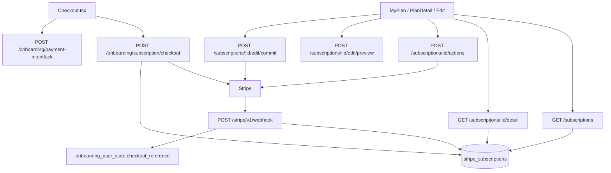

# Aplicacao do pos-checkout no backend Node

Como o bloco **depois** do Place Order entra no Express atual: **JWT**, **sem sessao**, **sem Woo order**.

Checkout real ja existe (`StripeBillingClient.createOnboardingSubscription`). ACK ja persiste `checkout_reference`. O dashboard **nao** le isso. O webhook **nao existe**. Eligibility de 1a compra le `wp_hsr_stripe_subscriptions` e hoje quase nunca acha linha — a 2a compra ainda pode ganhar cupom.

Contrato do front: `eden-bowls/src/services/onboardingApi.ts`, `subscriptionEditApi.ts`, `MyPlan.tsx`, `PlanDetail.tsx`, `EditSubscription.tsx`.

Este arquivo e o guia de implementacao. Nao copiar PHP. Nao recriar `fsb_subscription` / `wc_create_order`.

Create no Place Order (antes deste bloco): [../subscription-checkout/README.md](../subscription-checkout/README.md).

## 1. O que ja existe no Node e o que falta

| Responsabilidade | Node (hoje) | Node (alvo) |
|---|---|---|
| Confirmar 1a fatura paga | **nao existe** webhook | `POST /stripe/v1/webhook` publico, `Stripe-Signature`, raw body; `invoice.paid` upsert ledger + `checkout_reference.payment_state = paid` |
| Frete nos ciclos seguintes | checkout so injeta `add_invoice_items` na **1a** invoice | mesmo webhook, `invoice.created` (`subscription_cycle` + draft) cria invoice item de shipping |
| Corrigir ACK mentiroso | ACK confia no body do front | `payment_intent.payment_failed` / `invoice.payment_failed` → `payment_state = failed` se ledger ainda nao `active` |
| Convergir pause/cancel/edit | actions stub `queued` | Stripe real; `customer.subscription.updated` / `deleted` fecha ledger; `pending_webhook_confirmation` converge |
| Listar planos | `SubscriptionsRepository.listMine()` ignora `userId`, devolve `[]` | ledger por `user_id`; **sem** Woo |
| Detalhe do plano | stub Premium/Milo para qualquer `sub_` | shape do front; ownership JWT; 404 se nao for do user |
| Acoes | JWT + `assertCriticalOperationAllowed` + Zod interno de `action`; **nao** chama Stripe | 5 acoes do front; Stripe via `StripeBillingClient`; falha → 502 |
| Edit preview | stub `hash-123`, totais 30 USD | catalogo Node (`plan/preview`) + prorrata Stripe + tax US |
| Edit commit | **404** | rota nova; hash `expected_current_hash`; 409 `subscription_state_changed` |
| Elegibilidade 1a compra | le `wp_hsr_stripe_subscriptions` (`wp_user_id` / `customer_email`, status `active`/`trialing`) | checkout escreve `incomplete`; webhook `invoice.paid` promove `active` |

ACK **nao** substitui webhook. UI pode otimista-`paid`; o dominio so fecha em `invoice.paid`.

## 2. Decisoes em relacao ao PHP / ao codigo atual

| Tema | Decisao no Node |
|---|---|
| Path webhook | `POST /stripe/v1/webhook` **fora** de `/api/v1` (igual `/shipping/v1/*`). `buildBearerTokenMiddleware` ja ignora path que nao comeca com `/api/v1` |
| Auth webhook | header `Stripe-Signature` + `STRIPE_WEBHOOK_SECRET`; **raw body** **antes** de `express.json()` |
| Path dashboard | `/api/v1/subscriptions...` (front ja chama; rotas ja registradas) |
| Auth dashboard | JWT; `401` sem `currentUser.id`. Actions e commit: `assertCriticalOperationAllowed` (actions ja faz) |
| Envelope | `{ success, data }` nas rotas `/api/v1`. Webhook: `{ received: true }` (Stripe so exige 2xx) |
| Fonte de listagem | **so ledger Node** `stripe_subscriptions`. Woo **nao**. Fallback opcional: `subscriptions.list({ customer: cus_ })` para status fresco |
| Materializar pedido no `invoice.paid` | **nao portar** Woo. Upsert ledger + `checkout_reference.payment_state = paid` |
| Lookup do user no paid | `checkout_reference.stripe_subscription_id` em `onboarding_user_state` **ou** `cus_` no `StripeCustomerStore` **ou** `metadata.wp_user_id` da Subscription Stripe (checkout ja grava) |
| Frete recorrente | `invoice.created` + `invoiceItems.create`. Checkout hoje **nao** persiste shipping na `metadata` da sub — **passar a gravar** (ver 7.2) |
| `pending_webhook_confirmation` | true na maioria das actions; o front trata como "aguardando" |
| `change_plan` / `change_billing_frequency` no `/actions` | service ja aceita os 7 nomes PHP. Alvo: **422 `invalid_action`** para esses dois; o front usa edit preview/commit |
| Dedup webhook | tabela `stripe_webhook_events` (`event_id` unique `evt_...`) |
| Customer | `StripeCustomerStore` (`_hsr_stripe_customer_id`) — ja existe |
| Stripe HTTP | estender `src/infrastructure/stripe/stripe-billing-client.js` (nao criar segundo SDK) |
| Catalogo do edit | reusar `OnboardingPlanPreviewService` / `buildPlanPreviewResponse` (`src/core/plan-catalog-pricing.js`). Hash: mesmo padrao `canonicalize` + sha256 de `onboarding-plan-preview.service.js` |

## 3. Arquitetura no projeto atual

Padrao: `route → service → repository`. Stripe HTTP em `src/infrastructure/stripe/`. Regras puras em `src/core/`.



Webhook: **sem JWT**. Dashboard: JWT em todas.

Wiring hoje (`src/index.js`): repositorios de subscriptions sao **instanciados sem DataSource**:

```js
const subscriptionsRepository = new SubscriptionsRepository();
const subscriptionsDetailRepository = new SubscriptionsDetailRepository();
const subscriptionsActionsRepository = new SubscriptionsActionsRepository();
const subscriptionsEditPreviewRepository = new SubscriptionsEditPreviewRepository();
```

Alvo: injetar `dataSource` + `stripeBilling` + ledger repository (e catalogo no preview/commit).

## 4. Ordem de implementacao sugerida

O dashboard quebra hoje na ordem do usuario: sucesso no checkout → Meu Plano vazio → detalhe fake → edit 404.

1. **Migration + ledger repository** — desbloqueia escrita do checkout e leitura da listagem.
2. **Checkout grava ledger `incomplete` + shipping na metadata da sub** — senão o webhook nao tem o que promover e o 2o ciclo perde frete.
3. **Webhook** (`invoice.paid` + persistencia de eventos). Desbloqueia cobranca de verdade e 1a compra.
4. **`invoice.created`** no mesmo endpoint — senão o 2o ciclo perde frete.
5. **`GET /subscriptions`** lendo o ledger.
6. **`GET .../detail`** — Meu Plano / Edit precisam do shape rico.
7. **`POST .../actions`** para o que o front chama: pause, reactivate, cancel, toggle_auto_renew, update_payment_method.
8. **`POST .../edit/preview`** real (prorrata + tax US).
9. **`POST .../edit/commit`** — rota nova.
10. Eventos `customer.subscription.*` / `payment_intent.*` no webhook para fechar actions/edit e corrigir ACK.

## 5. Modelo de dados

Nao copiar Woo posts. Nao reusar `wp_hsr_stripe_subscriptions` como tabela TypeORM (eligibility ainda **le** essa tabela WP se o DB for compartilhado). No Node, criar tabelas proprias e **apontar a eligibility para elas**.

### 5.1 Ledger `stripe_subscriptions`

Colunas minimas (paridade com o que eligibility e o front precisam):

| Coluna | Tipo | Notas |
|---|---|---|
| `id` | int PK AI | |
| `user_id` | int | indice; **mesmo** `wp_user_id` da eligibility |
| `customer_email` | varchar 255 nullable | eligibility faz fallback por email |
| `stripe_subscription_id` | varchar 64 unique | `sub_...` |
| `stripe_customer_id` | varchar 64 | `cus_...` |
| `status` | varchar 32 | `incomplete` / `active` / `trialing` / `paused` / `canceled` / `past_due` |
| `plan_label` | varchar 128 nullable | |
| `stripe_price_id` | varchar 64 nullable | |
| `current_period_start` | datetime nullable | |
| `current_period_end` | datetime nullable | |
| `cancel_at_period_end` | tinyint 0/1 | `auto_renew = !cancel_at_period_end` |
| `payment_method_last4` | varchar 8 nullable | |
| `payment_method_brand` | varchar 32 nullable | |
| `pets_snapshot` | json nullable | `{ pet_ids, pets_names, pets }` |
| `plan_selection` | json nullable | copia do onboarding no momento do checkout/edit |
| `shipping` | json nullable | para `invoice.created` e detalhe |
| `address` | json nullable | |
| `subscription_term_months` | tinyint nullable | 1 / 3 / 6 |
| `edit_payment_pending` | tinyint 0/1 default 0 | |
| `edit_pending` | json nullable | `{ plan_selection, term_months, shipping, invoice_id, payment_intent_id }` |
| `created_at` / `updated_at` | datetime | |

Quem escreve:

- checkout → UPSERT `status = incomplete` (ou o status Stripe da sub recem-criada)
- webhook `invoice.paid` → `status = active` + periodos + last4
- webhook `customer.subscription.*` → status / `cancel_at_period_end` / periodos
- edit commit → `edit_payment_pending` + `edit_pending` se houver PI

Eligibility (`OnboardingDiscountEligibilityRepository.hasActiveSubscription`): hoje SQL usa `wp_user_id` e tabela `wp_hsr_stripe_subscriptions`. Alvo: consultar `stripe_subscriptions` por `user_id` (e email). Manter o try/catch de tabela ausente.

Se o DB for compartilhado com WP e `wp_hsr_stripe_subscriptions` ja existir, o repository do ledger **pode** ler as duas (Node primeiro). Nao duplicar escrita no WP se a tabela Node estiver no ar.

### 5.2 Eventos `stripe_webhook_events`

| Coluna | Tipo |
|---|---|
| `event_id` | varchar 64 PK (`evt_...`) |
| `type` | varchar 64 |
| `processed_at` | datetime |
| `payload_summary` | json nullable |

Idempotencia: `INSERT` unique. Duplicate → 200 sem reprocessar.

### 5.3 Ja existente (nao recriar)

- `onboarding_user_state.checkout_reference` (ja tem `stripe_subscription_id`, `payment_state`, PI)
- `wp_usermeta._hsr_stripe_customer_id`
- `onboarding_pets` / `plan_selection` / `address` / `shipping` para enriquecer detalhe

## 6. Env

Alem de `STRIPE_SECRET_KEY` / `STRIPE_SHIPPING_PRODUCT_ID` ja em `src/config/env.js` e `.env.example`:

| Variavel | Uso |
|---|---|
| `STRIPE_WEBHOOK_SECRET` | `whsec_...` — verificar `Stripe-Signature`. Sem isso → **503 so neste path** |
| `STRIPE_SHIPPING_PRODUCT_ID` | `invoice.created` reusa o mesmo product do checkout |
| `WP_HSR_STRIPE_SUBSCRIPTIONS_TABLE_NAME` | eligibility legado; apos o ledger Node, eligibility passa a ler `stripe_subscriptions` |

Adicionar `STRIPE_WEBHOOK_SECRET` em `rawEnvSchema` (optional string) e em `.env.example`.

Dashboard Stripe: endpoint `{API}/stripe/v1/webhook`. Eventos minimos: `invoice.paid`, `invoice.created`, `payment_intent.succeeded`, `payment_intent.payment_failed`, `invoice.payment_failed`, `customer.subscription.updated`, `customer.subscription.deleted`.

## 7. Arquivos a criar e a alterar

### 7.1 Criar

```text
src/infrastructure/migrations/1700000000009-create-stripe-subscription-ledger-tables.js
src/infrastructure/entities/stripe-subscription.entity.js
src/infrastructure/entities/stripe-webhook-event.entity.js
src/infrastructure/repositories/subscription-ledger.repository.js
src/infrastructure/repositories/stripe-webhook-events.repository.js
src/api/routes/stripe-webhook.routes.js
src/services/stripe-webhook.service.js
src/api/routes/subscriptions-edit-commit.routes.js
src/services/subscriptions-edit-commit.service.js
src/infrastructure/repositories/subscriptions-edit-commit.repository.js
src/api/validators/subscriptions-edit.validator.js
src/core/subscription-edit-hash.js
tests/stripe-webhook.routes.test.js
tests/stripe-webhook.service.test.js
tests/subscription-ledger.repository.test.js
tests/subscriptions-edit-commit.routes.test.js
```

### 7.2 Alterar

```text
src/app.js
  # ANTES de express.json():
  #   app.use('/stripe/v1/webhook', express.raw({ type: 'application/json' }));
  # registrar registerStripeWebhookRoutes
  # registrar registerSubscriptionsEditCommitRoutes junto do preview

src/index.js
  # instanciar ledger + webhook events + stripeWebhookService
  # passar dataSource/stripeBilling aos repositorios de subscriptions
  # passar STRIPE_WEBHOOK_SECRET

src/config/env.js          # STRIPE_WEBHOOK_SECRET
.env.example               # STRIPE_WEBHOOK_SECRET=

src/infrastructure/db.js   # entities + migration 0009

src/infrastructure/stripe/stripe-billing-client.js
  # constructEvent(rawBody, signature, secret)
  # pause / resume / cancel / setCancelAtPeriodEnd
  # updateDefaultPaymentMethod
  # addShippingInvoiceItem({ invoiceId, productId, amount, currency })
  # retrieveSubscription / listByCustomer
  # updateSubscriptionItems (edit commit)
  # previewProration (edit preview)
  # createOnboardingSubscription: gravar metadata de shipping
  #   shipping_amount_minor, shipping_currency, shipping_product_id, user_id

src/services/onboarding-subscription-checkout.service.js
  # apos create: ledger.upsert incomplete (userId, sub_, cus_, snapshots)

src/infrastructure/repositories/onboarding-discount-eligibility.repository.js
  # hasActiveSubscription: ler stripe_subscriptions (user_id + email)

src/infrastructure/repositories/subscriptions.repository.js          # listar ledger
src/infrastructure/repositories/subscriptions-detail.repository.js   # detalhe + enrich
src/infrastructure/repositories/subscriptions-actions.repository.js  # Stripe real
src/infrastructure/repositories/subscriptions-edit-preview.repository.js
src/services/subscriptions-actions.service.js   # 5 acoes do front; change_* → 422
src/services/subscriptions-edit-preview.service.js  # validacoes WP
src/services/subscriptions-detail.service.js    # 404 se repository devolver null
```

### 7.3 Nao criar

- rotas `/onboarding/session/...`
- `account-link`
- tabelas Woo so para listar plano
- `fsb_subscription` como entidade Node
- segundo client Stripe

## 8. Raw body do webhook (obrigatorio)

`createApp` hoje faz `app.use(express.json({ limit: '1mb' }))` **antes** das rotas. `constructEvent` precisa do Buffer original.

Alvo em `src/app.js`, **antes** do `express.json()`:

```js
app.use('/stripe/v1/webhook', express.raw({ type: 'application/json' }));
app.use(express.json({ limit: '1mb' }));
```

Na rota: `request.body` e `Buffer`. Nao passar por `JSON.parse` antes do Stripe.

## 9. Testes minimos na transicao

Nao rodar a suíte inteira. Por fatia:

```bash
npx jest --runTestsByPath tests/stripe-webhook.routes.test.js
npx jest --runTestsByPath tests/subscriptions.routes.test.js
npx jest --findRelatedTests src/services/subscriptions-actions.service.js
npx jest --findRelatedTests src/services/subscriptions-edit-preview.service.js
npx jest --runTestsByPath tests/subscriptions-edit-commit.routes.test.js
```

Cobrir: webhook sem assinatura → 400; secret ausente → 503; `evt_` repetido → 200 idempotente; `invoice.paid` marca `paid` e upsert ledger; list sem JWT → 401; list apos paid → 1 item; detail de sub de outro user → 404; `pause` chama Stripe; commit sem hash → 422; hash stale → 409; Stripe down em actions → 502 (nao 200 fake).
