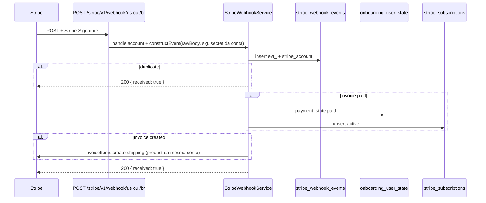

# Rota alvo: Stripe webhook

Duas merchant accounts (PAY-01). Cada Dashboard aponta só para o path daquela conta. Cutover operacional: [FEATURE_STRIPE_SEPARAR_PAISES/o-que-alterar-para-funcionar.md](../FEATURE_STRIPE_SEPARAR_PAISES/o-que-alterar-para-funcionar.md).

## Escopo

Rota legado WordPress:

- `POST /custom/v1/stripe-webhook`

Rotas Node (Express, **já registradas**):

- `POST /stripe/v1/webhook/us`
- `POST /stripe/v1/webhook/br`
- `POST /stripe/v1/webhook` — alias US no cutover

Auth = header `Stripe-Signature` + o secret da **mesma** conta do path. Assinatura inválida → 400; o receiver **não** tenta o outro secret.

Origem: Stripe (não o front). Consumidores posteriores: `GET /subscriptions`, eligibility de 1ª compra, actions/edit.

Local: `npm run stripe:listen` (US → `/webhook/us`) e `npm run stripe:listen:br` (BR → `/webhook/br`) em dois CLIs, cada um logado na conta correspondente.

Arquivos:

- `src/api/routes/stripe-webhook.routes.js` — `registerStripeWebhookRoutes`
- `src/services/stripe-webhook.service.js` — `StripeWebhookService.handle({ account, rawBody, signature })`
- `src/infrastructure/repositories/stripe-webhook-events.repository.js` — PK `(event_id, stripe_account)`
- `src/infrastructure/repositories/subscription-ledger.repository.js`
- `src/infrastructure/stripe/stripe-accounts.js` — client + `webhookSecret` por conta
- `tests/stripe-webhook.routes.test.js`
- `tests/stripe-webhook.service.test.js`

Env: `STRIPE_US_WEBHOOK_SECRET` (fallback `STRIPE_WEBHOOK_SECRET`) e `STRIPE_BR_WEBHOOK_SECRET`.

## Responsabilidade

Receber eventos Stripe, verificar assinatura, processar **uma vez** e atualizar o estado local. Persiste `stripe_account` no evento e no upsert do ledger.

Não é chamada pelo `Checkout.tsx`. Se o ACK falhar após `confirmCardPayment`, a UI assume que **este** webhook converge `payment_state`.

Mutação segue a conta do path / ledger. Kill switch `STRIPE_BR_ENABLED` **não** silencia webhook de um `sub_` já gravado como `br`.

## Auth

Pública. **Sem JWT**. Auth = `Stripe-Signature` + secret da conta do path:

| Path | Secret |
|------|--------|
| `/stripe/v1/webhook/us` e `/stripe/v1/webhook` | `STRIPE_US_WEBHOOK_SECRET` (fallback `STRIPE_WEBHOOK_SECRET`) |
| `/stripe/v1/webhook/br` | `STRIPE_BR_WEBHOOK_SECRET` |

Path **fora** de `/api/v1`: `buildBearerTokenMiddleware` já faz `next()` se `!request.path.startsWith('/api/v1')` — igual `/shipping/v1/*` e `/health`.

Body: **raw** (`application/json` bytes). Montar `express.raw` **antes** de `express.json()` em `src/app.js`.

| Falha | Status |
|---|---|
| secret da conta ausente | 503 `{ received: false }` — não derrubar o resto da API |
| sem `Stripe-Signature` / secret errado (inclui secret da **outra** conta) | 400 |
| evento desconhecido | 200 (ignorar) |
| `evt_` já processado **nessa** conta | 200 sem reexecutar |

`evt_` é único **por conta**. O mesmo id nas duas Dashboards não colide.

## Eventos que o Node precisa

### 1) `invoice.paid` — obrigatorio agora

Resolver `user_id` nesta ordem:

1. `invoice.subscription` / `parent.subscription_details.subscription` → `onboarding_user_state.checkout_reference.stripe_subscription_id`
2. `invoice.customer` (`cus_`) → `StripeCustomerStore` (meta `_hsr_stripe_customer_id_us` ou `_hsr_stripe_customer_id_br` da **mesma** conta)
3. `subscription.metadata.wp_user_id` (checkout ja grava)

Depois:

1. UPSERT ledger (`status = active`, periodos, price, last4 se vierem) com `stripe_account` do path.
2. UPDATE `checkout_reference.payment_state = paid` (mesmo se ACK ja escreveu).
3. Se `edit_payment_pending` e a invoice e a de prorrata (`edit_pending.invoice_id`): limpar pendencia e promover `plan_selection` / termo / shipping do `edit_pending`.
4. Idempotente: segundo `invoice.paid` da mesma invoice nao duplica ledger.

Sem este evento, Meu Plano fica vazio e a 2a compra ainda pode receber cupom de 1a.

**Nao** criar pedido Woo. **Nao** gravar `client_secret` no ledger.

### 2) `invoice.created` — obrigatorio para o 2o ciclo

O checkout Node so coloca frete na **1a** invoice (`add_invoice_items`). Ciclos seguintes **somem o frete** se este handler nao existir.

Alvo: se `billing_reason === 'subscription_cycle'` (nao `subscription_create`), invoice `status === 'draft'`, e a sub/ledger tiver shipping persistido, chamar `invoiceItems.create` com o product da **mesma** conta (`STRIPE_US_SHIPPING_PRODUCT_ID` / `STRIPE_BR_SHIPPING_PRODUCT_ID`; US herda `STRIPE_SHIPPING_PRODUCT_ID`) **antes** da invoice fechar.

Checkout precisa gravar na metadata da Subscription (hoje so tem `wp_user_id` + `source`):

```text
shipping_amount_minor
shipping_currency
shipping_product_id
```

Sem metadata/ledger de shipping → no-op.

### 3) `payment_intent.succeeded` / `processing`

Atualizar `checkout_reference` (id + status). **Nao** tratar como substituto de `invoice.paid`. **Nao** limpar `client_secret` (o ACK settled e quem limpa no fluxo de onboarding).

### 4) `payment_intent.payment_failed` / `invoice.payment_failed`

Corrige ACK otimista. `payment_state = failed` no `checkout_reference` se a sub ainda nao estiver `active` no ledger. Webhook **nao** rebaixa `paid` se o ledger ja estiver `active`.

### 5) `customer.subscription.updated` / `deleted`

Fecha actions e edit commit. Atualizar ledger (`status`, `cancel_at_period_end`, periodos, items). Sem isso, `pending_webhook_confirmation: true` nunca converge.

Mapear status Stripe → ledger:

| Stripe | Ledger / front |
|---|---|
| `active` | `active` |
| `paused` / `pause_collection` | `paused` |
| `canceled` / `incomplete_expired` | `canceled` |
| `past_due` / `unpaid` | `past_due` |
| `incomplete` | `incomplete` |
| `trialing` | `trialing` |

## Fluxo alvo



Responder **200 rapido**. Falha de negocio depois de verificar a assinatura: logar e ainda 200 se o retry da Stripe ia duplicar efeito; 500 so se o processamento for seguro de retentar (insert do `evt_` ainda nao commitado). Ordem: verificar assinatura → insert `evt_` → processar. Duplicate key no insert → return 200.

## Relacao com ACK

| | ACK | Webhook `invoice.paid` |
|---|---|---|
| Quem chama | front autenticado | Stripe |
| Confia no status? | body do cliente | evento assinado |
| Marca UI paid? | sim (otimista) | nao fala com UI |
| Cria ledger / fecha dominio? | **nao** | **sim** |
| Resolve conta Stripe | nao (local only) | path `/us` ou `/br` |

## Request

```http
POST /stripe/v1/webhook/us
Stripe-Signature: t=...,v1=...
Content-Type: application/json
```

BR: `POST /stripe/v1/webhook/br`. Alias cutover US: `POST /stripe/v1/webhook`.

Body: evento Stripe cru (`id`, `type`, `data.object`).

## Response

```json
{ "received": true }
```

Nao usar o envelope `{ success, data }` do resto da API.

## Controller

```js
function registerStripeWebhookRoutes(app, dependencies = {}) {
  const register = (path, account) => {
    app.post(path, async (request, response, next) => {
      const result = await dependencies.stripeWebhookService.handle({
        account,
        rawBody: request.body,
        signature: request.headers['stripe-signature']
      });
      response.status(200).json(result);
    });
  };

  register('/stripe/v1/webhook/br', 'br');
  register('/stripe/v1/webhook/us', 'us');
  register('/stripe/v1/webhook', 'us');
}
```

## Persistencia

- `stripe_webhook_events` — `(event_id, stripe_account)`
- `onboarding_user_state.checkout_reference` (inclui `stripe_account` gravado no checkout)
- `stripe_subscriptions.stripe_account`

Resolver user no ACK repository ja le `checkout_reference` por `user_id`. O webhook precisa do inverso: `stripe_subscription_id` no estado do usuario / ledger da mesma conta.

## Env

| Variavel | Conta | Fallback |
|----------|--------|----------|
| `STRIPE_US_WEBHOOK_SECRET` | US | `STRIPE_WEBHOOK_SECRET` |
| `STRIPE_BR_WEBHOOK_SECRET` | BR | nenhum |
| `STRIPE_US_SHIPPING_PRODUCT_ID` | US | `STRIPE_SHIPPING_PRODUCT_ID` |
| `STRIPE_BR_SHIPPING_PRODUCT_ID` | BR | nenhum |

Sem secret da conta do path → 503 neste path, nao derrubar o resto da API.

Dashboard: endpoint US → `{API}/stripe/v1/webhook/us`; BR → `{API}/stripe/v1/webhook/br`. Eventos minimos: `invoice.paid`, `invoice.created`, `payment_intent.succeeded`, `payment_intent.processing`, `payment_intent.payment_failed`, `invoice.payment_failed`, `customer.subscription.updated`, `customer.subscription.deleted`. Test + live × br + us = 4 endpoints.

## O que mudou em relacao ao WordPress

| Antes (WP) | Alvo (Node) |
|---|---|
| materializa Woo + Flexible | upsert ledger + `checkout_reference` |
| lookup LIKE no JSON da sessao | `stripe_subscription_id` no estado do `user_id` / ledger |
| option `hsr_stripe_subscription_order_map` | desnecessario |
| `wp_hsr_stripe_events` | `stripe_webhook_events` com `stripe_account` |

## Testes minimos

- sem `Stripe-Signature` → 400
- secret errado → 400
- secret da outra conta no path (BR em `/us` ou US em `/br`) → 400, sem persist/dispatch
- secret nao configurado para aquela conta → 503
- `invoice.paid` primeiro → ledger active + `payment_state` paid + `stripe_account` do path
- mesmo `evt_` de novo **na mesma conta** → 200, um unico upsert
- `invoice.created` de ciclo 2 com shipping metadata → chama `invoiceItems.create` com o product da conta
- JWT no header nao e exigido e nao bloqueia
- path **nao** passa pelo bearer (teste de app: POST sem Authorization → nao 401)
