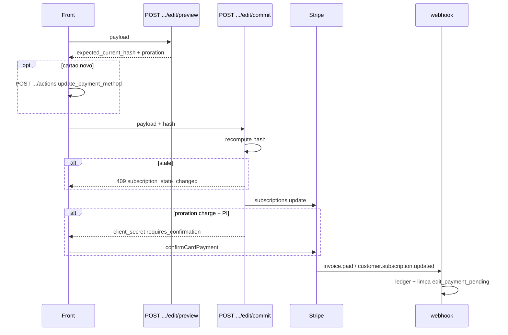

# Rota: commit de edicao da assinatura

## Escopo

Rota legado WordPress:

- `POST /custom/v1/subscriptions/:subscriptionId/edit/commit`

Rota Node alvo:

- `POST /api/v1/subscriptions/:subscriptionId/edit/commit`

**Nao existe no Express.** `createApp` nao registra o path; o 404 handler devolve `{ success: false, message: "Route not found." }`.

O front ja chama (`commitSubscriptionEdit` em `subscriptionEditApi.ts`, `runCommit` em `EditSubscription.tsx`).

Contrato TS: `SubscriptionEditCommitResponse`.

## Responsabilidade

Aplicar a edicao que a preview simulou: atualizar items/termo/endereco/shipping na Stripe, cobrar prorrata se `direction = charge`, marcar pendencia se o PI precisar de 3DS.

Nao e `/actions`. Pause/cancel ficam em actions. Troca de plano, prazo, pets e endereco passam por **preview → commit**.

## Auth

JWT obrigatorio. `assertCriticalOperationAllowed` (igual checkout/ACK/actions) — a edicao pode cobrar.

```http
POST /api/v1/subscriptions/sub_123/edit/commit
Authorization: Bearer <jwt>
Content-Type: application/json
```

## Par com a preview

```
preview → expected_current_hash
commit  → body inclui o hash
          backend recomputa hash do estado atual (mesmo modulo src/core/subscription-edit-hash.js)
          diverge → 409 subscription_state_changed
          (EditSubscription re-roda preview)
```

Sem hash no body → 422 `expected_current_hash_required`.

## Validacoes (iguais a preview + extras)

Tudo que a preview bloqueia, o commit bloqueia de novo (nao confiar so no client):

- cancelada → 422 `subscription_not_editable`
- `edit_payment_pending` → 409
- termo 1 \| 3 \| 6
- plano/catalogo/`pet_blocked`
- hash obrigatorio e fresco
- ownership → 404

Se a preview gerou charge e o commit nao receber `payment_method_id` (nem um default na sub) → 422 `invalid_payment_method`.

## Fluxo alvo



Passos:

1. JWT + conta ativa + ownership + `assert_editable` + recompute hash.
2. Resolve plano proposto (mesmo `resolve_proposed_plan` da preview — **nao** duplicar formula; extrair helper compartilhado).
3. `subscriptions.update` (items, price, metadata de termo/shipping/address). Nao reaplicia cupom de 1a compra (`discounts` vazio / nao anexar promo).
4. Se prorrata `charge`: cria/finaliza invoice; se o PI vier `requires_confirmation` / `requires_action`, gravar no ledger:
   - `edit_payment_pending = 1`
   - `edit_pending` JSON (`plan_selection`, `term_months`, `shipping`, `invoice_id`, `payment_intent_id`)
   - devolver `stripe_client_secret` + `payment_state: requires_confirmation`
5. Se `credit` / `none`: aplica ja; `edit_payment_pending` permanece false; `pending_webhook_confirmation` pode ser true ate `customer.subscription.updated`.
6. Atualizar snapshots do ledger (pets/plan/address/shipping/termo) quando nao houver pendencia de PI.

O front, se `stripe_client_secret` e `payment_state === requires_confirmation`, chama `confirmCardPayment` (mesmo padrao do Place Order). **Nao** chama ACK de onboarding depois do edit; a convergencia e o webhook.

Se o usuario trocou cartao, o Edit chama `update_payment_method` **antes** deste POST.

## Request

Mesmo body da preview **mais** `expected_current_hash` (obrigatorio):

```json
{
  "subscription_term_months": 3,
  "pets": [{ "pet_name": "Milo", "enabled": true, "selected_flavors": ["chicken"], "flavor_weights": [100] }],
  "address": { "country": "US", "state": "CA", "postal_code": "94105" },
  "shipping": { "method_id": "ship_1", "label": "FedEx", "cost": 12.9, "total": 12.9 },
  "payment_method_id": "pm_123",
  "expected_current_hash": "sha256-..."
}
```

Validator: `parseSubscriptionsEditCommitInput` no mesmo arquivo Zod da preview.

## Response

Contrato TS `SubscriptionEditCommitResponse`:

```json
{
  "success": true,
  "data": {
    "subscription_id": "sub_123",
    "pending_webhook_confirmation": true,
    "term_change": true,
    "proration": {
      "direction": "charge",
      "amount_due_now": 12.5,
      "credit_applied": 0,
      "currency": "USD"
    },
    "payment_state": "requires_confirmation",
    "stripe_invoice_id": "in_...",
    "stripe_payment_intent_id": "pi_...",
    "stripe_client_secret": "pi_..._secret_...",
    "stripe_payment_intent_status": "requires_confirmation",
    "edit_payment_pending": true
  }
}
```

`payment_state` alinhado ao checkout (`StripeBillingClient.resolvePaymentState`): `paid` | `requires_confirmation` | `failed` | `pending_payment_method`.

Quando nao ha cobranca imediata:

- `stripe_client_secret`: `null`
- `edit_payment_pending`: `false`
- `payment_state`: `paid` (nada a confirmar)
- o front **nao** entra no `confirmCardPayment` (`EditSubscription.tsx` so confirma se secret **e** `requires_confirmation`)

Depois do sucesso o front mostra toast e navega para `/dashboard/plans/:id`.

## Relacao com webhook

| Evento | Efeito no edit |
|---|---|
| `invoice.paid` da invoice de prorrata | limpar `edit_payment_pending`; gravar plan_selection novo no ledger |
| `invoice.payment_failed` | manter pendencia; detalhe mostra failed |
| `customer.subscription.updated` | items/termo do ledger = Stripe |

Enquanto `edit_payment_pending`, preview e commit seguintes → 409. O usuario so sai dali atualizando cartao (`/actions`) ou cancelando.

## Arquivos a criar

```text
src/api/routes/subscriptions-edit-commit.routes.js
src/services/subscriptions-edit-commit.service.js
src/infrastructure/repositories/subscriptions-edit-commit.repository.js
src/api/validators/subscriptions-edit.validator.js   # compartilhado com preview
src/core/subscription-edit-hash.js                   # compartilhado
tests/subscriptions-edit-commit.routes.test.js
tests/subscriptions-edit-commit.service.test.js
```

Padrao da rota: igual preview (JWT, HttpError com `details`).

Registrar em `src/app.js` **junto** com o preview:

```js
const { registerSubscriptionsEditCommitRoutes } = require('./api/routes/subscriptions-edit-commit.routes');
// ...
registerSubscriptionsEditPreviewRoutes(app, dependencies);
registerSubscriptionsEditCommitRoutes(app, dependencies);
```

`src/index.js`: instanciar service/repository com `authService`, `stripeBilling`, ledger, catalogo.

Preview sem commit deixa a tela de review sem save.

## O que mudou em relacao ao WordPress

| Antes (WP) | Alvo (Node) |
|---|---|
| commit no plugin billing + metas Woo | rota Express nova + ledger |
| Flexible/order atualizados no webhook | so ledger |
| front ja aponta para `/api/v1/.../edit/commit` | hoje 404 |

## Testes minimos

- rota ausente hoje → 404 (este teste some quando a rota existir; substituir por 401 sem JWT)
- sem JWT → 401
- conta bloqueada → 403
- sem `expected_current_hash` → 422
- hash stale → 409; segundo commit com hash novo da preview → 200
- prorrata `none` → sem `stripe_client_secret`, `edit_payment_pending` false
- prorrata `charge` com PI incomplete → secret + `requires_confirmation` + pending true
- nao aplica promo de 1a compra (nao passa `discounts` / `promotion_code` no update)
- commit de sub de outro user → 404
