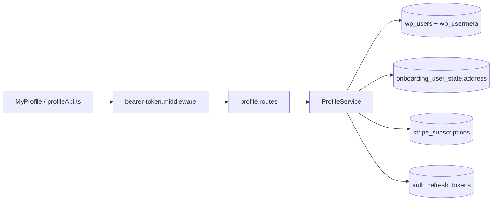

# Perfil da conta no backend Node

Documentacao para **implementar** as rotas de My Profile no `eden-bowls-backend`.

Hoje **nenhuma** rota `/api/v1/profile*` existe em `src/app.js`. O front ainda chama o WordPress (`/custom/v1/profile*`) com o mesmo JWT emitido pelo Node.

Identidade: **JWT**. Nao ha `session_id`. Nao ha `x-session-token`. Nao ha cookie WP. O usuario e `request.currentUser.id` (claim `data.user.id`).

Analise legado WP: `docs/profile/`.

Contrato do front:

- `eden-bowls/src/pages/dashboard/pages/profile/services/profileApi.ts`
- `eden-bowls/src/pages/dashboard/pages/profile/types/profile.ts`
- `eden-bowls/src/pages/dashboard/pages/profile/hooks/useProfile.ts`
- tela `MyProfile.tsx`

`GET /api/v1/auth/me` **nao** substitui o perfil. Devolve so `user_email` / `user_nicename` / `user_display_name`. A tela precisa de telefone, pais, avatar, endereco, timestamp de senha e `accountStatus`.

## Estado atual

| Rota alvo Node | Metodo | Estado | Front hoje |
|---|---|---|---|
| `/api/v1/profile` | GET | **404** | `GET /custom/v1/profile` |
| `/api/v1/profile/personal` | PUT | **404** | `PUT /custom/v1/profile/personal` |
| `/api/v1/profile/delivery` | PUT | **404** | `PUT /custom/v1/profile/delivery` |
| `/api/v1/profile/email` | PUT | **404** | `PUT /custom/v1/profile/email` |
| `/api/v1/profile/password` | PUT | **404** | `PUT /custom/v1/profile/password` |
| `/api/v1/profile/avatar` | POST | **404** | `POST /custom/v1/profile/avatar` |
| `/api/v1/profile` | DELETE | **404** | `DELETE /custom/v1/profile` |

## Mudanca de modelo

| Aspecto | WordPress (legado) | Node (alvo) |
|---|---|---|
| Identidade | JWT ou cookie WP | so `Authorization: Bearer <jwt>` |
| Sessao de onboarding | nao usava nesta familia | continua **nao** usando |
| Envelope sucesso | `{ success, data }` | igual |
| Envelope erro | `{ code, message, data: { status, field, errors } }` | `{ success: false, message, details: { code, field?, errors? } }` |
| Nome / e-mail / senha | `wp_users` | **igual** (`AuthRepository` ja usa essas tabelas) |
| Telefone / avatar / pwd timestamp | `wp_usermeta` (`billing_phone`, `_eden_*`) | **igual** (usermeta ja e a store de OTP e `cus_`) |
| Endereco rotulado `delivery` | usermeta **billing** WooCommerce | JSON `onboarding_user_state.address` (fonte do checkout) |
| Assinatura ativa | CPT `fsb_subscription` (`active`/`pending`/`on-hold`) | ledger `stripe_subscriptions` (`active`/`trialing`) |
| Logout apos senha | destroi cookies WP; JWT **segue valido** | revogar `auth_refresh_tokens` do user |
| Delete | `wp_delete_user`; Stripe **nao** e chamado | cancelar leftover Stripe + apagar user + revogar refresh |

O front de perfil ainda parseia o envelope WP (`body.code` + `body.data.field` / `body.data.errors`). Ao ligar as rotas Node, `profileApi.ts` tem de passar a ler `details.code` / `details.field` / `details.errors` — o mesmo padrao do error handler em `src/app.js`.

## Rotas cobertas

| Documento | Rota |
|---|---|
| [ROTA_PROFILE.md](./ROTA_PROFILE.md) | `GET /api/v1/profile` |
| [ROTA_PROFILE_PERSONAL.md](./ROTA_PROFILE_PERSONAL.md) | `PUT /api/v1/profile/personal` |
| [ROTA_PROFILE_DELIVERY.md](./ROTA_PROFILE_DELIVERY.md) | `PUT /api/v1/profile/delivery` |
| [ROTA_PROFILE_EMAIL.md](./ROTA_PROFILE_EMAIL.md) | `PUT /api/v1/profile/email` |
| [ROTA_PROFILE_PASSWORD.md](./ROTA_PROFILE_PASSWORD.md) | `PUT /api/v1/profile/password` |
| [ROTA_PROFILE_AVATAR.md](./ROTA_PROFILE_AVATAR.md) | `POST /api/v1/profile/avatar` |
| [ROTA_PROFILE_DELETE.md](./ROTA_PROFILE_DELETE.md) | `DELETE /api/v1/profile` |

## Arquitetura comum



1. `createApp` registra as rotas (ainda **nao** faz).
2. `buildBearerTokenMiddleware` valida JWT em `/api/v1/*`. Sem header, segue sem `request.currentUser`.
3. Toda rota de profile exige `request.currentUser.id` → senao `401 unauthorized`.
4. JWT malformado / expirado / iss errado: middleware `403` (`jwt_auth_bad_auth_header` / `jwt_auth_invalid_token`) **antes** da rota.
5. Mutacoes (personal / delivery / email / password / avatar / delete) tambem chamam `authService.assertCriticalOperationAllowed(userId)`: conta `pending` / `inactive` / `suspended` / `banned` → `403 account_operation_not_allowed`.
6. GET recusa conta `pending` como `GET /api/v1/auth/me` (`401 unauthorized`).

Nao ha `x-session-token`. Nao ha Woo `WC_Customer`. Nao ha CPT `fsb_subscription`.

## Auth

```http
Authorization: Bearer <jwt-de-usuario>
```

JWT: HS256, secret `JWT_AUTH_SECRET_KEY` (mesmo contrato de `src/core/jwt-token.js`), claim `data.user.id`.

Rate limit: so o global Express (`300/min`). As rotas de senha/e-mail **deveriam** ter limite extra na prova de `currentPassword`; o PHP nao tinha.

## Envelope

Sucesso:

```json
{
  "success": true,
  "data": {}
}
```

Erro (error handler de `src/app.js` e rotas que devolvem `details`):

```json
{
  "success": false,
  "message": "Authentication is required.",
  "details": { "code": "unauthorized" }
}
```

Erros de campo (e-mail, senha, delivery) colocam `field` e/ou `errors` dentro de `details`, para o front montar `fieldErrors`.

Codes a preservar (o front de dialogs ja trata):

| code | HTTP | Onde |
|---|---|---|
| `unauthorized` | 401 | sem JWT |
| `jwt_auth_*` | 403 | middleware |
| `account_operation_not_allowed` | 403 | conta bloqueada |
| `validation_error` | 422 | campo obrigatorio / formato |
| `invalid_password` | 422 | senha atual errada |
| `email_taken` | 422 | e-mail de outro user |
| `password_mismatch` | 422 | confirmacao diferente |
| `invalid_mime` / `invalid_image` / `image_too_large` | 422 | avatar |
| `active_subscription` | 422 | delete bloqueado |
| `upload_failed` / `delete_failed` | 500 | IO |

## Persistencia reusada (ja existe)

| Recurso | Tabela / helper | Uso no perfil |
|---|---|---|
| User | `wp_users` | `ID`, `display_name`, `user_email`, `user_pass` |
| Meta | `wp_usermeta` | `_eden_avatar_url`, `_eden_pwd_updated_at`, `_eden_phone_country`, `billing_phone`, `hsr_activation_status`, `_hsr_stripe_customer_id` |
| Endereco | `onboarding_user_state.address` | bloco JSON `delivery` |
| Ledger | `stripe_subscriptions` | `hasActiveSubscription` (`active`/`trialing`) |
| Refresh | `auth_refresh_tokens` | revogar na troca de senha e no delete (`revokeAllForUser`) |
| Senha | `src/core/wordpress-password.js` | `verifyWordpressPassword` / `hashWordpressPassword` |
| Stripe customer | `StripeCustomerStore` | `cus_` na usermeta; nao apagar cobranca no GET |

## Arquivos a criar

- `src/api/routes/profile.routes.js`
- `src/services/profile.service.js`
- `src/infrastructure/repositories/profile.repository.js`
- `tests/profile.routes.test.js`
- `tests/profile.service.test.js`

Registrar em `src/app.js` e wirar em `src/index.js` (DataSource + `AuthService` + `SubscriptionLedgerRepository` + `AuthRefreshTokenRepository` + `StripeBillingClient` + `StripeCustomerStore`).

Avatar: o `express.json({ limit: '1mb' })` global **nao** cabe 3 MiB de binario em Base64. A rota POST avatar precisa de limite proprio (`5mb`) **antes** do parser de 1mb, ou multipart.

## O que nao portar do WP

- Cookie de sessao WP / `is_user_logged_in()`
- `x-session-token` / `session_id`
- CPT `fsb_subscription` e `get_posts`
- `WC()->countries->get_states` — mapa US hardcoded no service
- `wp_delete_user` e hooks Woo (`wc_delete_user_data`)
- Gravatar / `get_avatar_data`
- Envelope `{ code, message, data: { status } }` como unica forma (manter so se o front ainda nao tiver sido atualizado)
