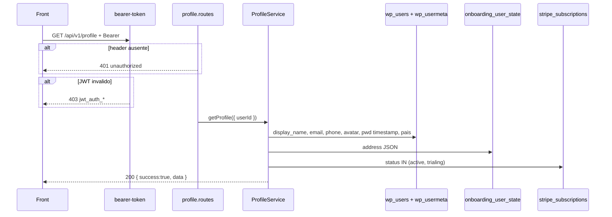

# Rota: ler perfil

## Escopo

Rota alvo no backend Node:

- `GET /api/v1/profile`

Front:

- `eden-bowls/src/pages/dashboard/pages/profile/services/profileApi.ts` (`fetchProfile`)
- `useProfile.ts` (load inicial da tela My Profile)

Rota legado WordPress:

- `GET /custom/v1/profile` — `docs/profile/01-get-profile.md`

## Responsabilidade

Devolver o DTO de conta do usuario autenticado: dados pessoais, endereco de entrega, avatar, timestamp de senha e `accountStatus` (pode apagar a conta?).

Nao persiste nada. Mutacoes sao as rotas irmas.

Nao confundir com `GET /api/v1/auth/me` (identidade curta, sem delivery/avatar/accountStatus).

## Estado de implementacao

| Parte | Status |
|---|---|
| Rota em `src/app.js` | **ausente** (404) |
| JWT 401 / 403 | padrao do middleware + exigir `currentUser.id` |
| Leitura `wp_users` / usermeta | **nao** — helpers de meta ja existem no `AuthRepository` |
| Leitura `onboarding_user_state.address` | **nao** |
| `hasActiveSubscription` no ledger | helper ja existe em `SubscriptionLedgerRepository` |

## Endpoint, controller e permissao

- Path: `/api/v1/profile`
- Method: `GET`
- Query / body: nenhum
- Registrar: `registerProfileRoutes`
- Service: `ProfileService.getProfile({ userId })`

Controller:

1. Sem service → `503`.
2. Sem `request.currentUser.id` → `401 unauthorized`.
3. `getProfile`.
4. `200` `{ success: true, data }`.

## Auth

```http
GET /api/v1/profile
Authorization: Bearer <jwt>
```

Sem JWT: `401`. JWT invalido: `403` no middleware, antes da rota.

Conta `pending`: mesmo criterio de `AuthService.getCurrentUser` → `401 unauthorized`.

Nao aceitar `x-session-token`.

## Fluxo



## Montagem do DTO

Ordem:

1. `id` = `wp_users.ID`.
2. `fullName` = `display_name`, fallback `user_login`.
3. `email` = `user_email`.
4. `phone` = usermeta `billing_phone` (string vazia se ausente).
5. `countryCode` + `availableCountryCodes` = cascade de pais (abaixo).
6. `avatarUrl` = usermeta `_eden_avatar_url` (string vazia → `null`).
7. `passwordLastUpdatedAt` = usermeta `_eden_pwd_updated_at` (`null` se nunca trocou pela API).
8. `delivery` = mapeamento de `onboarding_user_state.address` (campos vazios → `""`).
9. `accountStatus` = `hasActiveSubscription` no ledger.

### Pais do telefone

Whitelist so `BR` / `US` (uppercase). Cascade:

1. usermeta `_eden_phone_country`
2. `onboarding_user_state.address.phone_country`
3. `onboarding_user_state.address.country`
4. usermeta `hsr_market_country` (legado WP)
5. default `'US'`

`availableCountryCodes`: se o pais ja resolveu → `[esse]`; senao → `['BR','US']`. A UI trava a troca BR↔US depois do primeiro valor.

Nao usar `billing_country` / `shipping_country` Woo como fonte primaria. Checkout Node nao grava esses metas.

### Endereco (`delivery`)

Fonte: `onboarding_user_state.address`. **Nao** ler usermeta `billing_*`.

| JSON do perfil | JSON `address` do Node |
|---|---|
| `address` | `street` / `address_line1` |
| `complement` | `complement` / `address_line2` |
| `city` | `city` |
| `state` | `state` (display: US nome uppercase; BR UF uppercase) |
| `zipCode` | `zipcode` / `postal_code` |
| `deliveryInstructions` | `delivery_instructions` |

Pais usado so para formatar estado: `address.country` se `BR`/`US`, senao o cascade do telefone, senao `'US'`.

Estado US: persistido como ISO-2 (`CA`) quando reconhecido; resposta GET = nome EN uppercase (`CALIFORNIA`). Sem WooCommerce — mapa hardcoded de 50 estados no service (sem DC/territorios). Aceitar codigo, nome EN e alias `Nova Iorque` → `NY`. Valor desconhecido → uppercase cru.

BR: `strtoupper` do valor armazenado. Sem validacao de UF.

Linha de state ausente: bloco delivery todo `""`.

### Assinatura ativa

Reusar `SubscriptionLedgerRepository.hasActiveSubscription(userId, email)`:

```sql
SELECT 1 FROM stripe_subscriptions
WHERE user_id = ? AND status IN ('active', 'trialing')
LIMIT 1
```

Fallback por `customer_email` so se o lookup por `user_id` falhar.

**Nao** copiar o CPT WP (`active`/`pending`/`on-hold`). `trialing` **bloqueia** delete (o PHP deixava passar). `on-hold` / `paused` / `incomplete` **nao** bloqueiam.

Tabela ausente (`hasActiveSubscription` devolve `null`): **fail closed** — tratar como assinatura ativa para `canDeleteAccount` (`false`). No PHP, CPT ausente liberava o delete.

```json
{
  "hasActiveSubscription": true,
  "canDeleteAccount": false,
  "deleteRestrictionMessage": "You have an active subscription. Please cancel it before deleting your account."
}
```

Sem assinatura ativa: `canDeleteAccount: true`, `deleteRestrictionMessage: null`. A mesma mensagem e o `422 active_subscription` do DELETE.

## Chamadas externas

Nenhuma HTTP. Sem Stripe API, ViaCEP, e-mail.

| Recurso | Tipo |
|---|---|
| `wp_users` + `wp_usermeta` | leitura |
| `onboarding_user_state` | leitura da coluna `address` |
| `stripe_subscriptions` | `SELECT 1 ... LIMIT 1` |

## Contrato

HTTP `200`:

```json
{
  "success": true,
  "data": {
    "id": 77,
    "fullName": "Jane Doe",
    "email": "jane@example.com",
    "phone": "+1 415 555 0100",
    "countryCode": "US",
    "availableCountryCodes": ["US"],
    "avatarUrl": "https://cdn.example.com/avatars/77.jpg",
    "passwordLastUpdatedAt": "2026-08-19 12:00:00",
    "delivery": {
      "address": "123 Market St",
      "complement": "Apt 4",
      "city": "San Francisco",
      "state": "CALIFORNIA",
      "zipCode": "94103",
      "deliveryInstructions": "Leave at door"
    },
    "accountStatus": {
      "hasActiveSubscription": false,
      "canDeleteAccount": true,
      "deleteRestrictionMessage": null
    }
  }
}
```

`passwordLastUpdatedAt`: datetime `YYYY-MM-DD HH:mm:ss` (o front so exibe a string). Preferir UTC no Node e documentar; se o front ja parseia o formato mysql do WP, manter o mesmo shape.

### Erros

| HTTP | `details.code` | Quando |
|---|---|---|
| 401 | `unauthorized` | sem Bearer / user pendente / user inexistente |
| 403 | `jwt_auth_*` | token ruim (middleware) |
| 503 | — | service / DB |

Usuario autenticado com perfil vazio ainda e `200`.

## O que mudou em relacao ao WordPress

| Antes (WP) | Alvo (Node) |
|---|---|
| `/custom/v1/profile` | `/api/v1/profile` |
| cookie WP opcional | so JWT |
| delivery = billing usermeta | `onboarding_user_state.address` |
| CPT `fsb_subscription` | ledger `active`/`trialing` |
| CPT ausente = pode apagar | tabela ausente = **nao** pode apagar |
| `trialing` nao bloqueava | `trialing` bloqueia |
| 403 JWT via `rest_pre_dispatch` | 403 no `buildBearerTokenMiddleware` |

## Testes

Cobrir: 401 sem JWT; 403 token invalido; cascade de pais; state `CA` → `CALIFORNIA`; BR `sp` → `SP`; address ausente; ledger `trialing` → `canDeleteAccount: false`; tabela ledger ausente → fail closed; `_eden_avatar_url` vazio → `null`.
