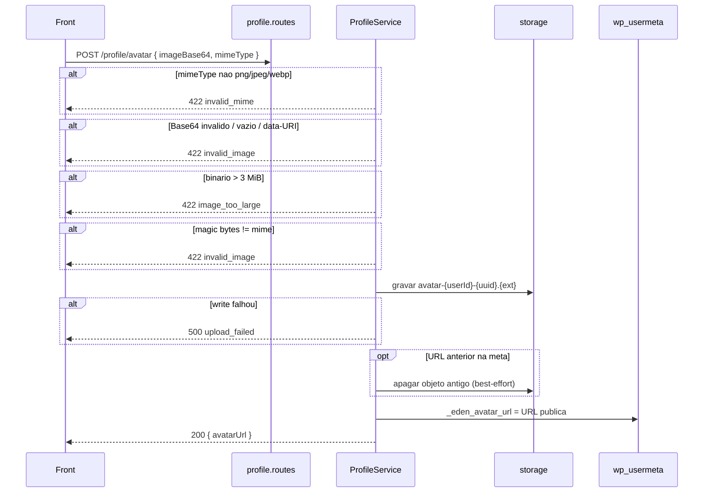

# Rota: upload de avatar

## Escopo

Rota alvo no backend Node:

- `POST /api/v1/profile/avatar` (**so POST**)

Front:

- `uploadAvatar` em `profileApi.ts`
- `useProfile.savePersonal` — se o recorte e data URL, faz split do prefixo `data:...;base64,` e manda **so o Base64** + `mimeType`

Rota legado WordPress:

- `POST /custom/v1/profile/avatar` — `docs/profile/06-post-profile-avatar.md`

Alternativa: `PUT /profile/personal` com `avatarUrl` ja hospedada (ou `null` para remover).

## Responsabilidade

Validar mime/tamanho, gravar o ficheiro (disco local ou object storage) e persistir a URL publica em usermeta `_eden_avatar_url`.

Nao registra attachment WP. Nao e multipart — JSON com Base64.

## Estado de implementacao

| Parte | Status |
|---|---|
| Rota | **ausente** |
| Storage | **nao** ha pasta de uploads no Node |
| Limite JSON global | `express.json({ limit: '1mb' })` em `src/app.js` — **insuficiente** para 3 MiB binario (~4 MiB Base64) |

Antes de implementar: registrar um parser JSON `limit: '5mb'` **so** neste path, **antes** do parser de 1mb, ou o POST morre em 413 sem chegar no handler.

## Endpoint, controller e permissao

- Path: `/api/v1/profile/avatar`
- Method: `POST` only (paridade `CREATABLE`; o front so usa POST)
- Service: `ProfileService.uploadAvatar({ userId, payload })`

JWT obrigatorio. `assertCriticalOperationAllowed`.

## Fluxo



## Validacoes

| # | Regra | HTTP | `details.code` | Message |
|---|---|---|---|---|
| 1 | `mimeType` ∈ `{image/png, image/jpeg, image/webp}` | 422 | `invalid_mime` | `Unsupported image type. Use PNG, JPEG, or WebP.` |
| 2 | Base64 decode ok, length > 0, **sem** prefixo `data:` | 422 | `invalid_image` | `Invalid image data.` |
| 3 | binario `<= 3 * 1024 * 1024` | 422 | `image_too_large` | `Image must be smaller than 3 MB.` |
| 4 | magic bytes batem com o mime declarado | 422 | `invalid_image` | `Invalid image data.` |
| 5 | write storage ok | 500 | `upload_failed` | `Failed to save avatar image.` |

Default `mimeType = image/jpeg` se ausente (paridade PHP).

O front **ja** tira o prefixo data-URI. Rejeitar data-URI no back (virgula / `data:`) como o PHP (`base64_decode` strict).

Nao aceitar SVG. Nao validar dimensoes.

O client tambem recusa ficheiro > 3 MiB **antes** do POST (`ProfilePersonalInfoSection.processFile`).

## Persistencia

| Destino | Valor |
|---|---|
| Storage | `avatar-{userId}-{uuid}.{png\|jpg\|webp}` — **nao** usar `time()` (colisao no mesmo segundo) |
| usermeta `_eden_avatar_url` | URL absoluta HTTPS |

Apagar o objeto apontado pela meta anterior **antes** ou logo apos o write (o PHP vazava ficheiros).

Nao servir upload com `Content-Type` errado. Nao executar HTML polyglot.

Ambiente local: pasta estatica do processo Node (ex. `public/avatars`) **ou** S3. Nao depender de `wp-content/uploads`.

Se o write ok e a meta falhar: nao devolver 200 com URL que o GET nao vai ler — 500.

## Contrato

### Body

```json
{
  "imageBase64": "<base64 sem prefixo data:>",
  "mimeType": "image/jpeg"
}
```

Extensoes: png → `.png`, jpeg → `.jpg`, webp → `.webp`.

### Sucesso (200)

```json
{
  "success": true,
  "data": {
    "avatarUrl": "https://cdn.example.com/avatars/avatar-77-550e8400.jpg"
  }
}
```

### Erros

| HTTP | `details.code` | Quando |
|---|---|---|
| 401 | `unauthorized` | sem JWT |
| 403 | `jwt_auth_*` / `account_operation_not_allowed` | |
| 413 | — | JSON maior que o limit do parser |
| 422 | `invalid_mime` | mime fora da lista |
| 422 | `invalid_image` | Base64 / data-URI / magic bytes |
| 422 | `image_too_large` | binario > 3 MiB |
| 500 | `upload_failed` | storage |

## O que mudou em relacao ao WordPress

| Antes (WP) | Alvo (Node) |
|---|---|
| `wp-content/uploads/eden-avatars/` | storage do Node / S3 |
| `time()` no filename | UUID |
| ficheiro antigo orfao | garbage-collect a URL anterior |
| so confia no `mimeType` do client | magic bytes |
| `file_put_contents` + 200 mesmo se meta falhar | 500 se a meta nao gravar |
| JSON sem limite extra (PHP) | **subir o limit** neste path |

## Testes

data-URI → `invalid_image`; mime `image/gif`; 3 MiB + 1 byte; default jpeg; segundo upload apaga (ou tenta apagar) o primeiro; 401.
