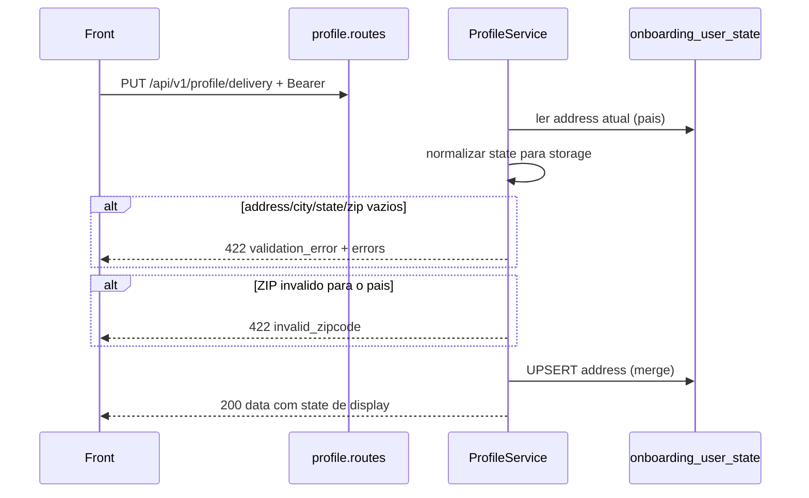

# Rota: atualizar endereco de entrega

## Escopo

Rota alvo no backend Node:

- `PUT /api/v1/profile/delivery` (aceitar tambem `PATCH`)

Front:

- `updateDeliveryInfo` em `profileApi.ts`
- `ProfileDeliverySection` (valida required no client; o back valida de novo)

Rota legado WordPress:

- `PUT|PATCH|POST /custom/v1/profile/delivery` — `docs/profile/03-put-profile-delivery.md`

Checkout que **grava** o mesmo JSON:

- `POST /api/v1/onboarding/address` — [../checkout/ROTA_ONBOARDING_ADDRESS.md](../checkout/ROTA_ONBOARDING_ADDRESS.md)

## Responsabilidade

Persistir rua, complemento, cidade, estado, CEP/ZIP e instrucoes no JSON `onboarding_user_state.address` do `user_id` do JWT.

Nao faz lookup de CEP. Nao cotiza frete. Nao aceita `country` no body — o pais ja esta no address (ou no cascade do GET).

## Estado de implementacao

| Parte | Status |
|---|---|
| Rota | **ausente** |
| UPSERT `address` | reusar `OnboardingZipcodeRepository.saveZipcode` **com merge** (hoje o save **substitui** o JSON inteiro) |
| Validacao ZIP BR/US | **nao** nesta rota no PHP; no Node **alinhar** com `OnboardingZipcodeService` |

## Endpoint, controller e permissao

- Path: `/api/v1/profile/delivery`
- Method: `PUT` e `PATCH`
- Service: `ProfileService.updateDelivery({ userId, payload })`

JWT obrigatorio. `assertCriticalOperationAllowed`.

## Fluxo



## Pais (lido, nao gravado pelo body)

Cascade:

1. `address.country` se `BR`/`US`
2. cascade do telefone (`_eden_phone_country` → `phone_country` → `hsr_market_country`)
3. default `'US'`

A rota **nao** muda o pais. Sem `country` no contrato do front.

## Validacoes

Obrigatorios (mensagem `This field is required.` por campo), depois da normalizacao de estado:

| Campo body | Chave em `details.errors` |
|---|---|
| `address` | `address` |
| `city` | `city` |
| `state` | `state` |
| `zipCode` | `zipCode` |

`complement` e `deliveryInstructions` opcionais. String vazia **sobrescreve** o valor anterior. Campo omitido no PUT tambem vira `""` (nao e PATCH semantico; o PHP era assim e o front manda o bloco inteiro).

Se faltar obrigatorio: HTTP 422, `details.code = validation_error`, message `Required fields are missing.`, `details.errors` = mapa.

ZIP (melhoria vs PHP, alinhada ao checkout Node):

| Pais | Formato |
|---|---|
| BR | 8 digitos (normalizar: so digitos, truncar em 8) |
| US | `NNNNN` ou `NNNNN-NNNN` |

Falha de ZIP: 422 `invalid_zipcode` (o PHP aceitava qualquer string).

Estado US: storage ISO-2 se reconhecido; senao uppercase cru. Resposta: nome uppercase. Aceitar `CA`, `California`, `CALIFORNIA`, `Nova Iorque`. Mapa hardcoded, sem Woo.

BR: storage e resposta = uppercase (`SP`).

## Persistencia

Merge no JSON `address` — **nao** apagar `number`, `neighborhood`, `phone`, `phone_country`, `country` que o checkout ja gravou.

Campos escritos / espelhados:

```json
{
  "street": "<address>",
  "address_line1": "<address>",
  "complement": "<complement>",
  "address_line2": "<complement>",
  "city": "<city>",
  "state": "<stateForStorage>",
  "zipcode": "<zip normalizado>",
  "postal_code": "<zip normalizado>",
  "delivery_instructions": "<deliveryInstructions>"
}
```

UPSERT da linha `onboarding_user_state` se ainda nao existir. Se criar linha nova, preencher `country` pelo cascade (default `US`) para o checkout nao ficar sem pais.

**Nao** gravar usermeta `billing_*` / `shipping_*`. Stripe Customer address **nao** e atualizado aqui (igual ao PHP; divergencia ate um edit/checkout).

## Contrato

### Body

```json
{
  "address": "123 Market St",
  "complement": "Apt 4",
  "city": "San Francisco",
  "state": "California",
  "zipCode": "94103",
  "deliveryInstructions": "Leave at door"
}
```

### Sucesso (200)

```json
{
  "success": true,
  "data": {
    "address": "123 Market St",
    "complement": "Apt 4",
    "city": "San Francisco",
    "state": "CALIFORNIA",
    "zipCode": "94103",
    "deliveryInstructions": "Leave at door"
  }
}
```

`state` na resposta e display, nao o valor em disco.

### Erros

| HTTP | `details.code` | Quando |
|---|---|---|
| 401 | `unauthorized` | sem JWT |
| 403 | `jwt_auth_*` / `account_operation_not_allowed` | |
| 422 | `validation_error` | `details.errors` mapa de obrigatorios |
| 422 | `invalid_zipcode` | CEP/ZIP fora do formato do pais |

## O que mudou em relacao ao WordPress

| Antes (WP) | Alvo (Node) |
|---|---|
| 6 writes em `billing_*` + `_eden_delivery_instructions` | merge em `onboarding_user_state.address` |
| shipping usermeta ficava stale | shipping JSON do state **nao** e tocado (mesmo risco, outra coluna) |
| ZIP sem formato | validar BR 8 digitos / US 5 ou 9 |
| sem `country` no body | igual |

## Testes

`state` `Nova Iorque` → storage `NY` / response `NEW YORK`; BR `sp` → `SP`; zip omitido; complemento `""` apaga; merge preserva `phone` e `country` existentes; ZIP US `9410` → 422.
