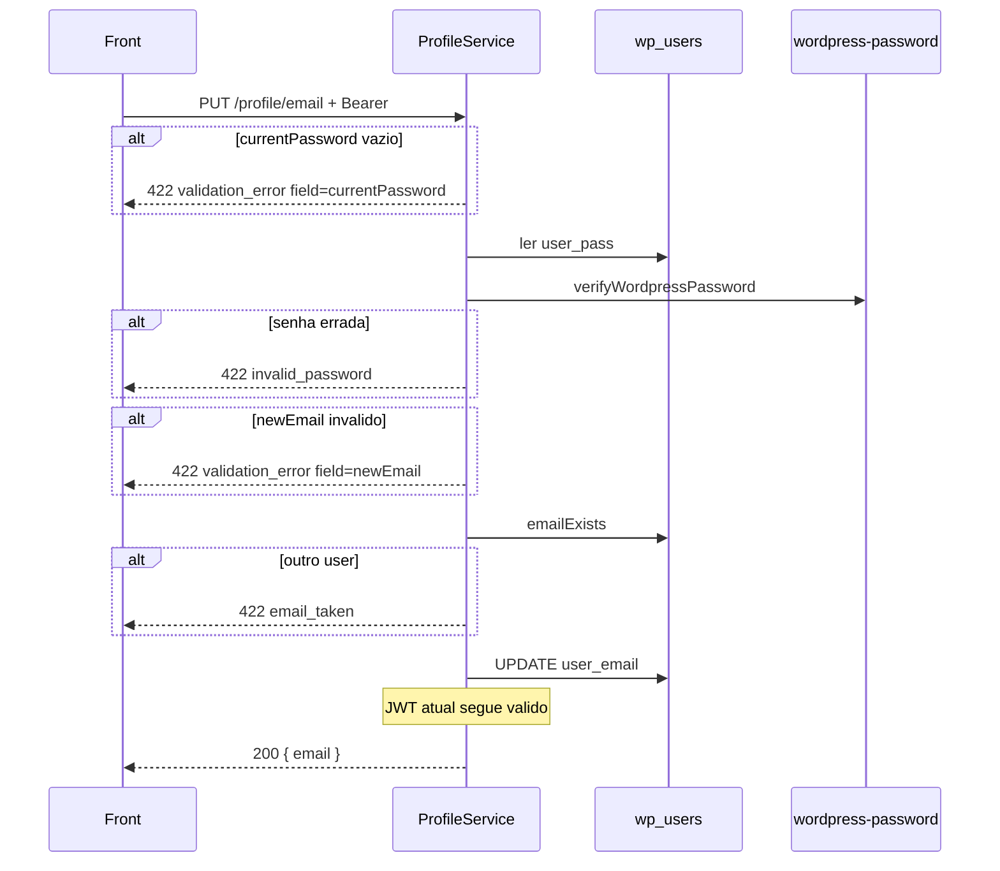

# Rota: trocar e-mail

## Escopo

Rota alvo no backend Node:

- `PUT /api/v1/profile/email` (aceitar tambem `PATCH`)

Front:

- `changeEmail` em `profileApi.ts`
- `ChangeEmailDialog` (mostra `fieldErrors` de `currentPassword` / `newEmail`)

Rota legado WordPress:

- `PUT|PATCH|POST /custom/v1/profile/email` — `docs/profile/04-put-profile-email.md`

Checagem publica (nao substitui esta rota):

- `POST /api/v1/auth/account/email-exists`

## Responsabilidade

Exigir a senha atual, validar unicidade e gravar `wp_users.user_email`.

**Nao** reenvia OTP. **Nao** invalida o access JWT (claim e `data.user.id`).

## Estado de implementacao

| Parte | Status |
|---|---|
| Rota | **ausente** |
| `verifyWordpressPassword` | ja existe (`AuthService.authenticate`) |
| `emailExists` | ja existe (`AuthRepository.emailExists`) |
| `UPDATE user_email` | **nao** |

## Endpoint, controller e permissao

- Path: `/api/v1/profile/email`
- Method: `PUT` e `PATCH`
- Service: `ProfileService.changeEmail({ userId, payload })`

JWT obrigatorio. `assertCriticalOperationAllowed`. Sem rate limit extra (gap: brute force da senha).

`currentPassword` **cru** — nao trim agressivo que quebre caracteres especiais.

## Fluxo



## Validacoes

Ordem **exata** (primeira falha ganha):

| # | Condicao | HTTP | `details.code` | `details.field` | Message |
|---|---|---|---|---|---|
| 1 | `currentPassword` vazio | 422 | `validation_error` | `currentPassword` | `Current password is required.` |
| 2 | hash nao confere | 422 | `invalid_password` | `currentPassword` | `Current password is incorrect.` |
| 3 | e-mail invalido apos normalize | 422 | `validation_error` | `newEmail` | `A valid email address is required.` |
| 4 | outro usuario com o e-mail | 422 | `email_taken` | `newEmail` | `This email address is already in use.` |

Normalize: trim + lowercase para lookup; gravar o e-mail sanitizado.

E-mail ja atual (mesmo user): passa e faz UPDATE no-op. Nao exige OTP no endereco novo (paridade PHP; o front nao espera).

Corrida de dois PATCH: unique em `user_email` (indice WP / `uk`). `ER_DUP_ENTRY` → `email_taken`, nao 500.

Nao atualizar `user_login`, `billing_email`, Stripe `customer.email` neste primeiro corte — documentar como gap se o billing depende do e-mail de contato. Se for barato, `stripe.customers.update(cus_, { email })` via `StripeCustomerStore.getCustomerId` + `StripeBillingClient`.

Nao mandar e-mail de notificacao automatico (o WP core podia; o HSR nao garantia). Se quiser aviso, implementar explicitamente.

## Persistencia

| Destino | Valor |
|---|---|
| `wp_users.user_email` | e-mail novo |

Refresh tokens: **nao** revogar (login seguinte usa o e-mail novo; o access atual continua).

## Contrato

### Body

```json
{
  "currentPassword": "old-secret",
  "newEmail": "jane.new@example.com"
}
```

### Sucesso (200)

```json
{
  "success": true,
  "data": { "email": "jane.new@example.com" }
}
```

### Erros

| HTTP | `details.code` | `details.field` | Quando |
|---|---|---|---|
| 401 | `unauthorized` | — | sem JWT |
| 403 | `jwt_auth_*` / `account_operation_not_allowed` | — | |
| 422 | `validation_error` | `currentPassword` ou `newEmail` | vazio / invalido |
| 422 | `invalid_password` | `currentPassword` | senha atual errada |
| 422 | `email_taken` | `newEmail` | e-mail de outro user |

## O que mudou em relacao ao WordPress

| Antes (WP) | Alvo (Node) |
|---|---|
| `wp_check_password` / `wp_update_user` | `verifyWordpressPassword` + `UPDATE` direto |
| `sanitize_email` + `is_email` | validator proprio (regex/lib), mesmo code |
| `get_user_by('email')` | `emailExists` ja usado no signup |
| `send_email_change_email` do core | nao enviar, a menos que se implemente |
| envelope WP_Error | envelope Node `details.field` |

## Testes

E-mail proprio (200); e-mail de outro (`email_taken`); senha errada vs senha omitida (codes diferentes); e-mail lixo; 401.
