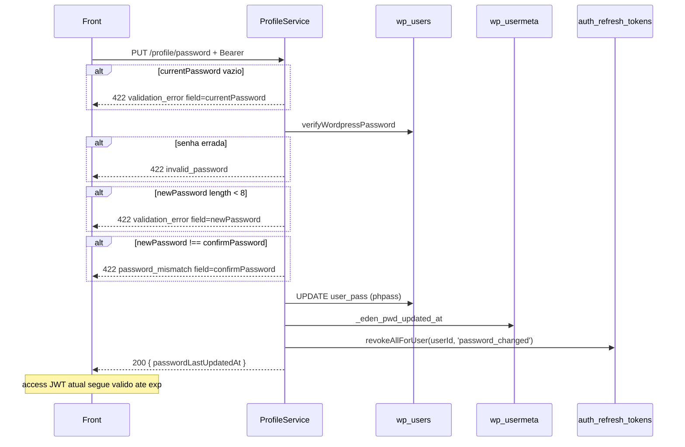

# Rota: trocar senha

## Escopo

Rota alvo no backend Node:

- `PUT /api/v1/profile/password` (aceitar tambem `PATCH`)

Front:

- `changePassword` em `profileApi.ts`
- `ChangePasswordDialog` (`fieldErrors` em `currentPassword` / `newPassword` / `confirmPassword`)
- GET perfil le `passwordLastUpdatedAt`

Rota legado WordPress:

- `PUT|PATCH|POST /custom/v1/profile/password` — `docs/profile/05-put-profile-password.md`

Login (nao troca senha):

- `POST /api/v1/auth/token`

## Responsabilidade

Exigir senha atual, gravar hash novo em `wp_users.user_pass`, timestamp `_eden_pwd_updated_at` e **revogar todos os refresh tokens** do usuario.

Nao emite JWT novo no body. Nao manda e-mail.

## Estado de implementacao

| Parte | Status |
|---|---|
| Rota | **ausente** |
| `verifyWordpressPassword` / `hashWordpressPassword` | ja existem |
| `AuthRefreshTokenRepository.revokeAllForUser` | ja existe (logout usa `revokeFamily`) |
| Write `user_pass` + meta timestamp | **nao** |

## Endpoint, controller e permissao

- Path: `/api/v1/profile/password`
- Method: `PUT` e `PATCH`
- Service: `ProfileService.changePassword({ userId, payload })`

JWT obrigatorio. `assertCriticalOperationAllowed`.

Senhas **cruas** (sem sanitize que altere o valor).

## Fluxo



## Validacoes

Ordem **exata**:

| # | Condicao | HTTP | `details.code` | `details.field` | Message |
|---|---|---|---|---|---|
| 1 | `currentPassword` vazio | 422 | `validation_error` | `currentPassword` | `Current password is required.` |
| 2 | hash nao confere | 422 | `invalid_password` | `currentPassword` | `Current password is incorrect.` |
| 3 | `newPassword.length < 8` | 422 | `validation_error` | `newPassword` | `New password must be at least 8 characters.` |
| 4 | `newPassword !== confirmPassword` | 422 | `password_mismatch` | `confirmPassword` | `New passwords do not match.` |

Length em caracteres JS (`String.length`), nao bytes PHP. `newPassword` vazio cai no passo 3, nao num code `required` proprio.

Nao exige senha nova ≠ atual. Nao exige maiuscula/numero/simbolo (paridade; endurecer e breaking).

`confirmPassword` ausente vira `""` e falha no passo 4 se a nova tiver 8+ chars.

## Persistencia

| Destino | Valor |
|---|---|
| `wp_users.user_pass` | `hashWordpressPassword(newPassword)` (phpass `$P$`/`$H$`, mesmo formato do login) |
| usermeta `_eden_pwd_updated_at` | datetime `YYYY-MM-DD HH:mm:ss` |
| `auth_refresh_tokens` | `revokeAllForUser(userId, 'password_changed', now)` em **todas** as familias |

Proximo `POST /api/v1/auth/token` exige a senha nova. `POST /api/v1/auth/refresh` com cookie antigo → `refresh_token_invalid`.

Access JWT deste request **permanece valido** ate `exp` (nao ha denylist). O buraco do PHP era pior: refresh Node tambem sobrevivia. Este revoke fecha o refresh.

Nao zerar activation key WP alem do hash — o Node nao usa `user_activation_key` no entity.

## Contrato

### Body

```json
{
  "currentPassword": "old-secret",
  "newPassword": "new-secret",
  "confirmPassword": "new-secret"
}
```

### Sucesso (200)

```json
{
  "success": true,
  "data": { "passwordLastUpdatedAt": "2026-08-19 12:00:00" }
}
```

### Erros

| HTTP | `details.code` | `details.field` | Quando |
|---|---|---|---|
| 401 | `unauthorized` | — | sem JWT |
| 403 | `jwt_auth_*` / `account_operation_not_allowed` | — | |
| 422 | `validation_error` | `currentPassword` / `newPassword` | vazio / curta |
| 422 | `invalid_password` | `currentPassword` | senha atual errada |
| 422 | `password_mismatch` | `confirmPassword` | confirmacao diferente |

## O que mudou em relacao ao WordPress

| Antes (WP) | Alvo (Node) |
|---|---|
| `wp_set_password` destroi cookies WP | nao ha cookie WP |
| JWT + refresh Node **seguiam validos** | **revoga todos os refresh** do user |
| `strlen` bytes PHP | `String.length` |
| sem e-mail de "senha mudou" | igual (nao enviar a menos que se peca) |

Este era o gap de seguranca mais grave da familia profile no PHP.

## Testes

Mismatch; 7 vs 8 chars; senha atual errada; persistencia do timestamp; refresh antigo rejeitado apos a troca (`revokeAllForUser` chamado com reason `password_changed`).
