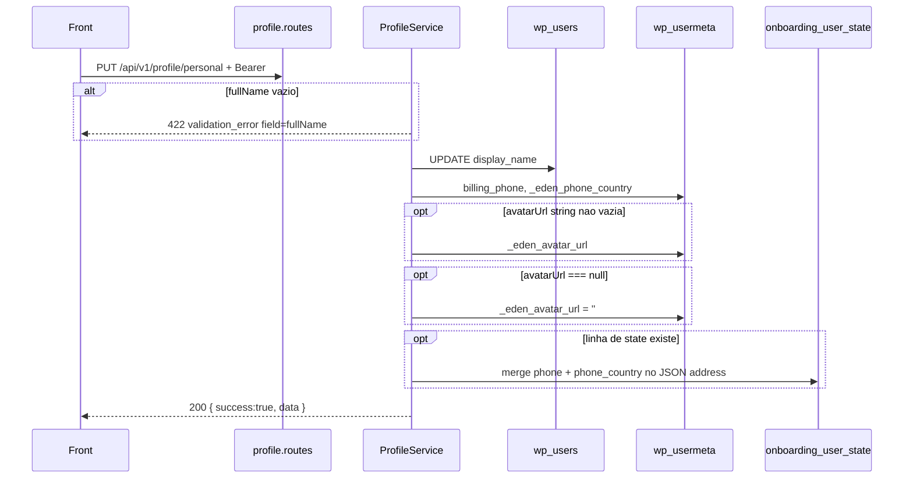

# Rota: atualizar dados pessoais

## Escopo

Rota alvo no backend Node:

- `PUT /api/v1/profile/personal` (aceitar tambem `PATCH`)

Front:

- `updatePersonalInfo` em `profileApi.ts`
- `useProfile.savePersonal` (depois de um eventual upload de avatar)

Rota legado WordPress:

- `PUT|PATCH|POST /custom/v1/profile/personal` — `docs/profile/02-put-profile-personal.md`

## Responsabilidade

Persistir nome, telefone, pais do DDI e (opcionalmente) URL de avatar. Nao devolve o perfil completo — so o subconjunto gravado.

Nao faz upload. Foto nova vai antes para `POST /api/v1/profile/avatar`. Esta rota so grava a URL ja hospedada.

## Estado de implementacao

| Parte | Status |
|---|---|
| Rota | **ausente** |
| JWT + conta ativa | padrao a implementar (`assertCriticalOperationAllowed`) |
| Write `display_name` / metas | **nao** |

## Endpoint, controller e permissao

- Path: `/api/v1/profile/personal`
- Method: `PUT` e `PATCH` (o front usa PUT)
- Registrar: `registerProfileRoutes`
- Service: `ProfileService.updatePersonal({ userId, payload })`

Sem `currentUser.id` → `401`. Conta bloqueada → `403 account_operation_not_allowed`.

## Fluxo



## Validacoes

| # | Regra | Falha |
|---|---|---|
| 1 | `fullName` trim nao vazio | 422 `validation_error`, `details.field = fullName`, `Full name is required.` |
| 2 | `phone` | **nao** valida formato (pode ser `""`) |
| 3 | `countryCode` | **nao** rejeita. Fora de `BR`/`US` ou fora de `availableCountryCodes` → coercao para o primeiro permitido (senao `'US'`) |
| 4 | `avatarUrl` string | persiste se truthy |
| 5 | `avatarUrl` `null` | **limpa** a meta (o PHP nao limpava; o front ja manda `null` para remover foto) |
| 6 | `avatarUrl` omitido / `""` | nao mexe na meta |

Pais ja resolvido: `availableCountryCodes` tem um item — mandar o outro pais e silenciado, nao 422. Mesma trava da UI.

Nao atualizar `user_login`, `first_name`, `last_name`, `user_nicename`.

## Persistencia

| Destino | Campo | Condicao |
|---|---|---|
| `wp_users.display_name` | `fullName` | sempre (se passou validacao) |
| usermeta `billing_phone` | `phone` | sempre (inclusive `""`) |
| usermeta `_eden_phone_country` | pais efetivo | sempre |
| usermeta `_eden_avatar_url` | URL ou `''` | se string truthy ou `null` |
| `onboarding_user_state.address.phone` / `phone_country` | merge | so se a linha ja existir — **nao** criar state so por telefone |

Checar o retorno do `UPDATE` de `wp_users` (o PHP ignorava `WP_Error`).

JWT / refresh: inalterados.

## Contrato

### Body

```json
{
  "fullName": "Jane Doe",
  "phone": "+1 415 555 0100",
  "countryCode": "US",
  "avatarUrl": "https://cdn.example.com/avatars/77.jpg"
}
```

`fullName` obrigatorio. Demais ausentes viram `""`. `avatarUrl` opcional.

### Sucesso (200)

```json
{
  "success": true,
  "data": {
    "fullName": "Jane Doe",
    "phone": "+1 415 555 0100",
    "countryCode": "US",
    "availableCountryCodes": ["US"],
    "avatarUrl": "https://cdn.example.com/avatars/77.jpg"
  }
}
```

`countryCode` na resposta e o **efetivo** (pos-fallback). `avatarUrl` e o valor **atual da meta**.

### Erros

| HTTP | `details.code` | Quando |
|---|---|---|
| 401 | `unauthorized` | sem JWT |
| 403 | `jwt_auth_*` / `account_operation_not_allowed` | token ruim / conta bloqueada |
| 422 | `validation_error` | `fullName` vazio |

## O que mudou em relacao ao WordPress

| Antes (WP) | Alvo (Node) |
|---|---|
| POST+PUT+PATCH (`EDITABLE`) | PUT+PATCH (front usa PUT) |
| `avatarUrl` vazio nao limpa | `null` limpa (paridade com `useProfile`) |
| so usermeta | tambem merge telefone no JSON `address` se existir |
| `wp_update_user` sem checar erro | falha de DB → 500, nao 200 mentiroso |

## Testes

Nome vazio; `countryCode` `br` lowercase; pais fora da lista (coercao, nao 422); `avatarUrl` omitido vs `""` vs `null`; 401.
