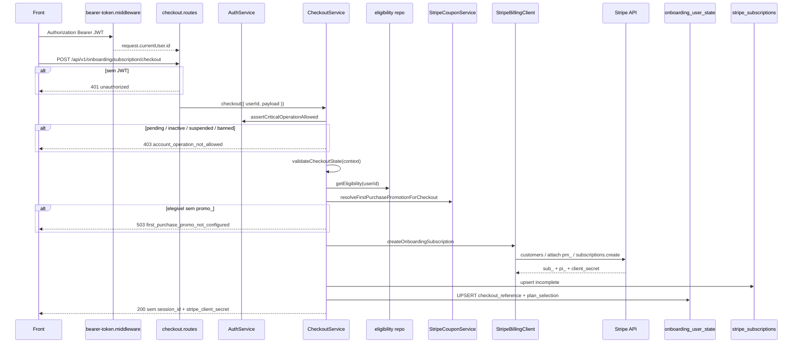

# POST `/api/v1/onboarding/subscription/checkout`

Documentacao de **implementacao** do Place Order no `eden-bowls-backend`.

Escopo: converter o estado autenticado do usuario (plano + endereco + frete) em cobranca Stripe da **primeira fatura**, devolver `stripe_client_secret` para o front confirmar o PaymentIntent, e gravar ledger `incomplete`. A cobranca so fecha no webhook `invoice.paid`.

Origem WP: `docs/subscription-checkout/01-onboarding-subscription-checkout.md`. Nao copiar PHP. Nao recriar sessao.

Stripe (create, tax, cupom, lock, webhook): [04-stripe-create-webhook-e-efeitos.md](./04-stripe-create-webhook-e-efeitos.md).

---

## 1) Identidade da rota

```
POST /api/v1/onboarding/subscription/checkout
```

| Item | Valor Node |
|---|---|
| Path | `/api/v1/onboarding/subscription/checkout` (front ja chama; **sem** `:sessionId`) |
| Metodo | `POST` |
| Auth | JWT obrigatorio (`Authorization: Bearer`) |
| Conta | `authService.assertCriticalOperationAllowed(userId)` |
| Handler | `OnboardingSubscriptionCheckoutService.checkout` |
| Stripe | `StripeBillingClient.createOnboardingSubscription` |
| Validator alvo | Zod no route (aliases `payment_method_id` / `paymentMethodId`) |
| Rate limit proprio | nenhum hoje; alvo: bucket curto por `user_id` (ex. 10/min) — melhoria, nao copia WP |

Objetivo: criar a Subscription Stripe (`payment_behavior: default_incomplete`) com items do snapshot de preco do usuario, anexar PaymentMethod, aplicar cupom de 1a compra se elegivel, injetar frete na 1a invoice (`add_invoice_items`) e devolver `stripe_client_secret`.

Nao confundir com:

- `POST /api/v1/onboarding/subscription/preview` — preview de imposto Stripe Tax, **nao** cria subscription.
- `POST /api/v1/onboarding/plan/preview` — preco de catalogo, sem Stripe.
- `POST /api/v1/onboarding/sales-tax/quote` / `POST /api/v1/onboarding/shipping` — tax/frete no estado; checkout **reusa** shipping e **recalcula** tax na Stripe.
- `POST /api/v1/onboarding/payment-intent/ack` — persiste status do PI **depois** do front confirmar. Nao fecha dominio.
- Woo Store API / `payment_url` — **nao existe** no Node.

### 1.1 Arquivos

Ja existem (alterar, nao recriar):

```text
src/api/routes/onboarding-subscription-checkout.routes.js
src/services/onboarding-subscription-checkout.service.js
src/infrastructure/repositories/onboarding-subscription-checkout.repository.js
src/infrastructure/stripe/stripe-billing-client.js
src/core/checkout-state.js
src/core/first-purchase-discount.js
src/services/stripe-coupon.service.js
src/infrastructure/repositories/onboarding-discount-eligibility.repository.js
src/infrastructure/repositories/subscription-ledger.repository.js
tests/onboarding-subscription-checkout.service.test.js
tests/onboarding-subscription-checkout.routes.test.js
```

Criar:

```text
src/api/validators/onboarding-subscription-checkout.validator.js
src/core/checkout-idempotency.js          # chave + fingerprint
```

---

## 2) Fluxo alvo



### 2.1 Camada HTTP

1. Middleware JWT em `/api/v1/*` preenche `request.currentUser`. Header malformado / token invalido → 403 no middleware (`jwt_auth_bad_auth_header` / `jwt_auth_invalid_token`), **antes** da rota.
2. Sem `currentUser.id` → `401 unauthorized`.
3. Body JSON. Zod (alvo) aceita aliases; campos extras ignorados.
4. `service.checkout({ userId, payload })`.
5. Sucesso → `200 { success: true, data }` **sem** `session_id`.
6. `HttpError` com `details.code` → `{ success: false, message, details }`.

Nao ha `X-Session-Token`. Nao ha cookie de sessao WP. Nao ha `session_id` no path.

`checkout_mode` / `flow` no body: **ignorar**. O Node nao tem fork. Se persistir o campo no JSON, gravar `subscription_first`.

Hoje o service ainda faz `payload.checkout_mode || payload.flow || 'order_first'`. Isso e residual do stub. Corrigir.

### 2.2 Autenticacao

Roda na rota + no service. Ordem alvo:

| # | Regra | HTTP | `code` |
|---|---|---|---|
| 1 | JWT ausente | 401 | `unauthorized` |
| 2 | JWT invalido / header malformado | 403 | `jwt_auth_*` (middleware) |
| 3 | usuario inexistente ou `activation_status` em `pending` \| `inactive` \| `suspended` \| `banned` | 403 | `account_operation_not_allowed` |

Equivalencias WP → Node:

| WP | Node |
|---|---|
| `require_linked_user_session_access` | JWT + `assertCriticalOperationAllowed` |
| `linked_user_id !== current_user_id` | nao existe: o JWT **e** o dono do estado |
| `session_not_found` | estado incompleto vira `422 session_incomplete`, nao 404 de sessao |
| `session_forbidden` | nao usar neste path |
| `customer_inactive` / `hsr_activation_status` | `account_operation_not_allowed` (manter o code Node; o front ja trata 403 de conta) |
| `customer_required` / account-link | nao migrar. Sem JWT nao chega no checkout |
| Rate limit `onboarding_auth` 300/300s por sessao | opcional por `user_id`; o global da API ja cobre |

Origem do JWT: `POST /api/v1/auth/token` (apos OTP). Envelope de erro padrao: ver [../checkout/README.md](../checkout/README.md).

### 2.3 Pipeline comum (antes do create Stripe)

Gate Woo (`woocommerce_required`) **nao existe**. Sem `STRIPE_SECRET_KEY` → `503 stripe_secret_missing`.

1. `getCheckoutContext(userId)` — `plan_selection`, `address`, `shipping`, `recurrence`, `checkout_reference` + pets em `onboarding_pets`.
2. `validateCheckoutState` — falha → 422, **nada gravado**.
3. Revalidar eligibility (nao confiar no GET `/discount/eligibility`).
4. Resolver `promo_` se elegivel (fail-closed).
5. Recalcular `catalog_pricing.discounted_first_month_total` e persistir em `plan_selection`.
6. Resolver items Stripe (`price_` + quantity).
7. Idempotencia / reuse (alvo — hoje **nao** existe): se o usuario ja tem `sub_` `incomplete` no `checkout_reference` com o mesmo fingerprint, devolver o estado persistido (`reused: true`) **sem** novo `subscriptions.create`.
8. `createOnboardingSubscription`.
9. UPSERT ledger `incomplete`.
10. UPSERT `checkout_reference` (+ `plan_selection` se o desconto mudou).

Nao chamar `replace_pets`. O save Node so toca `checkout_reference` e, se houver, `plan_selection`.

Questionnaire: o Node **nao** persiste mais. Nao exigir.

### 2.4 Validacoes de estado (`validateCheckoutState`)

Ja existe em `src/core/checkout-state.js`. Primeira falha hoje agrupa `missing[]` numa unica 422. Manter esse shape (o front casa `code === session_incomplete`). Mensagens por campo podem ir em `details.missing`.

| # | Regra | HTTP | `code` | Quando |
|---|---|---|---|---|
| 1 | pets vazios / todos `deleted_at` | 422 | `session_incomplete` | `missing: ['pets']` |
| 2 | `plan_selection.catalog_pricing` sem `line_items` e sem `subtotal > 0` | 422 | `session_incomplete` | `missing: ['plan_selection']` |
| 3 | address sem `country` + `zipcode` + `state` + `city` | 422 | `session_incomplete` | `missing: ['address']` |
| 4 | shipping sem `rate_id` nem `method_id` | 422 | `session_incomplete` | `missing: ['shipping']` |
| 5 | `recurrence` vazio | 422 | `session_incomplete` | `missing: ['recurrence']` |

Alvo extra (ainda nao no `validateCheckoutState`):

| # | Regra | HTTP | `code` |
|---|---|---|---|
| 6 | `payment_method_id` vazio ou nao comeca com `pm_` | 422 | `invalid_payment_method` |
| 7 | nenhum `price_` mapeado | 422 | `invalid_price_id` |
| 8 | email do usuario (`wp_users.user_email`) invalido | 422 | `invalid_customer_email` |
| 9 | US + `STRIPE_US_AUTOMATIC_TAX` sem `country`+`zipcode` | 422 | `sales_tax_unavailable` |

Shipping e **sempre** exigido no Node atual (nao ha `needs_shipping()` Woo). Manter: o catalogo Eden envia produto fisico.

### 2.5 Revalidacao de desconto de 1a compra

Nao usar o resultado persistido de `GET /api/v1/onboarding/discount/eligibility`. Recalcular no Place Order.

Hoje: `discountEligibilityRepository.getEligibility(userId)` + `stripeCouponService.resolveFirstPurchasePromotionForCheckout`.

Regras:

1. `hasPreviousPurchase` — **alvo:** nao contar checkout incompleto. Woo `pending` / `on-hold` **nao** deve queimar o cupom. Fonte preferida: ledger `stripe_subscriptions` com status `active`/`trialing` **ou** `checkout_reference.payment_state === paid`. A query atual em `wp_posts` (pedido Woo) e legado; manter so como fallback se a tabela existir, **excluindo** pending.
2. `hasActiveSubscription` — ja le `stripe_subscriptions` (Node) depois `wp_hsr_stripe_subscriptions` (WP). Tabela ausente = sem assinatura (elegivel). Manter.
3. Motivos: `HAS_PREVIOUS_PURCHASE` (prioridade) ou `HAS_ACTIVE_SUBSCRIPTION`. Inelegibilidade **nao** e HTTP 4xx; `eligible=false` e checkout **sem** `discounts`.

Percentual (`src/core/first-purchase-discount.js`):

| `subscription_term_months` | % |
|---|---|
| 6 | 40 |
| 3 | 25 |
| 1 | 10 |
| outro | 0 (e, se elegivel, 503 — prazo invalido) |

`discounted_first_month_total = round(subtotal * (1 - percent/100), 2)` em `plan_selection.catalog_pricing`.

O front **nao** manda cupom. Sem campo de promocao no body.

Detalhe do apply Stripe: [../coupons/STRIPE_COUPONS_FIRST_PURCHASE.md](../coupons/STRIPE_COUPONS_FIRST_PURCHASE.md) e [04](./04-stripe-create-webhook-e-efeitos.md).

### 2.6 Fingerprint e idempotencia (alvo)

O PHP hash-eava pets/line items/prazo e **nao** incluia shipping/endereco/tax/`pm_`. Nao copiar esse buraco.

Fingerprint Node (sha256 de JSON canonico):

- `user_id`
- `currency`
- `subtotal`
- `discounted_first_month_total`
- `subscription_term_months`
- line items (`price_id` ou `variation_id`, `quantity`, `line_total`) ordenados
- pets (`id`) ordenados
- shipping (`rate_id`, `method_id`, `cost`)
- address (`country`, `zipcode`, `state`)
- `promotion_code_id` (ou `none`)

Usos:

- invalidar `checkout_reference.stripe_subscription_id` se o contexto mudou;
- reuse: mesma chave + sub `incomplete` → `reused: true` sem novo create;
- metadata Stripe `hsr_items_digest` / equivalente.

`attempt_id`: o front **hoje nao envia**. Nao gerar UUID novo a cada POST (o PHP fazia isso e duplicava `sub_`).

Alvo, nesta ordem:

1. Se `checkout_reference` ja tem `stripe_subscription_id` `incomplete` e o fingerprint bate → reuse.
2. Senao, persistir um `attempt_id` no `checkout_reference` no **primeiro** POST e reusar na Idempotency-Key Stripe.
3. Aceitar `attempt_id` ou header `Idempotency-Key` se o front passar a mandar.

---

## 3) Request / response

### 3.1 Headers

```
POST /api/v1/onboarding/subscription/checkout
Content-Type: application/json
Authorization: Bearer {jwt}
```

Pre-requisitos de jornada (lidos do estado do `user_id`, nao do body):

```
POST /api/v1/onboarding/pets*
POST /api/v1/onboarding/recurrence
POST /api/v1/onboarding/plan-selection   (catalog_pricing.line_items)
POST /api/v1/onboarding/address
POST /api/v1/onboarding/shipping
GET  /api/v1/onboarding/payment-methods  (opcional; reusar pm_)
```

Auth/OTP ja aconteceu **antes** (nao ha account-link).

### 3.2 Body aceito

O front (`runSubscriptionCheckout`) manda so isto:

```json
{
  "billing": {
    "first_name": "Charles",
    "last_name": "Mendes",
    "email": "charles@example.com",
    "phone": "",
    "company": ""
  },
  "payment_method_id": "pm_1NxxxxCard"
}
```

Zod alvo:

| Campo | Aliases | Uso |
|---|---|---|
| `payment_method_id` | `paymentMethodId` | obrigatorio; deve comecar com `pm_` |
| `billing.first_name` | — | nome no customer Stripe |
| `billing.last_name` | — | idem |
| `billing.email` | — | **nao** substitui o email do `wp_users`; so fallback se o user nao tiver email |
| `billing.phone` | — | gravar no `checkout_reference` |
| `billing.company` | — | gravar no `checkout_reference` |
| `attempt_id` | — | opcional; se vier, reusar na Idempotency-Key |
| `checkout_mode` / `flow` | — | **ignorar** |
| `priceId` / `price_id` | — | ignorar; items vem do snapshot |
| `product_id` / `variation_id` / `quantity` | — | legado WP; **nao** aceitar |

### 3.3 Sucesso

Request: o JSON da secao 3.2.

Response `200` (sem `session_id`):

```json
{
  "success": true,
  "data": {
    "order_id": 0,
    "order_key": "",
    "status": "incomplete",
    "total": 87.5,
    "subtotal": 79.0,
    "product_tax": 0.0,
    "shipping_total": 8.5,
    "shipping_tax": 0.0,
    "shipping_total_with_tax": 8.5,
    "currency": "USD",
    "payment_url": "",
    "subscription_ids": [],
    "flexible_subscription_id": 0,
    "stripe_subscription_id": "sub_1Nxxxx",
    "stripe_client_secret": "pi_1Nxxxx_secret_abc",
    "stripe_payment_intent_id": "pi_1Nxxxx",
    "stripe_payment_intent_status": "requires_confirmation",
    "stripe_subscription_status": "incomplete",
    "stripe_sync_error": "",
    "stripe_sync_debug": [],
    "payment_state": "requires_confirmation",
    "has_payment_method": true,
    "reused": false,
    "discount_applied_percent": 25,
    "stripe_promotion_code_id": "promo_xxx",
    "stripe_discount_amount": 19.75,
    "discounts": [{ "promotion_code": "promo_xxx" }]
  }
}
```

Regras de shape:

- **Nunca** devolver `session_id` (teste ja cobre ausencia).
- `order_id` alvo = `0` (hoje `Date.now()` — corrigir). O type TS do front ainda tem `order_id: number`; `0` e valido.
- `payment_url` vazio / omitido. Nao inventar URL Woo.
- `subscription_ids` / `flexible_subscription_id` ficam vazios neste POST. Dashboard le o ledger depois do webhook.
- `data.total` alvo: preferir `latest_invoice.amount_due` da Stripe (o client **ja** usa `invoice.total` / `amount_due`). Nao somar so catalogo local.
- `product_tax` com `STRIPE_US_AUTOMATIC_TAX=true`: imposto real da invoice; placeholder 0 so se a invoice ainda nao tiver tax.
- Front seguinte: `stripe.confirmCardPayment(clientSecret)` e `POST /api/v1/onboarding/payment-intent/ack`.

### 3.4 `payment_state`

Copiar a semantica WP que o `Checkout.tsx` trata, **sem** status Woo:

| Condicao (primeira que casar) | `payment_state` |
|---|---|
| PI `succeeded` / `processing` / `requires_capture` | `paid` |
| PI `requires_payment_method` / `canceled` | `failed` |
| `client_secret` nao vazio | `requires_confirmation` |
| tem `sub_` e tem `pm_` | `requires_confirmation` |
| tem `pm_` sem secret | `pending_sync` |
| senao | `pending_payment_method` |

`StripeBillingClient.resolvePaymentState` ja cobre a maior parte. Quando `paid`, **nao** zerar `stripe_client_secret` no `checkout_reference` ate o ACK (o webhook tambem nao limpa). Na **resposta** HTTP, se ja estiver `paid`, pode omitir o secret.

Nao usar `requires_payment_method` como default de sucesso: o Place Order do front **exige** `pm_`. Sem `pm_` → 422, nao 200.

### 3.5 Erros HTTP

Envelope Node:

```json
{
  "success": false,
  "message": "Authentication is required.",
  "details": { "code": "unauthorized" }
}
```

Casar no front por `details.code` (e `message`). Manter os **mesmos codes** do WP no cutover, com as trocas de auth abaixo.

| HTTP | `code` | Quando |
|---|---|---|
| 401 | `unauthorized` | sem JWT |
| 403 | `account_operation_not_allowed` | conta nao ativa |
| 403 | `jwt_auth_*` | token invalido (middleware) |
| 409 | `checkout_context_mismatch` | fingerprint da sub persistida != atual (reuse recusado) |
| 409 | `payment_method_attached_to_other_customer` | `pm_` ja no outro `cus_` |
| 409 | `concurrent_subscription_create` | lock de create |
| 422 | `session_incomplete` | pets / plan / address / shipping / recurrence |
| 422 | `invalid_payment_method` | sem `pm_` / retrieve falhou |
| 422 | `invalid_price_id` | nenhum Price mapeado |
| 422 | `unmapped_variant` | line especifica sem `price_` (alvo; hoje a line e pulada) |
| 422 | `invalid_customer_email` | email do user invalido |
| 422 | `invalid_promotion_code_id` | `promo_` malformado (defesa; o service ja filtra) |
| 422 | `invalid_subscription_items` | item sem `price_` |
| 422 | `invalid_subscription_items_mixed_cycle_or_currency` | prices misturam moeda/intervalo |
| 422 | `sales_tax_unavailable` | US automatic tax sem address |
| 422 | `shipping_currency_missing` | frete > 0 sem currency |
| 422 | `shipping_amount_invalid` | minor units <= 0 |
| 429 | `rate_limit` | se o bucket proprio existir |
| 502 | `stripe_subscription_failed` | SDK throw / sub ou client_secret vazio |
| 502 | `stripe_customer_failed` | create/retrieve/update sem `cus_` |
| 502 | `stripe_price_retrieve_failed` | `prices.retrieve` throw (check de ciclo) |
| 503 | `stripe_secret_missing` | `STRIPE_SECRET_KEY` vazio |
| 503 | `first_purchase_promo_not_configured` | elegivel e slot `promo_` vazio / prazo invalido |

Nao devolver:

- `woocommerce_required`
- `stripe_subscription_unavailable` (plugin billing WP)
- `order_create_failed` / `checkout_failed` / `invalid_product`
- `session_forbidden` / `session_not_found` neste path

502: mapear `resource_missing`, card errors, `idempotency_error`. Nao devolver secret/stack. O `stripeMessage` atual ainda vaza `error.message` da Stripe — restringir.

Exemplos:

Conta pending:

```json
{
  "success": false,
  "message": "Account is not allowed to perform this operation.",
  "details": { "code": "account_operation_not_allowed" }
}
```

Sem pets:

```json
{
  "success": false,
  "message": "Onboarding checkout is incomplete.",
  "details": { "code": "session_incomplete", "missing": ["pets"] }
}
```

Elegivel 1a compra, `promo_` de 3 meses nao mapeado:

```json
{
  "success": false,
  "message": "First purchase promotion is not configured.",
  "details": { "code": "first_purchase_promo_not_configured" }
}
```

---

## 4) Relacao com o resto do onboarding

Fluxo feliz US (automatic tax on):

```
1. POST /api/v1/onboarding/address
2. POST /shipping/v1/calculate  (ou settings US) + POST /api/v1/onboarding/shipping
3. POST /api/v1/onboarding/subscription/preview   (informativo)
4. POST /api/v1/onboarding/subscription/checkout  ← esta rota
      → customers + attach pm_ + subscriptions.create
        automatic_tax=true + add_invoice_items + promo se 1a compra
      → ledger incomplete + checkout_reference
5. Front confirma PI (Stripe.js)
6. POST /api/v1/onboarding/payment-intent/ack     (otimista)
7. Webhook invoice.paid                           → ledger active + payment_state paid
```

GET de estado do usuario **nao** expoe `stripe_client_secret` no serializer publico. O front guarda o secret desta resposta.

Continua em [02-fluxo-stripe-first.md](./02-fluxo-stripe-first.md).
