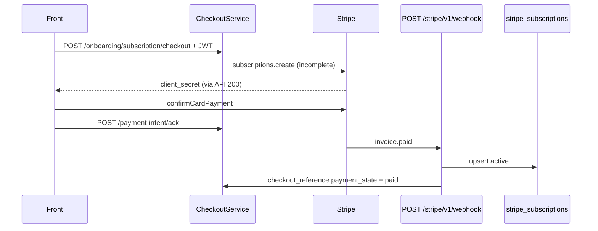

# Stripe create, webhook e efeitos (Node)

Parte da serie `POST /api/v1/onboarding/subscription/checkout`.

- Identidade / contrato HTTP: [01-onboarding-subscription-checkout.md](./01-onboarding-subscription-checkout.md)
- Fluxo Stripe-first: [02-fluxo-stripe-first.md](./02-fluxo-stripe-first.md)
- Ramo Woo descartado: [03-o-que-nao-portar-order-first.md](./03-o-que-nao-portar-order-first.md)

Origem WP: `docs/subscription-checkout/04-stripe-webhook-e-efeitos.md`.

Este arquivo cobre o que acontece **depois** que o service decide criar a subscription: `StripeBillingClient.createOnboardingSubscription`, tax, cupom, idempotencia, persistencia, webhook `invoice.paid` e notas de implementacao.

Entrada unica no Node:

```
OnboardingSubscriptionCheckoutService
  → StripeBillingClient.createOnboardingSubscription
  → ledger.upsert(incomplete)
  → UPSERT checkout_reference
```

Nao ha filter `hsr_checkout_create_stripe_subscription` nem action `hsr_checkout_order_ready_for_stripe_sync`.

Webhook (codigo ja existe): `POST /stripe/v1/webhook` → `StripeWebhookService`. Contrato: [../other-routers/ROTA_STRIPE_WEBHOOK.md](../other-routers/ROTA_STRIPE_WEBHOOK.md).

---

## 1) `StripeBillingClient.createOnboardingSubscription`

Servico: Stripe Billing API (`api.stripe.com`), SDK `stripe` via `createStripeSdk`.

Env (`src/config/env.js` + `.env.example`):

| Env | Uso | Default Node |
|---|---|---|
| `STRIPE_SECRET_KEY` | `api_key` | 503 `stripe_secret_missing` |
| `STRIPE_API_VERSION` | `apiVersion` do client | `2025-09-30.clover` |
| `STRIPE_MAX_RETRIES` | `maxNetworkRetries` | **2** (PHP vazio = 0; nao copiar 0) |
| `STRIPE_US_AUTOMATIC_TAX` | `automatic_tax.enabled` se pais US | **true** |
| `STRIPE_SHIPPING_PRODUCT_ID` | product do `add_invoice_items` / `invoice.created` | vazio → cria `Shipping` `txcd_92010001` na hora |
| `STRIPE_FIRST_PURCHASE_PROMO_1M` / `3M` / `6M` | mapa `promo_` | vazio → 503 se elegivel |
| `STRIPE_WEBHOOK_SECRET` | so o webhook | 503 so naquele path |

`createOnboardingSubscription` **nao** chama `paymentIntents.create` nem `checkout.sessions.create`. O PI nasce da invoice da subscription (`expand: latest_invoice.payment_intent`).

### 1.1 Validacoes iniciais (alvo no client ou no service)

- email valido; senao 422 `invalid_customer_email`
- `paymentMethodId` comeca com `pm_`; senao 422 `invalid_payment_method`
- `promotionCodeId` se presente deve comecar com `promo_`
- `items[]` cada um `price_` + quantity >= 1; senao 422 `invalid_subscription_items`
- `items.length === 0` → 422 `invalid_price_id` (hoje o client usa `session_incomplete` — alinhar o code)

Nao ha `resolve_order_id_for_subscription` Woo. Reuse e pelo `checkout_reference` do `user_id` ([03 §3](./03-o-que-nao-portar-order-first.md)).

### 1.2 Reuse de estado persistido (alvo)

Se `checkout_reference.stripe_subscription_id` existe e PI settled (`succeeded|processing|requires_capture`) **ou** status `active|trialing`:

- fingerprint incompativel → 409 `checkout_context_mismatch`
- senao devolver o estado persistido com `reused: true` **sem** novo `subscriptions.create`
- `paymentIntents.retrieve` para reconciliar status

Se `incomplete` e fingerprint bate: devolver o `client_secret` persistido (ou retrieve).

Hoje **nao** ha reuse. Cada Place Order cria outra `sub_`. Implementar antes de ir a producao.

### 1.3 Chamadas Stripe (ordem feliz)

| # | Recurso | Metodo | Quando | Notas Node |
|---|---|---|---|---|
| 1 | Customers | retrieve `existingCustomerId` | se `StripeCustomerStore` tem `cus_` | **preferir isto** |
| 2 | Customers | `customers.list({ email, limit: 1 })` | so se nao houver `cus_` no store | risco: dois users com o mesmo email compartilham `cus_` — nao usar como chave primaria |
| 3 | Customers | `customers.create` | nenhum `cus_` | `metadata.wp_user_id` + `user_id` |
| 4 | PaymentMethods | `paymentMethods.retrieve` | sempre | 422 se falhar |
| 5 | PaymentMethods | `attach` | PM sem `customer` | se `customer` **outro** `cus_` → 409 |
| 6 | Customers | `customers.update` | sempre apos attach | `invoice_settings.default_payment_method`; se address tiver country+zip: `address` + `shipping` |
| 7 | Prices | `prices.retrieve` | **so se** `items.length > 1` | mesma currency + `recurring.interval` + `interval_count`. Mix → 422. **Falta no client hoje** |
| 8 | Products | retrieve env ou `products.create` | frete > 0 | `ensureShippingProduct`; persistir id em env/ops, nao option WP |
| 9 | Subscriptions | `subscriptions.create` | se nao reuse | ver 1.4 |
| 10 | PaymentIntents | `retrieve` | so no reuse | |

Customer Stripe alvo = `user_id` interno (unique email). Nao fazer `customers.list(email)` se o store ja tem `cus_`.

### 1.4 Body de `subscriptions.create`

Ja montado no client. Alvo (completar metadata):

```json
{
  "customer": "cus_...",
  "items": [
    { "price": "price_meal_chicken", "quantity": 2 }
  ],
  "default_payment_method": "pm_...",
  "payment_behavior": "default_incomplete",
  "expand": ["latest_invoice.payment_intent", "latest_invoice.discounts", "discounts", "items.data.price"],
  "metadata": {
    "wp_user_id": "42",
    "user_id": "42",
    "source": "eden_bowls_node",
    "subscription_term_months": "3",
    "attempt_id": "uuid",
    "checkout_context_fingerprint": "sha256...",
    "shipping_amount_minor": "850",
    "shipping_currency": "usd",
    "shipping_product_id": "prod_...",
    "hsr_promotion_code_id": "promo_..."
  },
  "automatic_tax": { "enabled": true },
  "discounts": [{ "promotion_code": "promo_..." }],
  "add_invoice_items": [
    {
      "price_data": {
        "currency": "usd",
        "product": "prod_shipping",
        "unit_amount": 850,
        "tax_behavior": "exclusive"
      },
      "quantity": 1
    }
  ]
}
```

Regras:

- `payment_behavior: default_incomplete` — a cobranca **nao** confirma sozinha. Front precisa de `confirmCardPayment`.
- `automatic_tax.enabled: true` **somente** se flag on **e** pais US. Sem address `country`+`postal_code` nesse ramo → 422 `sales_tax_unavailable`.
- Flag off + US: neste corte **nao** criar `txr_` Woo. Ver [02 §3](./02-fluxo-stripe-first.md).
- Pais != US: sem `automatic_tax`.
- `discounts` so se `promotionCodeId` comeca com `promo_`.
- Frete na 1a invoice (`add_invoice_items`):
  - flag on: `unit_amount` = so `shipping.cost` (tax do frete a Stripe Tax calcula);
  - flag off (se um dia existir): `unit_amount` = cost + shipping_tax;
  - currency vazia com frete > 0 → 422 `shipping_currency_missing`;
  - major→minor: `Math.round(cost * 100)` (USD/BRL);
  - `unit_amount` <= 0 → 422 `shipping_amount_invalid`.
- Ciclos seguintes **nao** herdam `add_invoice_items`. Frete recorrente = webhook `invoice.created`.

Pos-create, se `subscription.id` **ou** `client_secret` vazio → 502 `stripe_subscription_failed`. Throw do SDK → 502 com mensagem **mapeada**, nao crua.

Hoje o client ja faz o create + shipping metadata. Falta: 422 de tax/address, check de ciclo, Idempotency-Key, `order_id: 0`.

---

## 2) Idempotencia e lock (alvo)

Header Stripe `Idempotency-Key`:

```
eb-sub-create-{userId}-{sha256(email)16}-{itemsDigest16}-{attemptHash16}-{promoScope12}
```

`attemptHash` = primeiros 16 hex de `sha256(attempt_id)`. O `attempt_id` mora em `checkout_reference` e e **estavel** para o mesmo fingerprint.

Lock Node (nao e option WP):

- chave: `checkout-sub-create:{userId}:{attemptHash}`
- TTL 120 s
- concorrencia → 409 `concurrent_subscription_create`
- release no `finally`

Implementacao minima: linha no ledger / coluna `checkout_reference.lock_until` / tabela `stripe_checkout_locks`. Redis nao e requisito deste corte. Stale lock nao pode durar mais que o TTL.

Audit WP `hsr_idempotency_audit` (cap 5000) **nao** portar. Log estruturado no logger da API basta.

---

## 3) Taxa no ponto de charge

| Cenario | Preview (`subscription/preview`) | Charge (`subscriptions.create`) |
|---|---|---|
| BR / nao-US | rota recusa (so US) | sem `automatic_tax` |
| US + flag on | `invoices.createPreview` + automatic tax | `automatic_tax.enabled=true`; exige ZIP |
| US + flag off | **nao** desalinhado: ou os dois usam preview, ou os dois 422 | nao inventar `WC_Tax` |

`data.total` do checkout Node **deve** ser o `invoice.total` / `amount_due` (o client ja faz). Cupom `once` e Stripe Tax entram nesse numero. Nao somar so `discounted_first_month_total + shipping` e vender como cobrado.

---

## 4) Cupom de 1a compra no charge

Nao ha campo de cupom no body. Apply:

1. Service revalida eligibility (ledger + fallback WP).
2. Percentual fixo por prazo (10/25/40).
3. Resolve `promo_` via `StripeCouponService` (DB `stripe_first_purchase_promos` + env).
4. Stripe recebe `discounts: [{ promotion_code }]`. Duration no Stripe Coupon = `once`.

Elegivel + slot vazio = **503**. Inelegivel segue sem `discounts`. Checkout `incomplete` **nao** conta como compra previa.

Contexto: [../coupons/STRIPE_COUPONS_FIRST_PURCHASE.md](../coupons/STRIPE_COUPONS_FIRST_PURCHASE.md).

---

## 5) Webhook e materializacao

Rota: `POST /stripe/v1/webhook` (fora de `/api/v1`, **sem JWT**). Raw body + `Stripe-Signature`.

Evento canonico de cobranca: `invoice.paid`.

O PHP disparava `hsr_stripe_invoice_paid_confirmed` e criava Woo + Flexible. O Node:

| Evento | Efeito ja no `StripeWebhookService` |
|---|---|
| `invoice.paid` | ledger `active` + `checkout_reference.payment_state = paid`; promove edit pendente se `invoice_id` bater |
| `invoice.created` | se `subscription_cycle` + draft, injeta frete (`addShippingInvoiceItem`) |
| `payment_intent.succeeded` / `processing` | atualiza PI no `checkout_reference` (nao substitui paid) |
| `payment_intent.payment_failed` / `invoice.payment_failed` | `payment_state = failed` se ledger ainda nao `active` |
| `customer.subscription.updated` / `deleted` | status / `cancel_at_period_end` / periodos no ledger |

Dedup: `stripe_webhook_events.event_id` unique. Duplicate → 200 sem reprocessar.

Fonte de verdade de cobranca e o webhook, **nao** o ACK.

Lookup do user (ja implementado, nesta ordem): ledger por `sub_` → `checkout_reference` → `StripeCustomerStore` por `cus_` → `metadata.user_id`.

**Nao** portar `LIKE` no JSON da sessao WP. **Nao** portar `hsr_stripe_subscription_order_map`.

`invoice.created` sem metadata/ledger de shipping = no-op. O Place Order precisa continuar gravando shipping na metadata **e** no ledger (ja faz os dois).

---

## 6) Equivalencia de hooks WP

Nao recriar actions/filters PHP. Mapa para o Express:

| WP | Node |
|---|---|
| `rest_api_init` | `registerOnboardingSubscriptionCheckoutRoutes` em `src/app.js` |
| `determine_current_user` / jwt-auth | `buildBearerTokenMiddleware` |
| `hsr_checkout_create_stripe_subscription` | `StripeBillingClient.createOnboardingSubscription` |
| `hsr_checkout_order_ready_for_stripe_sync` | **nao existe** (sem ramo B) |
| `hsr_stripe_invoice_paid_confirmed` | `StripeWebhookService.handleInvoicePaid` |
| `woocommerce_rest_insert_shop_order_object` | **nao portar** |
| `hsr_flexible_subscription_confirmed_after_payment` | ledger upsert |
| option `hsr_sub_lock_*` | lock por `user_id` + attempt (alvo) |
| transient `stripe_tax_rate_*` | **nao** (sem `txr_` manuais) |
| `get_option(pawbowl_stripe_first_purchase_promos)` | `StripeCouponService` + env |

---

## 7) Dependencias e efeitos colaterais

### 7.1 O que e lido

- Headers: `Authorization` (JWT). Nada de `X-Session-Token`.
- Body: `payment_method_id` / `paymentMethodId`, `billing.*`, opcional `attempt_id`.
- `onboarding_user_state`: `plan_selection`, `address`, `shipping`, `recurrence`, `checkout_reference`.
- `onboarding_pets` (nao deletados).
- `wp_users.user_email` / `display_name`.
- `wp_usermeta._hsr_stripe_customer_id`.
- `stripe_subscriptions` (eligibility + reuse).
- `wp_hsr_stripe_subscriptions` (fallback eligibility).
- Mapa `promo_` + `wp_postmeta` de Price (legado de variacao).
- Env Stripe / automatic tax / shipping product.

Nao ler: sessao HSR, carrinho Woo, `WC_Tax`.

### 7.2 O que e gravado neste POST

| Recurso | Stripe-first Node |
|---|---|
| `plan_selection` (desconto recalculado) | sim |
| `checkout_reference` | sim (`sub_`, PI, secret, totais, `payment_state`) |
| `onboarding_pets` | **nao** (sem `replace_pets`) |
| Pedido Woo | **nao** |
| Stripe Customer / PM attach / Subscription / Invoice / PI | sim |
| `stripe_subscriptions` | sim (`incomplete`) |
| lock de create | alvo |
| `STRIPE_SHIPPING_PRODUCT_ID` em runtime | se criou product (nao persistir em option WP; logar para o ops colar no env) |
| misconfig count do cupom | sim (`incrementMisconfigMetric`) |
| Flexible `fsb_subscription` | **nao** |

### 7.3 Consumidores posteriores

| Consumidor | O que le |
|---|---|
| Front Payment Element | `data.stripe_client_secret` |
| `POST .../payment-intent/ack` | `checkout_reference` do `user_id` |
| `GET .../payment-methods` | `cus_` no store |
| Webhook `invoice.paid` | ledger / `checkout_reference` / metadata `user_id` |
| Webhook `invoice.created` | metadata `shipping_*` + ledger.shipping |
| `GET /api/v1/subscriptions` | ledger por `user_id` |
| Eligibility 1a compra | ledger `active`/`trialing` |

### 7.4 Sem efeitos em

- `POST .../subscription/preview` (nao e chamado; preview nao e reusado no charge).
- Catalogo `plan/preview` (nao recalcula preco; usa snapshot).
- ViaCEP / Nominatim / OSRM (frete ja esta na coluna `shipping`).
- Criacao de Promotion Code (so **aplica** o `promo_` ja mapeado).
- `paymentIntents.create` explicito.

---

## 8) Sequencia pos-checkout



---

## 9) Checklist de implementacao (gaps vs codigo atual)

Ordenado pelo que quebra o usuario:

1. **Exigir `pm_`** no service (422) antes do Stripe.
2. **`order_id: 0`** no objeto `checkout` (parar `Date.now()`).
3. **Default persistido `checkout_mode: subscription_first`**. Ignorar body.
4. **Reuse** da `sub_` `incomplete` + fingerprint completo. Sem isso, retry duplica assinatura.
5. **`attempt_id` estavel** no `checkout_reference` + `Idempotency-Key` no `subscriptions.create`.
6. **Lock** 120s por `(userId, attemptId)` → 409.
7. **Customer por `user_id`** primeiro; `customers.list(email)` so fallback.
8. **Eligibility** nao queima cupom com Woo `pending` / checkout incompleto.
9. **Line sem Price** → 422 `unmapped_variant`.
10. **US sem ZIP** + automatic tax → 422 `sales_tax_unavailable`.
11. **Items > 1**: validar mesma moeda/ciclo.
12. **Zod** no route (`payment_method_id` obrigatorio).
13. **Mapear erros Stripe** (nao vazar message crua).
14. **Nao** devolver `payment_url` Woo / `session_id`.

Nao fazer neste corte:

- segundo client Stripe
- `wc_create_order`
- `txr_` manuais
- session token
- materializar Woo no webhook

---

## 10) Testes minimos

Nao rodar a suíte inteira. Por fatia:

```bash
npx jest --findRelatedTests src/services/onboarding-subscription-checkout.service.js
npx jest --runTestsByPath tests/onboarding-subscription-checkout.routes.test.js
npx jest --findRelatedTests src/infrastructure/stripe/stripe-billing-client.js
npx jest --runTestsByPath tests/stripe-webhook.routes.test.js
```

Cobrir:

- sem JWT → 401
- conta pending → 403 `account_operation_not_allowed`
- sem plan snapshot / pets / shipping / address / recurrence → 422 `session_incomplete`
- sem `pm_` → 422 `invalid_payment_method`
- elegivel sem promo map → 503
- inelegivel cria sub **sem** `discounts`
- mesmo fingerprint + `sub_` incomplete → `reused: true`, um unico `subscriptions.create` (mock)
- fingerprint com shipping diferente → novo create, nao reusa
- US flag on sem ZIP → 422
- BR sem `automatic_tax`
- falha Stripe → 502 (nao 200)
- resposta **sem** `session_id` e com `stripe_client_secret`
- `order_id === 0`
- webhook `invoice.paid` promove ledger uma vez so (idempotente)
- webhook sem JWT nao e 401
