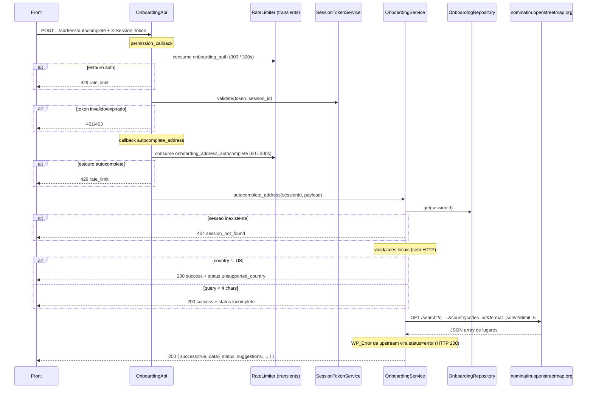

# POST `/onboarding/session/{session_id}/address/autocomplete`

Documentacao da logica **atual** do autocomplete de endereco no onboarding.

Escopo: sugerir ruas a partir de texto livre, **somente Estados Unidos**, via Nominatim (OpenStreetMap). A rota **nao persiste** o endereco na sessao. Persistencia e outra rota: `POST .../zipcode`.

Plugin: `headless-secure-registration`.

Arquivos principais:

- `wp/wp-content/plugins/headless-secure-registration/src/class-onboarding-api.php`
- `wp/wp-content/plugins/headless-secure-registration/src/class-onboarding-service.php`
- `wp/wp-content/plugins/headless-secure-registration/src/class-onboarding-repository.php`
- `wp/wp-content/plugins/headless-secure-registration/src/class-session-token-service.php`
- `wp/wp-content/plugins/headless-secure-registration/src/class-rate-limiter.php`
- `wp/wp-content/plugins/headless-secure-registration/src/class-plugin.php`

Nao ha teste unitario desta rota (diferente de `zipcode/lookup`). A classe `HSR\Shipping\Infrastructure\NominatimClient` **nao** e usada aqui — e o geocode BR do frete.

Namespace REST: `custom/v1`  
Base: `{WP_URL}/wp-json`

---

## 1) Identidade da rota

```
POST /wp-json/custom/v1/onboarding/session/{session_id}/address/autocomplete
```

| Item | Valor |
|---|---|
| Namespace WP | `custom/v1` |
| Metodo | `POST` (`WP_REST_Server::CREATABLE`) |
| Path param | `session_id` — regex `[A-Za-z0-9_-]+` |
| Permission | `OnboardingApi::require_valid_session_access` |
| Handler | `OnboardingApi::autocomplete_address` |
| Servico | `OnboardingService::autocomplete_address` |
| HTTP privado | `OnboardingService::autocomplete_address_us` |
| Registro | `add_action('rest_api_init', [OnboardingApi, 'register_routes'])` |

Objetivo: a partir de um texto de rua (minimo 4 caracteres), devolver ate 6 candidatos US com `street`, `city`, `state`, `zipcode` para o front preencher o formulario.

Nao confundir com:

- `POST .../zipcode/lookup` — ViaCEP / Zippopotam, autocomplete por **CEP/ZIP**, nao por rua
- `POST .../zipcode` — **grava** endereco na sessao (`zipcode_json`)
- `NominatimClient` no shipping — geocode BR (`countrycodes=br`, `limit=1`) para cotacao de frete, com User-Agent

---

## 2) Fluxo completo



### 2.1 Camada REST (`OnboardingApi::autocomplete_address`)

1. Sanitiza `session_id` com `sanitize_text_field`.
2. Consome rate limit **especifico** de autocomplete (`address_autocomplete`, 60 tentativas / 300 s, chave por sessao). Estouro → HTTP `429` (`rate_limit`).
3. Extrai body via `extract_payload`:
   - `get_json_params()` se array nao vazio;
   - senao `get_body_params()` (form-urlencoded).
4. Chama `OnboardingService::autocomplete_address`.
5. Se `WP_Error` → devolve o erro (so `session_not_found` chega aqui a partir do servico).
6. Senao → HTTP `200` com envelope `{ success: true, data: <resultado> }`.

O envelope `success: true` e usado **mesmo** quando `data.status` e `unsupported_country`, `incomplete`, `not_found` ou `error`. Falha de negocio nao e HTTP 4xx/5xx.

Nao ha `RequestValidator` nesta rota. Body vazio nao e 422: cai em `incomplete` (query com length 0).

### 2.2 Autenticacao (`require_valid_session_access`)

Roda **antes** do callback. Ordem:

1. `session_id` vazio → HTTP `403` (`session_forbidden`).
2. Rate limit de auth por sessao:
   - chave: `onboarding_auth`
   - default: `300` tentativas / `300` s
   - env: `HSR_ONBOARDING_AUTH_RATE_LIMIT_MAX`, `HSR_ONBOARDING_AUTH_RATE_LIMIT_WINDOW`
   - filters: `hsr/onboarding_rate_limit_max`, `hsr/onboarding_rate_limit_window`
   - janela efetiva no limiter: `max(60, window)`; tentativas: `max(1, max)`
   - estouro → HTTP `429` (`rate_limit`)
3. Token:
   - preferencial: header `X-Session-Token`
   - fallback: `Authorization: Bearer {token}` (e `HTTP_AUTHORIZATION` / `REDIRECT_HTTP_AUTHORIZATION`)
   - ausente → HTTP `401` (`session_unauthorized`)
4. `SessionTokenService::validate(token, session_id)`:
   - formato/assinatura invalidos → HTTP `401` (`session_token_invalid`)
   - expirado (`exp < now`) ou `sid` vazio → HTTP `401` (`session_token_expired`)
   - token de outra sessao → HTTP `403` (`session_forbidden`)

Origem do token: `POST /custom/v1/onboarding/session/start` → `data.session_token`.  
Assinatura: HMAC-SHA256 do payload base64url, secret `AUTH_KEY` (fallback `wp_salt('auth')`). Filter de TTL na **emissao**: `hsr/onboarding_token_ttl` (env `HSR_ONBOARDING_TOKEN_TTL`, default 172800 s).

Nao exige usuario WP logado. Sessao anonima com token e suficiente.

CORS: `Plugin::allow_rest_cors_headers` adiciona `x-session-token` em `rest_allowed_cors_headers`.

### 2.3 Validacoes de negocio (`OnboardingService::autocomplete_address`)

Sessao precisa existir (`repository->get`). Sem sessao → `WP_Error` HTTP `404` (`session_not_found`).

Diferente de `lookup_zipcode`: aqui a sessao **e** fonte de fallback de `country`. `session.zipcode` (city/state/zip gravados) **nao** e lido — so entram se o front reenviar no body.

Pipeline local, nesta ordem:

| # | Regra | Resultado (`data.status`) | Chama Nominatim? |
|---|---|---|---|
| 1 | Sessao inexistente | HTTP 404 | nao |
| 2 | `country` resolvido != `US` (ex.: `BR`, `CA`, `USA`) | `unsupported_country` | nao |
| 3 | `mb_strlen(query)` < 4 apos `sanitize_text_field` | `incomplete` | nao |
| 4 | Nominatim falhou (timeout, HTTP != 200, `WP_Error`) | `error` | sim |
| 5 | JSON invalido, array vazio, ou todos os hits filtrados | `not_found` | sim |
| 6 | Pelo menos uma suggestion apos filtro/dedup | `found` | sim |

Resolucao de pais:

```
country_input = normalize_country(payload.country ?? session.country)
  // uppercase, remove tudo que nao for A-Z
country = country_input === '' ? 'US' : country_input
```

So o valor exatamente `US` (apos normalize) segue para o Nominatim. Qualquer outro (`BR`, `USA`, `UNITEDSTATES`, `CA`) vira `unsupported_country`.

Implicacao: sessao iniciada com `country=BR` e body sem `country` **nao** autocompleta — mesmo com query US. O front precisa mandar `country: "US"` explicitamente, ou a sessao precisa ser US.

`normalize_country("us")` → `US`. `normalize_country("usa")` → `USA` → unsupported.

Completude da query:

- Contagem com `mb_strlen` (caracteres Unicode, nao bytes).
- Aplica-se **depois** de `sanitize_text_field` (trim, strip tags, colapsa whitespace).
- `"350"` (3 chars) → `incomplete`. `"350 "` → vira `"350"` → `incomplete`. `"5th A"` → `found` path.

Campos opcionais de contexto (nao bloqueiam; so enriquecem o `q` do Nominatim):

| Campo body | Uso |
|---|---|
| `zipcode` | concatenado no fim de `q` |
| `state` | concatenado no `q` |
| `city` | concatenado no `q` |

Nao ha validacao de formato de ZIP nesta rota. `zipcode` entra cru (apos sanitize) na query Nominatim. Nao usa `session.zipcode`.

---

## 3) Chamadas a backends externos

Nao ha chamada a um backend interno PawBowl. Um unico servico publico HTTP. Timeout: **5 segundos** (`wp_remote_get`). Sem API key, sem User-Agent, sem cache.

A classe `HSR\Shipping\Infrastructure\NominatimClient` **nao** e usada. O autocomplete US e inline em `autocomplete_address_us()`.

### 3.1 Estados Unidos — Nominatim (OpenStreetMap)

| Item | Valor |
|---|---|
| Servico | **Nominatim** (instancia publica OSM) |
| Metodo | `GET` |
| Host | `https://nominatim.openstreetmap.org/search` |
| Timeout | 5 s |
| Auth | nenhuma |
| Headers enviados | `Accept: application/json` **apenas** |
| User-Agent | **ausente** (diferente do `NominatimClient` de shipping) |

Query string (`http_build_query`, RFC1738 — espaco vira `+`):

| Param | Valor | Origem |
|---|---|---|
| `q` | `{query} {city} {state} {zipcode}` (partes vazias omitidas, juntas com espaco) | body |
| `countrycodes` | `us` | fixo |
| `addressdetails` | `1` | fixo |
| `format` | `jsonv2` | fixo |
| `limit` | `6` | fixo |

Montagem de `q` (PHP):

```php
$searchQuery = $query;
if ($city !== '')    { $searchQuery .= ' ' . $city; }
if ($state !== '')   { $searchQuery .= ' ' . $state; }
if ($zipcode !== '') { $searchQuery .= ' ' . $zipcode; }
```

Exemplo de request (query `350 5th Ave`, city `New York`, state `NY`, zipcode `10118`):

```http
GET https://nominatim.openstreetmap.org/search?q=350+5th+Ave+New+York+NY+10118&countrycodes=us&addressdetails=1&format=jsonv2&limit=6
Accept: application/json
```

Resposta esperada (HTTP 200 + JSON **array**):

```json
[
  {
    "place_id": 259210009,
    "licence": "Data © OpenStreetMap contributors, ODbL 1.0. http://osm.org/copyright",
    "osm_type": "way",
    "osm_id": 34633854,
    "lat": "40.7484284",
    "lon": "-73.9856546",
    "category": "tourism",
    "type": "attraction",
    "place_rank": 30,
    "importance": 0.7,
    "addresstype": "tourism",
    "name": "Empire State Building",
    "display_name": "Empire State Building, 350, 5th Avenue, Koreatown, Manhattan, New York County, New York, 10118, United States",
    "address": {
      "tourism": "Empire State Building",
      "house_number": "350",
      "road": "5th Avenue",
      "neighbourhood": "Koreatown",
      "suburb": "Manhattan",
      "city": "New York",
      "county": "New York County",
      "state": "New York",
      "ISO3166-2-lvl4": "US-NY",
      "postcode": "10118",
      "country": "United States",
      "country_code": "us"
    },
    "boundingbox": ["40.748", "40.7489", "-73.986", "-73.985"]
  }
]
```

Campos Nominatim **nao** copiados para o contrato: `lat`, `lon`, `osm_id`, `osm_type`, `boundingbox`, `importance`, `licence`. So entram no mapeamento abaixo.

### 3.2 Mapeamento Nominatim → suggestion

Para cada item do array:

| Campo interno | Origem Nominatim | Notas |
|---|---|---|
| `id` | `place_id` | se vazio, `md5(label)` |
| `label` | `display_name` | se vazio, monta `{street}, {city}, {state} {zipcode}, US` |
| `street` | `house_number` + ` ` + `road` | trim. Se vazio, cai em `entry.name` |
| `city` | `address.city` \|\| `town` \|\| `village` \|\| `hamlet` | primeiro nao vazio |
| `state` | ver regra abaixo | |
| `zipcode` | `address.postcode` | passa por `normalize_lookup_postal_input(..., 'US')` |
| `country` | fixo `'US'` | ignora `address.country_code` |
| `neighborhood` | `neighbourhood` \|\| `suburb` \|\| `county` | grafia britanica no OSM |
| `complement` | sempre `''` | |

Regra de `state` (ordem):

1. `address.state` (nome por extenso, ex. `"New York"`).
2. Se `address.state_code` existir e nao for vazio → **substitui** por `strtoupper(state_code)`. Nominatim publico **quase nunca** envia `state_code`.
3. `ISO3166-2-lvl4` (ex. `US-NY` → `NY`) so e usado se `state` **ainda estiver vazio**. Se Nominatim mandou `state: "New York"`, o ISO **nao** e aplicado.

Consequencia: o `state` devolvido costuma ser o **nome por extenso** (`New York`), nao a abreviacao (`NY`) que o lookup Zippopotam devolve. `set_zipcode` faz `strtoupper` no state mas **nao** exige 2 letras.

Filtro duro: a suggestion e **descartada** se `street`, `city`, `state` ou `zipcode` ficar vazio apos o map. Hits sem `postcode` (comum em POIs / cruzamentos) somem.

Dedup: chave = `label` (`display_name`). Primeiro ganha; repetidos saem. Ordem Nominatim e preservada.

`limit=6` e no Nominatim **antes** do filtro. O array final pode ter 0–6 itens.

Normalizacao do `postcode` US (`normalize_lookup_postal_input`):

- so digitos, trunca em 9;
- se length > 5, formata `NNNNN-NNNN` (ZIP+4).

### 3.3 Tratamento de erro do Nominatim

| Condicao | Interno | Exposto ao front |
|---|---|---|
| `wp_remote_get` retorna `WP_Error` (DNS, timeout, TLS) | `WP_Error address_autocomplete_error` status 503 | HTTP **200**, `data.status = error`, message *"Unable to autocomplete address right now."* |
| HTTP status != 200 (inclui 403 sem User-Agent, 429 da politica OSM) | idem 503 | idem `error` |
| JSON invalido ou nao-array | array vazio | HTTP 200, `data.status = not_found` |
| Array vazio `[]` | array vazio | `not_found` |
| Hits todos filtrados (sem postcode/rua/cidade) | array vazio apos loop | `not_found` |

O `WP_Error` interno `address_autocomplete_error` / 503 **nunca** vaza como HTTP 503 nesta rota. E convertido em `data.status = error` no servico, **antes** de voltar para a API.

Nao ha retry. Nao ha circuit breaker. Nao ha cache.

---

## 4) Contrato da rota WP (request / response)

### 4.1 Request

```http
POST /wp-json/custom/v1/onboarding/session/{session_id}/address/autocomplete
Content-Type: application/json
X-Session-Token: {session_token}
```

Body (JSON ou form). Campos lidos:

| Campo | Obrigatorio | Notas |
|---|---|---|
| `query` | efetivo (>= 4 chars) | texto de rua. Abaixo de 4 → `incomplete`, sem HTTP 422. |
| `country` | recomendado | so `US` dispara Nominatim. Fallback: `session.country`, depois default `US`. |
| `city` | opcional | enriquecimento do `q` |
| `state` | opcional | enriquecimento do `q` |
| `zipcode` | opcional | enriquecimento do `q`. Nao ha fallback `postal_code` nesta rota. |

#### Exemplo minimo (US, digitacao)

```json
{
  "query": "350 5th",
  "country": "US"
}
```

#### Exemplo com contexto do ZIP ja lookupado

```json
{
  "query": "350 5th Ave",
  "country": "US",
  "zipcode": "10118",
  "state": "NY",
  "city": "New York"
}
```

#### Exemplo BR (nao chama Nominatim)

```json
{
  "query": "Avenida Paulista",
  "country": "BR"
}
```

### 4.2 Response de sucesso (envelope)

Sempre HTTP `200` quando o servico retorna array:

```json
{
  "success": true,
  "data": {
    "status": "found",
    "country": "US",
    "query": "350 5th Ave",
    "suggestions": [
      {
        "id": "259210009",
        "label": "Empire State Building, 350, 5th Avenue, Koreatown, Manhattan, New York County, New York, 10118, United States",
        "street": "350 5th Avenue",
        "city": "New York",
        "state": "New York",
        "zipcode": "10118",
        "country": "US",
        "neighborhood": "Koreatown",
        "complement": ""
      }
    ],
    "message": "Address suggestions loaded."
  }
}
```

Shape de `data` e **fixo** em todos os status:

| Campo | Tipo | Semantica |
|---|---|---|
| `status` | string | `unsupported_country` \| `incomplete` \| `error` \| `not_found` \| `found` |
| `country` | string | pais resolvido (`US`, `BR`, …) |
| `query` | string | query sanitizada ecoada |
| `suggestions` | array | lista; `[]` quando nao `found` |
| `message` | string | i18n via `__()` text domain `headless-secure-registration` |

Shape de cada item em `suggestions`:

| Campo | Tipo | Semantica |
|---|---|---|
| `id` | string | `place_id` Nominatim ou `md5(label)` |
| `label` | string | `display_name` (texto longo para dropdown) |
| `street` | string | `{house_number} {road}` ou `name` |
| `city` | string | cidade |
| `state` | string | em geral nome por extenso OSM, nao necessariamente UF de 2 letras |
| `zipcode` | string | ZIP US normalizado |
| `country` | string | sempre `"US"` |
| `neighborhood` | string | neighbourhood / suburb / county |
| `complement` | string | sempre `""` |

### 4.3 Exemplos por `data.status`

**`incomplete`** (menos de 4 caracteres):

```json
{
  "success": true,
  "data": {
    "status": "incomplete",
    "country": "US",
    "query": "350",
    "suggestions": [],
    "message": "Type at least 4 characters to search addresses."
  }
}
```

**`unsupported_country`**:

```json
{
  "success": true,
  "data": {
    "status": "unsupported_country",
    "country": "BR",
    "query": "Avenida Paulista",
    "suggestions": [],
    "message": "Address autocomplete is currently available for US only."
  }
}
```

**`not_found`** (Nominatim 200 + sem hits utilizaveis):

```json
{
  "success": true,
  "data": {
    "status": "not_found",
    "country": "US",
    "query": "zzzz street that does not exist",
    "suggestions": [],
    "message": "No address suggestions found."
  }
}
```

**`error`** (Nominatim fora do ar / HTTP != 200) — HTTP ainda 200:

```json
{
  "success": true,
  "data": {
    "status": "error",
    "country": "US",
    "query": "350 5th Ave",
    "suggestions": [],
    "message": "Unable to autocomplete address right now."
  }
}
```

**`found`** — ver secao 4.2.

### 4.4 Erros HTTP reais (fora do envelope)

Formato WP REST: `{ "code", "message", "data": { "status": N } }`.

| HTTP | `code` | Quando |
|---|---|---|
| 401 | `session_unauthorized` | sem token |
| 401 | `session_token_invalid` | assinatura/formato |
| 401 | `session_token_expired` | `exp` vencido |
| 403 | `session_forbidden` | `session_id` vazio ou token de outra sessao |
| 404 | `session_not_found` | sessao nao existe (SQL nem transient legado) |
| 429 | `rate_limit` | auth 300/300s **ou** autocomplete 60/300s |

Exemplo 429:

```json
{
  "code": "rate_limit",
  "message": "Too many requests. Please try again later.",
  "data": { "status": 429 }
}
```

Exemplo 404:

```json
{
  "code": "session_not_found",
  "message": "Onboarding session not found.",
  "data": { "status": 404 }
}
```

---

## 5) Hooks e filters do WordPress

### 5.1 Especificos HSR (esta rota)

| Tipo | Hook | Onde | Efeito |
|---|---|---|---|
| action | `rest_api_init` | `Plugin::boot` | registra a rota |
| filter | `hsr/onboarding_rate_limit_max` | `consume_onboarding_limit` | altera max de **auth** e de **autocomplete**. Args: `($maxAttempts, $scope)` com `$scope` = `auth` ou `address_autocomplete` |
| filter | `hsr/onboarding_rate_limit_window` | idem | altera janela em segundos. `$scope` igual |
| filter | `rest_allowed_cors_headers` | `Plugin::allow_rest_cors_headers` | libera header `x-session-token` no CORS |

Filters de TTL (`hsr/onboarding_token_ttl`, `hsr/onboarding_ttl`) **nao** sao lidos no autocomplete. Token TTL vale na emissao; `hsr/onboarding_ttl` so entra se `repository->get` migrar sessao legado.

O filter `hsr/shipping_nominatim_user_agent` **nao** se aplica aqui. So o `NominatimClient` de shipping o usa.

Filters globais do `RateLimiter` (`hsr/rate_limit_max`, `hsr/rate_limit_window`, env `HSR_RATE_LIMIT_MAX`) **nao** se aplicam: o onboarding usa `consume_with_limits` com valores explicitos.

### 5.2 Core WP envolvidos (indiretos)

| Hook / API | Uso |
|---|---|
| REST API (`register_rest_route`, `permission_callback`) | roteamento e auth |
| `wp_remote_get` / HTTP API | Nominatim. Filters core: `pre_http_request`, `http_request_args`, `http_response` |
| `get_transient` / `set_transient` | rate limit; sessao legado |
| `sanitize_text_field` | path param, query, city, state, zipcode, campos do Nominatim |
| `mb_strlen` | minimo de 4 caracteres na query |
| `__()` | mensagens i18n (`headless-secure-registration`) |

Nao ha `do_action` proprio do autocomplete. Nenhum coupon, Stripe, WooCommerce ou meal-plan entra neste caminho.

---

## 6) Dependencias e efeitos colaterais

### 6.1 O que e lido

- Path: `session_id`.
- Headers: `X-Session-Token` / `Authorization`.
- Body: `query`, `country`, `zipcode`, `state`, `city`.
- Banco: tabela `{prefix}hsr_onboarding_sessions` (`SELECT * WHERE session_id`). Pets **nao** sao necessarios para a logica, mas `get_from_sql` tambem carrega `{prefix}hsr_onboarding_pets`.
- Coluna `country` da sessao: fallback se o body nao mandar `country`.
- Coluna `zipcode_json`: lida como parte da sessao e **ignorada** (city/state/zip do body e que entram no `q`).
- Transient legado: `hsr_onb_{sessionId}` se a linha SQL nao existir.

### 6.2 O que e gravado

| Recurso | Gravado? | Detalhe |
|---|---|---|
| `zipcode_json` / endereco da sessao | **nao** | autocomplete e read-only para endereco |
| `updated_at` da sessao | **nao** (sessao SQL moderna) | |
| Transient de rate limit | **sim** | duas chaves por request autenticado |
| Sessao legado (so transient) | **sim, efeito colateral** | `get()` faz lazy migrate: `save()` no SQL + regrava transient `hsr_onb_*` |

Chaves de rate limit (`RateLimiter::build_session_key`):

```
hsr_rl_{md5('onboarding_auth|{sessionId}')}
hsr_rl_{md5('onboarding_address_autocomplete|{sessionId}')}
```

Payload do transient: `{ "count": N }`, TTL = janela (minimo 60 s). `consume` incrementa **antes** de validar query e **mesmo** em `incomplete` / `unsupported_country`. Token invalido ainda consome o bucket `onboarding_auth` (permission_callback).

Nao ha cache do resultado Nominatim. Cada query >= 4 chars dispara HTTP.

### 6.3 Sem efeitos em

- WooCommerce / pedidos
- Stripe
- usuario WP
- catalogo `custom-meal-plan-builder`
- cotacao de frete / sales tax
- `POST .../zipcode` (front precisa chamar essa depois, com a suggestion escolhida)
- `NominatimClient` / cache de shipping

### 6.4 Dependencia de extensao PHP

`mb_strlen` exige `mbstring`. Sem a extensao, a rota fatura fatal error (nao ha polyfill no plugin). Node deve contar **codepoints Unicode**, nao bytes UTF-8.

---

## 7) Pontos de atencao para reimplementacao em Node

1. **Semantica HTTP vs `data.status`.** O front trata `unsupported_country` / `incomplete` / `not_found` / `error` / `found` dentro de `200 { success: true }`. Nao promover `error` para 503 nem `not_found` para 404 sem coordenar o front. O 503 interno (`address_autocomplete_error`) e propositalmente engolido.

2. **Nao persistir.** Esta rota nao e `set_zipcode`. Gravar a suggestion na sessao aqui quebraria o fluxo (usuario ainda esta escolhendo no dropdown).

3. **Somente US.** BR usa ViaCEP no `zipcode/lookup` (logradouro vem no CEP). Nao apontar Nominatim para BR neste endpoint sem mudar o contrato. `country` diferente de `US` deve devolver `unsupported_country` com `suggestions: []`, nao 422.

4. **Fallback de country e o oposto do lookup.** Lookup **ignora** `session.country`. Autocomplete **usa** `session.country` e, se ambos vazios, default `US`. Sessao BR sem `country` no body bloqueia o autocomplete. Replicar ou documentar a mudanca se o Node unificar as duas rotas.

5. **`USA` != `US`.** `normalize_country` so deixa A-Z. `"usa"` vira `"USA"` → unsupported. Aceitar so ISO-2.

6. **Minimo 4 caracteres Unicode, pos-sanitize.** Debounce no front nao substitui essa regra: request com `"350"` ainda precisa responder `incomplete` e **contar no rate limit**.

7. **Dois rate limits independentes.** Auth 300/300s e autocomplete **60**/300s (mais folgado que o lookup de ZIP, que e 30/300s), ambos por `session_id`, nao por IP. Query incompleta conta.

8. **Timeout 5 s e ausencia de retry.** Retry agressivo estoura o bucket de 60 e a politica do Nominatim publico (~1 req/s, uso identificavel).

9. **User-Agent obrigatorio na pratica.** A rota PHP **nao** envia User-Agent. A politica do Nominatim publico exige UA identificando o app; sem isso a instancia costuma responder **403**, que o PHP mapeia para `status=error`. O `NominatimClient` de shipping ja manda `EdenBowlShipping/1.0 (...)`. No Node: **enviar UA proprio** (e preferir o mesmo client do geocode de frete). Comportamento novo vs PHP, mas necessario para a rota funcionar em producao.

10. **Sem cache hoje.** Cachear `q`→suggestions (TTL curto, chave incluindo city/state/zip) e comportamento **novo**. Unificar com o client Nominatim de shipping evita duas politicas de UA/timeout.

11. **Duplicidade Nominatim.** `autocomplete_address_us` (US, `limit=6`, `addressdetails=1`, sem UA) vs `NominatimClient` (BR, `limit=1`, `addressdetails=0`, com UA e filter). No Node, um client so, com use cases distintos (autocomplete vs geocode de frete).

12. **Filtro de qualidade.** Nao devolver hit sem `street`+`city`+`state`+`postcode`. POI sem CEP some. Dedup por `display_name`.

13. **`state` por extenso vs UF.** Zippopotam devolve `NY`; Nominatim costuma devolver `New York` porque `ISO3166-2-lvl4` so e lido se `state` vier vazio. O front / `set_zipcode` precisa aceitar os dois, ou o Node deve preferir o ISO (`US-NY` → `NY`) **mesmo quando** `address.state` existir — isso seria correcao, nao copia fiel.

14. **`zipcode` no body nao tem alias `postal_code`.** Lookup tem. Autocomplete nao. Nao inventar o alias sem o front.

15. **`limit=6` e no upstream.** Apos filtro pode voltar menos. Nao paginar.

16. **Mensagens i18n.** Strings em ingles no codigo, text domain `headless-secure-registration`. Casar o front em `status`, nao em `message`.

17. **Politica OSM.** Uso da instancia publica e gratuito com limites estritos. Volume de onboarding (digitacao com debounce) pode exigir Nominatim self-hosted, Photon, LocationIQ ou Google Places. Nada disso existe no PHP atual.

18. **Migracao legado.** `repository->get` ainda promove transient `hsr_onb_*` para SQL. No Node, se a sessao ja estiver em Postgres, ignore esse ramo.

19. **Sem testes.** Nao ha `onboarding-service-address-autocomplete-test.php`. Ao reimplementar, cobrir pelo menos: query curta, country BR, Nominatim 503→`error`, JSON vazio→`not_found`, filtro sem postcode, dedup, concatenacao de `q`.

20. **Contrato sugerido na migracao** (`artefatos/migracao-node-reverse-engineering/08-endpoints-rest-sugeridos.md`): `POST /api/v1/onboarding/sessions/:sessionId/address/autocomplete`. Manter o mesmo `data` para o front atual.

---

## 8) Relacao com as outras rotas de endereco

Fluxo US tipico no front:

1. `POST .../zipcode/lookup` — Zippopotam preenche `city` + `state` (UF). `street` fica `""`.
2. `POST .../address/autocomplete` — Nominatim sugere ruas, usando city/state/zip do passo 1 como contexto do `q`.
3. Usuario escolhe uma suggestion.
4. `POST .../zipcode` — **grava** `zipcode_json` (street, city, state, zipcode, neighborhood, …).

Fluxo BR: o passo 2 **nao existe** (`unsupported_country`). A rua vem do ViaCEP no lookup.

Depois de `status = found` e escolha do usuario, o front deve chamar:

```
POST /custom/v1/onboarding/session/{session_id}/zipcode
```

Essa sim grava `zipcode_json`. Exige `country` BR/US, CEP valido, **state e city obrigatorios**. Autocomplete e o passo de preenchimento de rua nos US; save e o passo de checkout.
