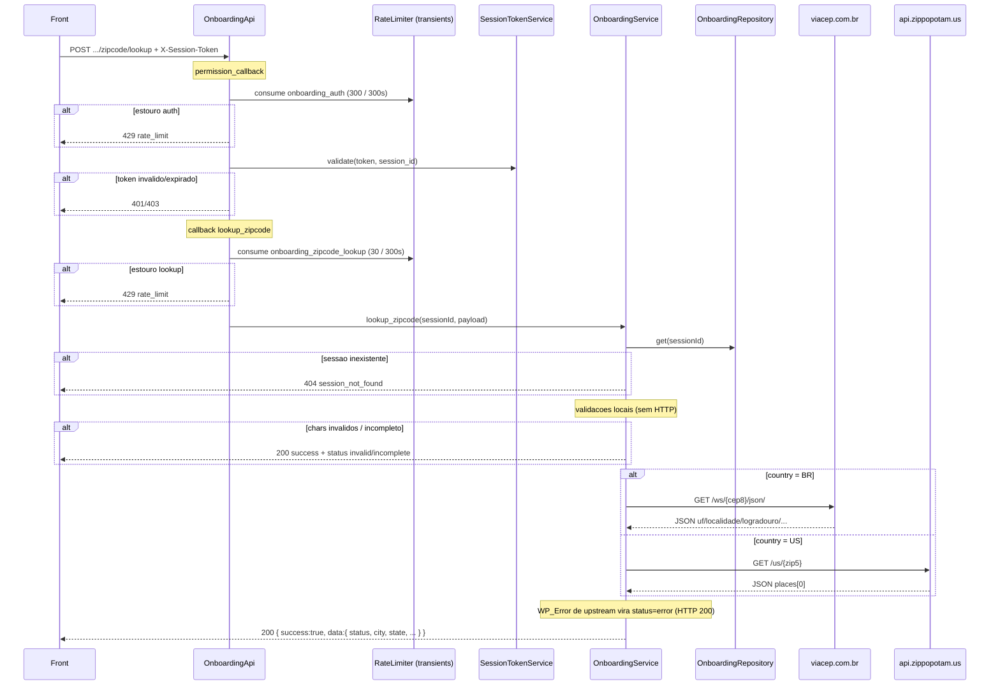

# POST `/onboarding/session/{session_id}/zipcode/lookup`

Documentacao da logica **atual** da consulta de CEP/ZIP no onboarding.

Escopo: autocomplete de endereco a partir do codigo postal. A rota **nao persiste** o endereco na sessao. Persistencia e outra rota: `POST .../zipcode`.

Plugin: `headless-secure-registration`.

Arquivos principais:

- `wp/wp-content/plugins/headless-secure-registration/src/class-onboarding-api.php`
- `wp/wp-content/plugins/headless-secure-registration/src/class-onboarding-service.php`
- `wp/wp-content/plugins/headless-secure-registration/src/class-onboarding-repository.php`
- `wp/wp-content/plugins/headless-secure-registration/src/class-session-token-service.php`
- `wp/wp-content/plugins/headless-secure-registration/src/class-rate-limiter.php`
- `wp/wp-content/plugins/headless-secure-registration/src/class-plugin.php`
- testes: `wp/wp-content/plugins/headless-secure-registration/tests/unit/onboarding-service-zipcode-lookup-test.php`

Namespace REST: `custom/v1`  
Base: `{WP_URL}/wp-json`

---

## 1) Identidade da rota

```
POST /wp-json/custom/v1/onboarding/session/{session_id}/zipcode/lookup
```

| Item | Valor |
|---|---|
| Namespace WP | `custom/v1` |
| Metodo | `POST` (`WP_REST_Server::CREATABLE`) |
| Path param | `session_id` — regex `[A-Za-z0-9_-]+` |
| Permission | `OnboardingApi::require_valid_session_access` |
| Handler | `OnboardingApi::lookup_zipcode` |
| Servico | `OnboardingService::lookup_zipcode` |
| Registro | `add_action('rest_api_init', [OnboardingApi, 'register_routes'])` |

Objetivo: validar o CEP/ZIP digitado (inclusive incompleto, para UX de digitacao progressiva) e, quando completo, consultar um provedor publico e devolver cidade/estado/(rua/bairro no BR).

Nao confundir com:

- `POST .../zipcode` — **grava** endereco na sessao (`zipcode_json`)
- `POST .../address/autocomplete` — Nominatim, somente US, por texto de rua
- `POST .../shipping/quote` — cotacao; no BR usa `ViaCepClient` (outra implementacao, com cache)

---

## 2) Fluxo completo



### 2.1 Camada REST (`OnboardingApi::lookup_zipcode`)

1. Sanitiza `session_id` com `sanitize_text_field`.
2. Consome rate limit **especifico** de lookup (`zipcode_lookup`, 30 tentativas / 300 s, chave por sessao). Estouro → HTTP `429` (`rate_limit`).
3. Extrai body via `extract_payload`:
   - `get_json_params()` se array nao vazio;
   - senao `get_body_params()` (form-urlencoded).
4. Chama `OnboardingService::lookup_zipcode`.
5. Se `WP_Error` → devolve o erro (so `session_not_found` chega aqui a partir do servico).
6. Senao → HTTP `200` com envelope `{ success: true, data: <resultado> }`.

O envelope `success: true` e usado **mesmo** quando `data.status` e `invalid`, `incomplete`, `not_found` ou `error`. Falha de negocio nao e HTTP 4xx/5xx.

### 2.2 Autenticacao (`require_valid_session_access`)

Roda **antes** do callback. Ordem:

1. `session_id` vazio → HTTP `403` (`session_forbidden`).
2. Rate limit de auth por sessao:
   - chave: `onboarding_auth`
   - default: `300` tentativas / `300` s
   - env: `HSR_ONBOARDING_AUTH_RATE_LIMIT_MAX`, `HSR_ONBOARDING_AUTH_RATE_LIMIT_WINDOW`
   - filters: `hsr/onboarding_rate_limit_max`, `hsr/onboarding_rate_limit_window`
   - janela efetiva no limiter: `max(60, window)` tentativas: `max(1, max)`
   - estouro → HTTP `429` (`rate_limit`)
3. Token:
   - preferencial: header `X-Session-Token`
   - fallback: `Authorization: Bearer {token}` (e `HTTP_AUTHORIZATION` / `REDIRECT_HTTP_AUTHORIZATION`)
   - ausente → HTTP `401` (`session_unauthorized`)
4. `SessionTokenService::validate(token, session_id)`:
   - formato/assinatura invalidos → HTTP `401` (`session_token_invalid`)
   - expirado (`exp < now`) ou `sid` vazio → HTTP `401` (`session_token_expired`)
   - token de outra sessao → HTTP `403` (`session_forbidden`)

Origem do token: `POST /custom/v1/onboarding/session/start` → `data.session_token`.  
Assinatura: HMAC-SHA256 do payload base64url, secret `AUTH_KEY` (fallback `wp_salt('auth')`). Filter de TTL na **emissao**: `hsr/onboarding_token_ttl` (env `HSR_ONBOARDING_TOKEN_TTL`, default 172800 s).

Nao exige usuario WP logado. Sessao anonima com token e suficiente.

### 2.3 Validacoes de negocio (`OnboardingService::lookup_zipcode`)

Sessao precisa existir (`repository->get`). Sem sessao → `WP_Error` HTTP `404` (`session_not_found`).

A sessao e **lida**, nao usada como fonte de `country`/`zipcode`. Pais da sessao e ignorado neste lookup (diferente de `set_zipcode`, que faz fallback para `$session['country']`).

Pipeline local, nesta ordem:

| # | Regra | Resultado (`data.status`) | Chama provedor? |
|---|---|---|---|
| 1 | Sessao inexistente | HTTP 404 | nao |
| 2 | Caracteres fora de `[0-9]`, hifen e espaco (`has_invalid_lookup_postal_characters`) | `invalid` | nao |
| 3 | Pais nao informado e nao inferivel (nem 5/9 digitos US, nem >= 8 BR) | `incomplete` (`country` vazio) | nao |
| 4 | CEP/ZIP incompleto para o pais | `incomplete` | nao |
| 5 | Provedor falhou (timeout, HTTP != 200, WP_Error) | `error` | sim |
| 6 | Provedor 404 / `erro: true` / JSON vazio / `state` ou `city` vazios | `not_found` | sim |
| 7 | `state` e `city` preenchidos | `found` | sim |

Resolucao de pais:

```
country_input = normalize_country(payload.country)   // uppercase, so A-Z
se country_input in {BR, US} → usa esse
senao → infer_lookup_country_from_postal_input(zipcode):
  5 ou 9 digitos → US
  >= 8 digitos   → BR
  resto          → ""
```

Qualquer outro valor de `country` (`CA`, `br `, `Brasil`) e descartado e cai na inferencia por quantidade de digitos.

Normalizacao (`normalize_lookup_postal_input`):

- BR: so digitos, trunca em 8, formata `NNNNN-NNN` quando length > 5.
- US: so digitos, trunca em 9, formata `NNNNN-NNNN` quando length > 5.

Completude (`is_lookup_postal_complete`):

- BR: exatamente 8 digitos.
- US: 5 **ou** 9 digitos (ZIP e ZIP+4). ZIP+4 e aceito, mas o lookup US usa so os **5 primeiros**.

---

## 3) Chamadas a backends externos

Nao ha chamada a um backend interno PawBowl. Sao dois servicos publicos HTTP, escolhidos pelo pais. Timeout: **5 segundos** (`wp_remote_get`). Sem API key, sem header custom, sem cache nesta rota.

A classe `HSR\Shipping\Infrastructure\ViaCepClient` **nao** e usada aqui. O lookup BR e inline em `lookup_zipcode_br()`. `ViaCepClient` e do fluxo de cotacao de frete.

### 3.1 Brasil — ViaCEP

| Item | Valor |
|---|---|
| Servico | **ViaCEP** |
| Metodo | `GET` |
| URL | `https://viacep.com.br/ws/{cep8}/json/` |
| `{cep8}` | 8 digitos, sem hifen |
| Payload | nenhum (query na URL) |
| Timeout | 5 s |
| Auth | nenhuma |

Exemplo de request:

```http
GET https://viacep.com.br/ws/01310100/json/
```

Resposta esperada (200 + JSON objeto, sem `erro`):

```json
{
  "cep": "01310-100",
  "logradouro": "Avenida Paulista",
  "complemento": "de 612 a 1510 - lado par",
  "unidade": "",
  "bairro": "Bela Vista",
  "localidade": "São Paulo",
  "uf": "SP",
  "estado": "São Paulo",
  "regiao": "Sudeste",
  "ibge": "3550308",
  "gia": "1004",
  "ddd": "11",
  "siafi": "7107"
}
```

Mapeamento para o contrato interno:

| Campo interno | Campo ViaCEP |
|---|---|
| `state` | `uf` |
| `city` | `localidade` |
| `street` | `logradouro` |
| `neighborhood` | `bairro` |
| `complement` | `complemento` |

Campos ViaCEP nao usados: `ibge`, `gia`, `ddd`, `siafi`, `cep`, `estado`, `regiao`, `unidade`.

Tratamento de erro:

| Condicao | Interno | Exposto ao front |
|---|---|---|
| `wp_remote_get` retorna `WP_Error` (DNS, timeout, TLS) | `WP_Error zipcode_lookup_error` status 503 | HTTP **200**, `data.status = error`, message *"Unable to lookup zip code right now."* |
| HTTP status != 200 | idem 503 | idem `error` |
| JSON invalido ou nao-array | array vazio | HTTP 200, `data.status = not_found` |
| `body.erro` truthy (CEP inexistente) | array vazio | HTTP 200, `data.status = not_found` |
| `uf` ou `localidade` vazios apos map | tratado no servico | HTTP 200, `data.status = not_found` |

ViaCEP tipico para CEP inexistente:

```json
{ "erro": true }
```

### 3.2 Estados Unidos — Zippopotam.us

| Item | Valor |
|---|---|
| Servico | **Zippopotam.us** |
| Metodo | `GET` |
| URL | `https://api.zippopotam.us/us/{zip5}` |
| `{zip5}` | 5 primeiros digitos (ZIP+4 e truncado) |
| Payload | nenhum |
| Timeout | 5 s |
| Auth | nenhuma |

Exemplo de request:

```http
GET https://api.zippopotam.us/us/10001
```

Resposta esperada (200):

```json
{
  "post code": "10001",
  "country": "United States",
  "country abbreviation": "US",
  "places": [
    {
      "place name": "New York",
      "longitude": "-73.9967",
      "state": "New York",
      "state abbreviation": "NY",
      "latitude": "40.7484"
    }
  ]
}
```

Mapeamento: usa **somente** `places[0]`.

| Campo interno | Campo Zippopotam |
|---|---|
| `state` | `state abbreviation` (NY, nao "New York") |
| `city` | `place name` |
| `street` | `""` (sempre) |
| `neighborhood` | `""` (sempre) |
| `complement` | `""` (sempre) |

Se `places` estiver vazio, `state`/`city` ficam vazios → `not_found`.

Tratamento de erro:

| Condicao | Interno | Exposto ao front |
|---|---|---|
| `WP_Error` de HTTP | `zipcode_lookup_error` 503 | HTTP 200, `status = error` |
| HTTP **404** | array vazio (ZIP inexistente) | HTTP 200, `status = not_found` |
| HTTP != 200 e != 404 | `zipcode_lookup_error` 503 | HTTP 200, `status = error` |
| JSON nao-array | array vazio | HTTP 200, `status = not_found` |

Diferenca importante vs ViaCEP: 404 do Zippopotam e `not_found`; 404 (ou qualquer nao-200) do ViaCEP e `error` (503 interno). ViaCEP devolve 200 + `{erro:true}` para CEP inexistente, nao 404.

---

## 4) Contrato da rota WP (request / response)

### 4.1 Request

```http
POST /wp-json/custom/v1/onboarding/session/{session_id}/zipcode/lookup
Content-Type: application/json
X-Session-Token: {session_token}
```

Body (JSON ou form). Campos lidos:

| Campo | Obrigatorio | Notas |
|---|---|---|
| `zipcode` | preferencial | string. Aceita hifen e espacos. |
| `postal_code` | fallback | usado so se `zipcode` ausente. |
| `country` | recomendado | so `BR` ou `US` (case-insensitive apos normalize). Qualquer outro valor e ignorado. |

Nao ha `RequestValidator` nesta rota. Body vazio nao e 422: cai em `incomplete`.

#### Exemplo BR (completo)

```json
{
  "zipcode": "01310-100",
  "country": "BR"
}
```

#### Exemplo US (ZIP+4; lookup usa 10001)

```json
{
  "postal_code": "10001-1234",
  "country": "US"
}
```

#### Exemplo incompleto (digitacao)

```json
{
  "zipcode": "01310",
  "country": "BR"
}
```

### 4.2 Response de sucesso (envelope)

Sempre HTTP `200` quando o servico retorna array:

```json
{
  "success": true,
  "data": {
    "status": "found",
    "country": "BR",
    "zipcode_input": "01310-100",
    "zipcode": "01310-100",
    "is_complete": true,
    "state": "SP",
    "city": "São Paulo",
    "street": "Avenida Paulista",
    "neighborhood": "Bela Vista",
    "complement": "de 612 a 1510 - lado par",
    "message": "Zip code found."
  }
}
```

Shape de `data` e **fixo** em todos os status (campos vazios quando nao encontrados):

| Campo | Tipo | Semantica |
|---|---|---|
| `status` | string | `invalid` \| `incomplete` \| `error` \| `not_found` \| `found` |
| `country` | string | `BR`, `US` ou `""` |
| `zipcode_input` | string | valor cru sanitizado do payload |
| `zipcode` | string | normalizado (ou `""` se invalid/incomplete sem pais) |
| `is_complete` | bool | `true` so depois da regra de completude |
| `state` | string | UF / state abbreviation, uppercase |
| `city` | string | cidade |
| `street` | string | BR: logradouro. US: sempre `""` |
| `neighborhood` | string | BR: bairro. US: sempre `""` |
| `complement` | string | BR: complemento ViaCEP. US: sempre `""` |
| `message` | string | i18n via `__()` text domain `headless-secure-registration` |

### 4.3 Exemplos por `data.status`

**`incomplete`** (CEP BR com 5 digitos, pais enviado):

```json
{
  "success": true,
  "data": {
    "status": "incomplete",
    "country": "BR",
    "zipcode_input": "01310",
    "zipcode": "01310",
    "is_complete": false,
    "state": "",
    "city": "",
    "street": "",
    "neighborhood": "",
    "complement": "",
    "message": "Zip code is incomplete."
  }
}
```

**`invalid`** (letra no codigo):

```json
{
  "success": true,
  "data": {
    "status": "invalid",
    "country": "US",
    "zipcode_input": "12A34",
    "zipcode": "",
    "is_complete": false,
    "state": "",
    "city": "",
    "street": "",
    "neighborhood": "",
    "complement": "",
    "message": "Zip code contains invalid characters."
  }
}
```

**`not_found`** (CEP/ZIP inexistente):

```json
{
  "success": true,
  "data": {
    "status": "not_found",
    "country": "BR",
    "zipcode_input": "00000000",
    "zipcode": "00000-000",
    "is_complete": true,
    "state": "",
    "city": "",
    "street": "",
    "neighborhood": "",
    "complement": "",
    "message": "Zip code not found."
  }
}
```

**`error`** (ViaCEP/Zippopotam fora do ar) — HTTP ainda 200:

```json
{
  "success": true,
  "data": {
    "status": "error",
    "country": "US",
    "zipcode_input": "10001",
    "zipcode": "10001",
    "is_complete": true,
    "state": "",
    "city": "",
    "street": "",
    "neighborhood": "",
    "complement": "",
    "message": "Unable to lookup zip code right now."
  }
}
```

**`found` US** (sem rua/bairro):

```json
{
  "success": true,
  "data": {
    "status": "found",
    "country": "US",
    "zipcode_input": "10001",
    "zipcode": "10001",
    "is_complete": true,
    "state": "NY",
    "city": "New York",
    "street": "",
    "neighborhood": "",
    "complement": "",
    "message": "Zip code found."
  }
}
```

### 4.4 Erros HTTP reais (fora do envelope)

Formato WP REST: `{ "code", "message", "data": { "status": N } }`.

| HTTP | `code` | Quando |
|---|---|---|
| 401 | `session_unauthorized` | sem token |
| 401 | `session_token_invalid` | assinatura/formato |
| 401 | `session_token_expired` | `exp` vencido |
| 403 | `session_forbidden` | `session_id` vazio ou token de outra sessao |
| 404 | `session_not_found` | sessao nao existe (SQL nem transient legado) |
| 429 | `rate_limit` | auth 300/300s **ou** lookup 30/300s |

Exemplo 429:

```json
{
  "code": "rate_limit",
  "message": "Too many requests. Please try again later.",
  "data": { "status": 429 }
}
```

Exemplo 404:

```json
{
  "code": "session_not_found",
  "message": "Onboarding session not found.",
  "data": { "status": 404 }
}
```

O `WP_Error` interno `zipcode_lookup_error` / 503 **nunca** vaza como HTTP 503 nesta rota. E convertido em `data.status = error`.

---

## 5) Hooks e filters do WordPress

### 5.1 Especificos HSR (esta rota)

| Tipo | Hook | Onde | Efeito |
|---|---|---|---|
| action | `rest_api_init` | `Plugin::boot` | registra a rota |
| filter | `hsr/onboarding_rate_limit_max` | `consume_onboarding_limit` | altera max de **auth** e de **lookup**. Args: `($maxAttempts, $scope)` com `$scope` = `auth` ou `zipcode_lookup` |
| filter | `hsr/onboarding_rate_limit_window` | idem | altera janela em segundos. `$scope` igual |

Filters de TTL (`hsr/onboarding_token_ttl`, `hsr/onboarding_ttl`) **nao** sao lidos no lookup. Token TTL vale na emissao; `hsr/onboarding_ttl` so entra se `repository->get` migrar sessao legado (ver abaixo).

Filters globais do `RateLimiter` (`hsr/rate_limit_max`, `hsr/rate_limit_window`, env `HSR_RATE_LIMIT_MAX`) **nao** se aplicam aqui: o onboarding usa `consume_with_limits` com valores explicitos.

### 5.2 Core WP envolvidos (indiretos)

| Hook / API | Uso |
|---|---|
| REST API (`register_rest_route`, `permission_callback`) | roteamento e auth |
| `wp_remote_get` / HTTP API | ViaCEP e Zippopotam. Filters core: `pre_http_request`, `http_request_args`, `http_response` |
| `get_transient` / `set_transient` | rate limit; sessao legado |
| `sanitize_text_field` | path param, zip, campos de endereco do provedor |
| `__()` | mensagens i18n (`headless-secure-registration`) |

Nao ha `do_action` proprio do lookup. Nenhum coupon, Stripe, WooCommerce ou meal-plan entra neste caminho.

---

## 6) Dependencias e efeitos colaterais

### 6.1 O que e lido

- Path: `session_id`.
- Headers: `X-Session-Token` / `Authorization`.
- Body: `zipcode` ou `postal_code`, `country`.
- Banco: tabela `{prefix}hsr_onboarding_sessions` (`SELECT * WHERE session_id`). Pets **nao** sao necessarios para a logica, mas `get_from_sql` tambem carrega `{prefix}hsr_onboarding_pets`.
- Coluna `zipcode_json` e lida como parte da sessao e **ignorada**.
- Transient legado: `hsr_onb_{sessionId}` se a linha SQL nao existir.

### 6.2 O que e gravado

| Recurso | Gravado? | Detalhe |
|---|---|---|
| `zipcode_json` / endereco da sessao | **nao** | lookup e read-only para endereco |
| `updated_at` da sessao | **nao** (sessao SQL moderna) | |
| Transient de rate limit | **sim** | duas chaves por request autenticado |
| Sessao legado (so transient) | **sim, efeito colateral** | `get()` faz lazy migrate: `save()` no SQL + regrava transient `hsr_onb_*` |

Chaves de rate limit (`RateLimiter::build_session_key`):

```
hsr_rl_{md5('onboarding_auth|{sessionId}')}
hsr_rl_{md5('onboarding_zipcode_lookup|{sessionId}')}
```

Payload do transient: `{ "count": N }`, TTL = janela (minimo 60 s). `consume` incrementa **antes** de validar CEP e **mesmo** em lookup incompleto/invalido. Token invalido ainda consome o bucket `onboarding_auth` (permission_callback).

Nao ha cache do resultado ViaCEP/Zippopotam nesta rota. Cada CEP completo dispara HTTP. O cache de ViaCEP existe so no use case de shipping (`WpTransientCache` + `ViaCepClient`).

### 6.3 Sem efeitos em

- WooCommerce / pedidos
- Stripe
- usuario WP
- catalogo `custom-meal-plan-builder`
- cotacao de frete / sales tax
- `POST .../zipcode` (front precisa chamar essa depois, com city/state preenchidos)

---

## 7) Pontos de atencao para reimplementacao em Node

1. **Semantica HTTP vs `data.status`.** O front trata `invalid` / `incomplete` / `not_found` / `error` / `found` dentro de `200 { success: true }`. Nao promover `error` para 503 nem `not_found` para 404 sem coordenar o front. O 503 interno (`zipcode_lookup_error`) e propositalmente engolido.

2. **Nao persistir.** Esta rota nao e `set_zipcode`. Gravar `zipcode` na sessao aqui quebraria o fluxo (usuario ainda esta digitando / conferindo autocomplete).

3. **Enviar `country` no body.** Sem `country`, 5 digitos sao US. Um CEP BR em digitacao (`01310`) vira ZIP completo americano e dispara Zippopotam. Recomendacao Node: exigir `country` (como `set_zipcode` ja exige) **ou** manter a inferencia e documentar o pe. Se o front atual sempre manda `country`, preserve o contrato.

4. **Dois rate limits independentes.** Auth 300/300s e lookup 30/300s, ambos por `session_id`, nao por IP. Lookup incompleto conta. Em Node: Redis/memory com as mesmas chaves semanticas, ou o front pode bater 429 mais cedo.

5. **Timeout 5 s e ausencia de retry.** Um retry agressivo soma com o rate limit de 30 e com o rate limit publico do ViaCEP/Zippopotam.

6. **Sem cache hoje.** Vale cachear CEP→endereco no Node (TTL curto), mas isso e comportamento **novo**. Unificar com o cache do `ViaCepClient` de shipping evita duas fontes.

7. **Duplicidade ViaCEP.** `lookup_zipcode_br` (inline, sem cache, `erro` → `not_found`) vs `ViaCepClient` (erro → `WP_Error` 404 `zipcode_not_found` / 503 `upstream_unavailable`). No Node, um client so, com mapeamento de erro diferente por use case (lookup vs quote).

8. **US nunca preenche rua.** Zippopotam so city/state. Autocomplete de street e `POST .../address/autocomplete` (Nominatim). Nao misturar.

9. **ZIP+4.** Aceito e formatado `10001-1234`, mas a URL usa `/us/10001`. `places[0]` apenas; ZIPs com varias cidades pegam a primeira.

10. **ViaCEP 404 vs Zippopotam 404.** ViaCEP: HTTP != 200 → `error`. Zippopotam: 404 → `not_found`. Replicar essa assimetria se o front diferencia retry vs "CEP invalido".

11. **`state` uppercase + sanitize.** UF/abreviacao passam por `strtoupper(sanitize_text_field(...))`. City/street/neighborhood/complement so `sanitize_text_field` (ViaCEP pode trazer acentos).

12. **Sessao como gate, nao como contexto.** Precisa existir; `session.country` / `session.zipcode` nao influenciam o lookup. Token HMAC precisa casar com o `session_id` da URL.

13. **Mensagens i18n.** Strings em ingles no codigo, traduziveis pelo locale WP. Node deve decidir: locale do request, catalogo de traducoes, ou strings fixas. Nao quebrar se o front compara `message` (melhor casar em `status`).

14. **Chars invalidos antes da completude.** `12A34` e `invalid` mesmo incompleto. Hifen e espaco sao validos. Ponto, letra, underline nao.

15. **Dependencia de terceiros sem SLA.** ViaCEP e Zippopotam sao publicos, sem auth, sujeitos a bloqueio por User-Agent/volume. No Node: User-Agent identificavel, circuit breaker, e fallback (base local de ZIP, BrasilAPI, USPS, etc.) se quiser robustez extra — isso **nao** existe no PHP atual.

16. **Migracao legado.** `repository->get` ainda promove transient `hsr_onb_*` para SQL. No Node, se a sessao ja estiver em Postgres, ignore esse ramo.

17. **Contrato sugerido na migracao** (`artefatos/migracao-node-reverse-engineering/08-endpoints-rest-sugeridos.md`): `POST /api/v1/onboarding/sessions/:sessionId/zipcode/lookup`. Manter o mesmo `data` para o front atual.

---

## 8) Relacao com a rota de persistencia

Depois de `status = found`, o front deve chamar:

```
POST /custom/v1/onboarding/session/{session_id}/zipcode
```

Essa sim grava `zipcode_json` (country, zipcode, state, city, street, number, neighborhood, complement, phone, ...). Exige `country` BR/US, CEP valido, **state e city obrigatorios**. Lookup e o passo de preenchimento; save e o passo de checkout.
