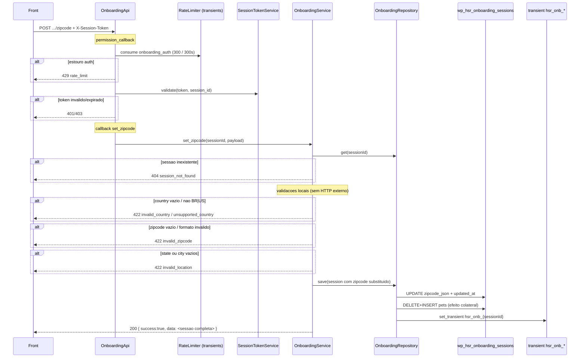

# POST `/onboarding/session/{session_id}/zipcode`

Documentacao da logica **atual** da persistencia de CEP/ZIP + endereco no onboarding.

Escopo: gravar o endereco de entrega na sessao (`zipcode_json`). A rota **nao consulta** provedor de CEP. Lookup e outra rota: `POST .../zipcode/lookup`.

Plugin: `headless-secure-registration`.

Arquivos principais:

- `wp/wp-content/plugins/headless-secure-registration/src/class-onboarding-api.php`
- `wp/wp-content/plugins/headless-secure-registration/src/class-onboarding-service.php`
- `wp/wp-content/plugins/headless-secure-registration/src/class-onboarding-repository.php`
- `wp/wp-content/plugins/headless-secure-registration/src/class-onboarding-schema.php`
- `wp/wp-content/plugins/headless-secure-registration/src/class-session-token-service.php`
- `wp/wp-content/plugins/headless-secure-registration/src/class-rate-limiter.php`
- `wp/wp-content/plugins/headless-secure-registration/src/class-plugin.php`

Nao ha teste unitario desta rota (diferente de `zipcode/lookup`). Smoke: `artefatos/SMOKE_TEST_ONBOARDING_CHECKOUT.md` secao 7.

Namespace REST: `custom/v1`  
Base: `{WP_URL}/wp-json`

---

## 1) Identidade da rota

```
POST /wp-json/custom/v1/onboarding/session/{session_id}/zipcode
```

| Item | Valor |
|---|---|
| Namespace WP | `custom/v1` |
| Metodo | `POST` (`WP_REST_Server::CREATABLE`) |
| Path param | `session_id` — regex `[A-Za-z0-9_-]+` |
| Permission | `OnboardingApi::require_valid_session_access` |
| Handler | `OnboardingApi::set_zipcode` |
| Servico | `OnboardingService::set_zipcode` |
| Validator | nenhum (`RequestValidator` nao e usado) |
| Rate limit proprio | nenhum (so o de auth no permission_callback) |
| Registro | `add_action('rest_api_init', [OnboardingApi, 'register_routes'])` |

Objetivo: validar e persistir o endereco de entrega na sessao de onboarding, para que cotacao de frete, sales tax, checkout e `account-link` leiam `session.zipcode`.

Nao confundir com:

- `POST .../zipcode/lookup` — ViaCEP / Zippopotam, **nao grava** sessao
- `POST .../address/autocomplete` — Nominatim US, **nao grava** sessao
- `POST .../shipping/quote` — consome o `zipcode` ja gravado
- `PUT/PATCH /profile/delivery` — endereco do usuario logado, nao da sessao

---

## 2) Fluxo completo



### 2.1 Camada REST (`OnboardingApi::set_zipcode`)

1. Sanitiza `session_id` com `sanitize_text_field`.
2. Extrai body via `extract_payload`:
   - `get_json_params()` se array nao vazio;
   - senao `get_body_params()` (form-urlencoded).
3. Chama `OnboardingService::set_zipcode`.
4. Se `WP_Error` → devolve o erro (404/422).
5. Senao → HTTP `200` com envelope `{ success: true, data: <sessao> }`.

Diferenca vs `GET .../session/{id}`: o GET passa por `present_session` (subset). Esta rota **nao**. Devolve o objeto interno da sessao, inclusive campos que o GET omite (`linked_user_id`, `package_selection`, `menu_selection`, `stripe_checkout`).

Nao ha rate limit especifico de zipcode. So o bucket `onboarding_auth` do permission_callback.

### 2.2 Autenticacao (`require_valid_session_access`)

Roda **antes** do callback. Ordem:

1. `session_id` vazio → HTTP `403` (`session_forbidden`).
2. Rate limit de auth por sessao:
   - chave: `onboarding_auth`
   - default: `300` tentativas / `300` s
   - env: `HSR_ONBOARDING_AUTH_RATE_LIMIT_MAX`, `HSR_ONBOARDING_AUTH_RATE_LIMIT_WINDOW`
   - filters: `hsr/onboarding_rate_limit_max`, `hsr/onboarding_rate_limit_window`
   - janela efetiva no limiter: `max(60, window)`; tentativas: `max(1, max)`
   - estouro → HTTP `429` (`rate_limit`)
3. Token:
   - preferencial: header `X-Session-Token`
   - fallback: `Authorization: Bearer {token}` (e `HTTP_AUTHORIZATION` / `REDIRECT_HTTP_AUTHORIZATION`)
   - ausente → HTTP `401` (`session_unauthorized`)
4. `SessionTokenService::validate(token, session_id)`:
   - formato/assinatura invalidos → HTTP `401` (`session_token_invalid`)
   - expirado (`exp < now`) ou `sid` vazio → HTTP `401` (`session_token_expired`)
   - token de outra sessao → HTTP `403` (`session_forbidden`)

Origem do token: `POST /custom/v1/onboarding/session/start` → `data.session_token`.  
Assinatura: HMAC-SHA256 do payload base64url, secret `AUTH_KEY` (fallback `wp_salt('auth')`). Filter de TTL na **emissao**: `hsr/onboarding_token_ttl` (env `HSR_ONBOARDING_TOKEN_TTL`, default 172800 s, minimo 1800 s).

CORS: `Plugin::allow_rest_cors_headers` adiciona `x-session-token` em `rest_allowed_cors_headers`.

Nao exige usuario WP logado. Sessao anonima com token e suficiente.

### 2.3 Validacoes de negocio (`OnboardingService::set_zipcode`)

Sessao precisa existir (`repository->get`). Sem sessao → `WP_Error` HTTP `404` (`session_not_found`).

Pipeline, nesta ordem. Toda falha daqui e HTTP 4xx com `WP_Error` (nao envelope `success: true`).

| # | Regra | HTTP | `code` |
|---|---|---|---|
| 1 | Sessao inexistente | 404 | `session_not_found` |
| 2 | `country` vazio apos fallback | 422 | `invalid_country` |
| 3 | `country` nao e `BR` nem `US` | 422 | `unsupported_country` |
| 4 | CEP/ZIP vazio apos normalizar | 422 | `invalid_zipcode` ("Zip code is required.") |
| 5 | Formato invalido para o pais | 422 | `invalid_zipcode` ("Invalid zip code format for selected country.") |
| 6 | `state` ou `city` vazios (apos sanitize) | 422 | `invalid_location` |

Resolucao de pais:

```
country = normalize_country(payload.country ?? session.country)
  → uppercase, trim, so A-Z
se country === "" → 422 invalid_country
se country not in {BR, US} → 422 unsupported_country
```

Diferenca vs lookup: aqui `session.country` e fallback. No lookup o pais da sessao e ignorado e ha inferencia por quantidade de digitos. `"br"` vira `"BR"`. `"Brazil"` vira `"BRAZIL"` → `unsupported_country`. `"CA"` → `unsupported_country`.

Campos obrigatorios de fato: **country**, **zipcode** (ou `postal_code`), **state**, **city**.  
Opcionais (viram `""` se ausentes): `street`/`address_line1`, `number`, `neighborhood`, `complement`/`address_line2`, `phone`, `phone_country`, `delivery_instructions`.

Nao valida:

- rua, numero, bairro (mesmo no BR)
- telefone / DDI
- UF de 2 letras (aceita `"NEW YORK"` apos `strtoupper`)
- se o CEP existe (nao chama ViaCEP/Zippopotam)
- se `country` do body bate com `session.country`
- se ja havia `plan_selection.shipping` (nao invalida cotacao antiga)

### 2.4 Normalizacao do CEP

`zipcodeRaw = sanitize_text_field(payload.zipcode ?? payload.postal_code ?? "")`  
depois `normalize_postal_code(raw, country)`:

| Pais | Normalizacao | Validacao (`is_valid_postal_code`) | Exemplo gravado |
|---|---|---|---|
| BR | so digitos (`\D` removido). **Sem hifen.** | `^\d{8}$` | `"01310100"` |
| US | uppercase; so `[0-9A-Z-]`; demais chars removidos | `^\d{5}(-\d{4})?$` | `"10001"` ou `"10001-1234"` |

Consequencias:

- BR `"01310-100"` / `"01310 100"` → `"01310100"` (ok).
- US `"10001-1234"` → ok (ZIP+4 **com** hifen).
- US `"100011234"` (9 digitos sem hifen) → **invalido**. No lookup, 9 digitos sao formatados e aceitos. Aqui nao.
- US letras (`"ABCDE"`) passam na normalizacao e falham na regex → `invalid_zipcode`.

### 2.5 Objeto gravado (`session.zipcode`)

Substituicao **total**, nao merge. Campos omitidos no body viram string vazia, mesmo que existissem na sessao.

```
session.zipcode = {
  zipcode,            // normalizado
  postal_code,        // copia de zipcode
  country,            // BR | US
  state,              // strtoupper(sanitize_text_field)
  city,               // sanitize_text_field
  street,             // payload.street ?? payload.address_line1
  number,
  neighborhood,
  complement,         // payload.complement ?? payload.address_line2
  phone,
  phone_country,      // so BR|US; senao ""
  delivery_instructions, // sanitize_textarea_field (preserva quebras de linha)
  address_line1,      // copia de street
  address_line2,      // copia de complement
}
```

Nao altera `session.country` nem `session.state` (colunas da sessao, seed do `start`). So o JSON de endereco.

`phone_country` fora de `{BR, US}` e descartado (`""`), sem erro.

---

## 3) Chamadas a backends externos

**Nenhuma.** Esta rota nao fala com ViaCEP, Zippopotam, Nominatim, WooCommerce, Stripe, catalogo `custom-meal-plan-builder`, nem qualquer API interna PawBowl.

O CEP e tratado como dado do cliente. Confianca no front (que em geral preencheu via `zipcode/lookup` e/ou `address/autocomplete`).

I/O desta rota:

| Destino | Operacao |
|---|---|
| MySQL `{prefix}hsr_onboarding_sessions` | `SELECT` da sessao; `UPDATE` de `zipcode_json` + demais colunas da linha + `updated_at` |
| MySQL `{prefix}hsr_onboarding_pets` | `DELETE` de todos os pets da sessao + `INSERT` de cada um (efeito de `repository->save`) |
| Transient WP `hsr_onb_{sessionId}` | rewrite de compatibilidade legado |

Se `get` nao achar SQL, tenta transient legado `hsr_onb_{sessionId}` e faz migrate lazy (`save` para SQL) **antes** das validacoes — mesmo se o body depois falhar 422, a migracao ja pode ter ocorrido.

---

## 4) Contrato da rota WP (request / response)

### 4.1 Request

```http
POST /wp-json/custom/v1/onboarding/session/{session_id}/zipcode
Content-Type: application/json
X-Session-Token: {session_token}
```

Body (JSON ou form). Campos lidos:

| Campo | Obrigatorio | Notas |
|---|---|---|
| `country` | sim* | `BR` ou `US`. Fallback: `session.country`. Sem os dois → 422 `invalid_country`. |
| `zipcode` | sim* | preferencial. |
| `postal_code` | fallback | usado so se `zipcode` ausente. |
| `state` | sim | uppercase. Qualquer string nao vazia. |
| `city` | sim | qualquer string nao vazia. |
| `street` | nao | alias: `address_line1`. |
| `number` | nao | concatenado em `address_1` so no checkout / account-link, se ainda nao estiver na rua. |
| `neighborhood` | nao | usado no BR; ignorado no checkout WC (nao ha campo bairro nativo). |
| `complement` | nao | alias: `address_line2`. |
| `phone` | nao | copiado para billing no checkout se o body de checkout nao mandar phone. |
| `phone_country` | nao | so persiste se `BR` ou `US`. |
| `delivery_instructions` | nao | textarea; vai para user meta `_eden_delivery_instructions` no `account-link`. |

\*obrigatorio apos fallback/normalizacao.

Nao ha `RequestValidator`. Campos extras no JSON sao ignorados.

#### Exemplo BR (completo)

```http
POST /wp-json/custom/v1/onboarding/session/abc123/zipcode
Content-Type: application/json
X-Session-Token: eyJzaWQiOi...
```

```json
{
  "zipcode": "01310-100",
  "country": "BR",
  "state": "SP",
  "city": "Sao Paulo",
  "street": "Avenida Paulista",
  "number": "1000",
  "neighborhood": "Bela Vista",
  "complement": "Apto 101",
  "phone": "11999999999",
  "phone_country": "BR",
  "delivery_instructions": "Deixar na portaria"
}
```

Equivalente via aliases:

```json
{
  "postal_code": "01310100",
  "country": "br",
  "state": "sp",
  "city": "Sao Paulo",
  "address_line1": "Avenida Paulista",
  "number": "1000",
  "neighborhood": "Bela Vista",
  "address_line2": "Apto 101"
}
```

#### Exemplo US (minimo valido)

```json
{
  "zipcode": "10001",
  "country": "US",
  "state": "NY",
  "city": "New York"
}
```

ZIP+4 e street via autocomplete:

```json
{
  "zipcode": "10001-1234",
  "country": "US",
  "state": "NY",
  "city": "New York",
  "street": "350 5th Avenue",
  "complement": "Apt 12"
}
```

### 4.2 Response de sucesso

HTTP `200`. Envelope:

```json
{
  "success": true,
  "data": { }
}
```

`data` e a **sessao inteira** lida + `zipcode` novo. Shape tipico (campos podem ser `null` se ainda nao preenchidos):

```json
{
  "success": true,
  "data": {
    "session_id": "abc123",
    "status": "active",
    "linked_user_id": null,
    "checkout_order_id": null,
    "pets": [],
    "questionnaire": null,
    "recurrence": null,
    "package_selection": null,
    "menu_selection": null,
    "plan_selection": null,
    "stripe_checkout": null,
    "zipcode": {
      "zipcode": "01310100",
      "postal_code": "01310100",
      "country": "BR",
      "state": "SP",
      "city": "Sao Paulo",
      "street": "Avenida Paulista",
      "number": "1000",
      "neighborhood": "Bela Vista",
      "complement": "Apto 101",
      "phone": "11999999999",
      "phone_country": "BR",
      "delivery_instructions": "Deixar na portaria",
      "address_line1": "Avenida Paulista",
      "address_line2": "Apto 101"
    },
    "locale": "pt-BR",
    "country": "BR",
    "state": "",
    "created_at": "2026-08-17T12:00:00+00:00",
    "updated_at": "2026-08-17T12:00:00+00:00"
  }
}
```

Notas sobre o `data` devolvido:

- `country` / `state` no nivel da sessao sao o seed do `start`, **nao** copiados do zipcode.
- `updated_at` no JSON de resposta e o valor **anterior** ao save. `OnboardingRepository::save` atualiza `updated_at` numa copia local; o caller nao recebe o timestamp novo. O banco sim.
- `repository->save` retorna `bool` e o servico **ignora**. Falha de SQL ainda pode virar HTTP 200 com o objeto em memoria.

Exemplo US gravado (minimo):

```json
{
  "zipcode": "10001",
  "postal_code": "10001",
  "country": "US",
  "state": "NY",
  "city": "New York",
  "street": "",
  "number": "",
  "neighborhood": "",
  "complement": "",
  "phone": "",
  "phone_country": "",
  "delivery_instructions": "",
  "address_line1": "",
  "address_line2": ""
}
```

### 4.3 Erros HTTP

Formato WP REST: `{ "code", "message", "data": { "status": N } }`.

| HTTP | `code` | Quando | Message (EN, dominio `headless-secure-registration`) |
|---|---|---|---|
| 401 | `session_unauthorized` | sem token | Session token is required. |
| 401 | `session_token_invalid` | assinatura/formato | Invalid session token. |
| 401 | `session_token_expired` | `exp` vencido | Session token expired. |
| 403 | `session_forbidden` | `session_id` vazio ou token de outra sessao | Session access denied. |
| 404 | `session_not_found` | sessao nao existe (SQL nem transient legado) | Onboarding session not found. |
| 422 | `invalid_country` | country vazio apos fallback | Country is required (BR or US). |
| 422 | `unsupported_country` | country normalizado fora de BR/US | Only BR and US are supported in onboarding. |
| 422 | `invalid_zipcode` | vazio apos normalize | Zip code is required. |
| 422 | `invalid_zipcode` | regex do pais | Invalid zip code format for selected country. |
| 422 | `invalid_location` | `state` ou `city` vazios | State and city are required. |
| 429 | `rate_limit` | auth 300/300s | Too many requests. Please try again later. |

Exemplo 422 (CEP BR com 5 digitos):

```http
POST /wp-json/custom/v1/onboarding/session/abc123/zipcode
Content-Type: application/json
X-Session-Token: ...

{
  "zipcode": "01310",
  "country": "BR",
  "state": "SP",
  "city": "Sao Paulo"
}
```

```json
{
  "code": "invalid_zipcode",
  "message": "Invalid zip code format for selected country.",
  "data": { "status": 422 }
}
```

Exemplo 422 (sem city):

```json
{
  "code": "invalid_location",
  "message": "State and city are required.",
  "data": { "status": 422 }
}
```

Exemplo 404:

```json
{
  "code": "session_not_found",
  "message": "Onboarding session not found.",
  "data": { "status": 404 }
}
```

Exemplo 401 (sem token):

```json
{
  "code": "session_unauthorized",
  "message": "Session token is required.",
  "data": { "status": 401 }
}
```

Diferenca vs lookup: lookup devolve `invalid` / `incomplete` **dentro** de HTTP 200. Aqui formato incompleto e HTTP 422. O front nao pode reutilizar o mesmo tratamento de status.

---

## 5) Hooks e filters do WordPress

### 5.1 Especificos HSR (esta rota)

| Tipo | Hook | Onde | Efeito |
|---|---|---|---|
| action | `rest_api_init` | `Plugin::boot` | registra a rota |
| filter | `hsr/onboarding_rate_limit_max` | `consume_onboarding_limit` | altera max de **auth**. Args: `($maxAttempts, $scope)` com `$scope` = `auth` |
| filter | `hsr/onboarding_rate_limit_window` | idem | altera janela em segundos |
| filter | `hsr/onboarding_ttl` | `OnboardingRepository::ttl` | TTL do transient legado no `save` (env `HSR_ONBOARDING_TTL`, default 172800, minimo 1800) |
| filter | `rest_allowed_cors_headers` | `Plugin::allow_rest_cors_headers` | libera header `x-session-token` |

`hsr/onboarding_token_ttl` nao e lido aqui (so na emissao do token).  
Filters globais do `RateLimiter` (`hsr/rate_limit_max`, `hsr/rate_limit_window`) **nao** se aplicam: onboarding usa `consume_with_limits` com valores explicitos.

Nao ha `do_action` proprio do set zipcode. Nenhum coupon, Stripe, WooCommerce ou meal-plan entra neste caminho.

### 5.2 Core WP envolvidos (indiretos)

| Hook / API | Uso |
|---|---|
| REST API (`register_rest_route`, `permission_callback`) | roteamento e auth |
| `$wpdb->get` / `update` / `delete` / `insert` | persistencia da sessao e rewrite de pets |
| `get_transient` / `set_transient` | rate limit; dual-write da sessao |
| `sanitize_text_field` | path param, quase todos os campos |
| `sanitize_textarea_field` | `delivery_instructions` |
| `wp_json_encode` | coluna `zipcode_json` |
| `__()` | mensagens i18n (`headless-secure-registration`) |
| `hash_hmac` / `hash_equals` | token de sessao |

---

## 6) Dependencias e efeitos colaterais

### 6.1 O que e lido

| Dado | Uso |
|---|---|
| Path `session_id` | auth + load |
| Header `X-Session-Token` (ou Bearer) | HMAC |
| Body (tabela 4.1) | endereco |
| `session.country` | fallback de pais se o body omitir `country` |
| Linha SQL da sessao (todas as colunas JSON) | objeto que sera regravado |
| Pets da sessao | regravados sem mudanca semantica |
| Transient `hsr_onb_{sessionId}` | so se SQL miss (legado) |
| Transient `hsr_rl_{md5('onboarding_auth\|{sessionId}')}` | rate limit auth |

`session.zipcode` anterior e **descartado** (overwrite). Nao e merge.

### 6.2 O que e gravado

Tabela `{prefix}hsr_onboarding_sessions`:

- `zipcode_json` — JSON do objeto da secao 2.5 (`longtext NULL`)
- `updated_at` — UTC `Y-m-d H:i:s` (no banco)
- demais colunas da linha — reescritas com o snapshot atual (status, locale, country da sessao, questionnaire, plan_selection, stripe_checkout, …)

Tabela `{prefix}hsr_onboarding_pets`:

- `DELETE WHERE session_id = ?` + `INSERT` de cada pet. Save de zipcode **reescreve pets**. Risco de corrida com `POST/PATCH .../pets`.

Transient:

```
hsr_onb_{sessionId}  TTL = hsr/onboarding_ttl (default 48 h)
```

Payload = sessao PHP completa (incluindo o `updated_at` novo da copia interna do `save`).

Rate limit auth: incrementa o contador **mesmo** em 422 posterior (o consume e no permission_callback, antes do handler). 404 de sessao inexistente tambem consome auth se o token for valido para aquele `session_id` — na pratica token HMAC de sessao que nunca foi persistida e raro; token de outra sessao ja cai em 403 antes.

### 6.3 O que esta rota **nao** faz

- Nao chama ViaCEP / Zippopotam / Nominatim
- Nao atualiza `session.country` / `session.state`
- Nao sincroniza user meta WooCommerce (`billing_*` / `shipping_*`) — isso e `POST .../account-link` via `sync_session_zipcode_to_user_meta`
- Nao grava pedido (`_hsr_onboarding_zipcode` no order e no checkout)
- Nao limpa nem re-cota `plan_selection.shipping`
- Nao re-calcula sales tax (`plan_selection.product_tax`)
- Nao toca Stripe
- Nao exige usuario logado

### 6.4 Consumidores posteriores do `zipcode` gravado

O objeto persistido vira contrato interno. Downstream:

| Consumidor | Uso |
|---|---|
| `GET .../session/{id}` | `present_session` devolve `zipcode` |
| `POST .../shipping/quote` | se `zipcode` vazio → 422 `shipping_address_required`. Pais do **zipcode** (nao da sessao) escolhe BR distancia vs US fixed. `postcode` vai cru (BR sem hifen). |
| `POST .../sales-tax/quote` / `ProductTaxService` | US: state + postcode + city; BR: tax 0 |
| `POST .../subscription/preview` | fallback de address US para Stripe Tax |
| `POST .../account-link` | copia para `billing_*` e `shipping_*`; phone → `billing_phone`; `phone_country` → `_eden_phone_country`; instructions → `_eden_delivery_instructions`. So se `line1`, city, state e postcode **todos** preenchidos — save minimo (sem street) **nao** sincroniza endereco no usuario. |
| `POST .../subscription/checkout` | 422 `session_incomplete` se `zipcode` nao for array. `CheckoutService::build_address` monta `address_1` = street + `, ` + number (se number ainda nao estiver na street). |
| Order meta `_hsr_onboarding_zipcode` | snapshot JSON no pedido; metabox admin |

---

## 7) Pontos de atencao para reimplementacao em Node

1. **Nao e lookup.** Nao chamar ViaCEP/Zippopotam aqui. O front ja deve ter city/state (e rua no BR). Validar formato localmente e persistir.

2. **HTTP 422 vs envelope 200.** Lookup usa `data.status`. Esta rota usa `WP_Error`. Replicar codes (`invalid_zipcode`, `invalid_location`, `invalid_country`, `unsupported_country`) se o front casa em `code`.

3. **Formato BR sem hifen.** Lookup devolve `"01310-100"`; save grava `"01310100"`. Frete BR (`CalculateShippingUseCase`) recebe esse valor. No Node, ou normalize igual (so digitos, 8) ou alinhe lookup+save+shipping numa unica forma e ajuste os tres.

4. **ZIP+4 US exige hifen.** `"10001-1234"` ok; `"100011234"` 422. Lookup aceita 9 digitos e formata. Se o front copiar `data.zipcode` do lookup ja formatado, funciona. Se mandar so digitos, quebra. Decisao Node: copiar a assimetria ou unificar (e avisar o front).

5. **Overwrite, nao patch.** Segundo POST sem `phone` apaga o phone. Front precisa reenviar o objeto completo. Em Node, PATCH semantico seria comportamento **novo**.

6. **Street/number opcionais.** Checkout e account-link concatenam `street + ", " + number`. Save minimo (so city/state/zip) passa nesta rota e **falha silenciosamente** no sync de user meta (precisa de `line1`). Shipping quote BR usa so o CEP. Nao endurecer street obrigatorio sem o front.

7. **`state` nao e UF de 2 letras.** Nominatim pode mandar `"New York"` → `"NEW YORK"`. Zippopotam manda `"NY"`. Woo/tax US costuma querer abreviacao. Replicar o `strtoupper` sem truncar, ou normalizar para ISO no Node (correcao, nao copia fiel).

8. **`session.country` vs `zipcode.country`.** Fallback do body e o seed geo do `start`, nao o endereco anterior. Front deve sempre mandar `country`. Se o usuario mudar de pais no form e omitir o campo, o CEP e validado contra o pais errado.

9. **Nao atualizar colunas `country`/`state` da sessao.** `present_session` continua mostrando o pais do start. Downstream de frete/tax usa `zipcode.country`. Nao unificar os dois sem auditar geo redirect.

10. **Resposta = sessao crua.** GET filtra com `present_session`; POST zipcode vaza `stripe_checkout`, `linked_user_id`, `package_selection`. No Node, preferir o mesmo subset do GET **ou** manter o leak se o front atual depende de algum campo extra. Conferir o cliente React antes de filtrar.

11. **`updated_at` stale no response.** O PHP devolve o timestamp antigo. Nao e necessario copiar o bug; devolver o novo e melhoria segura se o front nao compara.

12. **Save ignora falha de DB.** Copiar isso e perigoso. No Node: transacao, erro 500 se persistencia falhar, e **nao** reescrever a tabela de pets num UPDATE de endereco (hoje `replace_pets` e efeito colateral de todo `save`).

13. **Nao invalidar shipping/tax.** Trocar o CEP deixa `plan_selection.shipping` e `product_tax` velhos. Checkout pode usar frete da cidade anterior. No Node, ou copiar (e o front re-chama quote) ou invalidar shipping ao mudar postcode — o segundo e correção.

14. **Sem rate limit proprio.** So auth 300/300s por sessao. Lookup tem 30/300s. Nao precisa de bucket extra para ser fiel; um limite de write e melhoria.

15. **i18n.** Messages em ingles via `__()`. Node: locale do request, catalogo, ou strings fixas. Front deve casar em `code`, nao em `message`.

16. **Sanitize.** `sanitize_text_field` remove tags, `%0a`/`%0d`, e normaliza whitespace. `sanitize_textarea_field` mantem newlines em `delivery_instructions`. Replicar o minimo: strip HTML, trim, limitar tamanho.

17. **Aliases.** Aceitar `postal_code`, `address_line1`, `address_line2` alem de `zipcode`/`street`/`complement`. Duplicar `zipcode`=`postal_code` e `address_line1`=`street` no JSON gravado (checkout le os dois).

18. **`phone_country` silencioso.** Valor invalido vira `""`, nao 422.

19. **Migracao legado.** `repository->get` ainda promove transient `hsr_onb_*` para SQL. No Node, se a sessao ja estiver em Postgres, ignore esse ramo.

20. **Contrato sugerido na migracao** (`artefatos/migracao-node-reverse-engineering/08-endpoints-rest-sugeridos.md`): `POST /api/v1/onboarding/sessions/:sessionId/zipcode`. Manter o mesmo objeto `zipcode` interno para nao quebrar quote/checkout.

21. **Testes.** Nao ha unit test de `set_zipcode`. Vale cobrir: BR com hifen → 8 digitos; US ZIP+4; US 9 digitos sem hifen → 422; overwrite; fallback de `session.country`; `phone_country` invalido; country `Brazil` → `unsupported_country`.

---

## 8) Relacao com lookup e autocomplete

Fluxo feliz:

```
1. POST .../zipcode/lookup     → city, state, (street/neighborhood no BR)
2. POST .../address/autocomplete → street no US (Nominatim), se o usuario digitar rua
3. POST .../zipcode            → grava zipcode_json   ← esta rota
4. POST .../shipping/quote     → exige zipcode na sessao
5. POST .../shipping/select
6. POST .../account-link       → copia endereco para o usuario (se street preenchida)
7. POST .../subscription/checkout
```

Lookup e autocomplete **nao** substituem o save. Sem o passo 3, quote devolve `shipping_address_required` e checkout `session_incomplete`.
