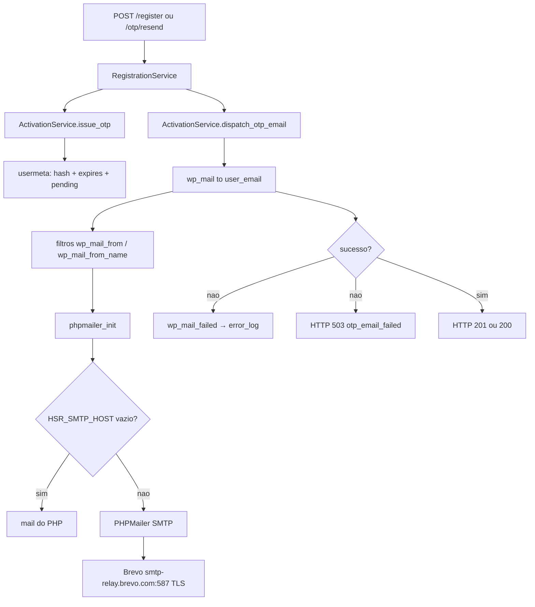

# Envio de e-mail (OTP + SMTP)

Documentacao do fluxo atual de envio de e-mail no backend WordPress.

Estado atual do codigo (workspace). Fonte unica da logica custom: plugin `headless-secure-registration`.

O unico e-mail transacional que o plugin **dispara** e o codigo OTP de verificacao de conta. A configuracao SMTP, porem, e **global**: qualquer `wp_mail()` do WordPress/WooCommerce passa pelo mesmo PHPMailer.

---

## 1) Objetivo

1. Gerar OTP de 6 digitos no registro / reenvio.
2. Enviar o codigo por e-mail via `wp_mail()`.
3. Autenticar o SMTP com as variaveis `HSR_SMTP_*` injetadas no container.
4. Bloquear login enquanto a conta estiver `pending`.

Nao ha fila, retry, template HTML, SendGrid SDK, nem e-mail de recuperacao de senha neste plugin.

---

## 2) Arquivos

| Papel | Arquivo |
|---|---|
| Bootstrap / hooks | `wp/wp-content/plugins/headless-secure-registration/src/class-plugin.php` |
| SMTP + From + log de falha | `src/class-mailer-config.php` |
| Gera OTP, persiste meta, monta e envia o e-mail | `src/class-activation-service.php` |
| Dispara o envio no register / resend | `src/class-registration-service.php` |
| Rotas REST | `src/class-registration-api.php` |
| Validacao de payload | `src/class-request-validator.php` |
| Rate limit HTTP | `src/class-rate-limiter.php` |
| Injecao local das envs | `docker-compose.yml` (servicos `wordpress` e `wordpress-cli-worker`) |
| Injecao prod das envs | `docker-compose.prod.yml` |
| Valores locais | `.env` (raiz de `pawbowl-wp`) |
| Contrato do front (signup/OTP) | `07-auth-signup-login-frontend.md` |

Namespace REST: `custom/v1` (base `{WP_URL}/wp-json`).

---

## 3) Credenciais do `.env` local

Valores lidos de `/home/charles_mendes/projetos/pawbowl-wp/pawbowl-wp/.env` em 16/08/2026.

Provider efetivo: **Brevo** (relay `smtp-relay.brevo.com`). Nao e SendGrid.

| Variavel | Valor atual |
|---|---|
| `HSR_SMTP_HOST` | `smtp-relay.brevo.com` |
| `HSR_SMTP_PORT` | `587` |
| `HSR_SMTP_USER` | `a57cf8001@smtp-brevo.com` |
| `HSR_SMTP_PASS` | `` |
| `HSR_SMTP_ENCRYPTION` | `tls` |
| `HSR_SMTP_AUTH` | `true` |
| `HSR_MAIL_FROM` | `charlesmendes9@gmail.com` |
| `HSR_MAIL_FROM_NAME` | `Eden Bowls` |

Essas chaves **nao** estao no `.env` local (o codigo usa default):

| Variavel | Default no codigo | Efeito |
|---|---|---|
| `HSR_ACTIVATION_TTL` | `600` | ignorado: TTL efetivo e `max(900, valor)` = **900 s** |
| `HSR_OTP_VERIFY_MAX_ATTEMPTS` | `5` | teto de tentativas por emissao |
| `HSR_OTP_RESEND_MAX_ATTEMPTS` | `3` | teto de reenvio por janela |
| `HSR_OTP_RESEND_WINDOW_SECONDS` | `3600` | janela do teto de reenvio |

`HSR_ACTIVATION_BASE_URL` e injetada no Docker (`http://localhost:3000/activate-account` no compose local) e **nao e lida** por nenhum PHP do plugin. O e-mail nao leva link de ativacao.

---

## 4) Como as credenciais chegam no PHP

```
.env (raiz)
  → docker compose substitui ${HSR_SMTP_*}
  → environment: do container wordpress
  → getenv('HSR_SMTP_HOST') etc. em MailerConfig / ActivationService
```

`MailerConfig` **nao** le `$_ENV` nem `wp-config.php`. So `getenv()`.

Se `HSR_SMTP_HOST` vier vazio, `configure()` retorna sem mexer no PHPMailer. O WordPress cai no transporte padrao (`mail()` do PHP). Os filtros de From ainda valem se `HSR_MAIL_FROM` / `HSR_MAIL_FROM_NAME` existirem.

No compose local, `HSR_RATE_LIMIT_MAX=120` e `HSR_RATE_LIMIT_WINDOW=60` tambem entram no container. Isso muda o rate limit de `POST /register` (nao o de verify/resend, que sao hardcoded).

---

## 5) Bootstrap

Em `HSR\Plugin::boot` (`plugins_loaded`):

1. instancia `MailerConfig`;
2. registra:

| Hook | Metodo | Quando |
|---|---|---|
| `phpmailer_init` | `MailerConfig::configure` | todo `wp_mail()` |
| `wp_mail_from` | `MailerConfig::mail_from` | substitui o From se `HSR_MAIL_FROM` nao vazio |
| `wp_mail_from_name` | `MailerConfig::mail_from_name` | substitui o nome se `HSR_MAIL_FROM_NAME` nao vazio |
| `wp_mail_failed` | `MailerConfig::log_failed_mail` | falha do PHPMailer |
| `authenticate` | `Plugin::block_pending_users` | bloqueia login WP de usuario `pending` |

O `MailerConfig` e global. Pedidos WooCommerce, reset de senha do WP e qualquer outro `wp_mail()` usam o mesmo SMTP Brevo e o mesmo From.

---

## 6) Rotas que disparam e-mail

Permission: publica (`__return_true`). Sem cookie, sem Bearer.

| Metodo | Rota | Handler | Quando envia |
|---|---|---|---|
| POST | `/custom/v1/register` | `RegistrationApi::register_user` → `RegistrationService::register` | apos criar usuario pendente |
| POST | `/custom/v1/otp/resend` | `RegistrationApi::resend_otp` → `RegistrationService::resend_otp` | reemissao do OTP |

`POST /custom/v1/otp/verify` **nao** envia e-mail. So consome o codigo.

`POST /custom/v1/account/email-exists` **nao** envia e-mail.

`PUT /custom/v1/profile/email` troca o e-mail e **nao** reenvia OTP.

---

## 7) Fluxo de negocio

### 7.1 Registro (`POST /register`)

1. Normaliza `username`, `email`, `password`, `recaptchaToken`.
2. `RequestValidator::validate_registration` → `422` se falhar.
3. `RateLimiter::consume` (no Docker local: 120 / 60 s; chave IP + UA + hash do e-mail).
4. Captcha se `HSR_RECAPTCHA_ENABLED` (default `false`).
5. `username_exists` ou `email_exists` → `409` (`registration_conflict`).
6. Cria usuario: `wc_create_new_customer` se WooCommerce, senao `wp_create_user`. Role `customer`.
7. `ActivationService::issue_otp($userId)`.
8. `ActivationService::dispatch_otp_email($userId, $otp)`.
9. `wp_mail` falhou → HTTP `503` (`otp_email_failed`). A conta **ja existe**, com `account_created: true` e `uid`.
10. Sucesso → HTTP `201` com `uid`, `email`, `otp_expires_in`, `requires_email_verification: true`.

O OTP **nao** volta no JSON. So no e-mail.

### 7.2 Reenvio (`POST /otp/resend`)

Body: `{ "uid": 123 }`.

1. `uid` < 1 → `422`.
2. Usuario inexistente → `404`.
3. Rate limit HTTP: 3 / 3600 s (`…|otp_resend`).
4. `consume_resend`:
   - status != `pending` → `400` (`already_active`);
   - janela 3600 s, teto 3 → `429` (`otp_resend_rate_limited`).
5. Novo `issue_otp` (invalida o codigo anterior, zera tentativas de verify, **nao** zera o contador de resend).
6. `dispatch_otp_email`. Falha → `503` (`otp_email_failed`).
7. Sucesso → HTTP `200` com `uid` e `otp_expires_in`.

### 7.3 Verificacao (sem e-mail)

`POST /otp/verify` compara HMAC, marca `hsr_activation_status = active`, grava consents e apaga hash/expiracao/contadores.

Usuario `pending` nao autentica:

- WP: filtro `authenticate` → `account_pending_activation` (403);
- Node: `AuthService` le a mesma meta no login/refresh/`me`.

---

## 8) Geracao e persistencia do OTP

`ActivationService::issue_otp`:

1. `random_int(0, 999999)` com pad de 6 digitos (`000000`–`999999`).
2. Hash: `hash_hmac('sha256', $otp, AUTH_SALT)` (`AUTH_SALT` do WordPress; fallback `hsr-default-salt`).
3. TTL: `max(900, (int) (HSR_ACTIVATION_TTL ?: 600))` → **15 minutos**.
4. Grava em `wp_usermeta`:

| Meta | Valor |
|---|---|
| `hsr_activation_status` | `pending` |
| `hsr_activation_otp_hash` | HMAC |
| `hsr_activation_otp_expires` | unix time |
| `hsr_activation_otp_attempts` | `0` |

O codigo em claro **nao** e persistido. So o hash.

Na ativacao: status `active`, `hsr_email_verified_at` (ISO), apaga hash/expiracao/attempts/resend.

---

## 9) Conteudo do e-mail

`ActivationService::dispatch_otp_email`:

| Campo | Valor |
|---|---|
| Destinatario | `$user->user_email` |
| Subject | `Your verification code` (i18n `headless-secure-registration`) |
| Body | `Your Eden Bowls verification code is {OTP}. This code expires in {N} minutes.` |
| `{N}` | `floor(TTL / 60)` → **15** com o TTL efetivo |
| Headers | nenhum |
| Content-Type | padrao WP: `text/plain` |
| HTML / template | nao |
| Anexo | nao |
| Link de ativacao | nao (`HSR_ACTIVATION_BASE_URL` nao entra aqui) |

Chamada:

```php
wp_mail($user->user_email, $subject, $message);
```

Usuario inexistente → `false` sem chamar `wp_mail`.

---

## 10) Transporte SMTP (`MailerConfig::configure`)

Disparado em `phpmailer_init` para **todo** `wp_mail()`.

```
HSR_SMTP_HOST vazio? → return (mail() do PHP)
senao:
  PHPMailer->isSMTP()
  Host        = HSR_SMTP_HOST
  Port        = HSR_SMTP_PORT ?: 587
  SMTPAuth    = HSR_SMTP_AUTH ?: true
  Username    = HSR_SMTP_USER          (so se auth true)
  Password    = HSR_SMTP_PASS          (so se auth true)
  SMTPSecure  = HSR_SMTP_ENCRYPTION    (so se nao vazio)
```

Com o `.env` atual:

- host `smtp-relay.brevo.com`
- porta `587`
- STARTTLS (`tls`)
- auth login com user/pass Brevo
- From `charlesmendes9@gmail.com` / `Eden Bowls`

Nao configura: `SMTPDebug`, timeout, DKIM, `SMTPAutoTLS`, `setFrom` direto no PHPMailer (o From vem dos filtros `wp_mail_from` / `wp_mail_from_name`).

### 10.1 From

| Filtro | Env | Fallback |
|---|---|---|
| `wp_mail_from` | `HSR_MAIL_FROM` | e-mail padrao do WP (`wordpress@{hostname}`) |
| `wp_mail_from_name` | `HSR_MAIL_FROM_NAME` | nome padrao do WP |

WooCommerce tambem registra `wp_mail_from` no momento do envio da classe `WC_Email`. A ordem dos filtros decide quem ganha se os dois estiverem ativos.

---

## 11) Falha de envio

`wp_mail()` devolve `false` → o service responde `503` `otp_email_failed`.

Em paralelo, `wp_mail_failed` chama `log_failed_mail`:

```
[HSR][mail_failed] {"message":"...","data":{"to":["user@..."],"subject":"...","phpmailer_exception_code":N}}
```

So loga `to` (sanitizado), `subject` e codigo da exception. **Nao** loga senha SMTP nem corpo do e-mail.

Nao ha retry automatico. O usuario precisa chamar `/otp/resend` (ou o front, no countdown de 10 s).

---

## 12) Rate limits ligados ao e-mail

| Escopo | Limite | Onde |
|---|---|---|
| `POST /register` | no Docker local: 120 / 60 s (env do compose). Default do codigo: 5 / 900 s | `RateLimiter::consume` |
| `POST /otp/resend` HTTP | 3 / 3600 s | `RegistrationService` |
| resend por usuario | 3 / 3600 s | `ActivationService::consume_resend` |
| `POST /otp/verify` HTTP | 5 / 600 s | `RegistrationService` |
| tentativas de codigo | 5 por emissao | `ActivationService` |
| TTL do OTP | minimo 900 s | `activation_ttl()` |
| countdown UI de resend | 10 s | `AuthModal` (front) |

---

## 13) Diagrama do fluxo completo

```mermaid
sequenceDiagram
    autonumber
    participant UI as AuthModal
    participant API as POST /custom/v1
    participant RS as RegistrationService
    participant AS as ActivationService
    participant WP as wp_mail
    participant MC as MailerConfig
    participant SMTP as smtp-relay.brevo.com

    UI->>API: POST /register
    API->>RS: register(payload)
    RS->>RS: valida + rate limit + cria user
    RS->>AS: issue_otp(userId)
    Note over AS: OTP 6 digitos + HMAC em usermeta<br/>status=pending TTL 900s
    RS->>AS: dispatch_otp_email(userId, otp)
    AS->>WP: wp_mail(user_email, subject, body)
    WP->>MC: wp_mail_from / wp_mail_from_name
    WP->>MC: phpmailer_init → configure()
    MC->>SMTP: SMTP 587 STARTTLS + AUTH
    SMTP-->>WP: ok / erro
    alt envio ok
        RS-->>UI: 201 uid + otp_expires_in
    else envio falhou
        MC->>MC: error_log [HSR][mail_failed]
        RS-->>UI: 503 otp_email_failed (conta ja criada)
    end

    UI->>API: POST /otp/verify
    API->>AS: activate_with_otp
    Note over AS: sem e-mail; status=active

    opt reenvio
        UI->>API: POST /otp/resend
        API->>AS: consume_resend + issue_otp + dispatch_otp_email
    end
```

---

## 14) Diagrama do transporte



---

## 15) O que este fluxo **nao** faz

Comparado com `artefatos/REQUISITOS.md` item 1.13 (SendGrid + varios templates):

| E-mail previsto | Estado atual |
|---|---|
| Confirmacao de cadastro / OTP | implementado (texto puro, via Brevo SMTP) |
| Recuperacao de senha | **nao** no HSR (so o reset nativo do WP, se alguem usar, herda o SMTP) |
| Confirmacao de pedido | WooCommerce, nao HSR |
| Status de envio | WooCommerce, nao HSR |
| Renovacao de assinatura | WooCommerce / Stripe, nao HSR |
| SDK SendGrid | **nao**. SMTP Brevo |
| Fila / retry | **nao** |
| Template HTML versionado | **nao** |
| Link `HSR_ACTIVATION_BASE_URL` | env morta |

Troca de e-mail no profile (`PUT /profile/email`) nao revalida com OTP.

---

## 16) Pontos de atencao

1. From `charlesmendes9@gmail.com` pelo relay Brevo: SPF/DKIM do Gmail nao autorizam esse envio. Risco de spam/rejeicao. Em producao o From deveria ser um dominio autenticado no Brevo.
2. A senha SMTP do `.env` e chave de API Brevo (`xsmtpsib-...`). Quem tiver o arquivo envia e-mail pela conta.
3. `MailerConfig` e global: um host SMTP quebrado derruba OTP **e** e-mails do WooCommerce.
4. Conta e criada **antes** do `wp_mail`. `503` nao significa que o usuario nao existe; o front deve oferecer resend com o `uid`.
5. TTL documentado no env example (`600`) e menor que o piso do codigo (`900`).
6. Sem HTML, sem unsubscribe, sem `List-Unsubscribe`. Corpo so com o codigo em claro.
7. `HSR_ACTIVATION_BASE_URL` no compose nao tem consumidor.
8. `email-exists` nao tem rate limit (enumeracao de e-mail).
