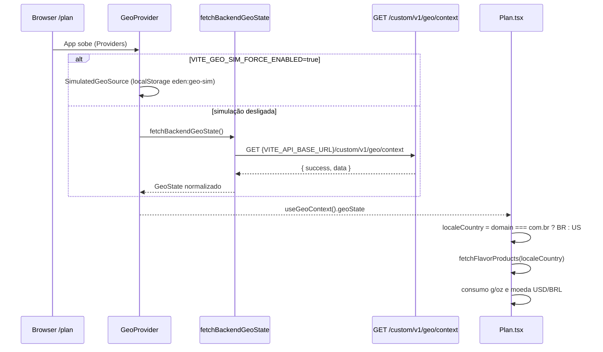
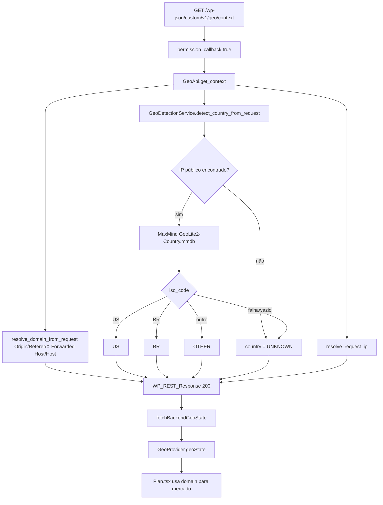

# Documentação Técnica Oficial
## Rota: GET /wp-json/custom/v1/geo/context

Data da análise: 2026-08-17
Escopo da análise: implementação existente no plugin WordPress `headless-secure-registration` e consumo no frontend da tela `/plan`.

## 1. Visão Geral

### Objetivo da rota
Resolver o contexto geográfico do visitante para o frontend decidir mercado (`.com` vs `.com.br`), idioma, moeda, catálogo de sabores e, quando aplicável, redirecionamento entre domínios.

### Responsabilidade
A rota é responsável apenas por:

1. detectar o domínio atual da request (`com` ou `com.br`);
2. detectar o país pelo IP via MaxMind GeoLite2;
3. devolver IP, domínio e país em JSON.

Não identificado na implementação:

- autenticação;
- query params;
- body;
- persistência em banco;
- preenchimento de `region` (sempre `null`);
- preenchimento de `presetId` (sempre `null`);
- cache HTTP da resposta de `/geo/context`.

A rota irmã `GET /custom/v1/geo/redirect` existe no mesmo controller, mas a tela de plano **não** a chama. O frontend trata redirect no próprio `GeoContext`.

### Fluxo completo (resumo)
1. WordPress recebe `GET /wp-json/custom/v1/geo/context`.
2. Plugin registra a rota em `rest_api_init`.
3. Callback `GeoApi::get_context` resolve domínio pelos headers da request.
4. `GeoDetectionService::detect_country_from_request` resolve IP e consulta MaxMind.
5. Callback devolve HTTP 200 com `{ success, data }`.
6. Frontend (`fetchBackendGeoState`) normaliza o payload e o `GeoProvider` publica `geoState`.
7. A tela `/plan` usa `geoState.domain` para país/moeda/catálogo/unidades de consumo.

## 2. Endpoint

### Método HTTP
`GET` (registrado como `\WP_REST_Server::READABLE`).

### URL
`/wp-json/custom/v1/geo/context`

### URL em QA
`https://edenbowls.com/qa-api/wp-json/custom/v1/geo/context`

O prefixo `/qa-api` é o rewrite/proxy do ambiente QA até o WordPress. A rota REST em si continua `custom/v1/geo/context`.

### Query Parameters aceitos
Nenhum.

### Request body
Não há body.

### Exemplo de chamada
```bash
curl --url "https://edenbowls.com/qa-api/wp-json/custom/v1/geo/context" \
  -H "accept: application/json" \
  -H "referer: https://edenbowls.com/qa-app/plan"
```

Cookies de sessão WordPress (`wordpress_logged_in_*`, `wp-settings-*`, etc.) **não são lidos** por esta rota. Eles aparecem no curl do browser porque o usuário estava logado no WP admin; a rota é pública.

## 3. Headers

### Headers observados no curl de QA
- `accept: application/json`
- `accept-language: en-US,en;q=0.9,pt;q=0.8`
- `cache-control: no-cache`
- `pragma: no-cache`
- `referer: https://edenbowls.com/qa-app/plan`
- `origin` (quando a request é CORS)
- headers `sec-*` do Chrome

### Headers realmente obrigatórios
Nenhum.

O frontend envia só `Accept: application/json`.

### Headers usados pela implementação

Para **domínio** (`GeoApi::resolve_domain_from_request`), nesta ordem:

1. `Origin`
2. `Referer`
3. `X-Forwarded-Host`
4. `HTTP_HOST` (`$_SERVER`)

Regra: se o host termina em `.com.br` (case-insensitive) → `domain = "com.br"`; senão → `domain = "com"`.

Para **país** (`GeoDetectionService::detect_request_ip`):

1. se `HSR_GEO_TRUST_PROXY_HEADERS` estiver definido e for true, **ou** se a constante não existir (default do detection service = true):
   - `X-Forwarded-For` (primeiro IP válido da lista)
   - `CF-Connecting-IP`
2. `REMOTE_ADDR`

Para o campo **`ip` da resposta** (`GeoApi::resolve_request_ip`) a regra é diferente:

- se `HSR_GEO_TRUST_PROXY_HEADERS` **não** estiver definido **ou** for false → só `REMOTE_ADDR`;
- se estiver definido e true → `CF-Connecting-IP`, depois `X-Forwarded-For`, depois `REMOTE_ADDR`.

Há inconsistência entre o IP usado para lookup de país e o IP devolvido no JSON. Ver seção 7.

### Observação de CORS no plugin
Filtro global:

- `add_filter('rest_allowed_cors_headers', [$this, 'allow_rest_cors_headers'])`
- adiciona `x-session-token`

Essa rota não envia `x-session-token`. O filtro existe no mesmo plugin e não é requisito desta rota.

## 4. Requisitos de autenticação

Rota pública.

```php
'permission_callback' => '__return_true'
```

Não exige:

- cookie WordPress;
- JWT;
- `x-session-token`;
- `Authorization`.

## 5. Fluxo Interno Completo (WordPress)

### 5.1 Bootstrap e registro
1. `headless-secure-registration.php` carrega `vendor/autoload.php` (MaxMind) e o autoloader `HSR\`.
2. Hook `plugins_loaded` instancia `HSR\Plugin` e chama `boot()`.
3. `boot()` instancia `new GeoApi()`.
4. `add_action('rest_api_init', [$geoApi, 'register_routes'])`.
5. `register_routes()` registra:
   - namespace: `custom/v1`
   - route: `/geo/context`
   - methods: `READABLE`
   - callback: `get_context`
   - permission_callback: `__return_true`

### 5.2 Execução por requisição
1. Cliente chama `GET /wp-json/custom/v1/geo/context`.
2. WordPress faz match da rota.
3. `permission_callback` aprova sem autenticação.
4. `GeoApi::get_context($request)`:
   - `$domain = resolve_domain_from_request($request)`
   - `$country = GeoDetectionService::detect_country_from_request()`
   - `$ip = resolve_request_ip()`
5. `detect_country_from_request()`:
   - resolve IP (prioriza IP público);
   - se IP vazio → `UNKNOWN`;
   - abre `GeoLite2-Country.mmdb` com `MaxMind\Db\Reader`;
   - lê `record['country']['iso_code']`;
   - normaliza para `US`, `BR`, `OTHER` ou `UNKNOWN`.
6. Retorna `WP_REST_Response` HTTP 200.

A constante `HSR_GEO_REAL_DETECTION_ENABLED` **não** é consultada por `/geo/context`. Ela só altera o seed de país na abertura de sessão de onboarding (`OnboardingService::start_session`). Esta rota sempre tenta MaxMind.

## 6. Fluxo no frontend (tela `/plan`)

A tela de plano não chama a rota direto. Ela lê `geoState` do `GeoProvider`, que dispara a request no mount do app.



### 6.1 Como a tela de plano consome o resultado

Em `src/pages/plan/Plan.tsx`:

```ts
const { geoState } = useGeoContext()
const localeCountry: 'US' | 'BR' = geoState.domain === 'com.br' ? 'BR' : 'US'
const localeConfig = {
  country: localeCountry,
  currency: localeCountry === 'BR' ? 'BRL' : 'USD',
}
```

Regra crítica: a tela de plano usa **`geoState.domain`**, não `geoState.country`.

Efeitos dessa escolha:

- domínio `.com.br` → mercado BR / BRL / unidades em g / catálogo BR;
- qualquer outro domínio → mercado US / USD / unidades em oz / catálogo US;
- um visitante brasileiro em `.com` (antes do auto-redirect) ainda vê mercado US nesta tela, porque o domínio ainda é `com`.

`localeConfig.country` entra em:

- `fetchFlavorProducts(localeConfig.country)` — catálogo de sabores;
- `buildSnapshotConsumption(..., localeConfig.country)` — fallback de labels g vs oz;
- `buildUnavailableConsumption(localeConfig.country)` — consumo placeholder;
- `setCurrency(localeConfig.currency)` quando o snapshot ainda não trouxe moeda.

Idioma da UI (`useI18n`) também segue `geoState.domain`:

- `com.br` → `pt-br.json`
- senão → `en-us.json`

### 6.2 Quando a request **não** acontece

Se `VITE_GEO_SIM_FORCE_ENABLED=true`, o `GeoProvider` usa `SimulatedGeoSource` e **não chama** `/geo/context`. O estado vem de `localStorage['eden:geo-sim']`.

No `.env` local atual isso está ligado. Em QA (`qa-app/plan`) a simulação está desligada, por isso o curl aparece no Network.

### 6.3 Fallback se a rota falhar

`GeoProvider` captura erro de `fetchBackendGeoState` e aplica:

```ts
FALLBACK_GEO_STATE = {
  domain: 'com',
  country: 'UNKNOWN',
  ip: null,
  region: null,
  source: 'fallback',
  presetId: null,
}
```

A tela de plano então assume mercado US.

### 6.4 Auto-redirect depois da rota

Com o `geoState` resolvido e sem `eden:region-preference` no localStorage:

- `.com` + país `BR` → redireciona para `https://www.edenbowls.com.br` + path atual;
- `.com.br` + país `US` → redireciona para `https://www.edenbowls.com` + path atual;
- `.com` + `US` ou `.com.br` + `BR` → permanece, sem modal;
- país `OTHER` ou `UNKNOWN` → modal de região (`RegionModal`).

Isso é frontend (`resolveScenario` / `getAutoRedirectPreset`). A rota `/geo/redirect` do WP não participa deste fluxo da tela de plano.

## 7. Regras de Negócio

### 7.1 Domínio
- Host `*.com.br` → `com.br`.
- Qualquer outro host (`edenbowls.com`, `localhost`, IP, etc.) → `com`.
- `qa-app` em `edenbowls.com` resolve `com`, mesmo com `accept-language` contendo `pt`.

### 7.2 País (MaxMind)
Normalização de ISO:

| ISO / entrada | Resultado |
|---|---|
| `US` | `US` |
| `BR` | `BR` |
| vazio / lookup falhou / IP ausente | `UNKNOWN` |
| qualquer outro ISO (`PT`, `DE`, ...) | `OTHER` |

Prioridade de IP no lookup: IP público > primeiro IP válido da lista > string vazia.

### 7.3 Mercado da tela de plano
Mercado efetivo = domínio, não país do IP.

| `geoState.domain` | país da tela | moeda | unidades |
|---|---|---|---|
| `com.br` | `BR` | `BRL` | g / kg |
| `com` | `US` | `USD` | oz |

### 7.4 Região e preset
- `data.region` sempre `null` no backend.
- `data.presetId` sempre `null` no backend.
- `data.source` sempre `"backend"` no backend.
- O frontend ignora `source`/`presetId` do JSON e força `source: 'backend'`, `presetId: null`.

### 7.5 Constantes PHP

| Constante | Default | Efeito nesta rota |
|---|---|---|
| `HSR_GEO_MAXMIND_DB_PATH` | `/var/www/html/data/GeoLite2-Country.mmdb` | caminho do `.mmdb` |
| `HSR_GEO_TRUST_PROXY_HEADERS` | detection service: `true`; `GeoApi::resolve_request_ip`: `false` se indefinida | se confia em `X-Forwarded-For` / `CF-Connecting-IP` |
| `HSR_GEO_REAL_DETECTION_ENABLED` | `false` | **não usada** por `/geo/context` |

### 7.6 O que a rota precisa para funcionar de verdade

A rota responde 200 mesmo com detecção incompleta. Para `country` sair de `UNKNOWN`:

1. plugin `headless-secure-registration` ativo;
2. REST API do WordPress acessível no prefixo do ambiente (`/qa-api/wp-json` em QA);
3. `vendor/autoload.php` com pacote `maxmind-db/reader`;
4. arquivo `GeoLite2-Country.mmdb` existente, legível, no path configurado;
5. IP público do cliente visível para o PHP (direto ou via proxy headers confiáveis);
6. frontend com `VITE_API_BASE_URL` apontando para a **base REST do WordPress** (incluindo `/wp-json`), não para o Node (`http://localhost:3000`);
7. `VITE_GEO_SIM_FORCE_ENABLED` diferente de `true`, senão o app não chama a rota.

Se MaxMind, classe Reader ou `.mmdb` falharem, a rota **não quebra**: devolve `country: "UNKNOWN"` e `success: true`.

### 7.7 Node backend
Não identificado em `eden-bowls-backend`. Não existe `GET /api/v1/geo/context` no Express atual.

Há sugestão de migração em `pawbowl-wp/artefatos/migracao-node-reverse-engineering/08-endpoints-rest-sugeridos.md` como `GET /api/v1/geo/context`. Ainda não implementada.

Implicação local: com `VITE_API_BASE_URL=http://localhost:3000` e simulação desligada, `fetch` vai para `http://localhost:3000/custom/v1/geo/context` e falha. O `GeoProvider` cai no fallback `.com` / `UNKNOWN`.

## 8. Estrutura da Resposta

### Sucesso (único caminho implementado)

HTTP 200

```json
{
  "success": true,
  "data": {
    "domain": "com",
    "country": "US",
    "ip": "8.8.8.8",
    "region": null,
    "source": "backend",
    "presetId": null
  }
}
```

| Campo | Tipo | Obrigatório | Nulo | Descrição |
|---|---|---|---|---|
| `success` | boolean | sim | não | sempre `true` neste callback |
| `data.domain` | `"com"` \| `"com.br"` | sim | não | domínio inferido do host |
| `data.country` | `"US"` \| `"BR"` \| `"OTHER"` \| `"UNKNOWN"` | sim | não | país normalizado pelo IP |
| `data.ip` | string | sim | pode ser `""` | IP usado/exibido; ver inconsistência de proxy |
| `data.region` | `null` | sim | sempre null | não implementado |
| `data.source` | `"backend"` | sim | não | literal |
| `data.presetId` | `null` | sim | sempre null | não implementado |

### Normalização no frontend (`backendGeo.ts`)

- `domain` diferente de `com.br` → `com`;
- `country` fora de `US|BR|OTHER|UNKNOWN` → `UNKNOWN`;
- `ip` ausente → `null`;
- `region` ausente → `null`.

## 9. Tratamento de Erros

Não identificado na implementação PHP:

- HTTP 4xx/5xx próprios da rota;
- `WP_Error`;
- validação de input;
- mensagem de falha estruturada.

Falhas de MaxMind são engolidas (`catch (\Throwable)`) e viram `country = UNKNOWN`.

No frontend:

- `response.ok === false` → throw `Unable to resolve geo context`;
- `GeoProvider` captura e aplica `FALLBACK_GEO_STATE`.

## 10. Performance

- Sem cache HTTP em `/geo/context` (diferente de `/geo/redirect`, que manda `Cache-Control: no-store`).
- Sem query de banco.
- Cada request abre e fecha o arquivo `.mmdb` (`new Reader` + `close()`).
- Lookup MaxMind é local (arquivo), sem HTTP externo no request path.

## 11. Arquivos dependentes

### 11.1 WordPress (servidor da rota)

| Arquivo | Papel |
|---|---|
| `pawbowl-wp/wp/wp-content/plugins/headless-secure-registration/headless-secure-registration.php` | boot do plugin, autoload Composer (MaxMind) |
| `pawbowl-wp/wp/wp-content/plugins/headless-secure-registration/includes/class-hsr-autoloader.php` | autoload `HSR\*` |
| `pawbowl-wp/wp/wp-content/plugins/headless-secure-registration/src/class-plugin.php` | instancia `GeoApi` e registra `rest_api_init` |
| `pawbowl-wp/wp/wp-content/plugins/headless-secure-registration/src/class-geo-api.php` | controller: `/geo/context` e `/geo/redirect` |
| `pawbowl-wp/wp/wp-content/plugins/headless-secure-registration/src/class-geo-detection-service.php` | IP + MaxMind + normalização de país |
| `pawbowl-wp/wp/wp-content/plugins/headless-secure-registration/src/class-onboarding-service.php` | usa `GeoDetectionService` no seed da sessão; não é chamado por esta rota |
| `pawbowl-wp/wp/wp-content/plugins/headless-secure-registration/composer.json` | dependência `maxmind-db/reader` |
| `/var/www/html/data/GeoLite2-Country.mmdb` | base GeoLite2 (path default) |

### 11.2 Frontend — chamada e estado

| Arquivo | Papel |
|---|---|
| `eden-bowls/src/lib/geo/backendGeo.ts` | `GET {VITE_API_BASE_URL}/custom/v1/geo/context` |
| `eden-bowls/src/contexts/GeoContext.tsx` | `GeoProvider` dispara a rota no mount e publica `geoState` |
| `eden-bowls/src/types/geo.ts` | tipos `GeoState`, `DomainVariant`, `CountryCode` |
| `eden-bowls/src/config/geo.ts` | presets de simulação, `FALLBACK_GEO_STATE`, `GEO_STORAGE_KEY` |
| `eden-bowls/src/lib/geo/geoSource.ts` | interface `GeoSource` |
| `eden-bowls/src/lib/geo/simulatedGeoSource.ts` | bypass da rota em simulação |
| `eden-bowls/src/App.tsx` | envolve o app com `Providers` (inclui `GeoProvider`) |
| `eden-bowls/src/AppShell.tsx` | rota `/plan`, `RegionModalGate`, overlay de simulação |

### 11.3 Frontend — tela de plano e mercado

| Arquivo | Papel |
|---|---|
| `eden-bowls/src/pages/plan/Plan.tsx` | consome `geoState.domain` para país, moeda, catálogo e consumo |
| `eden-bowls/src/services/mealPlanProductsApi.ts` | `fetchFlavorProducts(country)` — catálogo usado pelo plano |
| `eden-bowls/src/i18n/index.ts` | idioma da UI a partir de `geoState.domain` |
| `eden-bowls/src/services/onboardingApi.ts` | importa `fetchBackendGeoState` em `resolveCountry()`; função **não tem call site** no arquivo |

### 11.4 Frontend — região (depois da rota)

| Arquivo | Papel |
|---|---|
| `eden-bowls/src/features/region-experience/logic/resolveScenario.ts` | modal vs auto-redirect |
| `eden-bowls/src/features/region-experience/logic/buildDomainUrl.ts` | URL `.com` / `.com.br` |
| `eden-bowls/src/features/region-experience/storage/regionStorage.ts` | `eden:region-preference` |
| `eden-bowls/src/features/region-experience/constants/scenarios.ts` | CTAs do modal |
| `eden-bowls/src/features/region-experience/constants/domains.ts` | hosts canônicos |
| `eden-bowls/src/features/region-experience/constants/banners.ts` | conteúdo dos banners |
| `eden-bowls/src/features/region-experience/components/RegionModal.tsx` | modal |
| `eden-bowls/src/features/region-experience/components/RegionBanner.tsx` | banner |
| `eden-bowls/src/components/dev/GeoSimulationOverlay.tsx` | overlay local; não chama a rota |

### 11.5 Frontend — outros consumidores de `geoState` (não são a tela de plano, mas dependem do mesmo provider)

`Home.tsx`, seções da home, `MainHeader`, `MainFooter`, `OnboardingHeader`, `PetRegistration`, `RecipePage`, `SinglePage`, `AnalyticsContext`, headers do dashboard.

Todos leem `useGeoContext()`. A request continua sendo uma só, no mount do `GeoProvider`.

### 11.6 Testes / mock

| Arquivo | Papel |
|---|---|
| `eden-bowls/e2e/helpers/mockApi.ts` | mock E2E de `GET /custom/v1/geo/context` → `{ domain: 'com', country: 'US' }` |
| `eden-bowls/e2e/SCENARIO_COVERAGE.md` | menciona geo context na cobertura |

Não identificado teste unitário dedicado de `GeoContext` / `backendGeo`.

Não identificado teste PHP da rota no plugin.

## 12. Métodos executados (WordPress)

### `GeoApi::register_routes(): void`
- parâmetros: nenhum
- retorno: void
- registra `/geo/context` e `/geo/redirect`

### `GeoApi::get_context(WP_REST_Request $request): WP_REST_Response`
- parâmetros: request REST
- retorno: HTTP 200 + payload `success/data`
- orquestra domínio + país + IP

### `GeoApi::resolve_domain_from_request(WP_REST_Request $request): string`
- retorno: `"com"` ou `"com.br"`

### `GeoApi::resolve_request_ip(): string`
- retorno: IP ou `""`
- só confia em proxy se `HSR_GEO_TRUST_PROXY_HEADERS` estiver definido e true

### `GeoApi::extract_host(string $value): string`
- extrai host de URL ou host:porta

### `GeoDetectionService::detect_country_from_request(): string`
- retorno: `US|BR|OTHER|UNKNOWN`

### `GeoDetectionService::detect_request_ip(): string`
- prioriza IP público; default confia em proxy se constante ausente

### `GeoDetectionService::lookup_country_from_maxmind_db(string $ip): string`
- retorno: país normalizado ou `""`

### `GeoDetectionService::normalize_country(string $country): string`
- `US`/`BR` literais; vazio permanece vazio; resto → `OTHER` (exceto `UNKNOWN`)

## 13. Banco de Dados

Não identificado. Esta rota não consulta MySQL/WordPress tables.

Dependência de arquivo: MaxMind `GeoLite2-Country.mmdb`.

## 14. Dependências

- Plugin WordPress `headless-secure-registration` ativo
- WordPress REST API
- Composer `maxmind-db/reader`
- Arquivo GeoLite2 Country
- (Frontend) `VITE_API_BASE_URL` apontando para a base `/wp-json`
- (Frontend) `GeoProvider` montado acima de `/plan`

Hooks:

- `plugins_loaded` → `Plugin::boot`
- `rest_api_init` → `GeoApi::register_routes`

APIs externas no request path: não identificado (MaxMind é arquivo local).

## 15. Fluxograma



## 16. Guia de Migração para Node.js

Ainda não existe rota equivalente no Express. Contrato sugerido:

`GET /api/v1/geo/context`

### Controller
- público, sem JWT;
- lê `Origin`/`Referer`/`X-Forwarded-Host`/`Host` para domínio;
- lê IP com a **mesma** política de proxy do lookup e do campo `ip` (hoje elas divergem no PHP; a migração deve escolher uma e documentar).

### Service
- `detectDomain(headers) -> 'com' | 'com.br'`
- `detectCountry(ip) -> 'US' | 'BR' | 'OTHER' | 'UNKNOWN'`
- `lookupMaxMind(ip)` via `maxmind` / `@maxmind/geoip2-node` e arquivo `.mmdb`

### Config
- `GEO_MAXMIND_DB_PATH`
- `GEO_TRUST_PROXY_HEADERS`
- não reutilizar `HSR_GEO_REAL_DETECTION_ENABLED` nesta rota, a menos que o produto queira mudar o comportamento atual

### DTO de resposta
Manter `{ success: true, data: { domain, country, ip, region: null, source: 'backend', presetId: null } }` para não quebrar `backendGeo.ts`.

### Frontend na migração
Trocar em `backendGeo.ts`:

```ts
`${resolveApiBaseUrl()}/custom/v1/geo/context`
```

por

```ts
`${resolveApiBaseUrl()}/api/v1/geo/context`
```

e apontar `VITE_API_BASE_URL` ao Node. Ajustar o mock E2E em `e2e/helpers/mockApi.ts`.

### Banco / migrations
Não identificado. Só o arquivo `.mmdb` no deploy.

## 17. Melhorias sugeridas

1. Unificar a política de `HSR_GEO_TRUST_PROXY_HEADERS` entre lookup de país e campo `ip`.
2. Preencher `region` se o produto precisar (hoje o frontend aceita, mas o WP sempre manda `null`).
3. Migrar para Node e deixar de depender do prefixo WP `/wp-json` no `VITE_API_BASE_URL` misto.
4. Remover ou usar `resolveCountry()` em `onboardingApi.ts` (morta; ainda importa `fetchBackendGeoState`).
5. Documentar no deploy o path e a atualização periódica do `GeoLite2-Country.mmdb`.
6. Resposta 200 com `UNKNOWN` é silenciosa: um health check separado ajudaria a detectar `.mmdb` ausente.

## 18. Relação com outras rotas da tela de plano

`/geo/context` não monta o plano. Ela só define mercado. Depois a tela chama rotas Node/WP de onboarding (snapshot, recommendation, flavors, plan-selection, etc.) já documentadas em `docs/docs/ROTA_ONBOARDING_PLAN_*`.

O país efetivo enviado a essas rotas no plano vem de `localeConfig.country`, derivado do **domínio** devolvido (ou inferido) por esta rota — não do ISO MaxMind, salvo quando um snapshot/recommendation posterior traz `country` próprio.
