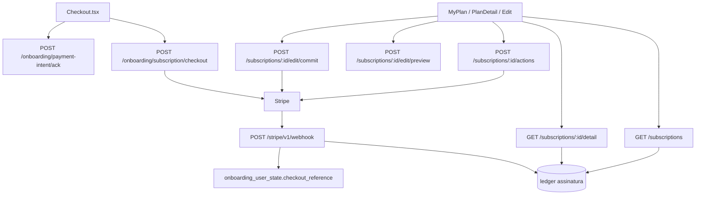

# Aplicacao do pos-checkout no backend Node

Como a logica WordPress (`pawbowl-stripe-billing` + `headless-secure-registration`) entra no Express **depois** do Place Order real: **JWT**, **sem sessao**, **sem Woo order** como fonte de verdade.

Analises WP: `docs/rotes/ANALISE_MIGRACAO_ROTA_SUBSCRIPTIONS*.md`, `docs/checkout/subscription-checkout/01-onboarding-subscription-checkout.md`, `docs/checkout/payment-intent-ack/01-onboarding-payment-intent-ack.md`.

Contrato do front: `eden-bowls/src/services/onboardingApi.ts`, `subscriptionEditApi.ts`, `MyPlan.tsx`, `PlanDetail.tsx`, `EditSubscription.tsx`.

Este arquivo e o guia de transicao. Nao copiar PHP. Nao recriar `fsb_subscription` / `wc_create_order`.

## 1. O que ja existe no Node e o que falta

O checkout ja cria Subscription Stripe e grava `checkout_reference` + `cus_` no usuario. O dashboard **nao** le isso. O webhook **nao existe**.

| Responsabilidade | WP (hoje, codigo vivo) | Node (hoje) | Node (alvo) |
|---|---|---|---|
| Confirmar 1a fatura paga | `POST /custom/v1/stripe-webhook` `invoice.paid` → `hsr_stripe_invoice_paid_confirmed` | **nao existe** | webhook publico, assinatura Stripe, raw body |
| Frete nos ciclos seguintes | mesmo webhook, evento `invoice.created` injeta `invoiceItems` | **nao existe** | mesmo endpoint; metadata de shipping do create |
| Corrigir ACK mentiroso | `payment_intent.payment_failed` / `invoice.payment_failed` | **nao existe** | atualizar `checkout_reference.payment_state` |
| Convergir pause/cancel/edit | `customer.subscription.updated` / `deleted` | **nao existe** | atualizar ledger; `pending_webhook_confirmation` fecha |
| Listar planos | Woo `fsb_subscription` + ledger `wp_hsr_stripe_subscriptions` | stub `[]` | ledger (+ Stripe retrieve se preciso); **sem** Woo |
| Detalhe do plano | Woo detalhe rico, fallback ledger | stub Premium/Milo | mesmo shape do front; ownership JWT |
| Acoes | Stripe primeiro, estado local no webhook | stub queued | Stripe real; devolver `pending_webhook_confirmation: true` |
| Edit preview | catalogo + prorrata Stripe + tax US | stub hash/totais | Stripe + catalogo Node (`plan/preview`) |
| Edit commit | Stripe update + invoice se charge; front confirma PI | **404** | criar rota; mesmo contrato do `subscriptionEditApi.ts` |
| Elegibilidade 1a compra | `HAS_ACTIVE_SUBSCRIPTION` no ledger | le `wp_hsr_stripe_subscriptions` | webhook/checkout **escrevem** o ledger; senao 2a compra ainda ganha cupom |

ACK **nao** substitui webhook. UI pode otimista-`paid`; o dominio so fecha em `invoice.paid`.

## 2. Decisoes em relacao ao PHP

| Tema | WP | Decisao no Node |
|---|---|---|
| Path webhook | `/wp-json/custom/v1/stripe-webhook` | `POST /stripe/v1/webhook` (**fora** de `/api/v1`, como frete) para pular JWT |
| Auth webhook | Stripe-Signature | igual; `STRIPE_WEBHOOK_SECRET`; **raw body** |
| Path dashboard | `/custom/v1/subscriptions...` | `/api/v1/subscriptions...` (front ja chama) |
| Auth dashboard | usuario WP logado | JWT; `401` sem `currentUser.id` |
| Envelope | `{ success, data }` | o mesmo, **sem** `session_id` |
| Fonte de listagem | Woo `fsb_subscription` + ledger | **so ledger** (e/ou Stripe Customer subscriptions). Woo **nao** |
| Materializar pedido no `invoice.paid` | `wc_create_order` + Flexible | **nao portar**. Upsert ledger + `checkout_reference.payment_state = paid` |
| Lookup da sessao no paid | `stripe_checkout_json LIKE '%sub_%'` | `checkout_reference.stripe_subscription_id` indexado / JSON do `user_id` |
| Frete recorrente | `invoice.created` + `invoiceItems.create` | portar; metadata de shipping no create ja existe |
| `pending_webhook_confirmation` | true na maioria das actions | manter; o front trata como "aguardando" |
| `change_plan` / `change_billing_frequency` no `/actions` | existem no PHP | **nao priorizar**: o front atual usa edit preview/commit |
| `edit/commit` | PHP `StripeSubscriptionEditService::commit` | criar rota; hash `expected_current_hash`; 409 `subscription_state_changed` |
| Dedup webhook | tabela `wp_hsr_stripe_events` | tabela `stripe_webhook_events` (`event.id` unique) |
| Customer | meta pedido + ledger | `StripeCustomerStore` ja usa `_hsr_stripe_customer_id` |

## 3. Arquitetura no projeto atual

Padrao: `route → service → repository`. Stripe HTTP em `src/infrastructure/stripe/`. Regras puras em `src/core/`.



Webhook: **sem JWT**. Dashboard: JWT em todas.

## 4. Ordem de implementacao sugerida

O dashboard quebra hoje na ordem do usuario: sucesso no checkout → Meu Plano vazio → detalhe fake → edit 404.

1. **Webhook** (`invoice.paid` + persistencia de eventos + ledger). Desbloqueia cobranca de verdade e 1a compra.
2. **`invoice.created`** no mesmo endpoint — senão o 2o ciclo perde frete.
3. **`GET /subscriptions`** lendo o ledger (e opcionalmente Stripe).
4. **`GET .../detail`** — Meu Plano / Edit precisam do shape rico.
5. **`POST .../actions`** para o que o front chama: pause, reactivate, cancel, toggle_auto_renew, update_payment_method.
6. **`POST .../edit/preview`** real (prorrata + tax US).
7. **`POST .../edit/commit`** — rota nova.
8. Eventos `customer.subscription.*` / `payment_intent.*` no webhook para fechar actions/edit e corrigir ACK.

## 5. Modelo de dados minimo

Nao copiar Woo posts. Minimo para paridade com o front:

### 5.1 Ledger de assinatura

Reusar `wp_hsr_stripe_subscriptions` se o DB for compartilhado (eligibility ja consulta essa tabela). Ou tabela Node equivalente com:

- `user_id`
- `stripe_subscription_id` (unique)
- `stripe_customer_id`
- `status`
- `plan_label`
- `stripe_price_id`
- `current_period_start` / `current_period_end`
- `cancel_at_period_end`
- `payment_method_last4` / brand
- snapshot de pets / plan_selection / shipping / address (JSON)
- `subscription_term_months`
- `edit_payment_pending`

Quem escreve: checkout (status `incomplete`) e webhook `invoice.paid` (status `active`).

### 5.2 Eventos de webhook

`event_id` (unique, `evt_...`), `type`, `processed_at`, payload resumido. Idempotencia: mesmo `evt_` duas vezes → 200 sem reprocessar.

### 5.3 Ja existente

- `onboarding_user_state.checkout_reference`
- `wp_usermeta._hsr_stripe_customer_id`
- `onboarding_pets` / `plan_selection` para enriquecer detalhe

## 6. Env sugerido

Alem de `STRIPE_SECRET_KEY` ja usado no checkout:

| Variavel | Uso |
|---|---|
| `STRIPE_WEBHOOK_SECRET` | `whsec_...` — verificar `Stripe-Signature` |
| `STRIPE_SHIPPING_PRODUCT_ID` | ja no `.env.example`; `invoice.created` reusa para ciclos seguintes |
| `WP_HSR_STRIPE_SUBSCRIPTIONS_TABLE_NAME` | ja default `wp_hsr_stripe_subscriptions` na eligibility |

## 7. Arquivos a criar e a alterar

### 7.1 Criar

```text
src/api/routes/stripe-webhook.routes.js
src/services/stripe-webhook.service.js
src/infrastructure/stripe/stripe-webhook-events.repository.js
src/infrastructure/repositories/subscription-ledger.repository.js
src/api/routes/subscriptions-edit-commit.routes.js
src/services/subscriptions-edit-commit.service.js
src/infrastructure/repositories/subscriptions-edit-commit.repository.js
tests/stripe-webhook.routes.test.js
tests/subscriptions.service.test.js
```

### 7.2 Alterar (substituir stubs)

```text
src/infrastructure/repositories/subscriptions.repository.js
src/infrastructure/repositories/subscriptions-detail.repository.js
src/infrastructure/repositories/subscriptions-actions.repository.js
src/infrastructure/repositories/subscriptions-edit-preview.repository.js
src/services/subscriptions.service.js
src/services/subscriptions-detail.service.js
src/services/subscriptions-actions.service.js
src/services/subscriptions-edit-preview.service.js
src/app.js          # webhook fora de /api/v1; raw body
src/index.js
src/config/env.js   # STRIPE_WEBHOOK_SECRET
```

### 7.3 Nao criar

- rotas `/onboarding/session/...`
- `account-link`
- tabelas Woo so para listar plano
- `fsb_subscription` como entidade Node

## 8. Testes minimos na transicao

Nao rodar a suíte inteira. Por fatia:

```bash
npx jest --runTestsByPath tests/stripe-webhook.routes.test.js
npx jest --runTestsByPath tests/subscriptions.routes.test.js
npx jest --findRelatedTests src/services/subscriptions-actions.service.js
npx jest --findRelatedTests src/services/subscriptions-edit-preview.service.js
```

Cobrir: webhook sem assinatura → 400; `evt_` repetido → 200 idempotente; `invoice.paid` marca `paid` e upsert ledger; list sem JWT → 401; list apos paid → 1 item; detail de sub de outro user → 404; actions `pause` chama Stripe; commit sem rota hoje → 404 ate existir; commit sem hash → 422; hash stale → 409.
