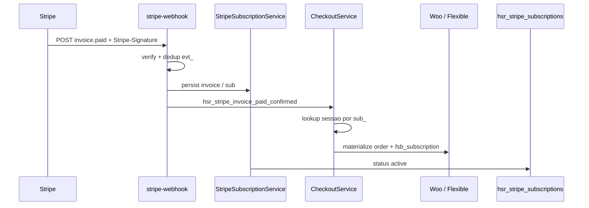
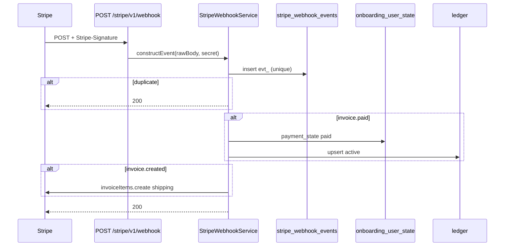

# Rota alvo: Stripe webhook

## Escopo

Rota legado WordPress:

- `POST /custom/v1/stripe-webhook`

Rota alvo Node:

- `POST /stripe/v1/webhook`

Nao existe no Express hoje. O Place Order real e o ACK ja rodam; a cobranca so fecha neste POST.

Origem: Stripe (nao o front). Consumidores posteriores: `GET /subscriptions`, eligibility de 1a compra, actions/edit.

Plugin WP:

- `pawbowl-stripe-billing` (receiver + persist ledger/events)
- `headless-secure-registration` (`CheckoutService::on_stripe_invoice_paid_confirmed`)

Analises: `docs/checkout/subscription-checkout/01-onboarding-subscription-checkout.md` secao 9; `docs/checkout/payment-intent-ack/01-onboarding-payment-intent-ack.md` secao 8.

## Responsabilidade

Receber eventos Stripe, verificar assinatura, processar **uma vez** e atualizar o estado local.

Nao e chamada pelo `Checkout.tsx`. Se o ACK falhar apos `confirmCardPayment`, a UI assume que **este** webhook converge `payment_state`.

## Auth

Publica. **Sem JWT**. Auth = header `Stripe-Signature` + `STRIPE_WEBHOOK_SECRET`.

Path **fora** de `/api/v1` para o `bearer-token.middleware` nao exigir Bearer. Igual `/shipping/v1/*`.

Body: **raw** (`application/json` bytes). `express.json()` quebra a verificacao. Montar o parser raw so neste path, antes do JSON global, ou verificar a partir do buffer original.

Invalid signature → `400`. Evento desconhecido → `200` (ignorar). Evento ja processado (`evt_` unique) → `200` sem reexecutar.

## Eventos que o WP trata e o Node precisa

### 1) `invoice.paid` — obrigatorio agora

WP: `do_action('hsr_stripe_invoice_paid_confirmed')` → `materialize_order_from_subscription_first`.

O que o PHP faz:

1. Resolve `sub_` na invoice / metadata / map option.
2. Acha a sessao por `stripe_checkout_json LIKE '%"stripe_subscription_id":"sub_..."%'`.
3. Cria pedido Woo + dispara Flexible (`woocommerce_rest_insert_shop_order_object`).
4. Atualiza ledger `wp_hsr_stripe_subscriptions` para `active`.

O que o Node **nao** copia: Woo order, Flexible.

O que o Node **faz**:

1. Resolver `user_id` por `checkout_reference.stripe_subscription_id` **ou** `cus_` no `StripeCustomerStore`.
2. UPSERT ledger (`status = active`, periodos, price, last4 se vierem).
3. UPDATE `checkout_reference.payment_state = paid` (mesmo se ACK ja escreveu).
4. Idempotente: segundo `invoice.paid` da mesma invoice nao duplica ledger.

Sem este evento, Meu Plano fica vazio e a 2a compra ainda pode receber cupom de 1a.

### 2) `invoice.created` — obrigatorio para o 2o ciclo

WP: injeta frete com `invoiceItems.create` usando metadata de shipping gravada no `subscriptions.create`.

O checkout Node so coloca frete na **1a** invoice (`add_invoice_items`). Ciclos seguintes **somem o frete** se este handler nao existir.

Alvo: se a invoice e `subscription_cycle` (nao a primeira) e ha shipping persistido, adicionar o mesmo product/price de `STRIPE_SHIPPING_PRODUCT_ID` **antes** da invoice fechar. So em `draft`.

### 3) `payment_intent.succeeded` / `processing`

WP grava `_hsr_stripe_payment_intent_id` / `_status` no pedido. **Nao** chama `payment_complete`. **Nao** limpa `client_secret` (o ACK settled e quem limpa). **Nao** materializa Flexible.

Node: atualizar `checkout_reference` (id + status). Nao tratar como substituto de `invoice.paid`.

### 4) `payment_intent.payment_failed` / `invoice.payment_failed`

Corrige ACK otimista. Node: `payment_state = failed` no `checkout_reference` se a sub ainda nao estiver `active`.

### 5) `customer.subscription.updated` / `deleted` / `paused` (quando o Stripe enviar)

Fecha actions e edit commit. Atualizar ledger (`status`, `cancel_at_period_end`, periodos, items). Sem isso, `pending_webhook_confirmation: true` nunca converge.

## Fluxo WP (invoice.paid)



## Fluxo alvo Node



Responder **200 rapido**. Falha de negocio depois de verificar a assinatura: logar e ainda 200 se o retry da Stripe ia duplicar efeito; 500 so se o processamento for seguro de retentar (insert do `evt_` ainda nao commitado).

## Relacao com ACK

| | ACK | Webhook `invoice.paid` |
|---|---|---|
| Quem chama | front autenticado | Stripe |
| Confia no status? | body do cliente | evento assinado |
| Marca UI paid? | sim (otimista) | nao fala com UI |
| Cria ledger / fecha dominio? | **nao** | **sim** |
| Limpa client_secret no WP? | sim se settled | nao |

Last-write-wins no WP nas mesmas chaves de PI. Ack atrasado com `requires_action` pode rebaixar um `succeeded` do webhook. No Node: webhook **nao** rebaixa `paid` se o ledger ja estiver `active`.

## Request

```http
POST /stripe/v1/webhook
Stripe-Signature: t=...,v1=...
Content-Type: application/json
```

Body: evento Stripe cru (`id`, `type`, `data.object`).

## Response

```json
{ "received": true }
```

Nao precisa do envelope `{ success, data }` do resto da API. Stripe so exige 2xx.

## Persistencia

- `stripe_webhook_events.event_id`
- `onboarding_user_state.checkout_reference`
- ledger (`wp_hsr_stripe_subscriptions` ou tabela Node)

Nao gravar `client_secret` no ledger.

## Env

`STRIPE_WEBHOOK_SECRET` (`whsec_...`). Sem isso → 503 neste path, nao derrubar o resto da API.

Dashboard Stripe: apontar o endpoint de teste/prod para `{API}/stripe/v1/webhook`. Eventos minimos: `invoice.paid`, `invoice.created`, `payment_intent.succeeded`, `payment_intent.payment_failed`, `invoice.payment_failed`, `customer.subscription.updated`, `customer.subscription.deleted`.

## O que mudou em relacao ao WordPress

| Antes (WP) | Alvo (Node) |
|---|---|
| materializa Woo + Flexible | upsert ledger + `checkout_reference` |
| lookup LIKE no JSON da sessao | `stripe_subscription_id` no estado do `user_id` |
| option `hsr_stripe_subscription_order_map` | desnecessario (sem order_id Woo) |
| `wp_hsr_stripe_events` | mesma ideia, tabela Node ou a WP se DB compartilhado |

## Testes minimos

- sem `Stripe-Signature` → 400
- secret errado → 400
- `invoice.paid` primeiro → ledger active + `payment_state` paid
- mesmo `evt_` de novo → 200, um unico upsert
- `invoice.created` de ciclo 2 com shipping metadata → chama `invoiceItems.create`
- JWT no header nao e exigido e nao bloqueia
