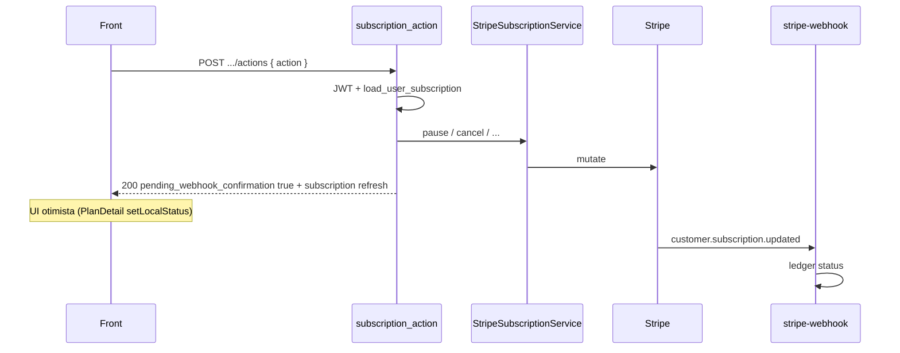

# Rota: acoes da assinatura

## Escopo

Rota legado WordPress:

- `POST /custom/v1/subscriptions/:subscriptionId/actions`

Rota atual Node (stub):

- `POST /api/v1/subscriptions/:subscriptionId/actions`

Front:

- `runSubscriptionAction` em `onboardingApi.ts`
- `updateSubscriptionPaymentMethod` em `subscriptionEditApi.ts` (`action: update_payment_method`)
- `PlanDetail.tsx` (pause, reactivate, cancel, toggle_auto_renew)

WP: `StripeSubscriptionApi::subscription_action` → `StripeSubscriptionService`.

Analise longa: `docs/rotes/ANALISE_MIGRACAO_ROTA_SUBSCRIPTIONS_ACTIONS.md`.

## Responsabilidade

Comandar uma mutacao na assinatura Stripe. A resposta imediata **nao** e o estado final: a maioria das acoes devolve `pending_webhook_confirmation: true`. O webhook `customer.subscription.updated` / `deleted` confirma.

Nao e o caminho de troca de plano/prazo no front atual. Isso vai para edit preview + commit.

## Estado de implementacao Node

`SubscriptionsActionsRepository.executeAction` ecoa o `action` do body e devolve `pending_webhook_confirmation: true` + assinatura fake `active` / Premium. **Nao** chama Stripe. Pause "funciona" na UI ate o refresh.

## Auth

JWT obrigatorio. Sub tem de ser do user. WP rate 40 / 300s.

## Acoes

### O que o PHP aceita

| action | Body extra | Stripe |
|---|---|---|
| `pause` | — | `pause_subscription` |
| `reactivate` | — | `reactivate_subscription` |
| `cancel` | — | `cancel_subscription` |
| `toggle_auto_renew` | `enabled?` boolean; se omitido, **alterna** o valor atual | `set_subscription_auto_renew` |
| `change_plan` | `new_variation_id` **ou** `new_product_id` + `new_price_id` (`price_`) | `update_subscription` |
| `change_billing_frequency` | `frequency`: weekly \| biweekly \| monthly + `new_price_id` | `update_subscription` |
| `update_payment_method` | `payment_method_id` (`pm_`) | attach + default na sub |

### O que o front Node chama hoje

`SubscriptionAction` = `pause` | `reactivate` | `cancel` | `toggle_auto_renew` | `update_payment_method`.

Portar **esses cinco** primeiro. `change_plan` / `change_billing_frequency` no `/actions` podem ficar 422 `invalid_action` ate o edit commit existir; o PHP ainda os tem para clientes antigos.

## Validacoes WP

| Falha | Status | code |
|---|---|---|
| Sem usuario | 401 | `unauthorized` |
| id invalido | 422 | `invalid_subscription_id` |
| nao e do user | 404 | `subscription_not_found` |
| `action` ausente / desconhecido | 422 | `invalid_action` |
| change_plan sem produto/variacao | 422 | `invalid_plan` |
| `new_price_id` sem `price_` | 422 | `invalid_price_id` |
| frequency fora da lista | 422 | `invalid_frequency` |
| PM sem `pm_` | 422 | `invalid_payment_method` |

## Fluxo WP



Regras escondidas:

1. Stripe e autoritativo. Sem mutacao local otimista em troca de plano/frequencia.
2. A resposta **sempre** inclui a assinatura recarregada para a UI atualizar na hora.
3. `x-request-id` vira `request_fingerprint` em change_plan/frequency (idempotencia observacional).
4. Pause/cancel no `PlanDetail` atualizam `localStatus` mesmo antes do webhook.

## Fluxo alvo Node

1. JWT + `sub_` + ownership via ledger.
2. Zod do `action` + campos por acao.
3. Chamar Stripe (mesmo client do checkout).
4. Nao marcar `active`/`paused` no ledger como verdade final — ou marcar `pending_*` e deixar o webhook fechar.
5. Devolver o mesmo envelope. `pending_webhook_confirmation: true` para pause/reactivate/cancel/toggle/update_pm.

## Request

```http
POST /api/v1/subscriptions/sub_123/actions
Authorization: Bearer <jwt>
Content-Type: application/json
```

```json
{ "action": "pause" }
```

```json
{ "action": "toggle_auto_renew", "enabled": true }
```

```json
{ "action": "update_payment_method", "payment_method_id": "pm_123" }
```

`EditSubscription` chama `update_payment_method` **antes** do commit se o usuario trocou o cartao.

## Response

```json
{
  "success": true,
  "data": {
    "action": "pause",
    "pending_webhook_confirmation": true,
    "command_result": [{ "status": "queued" }],
    "subscription": {
      "id": "sub_123",
      "status": "active",
      "plan_label": "Plan #1",
      "current_period_end": "2026-09-09T00:00:00.000Z"
    }
  }
}
```

O front trata `pending_webhook_confirmation: true` como processamento. `PlanDetail` mesmo assim aplica status local (pause → paused).

## Persistencia WP

Metas de order: `_hsr_stripe_subscription_status`, `_hsr_payment_method_*`, `_hsr_stripe_last_webhook_event*`. Tabelas: `wp_hsr_stripe_subscriptions`, `wp_hsr_stripe_events`, `wp_hsr_stripe_customers`.

Node: Stripe + ledger no webhook. Actions nao precisam gravar Woo meta.

## O que mudou em relacao ao WordPress

| Antes (WP) | Alvo (Node) |
|---|---|
| carrega `fsb_subscription` | ledger + Stripe |
| 7 actions | 5 do front primeiro |
| stub Node nao fala com Stripe | Stripe real; falha → 502, nao 200 fake |

## Testes minimos

- sem JWT → 401
- `action: explode` → 422
- `pause` de sub de outro user → 404
- `pause` chama Stripe pause e devolve `pending_webhook_confirmation: true`
- `update_payment_method` sem `pm_` → 422
- Stripe down → 502, nao 200 queued fake
