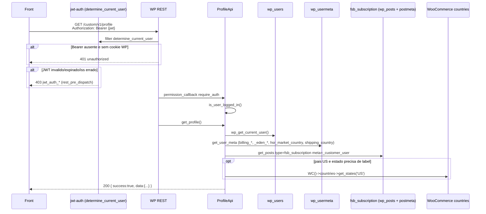

# GET `/profile`

Documentacao da logica **atual** da leitura do perfil do cliente autenticado.

Escopo: montar o DTO de conta (dados pessoais, endereco de entrega, avatar, status de exclusao). A rota **nao persiste** nada. Mutacoes sao rotas irmas: `/profile/personal`, `/profile/delivery`, `/profile/email`, `/profile/password`, `/profile/avatar` e `DELETE /profile`.

Plugin: `headless-secure-registration`.

Arquivos principais:

- `wp/wp-content/plugins/headless-secure-registration/src/class-profile-api.php`
- `wp/wp-content/plugins/headless-secure-registration/src/class-plugin.php`
- auth JWT: `wp/wp-content/plugins/jwt-authentication-for-wp-rest-api/public/class-jwt-auth-public.php`
- origem dos metas no onboarding: `wp/wp-content/plugins/headless-secure-registration/src/class-onboarding-service.php` (`sync_session_preferences_to_user_meta`, persistencia de endereco)
- CPT de assinatura: WooCommerce order type `fsb_subscription` (Flexible Subscriptions) + plugin `pawbowl-stripe-billing`
- testes relacionados (avatar, nao o GET): `wp/wp-content/plugins/headless-secure-registration/tests/unit/plugin-avatar-filter-test.php`

Namespace REST: `custom/v1`  
Base: `{WP_URL}/wp-json`

---

## 1) Identidade da rota

```
GET /wp-json/custom/v1/profile
```

| Item | Valor |
|---|---|
| Namespace WP | `custom/v1` |
| Metodo | `GET` (`WP_REST_Server::READABLE`) |
| Path param | nenhum |
| Query/body | nenhum (handler ignora `$request`) |
| Permission | `ProfileApi::require_auth` → `is_user_logged_in()` |
| Handler | `ProfileApi::get_profile` |
| Builder | `ProfileApi::build_profile` |
| Registro | `add_action('rest_api_init', [ProfileApi, 'register_routes'])` |
| Rate limit | **nao** ha |
| Session token HSR | **nao** aceita (`X-Session-Token` e so onboarding) |

Objetivo: devolver o perfil do usuario **ja autenticado** para a tela de conta (nome, e-mail, telefone, pais, avatar, endereco de entrega, timestamp de senha, flag de assinatura ativa / permissao de exclusao).

Nao confundir com:

- `GET /api/v1/auth/me` — Node; existe e o front **nao** usa (ver `07-auth-signup-login-frontend.md`)
- `PUT /custom/v1/profile/personal` — grava nome/telefone/pais/avatar URL
- `PUT /custom/v1/profile/delivery` — grava endereco billing + instrucoes
- `DELETE /custom/v1/profile` — exclui a conta WP (bloqueia se houver assinatura "ativa" pelo mesmo criterio deste GET)

---

## 2) Fluxo completo



### 2.1 Camada REST (`ProfileApi::get_profile`)

1. `wp_get_current_user()` — usuario ja resolvido pelo JWT/cookie.
2. `build_profile($userId, $user)` — leitura pura.
3. HTTP `200` com envelope `{ success: true, data: <perfil> }`.

Nao valida payload. Nao escreve. Nao chama HTTP externo. Nao usa `RateLimiter` nem `SessionTokenService`.

### 2.2 Autenticacao (`require_auth`)

Roda **antes** do callback.

1. `is_user_logged_in() === false` → HTTP `401`, code `unauthorized`, message `Authentication required.`
2. Caso contrario → `true`.

Quem popula o usuario atual (fora desta classe):

| Fonte | Como | Plugin |
|---|---|---|
| `Authorization: Bearer {jwt}` | filter `determine_current_user` | `jwt-authentication-for-wp-rest-api` |
| Cookie de sessao WP | auth cookie padrao (mesmo origin / `wp_set_auth_cookie`) | WordPress core |

O JWT emitido pelo **Node** (`POST /api/v1/auth/token`) e o emitido pelo plugin JWT compartilham o mesmo contrato: HS256, secret `JWT_AUTH_SECRET_KEY`, claims `iss` + `data.user.id`. O front atual autentica no Node e manda esse Bearer nas chamadas WP.

Token JWT malformado/expirado/iss divergente **nao** chega no `require_auth`. O plugin JWT intercepta em `rest_pre_dispatch` e devolve HTTP `403` (`jwt_auth_invalid_token`, `jwt_auth_bad_iss`, `jwt_auth_bad_config`, etc.).

`X-Session-Token` (onboarding) **nao** autentica esta rota. CORS do HSR so adiciona esse header na lista permitida; nao e lido aqui.

Conta pendente de OTP: o filter `authenticate` (`Plugin::block_pending_users`) bloqueia **login** com senha. Um JWT ja emitido ainda autentica o GET (o profile nao recheca `hsr_activation_status`).

### 2.3 Montagem do DTO (`build_profile`)

Ordem:

1. Nome: `display_name`, fallback `user_login`.
2. Telefone: meta `billing_phone`.
3. Pais do telefone: `resolve_profile_country_code` + `resolve_available_phone_country_codes`.
4. Avatar: meta `_eden_avatar_url` (string vazia vira `null`).
5. Senha atualizada em: meta `_eden_pwd_updated_at` (so existe apos `PUT /profile/password`; usuarios antigos → `null`).
6. Endereco: metas WooCommerce **billing** mapeados para o bloco `delivery`.
7. Estado formatado para resposta (US → nome por extenso em maiusculas; BR → uppercase do valor).
8. Assinatura ativa: `has_active_subscription` → `accountStatus`.

---

## 3) Validacoes

O GET em si nao valida campos. Unica "validacao" e autenticacao.

Normalizacoes internas ao **ler**:

| Campo | Regra |
|---|---|
| `countryCode` | uppercase, so `A-Z`, whitelist `BR`/`US`. Fora disso, descarta o candidato e tenta o proximo. |
| `availableCountryCodes` | se o pais resolvido existir → `[esse]`; senao → `['BR','US']`. |
| Fallback de pais | primeiro de `availableCountryCodes`, senao `'US'`. |
| `state` (US) | codigo `AL`…`WY` **ou** nome (EN, label WooCommerce, alias PT `Nova Iorque`) → nome completo uppercase (`NEW YORK`). Codigo desconhecido → uppercase cru. |
| `state` (nao-US) | `strtoupper` do valor armazenado. Sem mapa de UFs BR. |
| `avatarUrl` / `passwordLastUpdatedAt` | string vazia → `null` (JSON). |

Pais usado **so para formatar estado** (`resolve_delivery_country_code`), cascade diferente do `countryCode` do telefone:

1. `billing_country`
2. `shipping_country`
3. mesmo cascade do telefone (`_eden_phone_country` → `hsr_market_country` → billing → shipping)
4. default `'US'`

Nao valida CEP, telefone, e-mail. Nao exige endereco preenchido — campos vazios voltam `""`.

---

## 4) Dados lidos (nenhum gravado)

### 4.1 `wp_users` (objeto `WP_User`)

| Campo WP | Campo JSON |
|---|---|
| `ID` | `id` (int) |
| `display_name` (fallback `user_login`) | `fullName` |
| `user_email` | `email` |

Nao devolve `user_login`, hash de senha, roles, nicename.

### 4.2 `wp_usermeta`

Constantes da classe:

- `_eden_phone_country`
- `_eden_avatar_url`
- `_eden_pwd_updated_at`
- `_eden_delivery_instructions`

| Meta key | Uso |
|---|---|
| `billing_phone` | `phone` |
| `_eden_phone_country` | candidato 1 de `countryCode` |
| `hsr_market_country` | candidato 2 (gravado no onboarding / account-link) |
| `billing_country` | candidato 3 de pais; candidato 1 de pais de entrega |
| `shipping_country` | candidato 4 de pais; candidato 2 de pais de entrega |
| `_eden_avatar_url` | `avatarUrl` |
| `_eden_pwd_updated_at` | `passwordLastUpdatedAt` (mysql datetime, timezone WP `current_time`) |
| `billing_address_1` | `delivery.address` |
| `billing_address_2` | `delivery.complement` |
| `billing_city` | `delivery.city` |
| `billing_state` | `delivery.state` (apos formatacao) |
| `billing_postcode` | `delivery.zipCode` |
| `_eden_delivery_instructions` | `delivery.deliveryInstructions` |

**Nao lidos** (mas o onboarding **grava** nos dois prefixos): `shipping_address_1/2`, `shipping_city`, `shipping_state`, `shipping_postcode`, `first_name`, `last_name`, `billing_email`.

O bloco JSON chama-se `delivery`, mas a fonte e **billing**. `PUT /profile/delivery` tambem so atualiza billing. Shipping pode ficar stale.

### 4.3 Assinatura (`fsb_subscription`)

`has_active_subscription($userId)`:

1. Se `post_type_exists('fsb_subscription')` for falso → `false` (conta apagavel). Acontece se Flexible Subscriptions nao estiver ativo.
2. `get_posts`:
   - `post_type` = `fsb_subscription`
   - `post_status` = `any`
   - meta `_customer_user` = `$userId` (mesmo meta de customer do WooCommerce order)
   - `fields` = `ids`
   - `numberposts` = `-1` (todas)
3. Para cada ID, `get_post_status`. Considera ativa se status ∈ `{active, pending, on-hold}`.

Nao consulta Stripe. Nao consulta `{prefix}hsr_stripe_subscriptions`. Nao trata `trialing`, `cancelled`, `expired`.

Isso **diverge** da regra de "ja tem assinatura" no checkout (`user_has_active_subscription`: tabela Stripe `status IN ('active','trialing')`). Um usuario `trialing` no Stripe / `cancelled` no CPT pode ver flags diferentes nas duas telas.

`accountStatus`:

```json
{
  "hasActiveSubscription": true,
  "canDeleteAccount": false,
  "deleteRestrictionMessage": "You have an active subscription. Please cancel it before deleting your account."
}
```

Sem assinatura ativa: `canDeleteAccount: true`, `deleteRestrictionMessage: null`. A mesma mensagem e o `WP_Error` `active_subscription` (422) do `DELETE /profile`.

---

## 5) Chamadas a backends externos

**Nenhuma.** Esta rota nao faz HTTP para Stripe, ViaCEP, Nominatim, Zippopotam, recaptcha, e-mail ou Node.

Tudo e in-process:

| "Servico" | Tipo | Endpoint / query | Payload | Resposta | Erro |
|---|---|---|---|---|---|
| WordPress users | DB | `wp_get_current_user` / `wp_users` | user id da sessao JWT | `WP_User` | usuario 0 → 401 antes |
| WordPress usermeta | DB | `get_user_meta` / `wp_usermeta` | user id + key | string (possivelmente vazia) | silencio; vazio vira `""` ou `null` |
| Flexible Subscriptions / WC | DB | `get_posts` CPT `fsb_subscription` + `_customer_user` | user id | lista de IDs | CPT ausente → trata como sem assinatura |
| WooCommerce Countries | in-process | `WC()->countries->get_states('US')` | `'US'` | mapa codigo → label (i18n) | se `WC()` nao existir, usa so o mapa hardcoded + alias `Nova Iorque` |

Nao ha tratamento de timeout/retry: nao ha I/O de rede.

---

## 6) Hooks / filters do WP envolvidos

### 6.1 Registrados pelo HSR (contexto da feature)

| Hook | Onde | Papel nesta rota |
|---|---|---|
| `rest_api_init` | `Plugin::boot` | registra GET/DELETE `/profile` e sub-rotas |
| `show_user_profile` / `edit_user_profile` | `ProfileApi::render_admin_delivery_instructions_field` | **nao** no GET; UI wp-admin para `_eden_delivery_instructions` |
| `personal_options_update` / `edit_user_profile_update` | `save_admin_delivery_instructions_field` | **nao** no GET; grava o textarea admin |
| `get_avatar_data` | `Plugin::override_avatar_data` (prio 20) | **nao** invocado pelo GET. O GET devolve a URL crua da meta. O filter so afeta `get_avatar()` no wp-admin/tema |
| `rest_allowed_cors_headers` | adiciona `x-session-token` | irrelevante para profile (auth e Bearer/cookie) |
| `authenticate` | `block_pending_users` | irrelevante no GET autenticado por JWT ja emitido |

### 6.2 Fora do HSR, no caminho da request

| Hook | Plugin / core | Papel |
|---|---|---|
| `determine_current_user` | jwt-auth | resolve user id a partir do Bearer |
| `rest_pre_dispatch` | jwt-auth | se o token falhou, aborta com `WP_Error` 403 |
| `jwt_auth_algorithm` | jwt-auth | default `HS256` |
| `get_user_metadata` | WP core (via `get_user_meta`) | object cache / plugins de meta |
| `pre_get_posts` / `posts_*` | WP_Query (`get_posts`) | query das assinaturas |
| `remove_accents` | WP i18n (se a funcao existir) | lookup de estado US |

O GET **nao** dispara `profile_update`, `wp_update_user`, `set_user_role`, `deleted_user`, `woocommerce_customer_save_address`.

---

## 7) Dependencias e efeitos colaterais

| Recurso | Efeito no GET |
|---|---|
| Sessao WP cookie | opcional; alternativa ao JWT |
| JWT Bearer | caminho headless atual (token Node ou jwt-auth) |
| Banco `wp_users` + `wp_usermeta` | **leitura** |
| Banco `wp_posts` + `wp_postmeta` | **leitura** das `fsb_subscription` |
| Object cache WP | `get_user_meta` / `get_posts` podem ser cacheados; a rota nao invalida |
| Transients / RateLimiter | nenhum |
| Arquivos / uploads | nenhum (avatar e so URL na meta) |
| E-mail | nenhum |
| Stripe API | nenhum |
| WooCommerce session/cart | nenhum |
| Side effect de escrita | **nenhum** |

Custo: `get_posts(... numberposts => -1)` lista **todas** as assinaturas do usuario e depois checa status uma a uma. Nao ha `posts_per_page: 1` + filtro de status na query. Em contas com historico grande, e um N+1 barato mas desnecessario.

---

## 8) Contrato de resposta

HTTP `200`:

```json
{
  "success": true,
  "data": {
    "id": 77,
    "fullName": "Jane Doe",
    "email": "jane@example.com",
    "phone": "+1 415 555 0100",
    "countryCode": "US",
    "availableCountryCodes": ["US"],
    "avatarUrl": "https://example.com/wp-content/uploads/eden-avatars/avatar-77-123.jpg",
    "passwordLastUpdatedAt": "2026-08-19 12:00:00",
    "delivery": {
      "address": "123 Market St",
      "complement": "Apt 4",
      "city": "San Francisco",
      "state": "CALIFORNIA",
      "zipCode": "94103",
      "deliveryInstructions": "Leave at door"
    },
    "accountStatus": {
      "hasActiveSubscription": false,
      "canDeleteAccount": true,
      "deleteRestrictionMessage": null
    }
  }
}
```

| Campo | Tipo | Notas |
|---|---|---|
| `id` | int | WP user ID |
| `fullName` | string | `display_name` |
| `email` | string | `user_email` |
| `phone` | string | pode ser `""` |
| `countryCode` | `"BR"` \| `"US"` | sempre um dos dois apos fallback |
| `availableCountryCodes` | string[] | 1 item se pais ja resolvido; senao `["BR","US"]` |
| `avatarUrl` | string \| null | |
| `passwordLastUpdatedAt` | string \| null | datetime mysql, timezone do WP, **nao** ISO-8601 |
| `delivery.state` | string | US: nome uppercase; BR: UF uppercase |
| `accountStatus.deleteRestrictionMessage` | string \| null | copy em ingles, hardcoded |

### Erros

| HTTP | `code` | Origem | Quando |
|---|---|---|---|
| 401 | `unauthorized` | `require_auth` | sem usuario logado (sem Bearer e sem cookie) |
| 403 | `jwt_auth_*` | plugin JWT `rest_pre_dispatch` | Bearer presente mas invalido/expirado/iss/config |
| 200 | — | handler | sempre que autenticado; perfil vazio ainda e success |

Nao ha 404 de "usuario nao encontrado": se o JWT aponta para um user id, o core ja carregou o `WP_User`.

Envelope WP_Error padrao REST:

```json
{
  "code": "unauthorized",
  "message": "Authentication required.",
  "data": { "status": 401 }
}
```

---

## 9) Familia da mesma classe (mutacoes)

Mesma auth (`require_auth`). Sem rate limit. Documentacao completa de cada mutacao:

| Metodo | Path | Doc |
|---|---|---|
| PUT/PATCH/POST | `/profile/personal` | `02-put-profile-personal.md` |
| PUT/PATCH/POST | `/profile/delivery` | `03-put-profile-delivery.md` |
| PUT/PATCH/POST | `/profile/email` | `04-put-profile-email.md` |
| PUT/PATCH/POST | `/profile/password` | `05-put-profile-password.md` |
| POST | `/profile/avatar` | `06-post-profile-avatar.md` |
| DELETE | `/profile` | `07-delete-profile.md` |

`WP_REST_Server::EDITABLE` = POST + PUT + PATCH. O front pode usar qualquer um nas rotas personal/delivery/email/password.

---

## 10) Pontos de atencao para reimplementacao em Node

1. **Auth.** Reusar o mesmo JWT HS256 (`JWT_AUTH_SECRET_KEY`, claim `data.user.id`). Nao aceitar `X-Session-Token`. Distinguir 401 (ausente) de 403 (token ruim) se quiser paridade com o plugin JWT; o HSR so emite 401.
2. **Envelope.** Manter `{ success: true, data }` e os codes `unauthorized` / `validation_error` / `active_subscription` se o front ja os consome.
3. **Modelo.** Separar `users`, `user_profiles`, `user_addresses` (ver `07-modelagem-postgresql-sugerida.md`). Hoje tudo e usermeta plano. Na migracao, billing vs shipping precisa de regra: o perfil **so** expoe/edita billing, rotulado como delivery.
4. **Pais.** Cascade `_eden_phone_country` → `hsr_market_country` → `billing_country` → `shipping_country` → `US`. `availableCountryCodes` trava no pais ja escolhido (UI de telefone nao deixa trocar BR↔US depois do primeiro valor).
5. **Estado US.** Persistencia = ISO-2 (`CA`). Resposta GET = nome uppercase (`CALIFORNIA`). Aceitar codigo, nome EN, label traduzida Woo e `Nova Iorque`. Sem DC/territorios no mapa hardcoded. BR: uppercase, sem validacao de UF.
6. **Assinatura ativa.** Nao copiar cegamente o CPT. Unificar com `{prefix}hsr_stripe_subscriptions` (`active`/`trialing`) **ou** documentar a divergencia de proposito. Se o CPT nao existir, hoje `canDeleteAccount` fica `true` — perigoso em ambiente sem Flexible Subscriptions.
7. **`passwordLastUpdatedAt`.** Formato mysql (`Y-m-d H:i:s`) no timezone do WP, nao ISO-8601. Front pode estar parseando isso. Meta so existe apos troca via API.
8. **Avatar.** GET so devolve URL. Upload e arquivo local `wp-content/uploads/eden-avatars/`. No Node: object storage + URL absoluta; garbage-collect versoes antigas (hoje vazam). Validar mime real, nao so o campo `mimeType`.
9. **Delete.** Bloquear com a **mesma** definicao de assinatura ativa do GET. Alem disso, cancelar/arquivar no Stripe — o PHP **nao** faz isso.
10. **Troca de senha.** `wp_set_password` invalida cookies WP mas nao JWTs. Decidir se o Node rotaciona a familia de refresh (`auth_refresh_tokens`) nesse endpoint.
11. **Troca de e-mail.** Sem OTP, sem invalidar JWT. Avaliar se o Node deve exigir re-verificacao (hoje nao).
12. **Sem I/O externo no GET.** Manter barato; indexar `customer_user_id` / `wp_user_id` na tabela de subscriptions em vez de `get_posts(-1)`.
13. **Nao chamar `get_avatar_data`.** O contrato do app e a meta `_eden_avatar_url`, nao Gravatar.
14. **Idioma das mensagens.** Copy de erro/restricao em ingles hardcoded. i18n do admin (`esc_html__`) nao se aplica ao REST.
15. **Testes.** Nao ha unit test de `get_profile`. Cobrir: cascade de pais, formatacao de estado US/BR, CPT ausente, status `on-hold` vs `trialing`, 401 vs JWT 403.

Rota alvo sugerida na migracao: `GET /api/v1/profile` (`08-endpoints-rest-sugeridos.md`).
