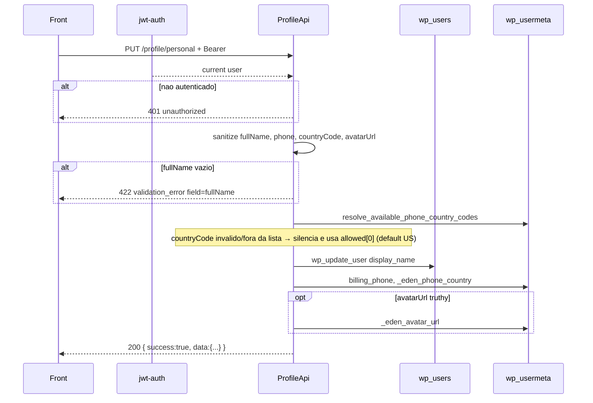

# PUT `/profile/personal`

Documentacao da logica **atual** da atualizacao de dados pessoais (nome, telefone, pais do telefone, URL de avatar).

Escopo: persistir campos do bloco "personal" da tela de conta. Nao devolve o perfil completo — so o subconjunto gravado.

Plugin: `headless-secure-registration`.

Arquivos principais:

- `wp/wp-content/plugins/headless-secure-registration/src/class-profile-api.php` (`update_personal`)
- `wp/wp-content/plugins/headless-secure-registration/src/class-plugin.php`
- auth JWT: ver `profile/01-get-profile.md` secao 2.2
- origem dos metas: onboarding `OnboardingService` grava `_eden_phone_country` / `hsr_market_country` no account-link

Namespace REST: `custom/v1`  
Base: `{WP_URL}/wp-json`

---

## 1) Identidade da rota

```
PUT|PATCH|POST /wp-json/custom/v1/profile/personal
```

| Item | Valor |
|---|---|
| Namespace WP | `custom/v1` |
| Metodo | `WP_REST_Server::EDITABLE` = POST + PUT + PATCH |
| Permission | `ProfileApi::require_auth` → `is_user_logged_in()` |
| Handler | `ProfileApi::update_personal` |
| Registro | `add_action('rest_api_init', [ProfileApi, 'register_routes'])` |
| Rate limit | **nao** ha |
| Session token HSR | **nao** aceita |

Objetivo: atualizar `display_name`, telefone WooCommerce, pais do DDI e (opcionalmente) a URL do avatar.

Nao confundir com:

- `GET /custom/v1/profile` — leitura do DTO completo
- `POST /custom/v1/profile/avatar` — upload binario; esta rota so aceita URL ja pronta em `avatarUrl`
- `PUT /custom/v1/profile/delivery` — endereco

Auth identica ao GET: Bearer JWT (Node ou jwt-auth) ou cookie WP. Detalhes e tabela 401 vs 403 em `01-get-profile.md`.

---

## 2) Fluxo completo



### 2.1 Camada REST (`update_personal`)

1. `wp_get_current_user()`.
2. Le params (JSON ou form): `fullName`, `phone`, `countryCode`, `avatarUrl`.
3. Sanitiza:
   - `fullName`, `phone`, `countryCode` → `sanitize_text_field`
   - `countryCode` ainda passa por `normalize_country_code` (uppercase, so `A-Z`, whitelist `BR`/`US`)
   - `avatarUrl` → `esc_url_raw`
4. Valida `fullName`.
5. Resolve pais permitido e persiste.
6. Envelope `{ success: true, data }`.

`get_param` pega de JSON body, POST body ou query. Content-Type JSON e o caminho headless.

### 2.2 Autenticacao

Igual a todas as rotas `/profile*`: `require_auth`. Sem rate limit. Sem `X-Session-Token`.

---

## 3) Validacoes

| # | Regra | Falha |
|---|---|---|
| 1 | `fullName` apos sanitize nao vazio (`empty()`) | HTTP 422 `validation_error`, `field: fullName`, `Full name is required.` |
| 2 | `phone` | **nao** validado (pode ser `""`) |
| 3 | `countryCode` | **nao** rejeita. Se vazio, nao-`BR`/`US`, ou fora de `availableCountryCodes`, substitui por `$allowedCountryCodes[0]` (senao `'US'`) |
| 4 | `avatarUrl` | se vazio/`0` apos `esc_url_raw`, **nao atualiza** a meta (nao limpa avatar existente). Nao verifica se a URL e do dominio de uploads |

`empty("0")` em PHP e `true`: nome `"0"` falha a validacao.

`availableCountryCodes` usa o mesmo cascade do GET (`_eden_phone_country` → `hsr_market_country` → `billing_country` → `shipping_country`). Se o usuario ja tem pais resolvido, a lista tem **um** item — tentar mandar o outro pais e silenciado, nao 422.

---

## 4) Dados lidos / gravados

### Lidos

- `WP_User` atual (`ID`)
- metas para resolver pais: `_eden_phone_country`, `hsr_market_country`, `billing_country`, `shipping_country`
- apos write: `_eden_avatar_url` (para a resposta)

### Gravados

| Destino | Campo | Condicao |
|---|---|---|
| `wp_users.display_name` | `fullName` | sempre (se passou validacao) |
| usermeta `billing_phone` | `phone` | sempre (inclusive string vazia) |
| usermeta `_eden_phone_country` | `countryCode` efetivo | sempre |
| usermeta `_eden_avatar_url` | `avatarUrl` | so se truthy |

**Nao** atualiza: `first_name`, `last_name`, `nickname`, `user_nicename`, `billing_country`, `shipping_*`, `hsr_market_country`.

---

## 5) Chamadas a backends externos

**Nenhuma HTTP.** In-process:

| "Servico" | Tipo | O que faz | Erro |
|---|---|---|---|
| WordPress users | DB | `wp_update_user(['ID', 'display_name'])` | retorno `WP_Error` **nao** e checado pelo handler — segue o 200 mesmo se o update falhar |
| WordPress usermeta | DB | `update_user_meta` / `get_user_meta` | silencio |

Nao chama Stripe, e-mail, storage, nem o Node.

---

## 6) Hooks / filters do WP envolvidos

Alem da auth JWT (`determine_current_user`, `rest_pre_dispatch`):

| Hook | Origem | Quando |
|---|---|---|
| `wp_pre_insert_user_data` / `insert_user_meta` | `wp_update_user` | antes/durante o write em `wp_users` |
| `profile_update` | `wp_update_user` | depois do update de `display_name` |
| `send_email_change_email` / `send_password_change_email` | `wp_update_user` | **nao** disparam (so `display_name` muda) |
| `update_user_metadata` / `updated_user_meta` | `update_user_meta` | cada meta |
| `get_avatar_data` | HSR `Plugin::override_avatar_data` | **nao** neste request; so quando alguem chamar `get_avatar()` depois, se a URL foi gravada |

`woocommerce_customer_save_address` **nao** dispara: o codigo usa `update_user_meta` cru, nao `WC_Customer->save()`.

---

## 7) Dependencias e efeitos colaterais

| Recurso | Efeito |
|---|---|
| Sessao / JWT | inalterados |
| `wp_users` | `display_name` |
| `wp_usermeta` | 2 ou 3 keys |
| Object cache | `wp_update_user` e `update_user_meta` invalidam cache do user |
| Arquivos | nenhum (URL apenas) |
| E-mail / Stripe | nenhum |

Efeito de produto: o GET passa a devolver o novo nome/telefone. `availableCountryCodes` pode **encolher** de `['BR','US']` para `[pais gravado]` na proxima leitura.

---

## 8) Contrato

### Body

```json
{
  "fullName": "Jane Doe",
  "phone": "+1 415 555 0100",
  "countryCode": "US",
  "avatarUrl": "https://example.com/wp-content/uploads/eden-avatars/avatar-77.jpg"
}
```

Todos opcionais na assinatura REST; so `fullName` e obrigatorio na validacao. Campos ausentes viram `""`.

### Sucesso (200)

```json
{
  "success": true,
  "data": {
    "fullName": "Jane Doe",
    "phone": "+1 415 555 0100",
    "countryCode": "US",
    "availableCountryCodes": ["US"],
    "avatarUrl": "https://example.com/wp-content/uploads/eden-avatars/avatar-77.jpg"
  }
}
```

`countryCode` na resposta e o **efetivo** (pos-fallback), nao necessariamente o enviado. `avatarUrl` e o valor **atual da meta** (pode ser o antigo se o body nao mandou URL).

### Erros

| HTTP | `code` | Quando |
|---|---|---|
| 401 | `unauthorized` | sem login |
| 403 | `jwt_auth_*` | Bearer invalido |
| 422 | `validation_error` | `fullName` vazio; `data.field = fullName` |

---

## 9) Pontos de atencao para Node

1. Paridade de metodos: aceitar PUT **e** PATCH (front pode usar qualquer EDITABLE).
2. Pais invalido **nao** e 422 — e coercao silenciosa. Replicar ou tornar explicito (breaking).
3. Depois do primeiro pais, a UI nao consegue trocar BR↔US por esta rota.
4. `avatarUrl` vazio nao limpa. Se o Node quiser "remover foto", precisa de contrato novo.
5. Nao sincronizar `first_name`/`last_name` a menos que o admin WP dependa disso — hoje o perfil so usa `display_name`.
6. Telefone sem E.164 / mascara. Billing WooCommerce e a fonte de verdade compartilhada com checkout.
7. Checar retorno do update de usuario (PHP ignora `WP_Error` de `wp_update_user`).
8. Testes: nome `"0"`; `countryCode` `br`/`us` lowercase; URL avatar omitida vs `""`; coercao de pais.

Rota alvo: `PATCH /api/v1/profile/personal`.
