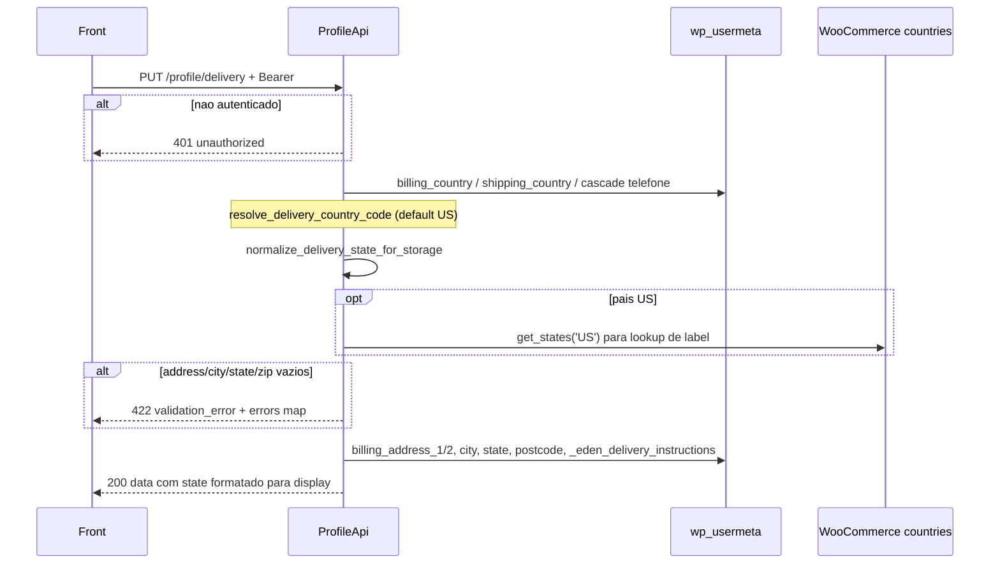

# PUT `/profile/delivery`

Documentacao da logica **atual** da atualizacao do endereco de entrega.

Escopo: gravar o endereco **billing** do WooCommerce (rotulado como delivery no JSON) e as instrucoes `_eden_delivery_instructions`. Nao mexe em shipping, pais, nem CEP lookup.

Plugin: `headless-secure-registration`.

Arquivos principais:

- `wp/wp-content/plugins/headless-secure-registration/src/class-profile-api.php` (`update_delivery` + helpers de estado)
- `wp/wp-content/plugins/headless-secure-registration/src/class-plugin.php` (campo admin das instrucoes)
- origem no onboarding: `OnboardingService` grava billing **e** shipping; esta rota so atualiza billing
- auth: `profile/01-get-profile.md` secao 2.2

Namespace REST: `custom/v1`  
Base: `{WP_URL}/wp-json`

---

## 1) Identidade da rota

```
PUT|PATCH|POST /wp-json/custom/v1/profile/delivery
```

| Item | Valor |
|---|---|
| Namespace WP | `custom/v1` |
| Metodo | `WP_REST_Server::EDITABLE` = POST + PUT + PATCH |
| Permission | `ProfileApi::require_auth` |
| Handler | `ProfileApi::update_delivery` |
| Rate limit | **nao** ha |
| Session token HSR | **nao** aceita |

Objetivo: persistir rua, complemento, cidade, estado, CEP/ZIP e instrucoes ao motorista.

Nao confundir com:

- `POST /custom/v1/onboarding/session/{id}/zipcode` — grava endereco na **sessao** de onboarding
- `POST .../zipcode/lookup` — consulta ViaCEP / Zippopotam, **nao** persiste
- `GET /custom/v1/profile` — le os mesmos campos billing

Auth identica ao GET (`require_auth` + JWT/cookie).

---

## 2) Fluxo completo



### 2.1 Camada REST (`update_delivery`)

1. Sanitiza campos:
   - `address`, `complement`, `city`, `state`, `zipCode` → `sanitize_text_field`
   - `deliveryInstructions` → `sanitize_textarea_field` (preserva quebras de linha)
2. Resolve pais de entrega (`resolve_delivery_country_code`) — **lido**, nunca gravado aqui.
3. Normaliza estado para storage; formata estado para a resposta.
4. Valida obrigatorios **depois** da normalizacao de estado.
5. `update_user_meta` nos 6 campos.
6. HTTP 200 com o DTO do bloco delivery (estado de **display**, nao o persistido).

### 2.2 Pais usado so para o estado

Cascade (`resolve_delivery_country_code`):

1. `billing_country` se `BR`/`US`
2. `shipping_country` se `BR`/`US`
3. cascade do telefone (`_eden_phone_country` → `hsr_market_country` → billing → shipping)
4. default `'US'`

A rota **nao** aceita `country` no body. Mudar o pais nao e possivel por aqui.

---

## 3) Validacoes

Obrigatorios (mensagem `This field is required.` por campo):

| Campo body | Criterio `empty()` | Chave em `errors` |
|---|---|---|
| `address` | apos sanitize | `address` |
| `city` | apos sanitize | `city` |
| `state` | apos **normalizacao de storage** (`stateForStorage`) | `state` |
| `zipCode` | apos sanitize | `zipCode` |

`complement` e `deliveryInstructions` opcionais. String vazia **sobrescreve** o valor anterior (nao e "omitir = manter").

Se qualquer obrigatorio faltar: HTTP 422, code `validation_error`, message `Required fields are missing.`, `data.errors` = mapa campo → mensagem. Pode vir mais de um campo.

**Nao** valida:

- formato de CEP (8 digitos) vs ZIP (5/9)
- UF brasileira contra lista
- estado US contra o mapa (valor desconhecido e persistido como `strtoupper` cru, ex. `XX` ou `DISTRICT OF COLUMBIA`)
- tamanho das instrucoes

Normalizacao de estado:

| Pais | Storage | Resposta |
|---|---|---|
| `US` | codigo ISO-2 se reconhecido (`CA`); senao uppercase do input | nome EN uppercase (`CALIFORNIA`) se o codigo existir no mapa hardcoded; senao uppercase cru |
| outro (BR) | `strtoupper` do input (`SP`) | o mesmo uppercase |

Lookup US aceita codigo, nome EN, labels do WooCommerce (`get_states('US')`, i18n) e alias `Nova Iorque` → `NY`. Mapa hardcoded: 50 estados, **sem** DC/territorios.

---

## 4) Dados lidos / gravados

### Lidos

Metas de pais: `billing_country`, `shipping_country`, `_eden_phone_country`, `hsr_market_country`.

### Gravados (so billing + instrucao Eden)

| Meta | Body |
|---|---|
| `billing_address_1` | `address` |
| `billing_address_2` | `complement` |
| `billing_city` | `city` |
| `billing_state` | `stateForStorage` (codigo US / UF uppercase) |
| `billing_postcode` | `zipCode` |
| `_eden_delivery_instructions` | `deliveryInstructions` |

**Nao** grava: `shipping_*`, `billing_country`, `billing_first_name`, telefone.

O admin WP tambem edita `_eden_delivery_instructions` via `show_user_profile` / `personal_options_update` (nonce `hsr_delivery_instructions`). Mesma meta, outro canal.

---

## 5) Chamadas a backends externos

**Nenhuma HTTP** (sem ViaCEP, Nominatim, Zippopotam, Google Places).

| "Servico" | Tipo | Uso | Erro |
|---|---|---|---|
| WordPress usermeta | DB | read pais + write 6 metas | silencio |
| WooCommerce Countries | in-process | `WC()->countries->get_states('US')` no lookup de estado | se `WC()` ausente, so mapa hardcoded + alias PT |

Nao ha geocode nem validacao de CEP entregavel.

---

## 6) Hooks / filters do WP envolvidos

| Hook | Papel |
|---|---|
| JWT `determine_current_user` / `rest_pre_dispatch` | auth |
| `update_user_metadata` / `updated_user_meta` | cada `update_user_meta` |
| `remove_accents` | lookup de estado US |
| `show_user_profile` / `edit_user_profile` | **nao** neste request; UI admin da mesma meta de instrucoes |
| `woocommerce_customer_save_address` | **nao** dispara |

Nao chama `wp_update_user`.

---

## 7) Dependencias e efeitos colaterais

| Recurso | Efeito |
|---|---|
| JWT / sessao | inalterados |
| `wp_usermeta` | 6 writes |
| `shipping_*` | **fica stale** se o onboarding tinha preenchido os dois |
| Cache | invalidacao padrao de user meta |
| Frete / tax / Stripe Customer address | **nao** sincroniza. Assinatura Stripe e customer.address podem divergir ate um checkout/edit posterior |
| Instrucoes | usadas no checkout (`CheckoutService` copia `_eden_delivery_instructions` para order meta) |

---

## 8) Contrato

### Body

```json
{
  "address": "123 Market St",
  "complement": "Apt 4",
  "city": "San Francisco",
  "state": "California",
  "zipCode": "94103",
  "deliveryInstructions": "Leave at door"
}
```

`state` pode ser `CA`, `California` ou `CALIFORNIA`.

### Sucesso (200)

```json
{
  "success": true,
  "data": {
    "address": "123 Market St",
    "complement": "Apt 4",
    "city": "San Francisco",
    "state": "CALIFORNIA",
    "zipCode": "94103",
    "deliveryInstructions": "Leave at door"
  }
}
```

Assimilar ao GET: `delivery.state` e display, nao o valor em disco.

### Erros

| HTTP | `code` | Quando |
|---|---|---|
| 401 | `unauthorized` | sem login |
| 403 | `jwt_auth_*` | Bearer invalido |
| 422 | `validation_error` | `data.errors` mapa de campos faltando |

Exemplo 422:

```json
{
  "code": "validation_error",
  "message": "Required fields are missing.",
  "data": {
    "status": 422,
    "errors": {
      "zipCode": "This field is required.",
      "state": "This field is required."
    }
  }
}
```

---

## 9) Pontos de atencao para Node

1. Contrato JSON usa `delivery` / `complement` / `zipCode`, mas o persistido e billing WooCommerce. No Postgres, `user_addresses.type` precisa de regra: um registro `delivery` mapeado do billing legado, ou dois tipos com sync.
2. Resposta US = nome uppercase; storage = ISO-2. O front pode reenviar o nome na proxima PUT — o PHP aceita os dois.
3. Nao atualizar `billing_country` aqui. Pais vem de outro fluxo (onboarding / personal). Se o Node unificar PATCH de endereco com `country`, e um contrato novo.
4. Shipping legado pode divergir. Decidir se PATCH delivery atualiza os dois (mais seguro para fulfillment) ou so um.
5. Sem lookup de CEP nesta rota — o front que quiser autocomplete deve chamar o endpoint de zipcode (onboarding) ou um novo `/profile/zipcode/lookup`.
6. `deliveryInstructions: ""` apaga o texto. Diferente de campo omitido em um PATCH parcial — hoje omitido tambem vira `""` porque `get_param` default e vazio. **Nao e PATCH semantico**; e replace do bloco.
7. Nao disparar side effects de Woo `WC_Customer` a menos que queira hooks de terceiros.
8. Testes: `state` `Nova Iorque` → storage `NY` / response `NEW YORK`; BR `sp` → `SP`; zip omitido; complemento vazio apaga o anterior.

Rota alvo: `PATCH /api/v1/profile/delivery`.
