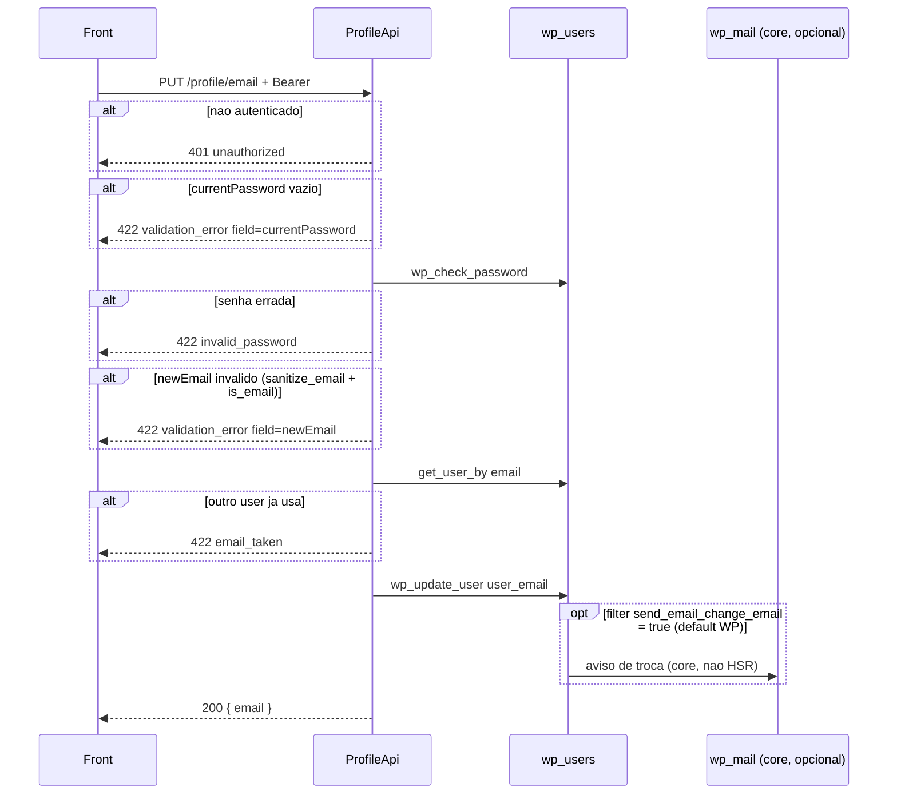

# PUT `/profile/email`

Documentacao da logica **atual** da troca de e-mail da conta autenticada.

Escopo: exigir a senha atual, validar unicidade e gravar `wp_users.user_email`. **Nao** reenvia OTP. **Nao** invalida JWT.

Plugin: `headless-secure-registration`.

Arquivos principais:

- `wp/wp-content/plugins/headless-secure-registration/src/class-profile-api.php` (`change_email`)
- OTP / e-mail de cadastro: `08-envio-email.md` (esta rota nao dispara `wp_mail` no HSR)
- auth: `profile/01-get-profile.md` secao 2.2
- login Node ainda le `wp_users.user_email`: `07-auth-signup-login-frontend.md`

Namespace REST: `custom/v1`  
Base: `{WP_URL}/wp-json`

---

## 1) Identidade da rota

```
PUT|PATCH|POST /wp-json/custom/v1/profile/email
```

| Item | Valor |
|---|---|
| Namespace WP | `custom/v1` |
| Metodo | `WP_REST_Server::EDITABLE` = POST + PUT + PATCH |
| Permission | `ProfileApi::require_auth` |
| Handler | `ProfileApi::change_email` |
| Rate limit | **nao** ha (brute force da senha **nao** limitado) |
| Session token HSR | **nao** aceita |

Objetivo: trocar o e-mail de login/contato da conta.

Nao confundir com:

- `POST /custom/v1/account/email-exists` — checagem publica no signup
- `POST /custom/v1/register` / `otp/verify` — cria conta + verifica OTP
- `PUT /custom/v1/profile/password` — outra prova de senha atual

Auth identica ao GET.

---

## 2) Fluxo completo



### 2.1 Camada REST (`change_email`)

1. `currentPassword` = string **crua** (sem sanitize — importante para caracteres especiais).
2. `newEmail` = `sanitize_email`.
3. Validacoes na ordem da tabela da secao 3. Primeira falha ganha.
4. `wp_update_user(['ID' => $userId, 'user_email' => $newEmail])`.
5. Resposta so com o e-mail novo. Retorno de `wp_update_user` **nao** e checado.

Mesmo e-mail ja atual: `get_user_by` acha o proprio user (`ID` igual) → passa e chama `wp_update_user` (no-op efetivo).

---

## 3) Validacoes

Ordem **exata** no codigo:

| # | Condicao | HTTP | `code` | `field` | Message |
|---|---|---|---|---|---|
| 1 | `currentPassword === ''` | 422 | `validation_error` | `currentPassword` | `Current password is required.` |
| 2 | `wp_check_password` falso | 422 | `invalid_password` | `currentPassword` | `Current password is incorrect.` |
| 3 | `! is_email($newEmail)` | 422 | `validation_error` | `newEmail` | `A valid email address is required.` |
| 4 | outro usuario com o e-mail | 422 | `email_taken` | `newEmail` | `This email address is already in use.` |

`is_email` roda **depois** de `sanitize_email`: input lixo vira `""` e cai no passo 3, nao num code separado.

Nao exige que o novo e-mail seja diferente do atual. Nao verifica `hsr_activation_status`. Nao manda OTP para o endereco novo.

`wp_check_password($plain, $user->user_pass, $userId)` usa o hash ja carregado no `WP_User` (phpass `$P$`/`$H$`, etc.) e o filter `check_password`.

---

## 4) Dados lidos / gravados

### Lidos

- `WP_User->user_pass` (hash)
- `WP_User->ID`
- lookup `get_user_by('email', $newEmail)` → `wp_users.user_email`

### Gravados

| Destino | Valor |
|---|---|
| `wp_users.user_email` | `$newEmail` sanitizado |

**Nao** atualiza: `user_login`, `user_nicename`, `billing_email`, `shipping_email`, metas de OTP, Stripe `customer.email`.

---

## 5) Chamadas a backends externos

**Nenhuma chamada HTTP do HSR.** Sem OTP, sem Brevo direto nesta classe.

| "Servico" | Tipo | Endpoint / API | Payload | Resposta | Erro |
|---|---|---|---|---|---|
| WordPress users | DB | `wp_check_password` / `get_user_by` / `wp_update_user` | user id + e-mail | `WP_User` / int / `WP_Error` | `WP_Error` de `wp_update_user` e **ignorado** |
| `wp_mail` (core) | SMTP via `phpmailer_init` HSR `MailerConfig` | so se o filter `send_email_change_email` permanecer `true` | template core "Email Changed" | bool | `wp_mail_failed` loga; o REST **ja devolveu 200** |

O HSR **nao** registra `send_email_change_email` → `__return_false`. Em WP padrao, a troca de e-mail via `wp_update_user` **pode** disparar e-mail de notificacao do core para o endereco antigo. Isso e distinto do OTP de cadastro (`08-envio-email.md` afirma que esta rota nao reenvia OTP — correto; o e-mail de *notification* do core e outro canal).

Nao atualiza customer no Stripe.

---

## 6) Hooks / filters do WP envolvidos

| Hook | Origem | Papel |
|---|---|---|
| JWT `determine_current_user` / `rest_pre_dispatch` | jwt-auth | auth |
| `check_password` | `wp_check_password` | plugins de hash |
| `wp_pre_insert_user_data` | `wp_update_user` | |
| `profile_update` | `wp_update_user` | apos persistir |
| `send_email_change_email` | `wp_update_user` | se true, dispara `wp_mail` |
| `phpmailer_init` / `wp_mail_from` / `wp_mail_from_name` / `wp_mail_failed` | HSR `MailerConfig` | so se o core enviar o aviso |

Nao dispara `ActivationService` nem `issue_otp`.

---

## 7) Dependencias e efeitos colaterais

| Recurso | Efeito |
|---|---|
| JWT access | **continua valido** (claim e `data.user.id`, nao e-mail) |
| Cookie WP | inalterado |
| Refresh Node (`auth_refresh_tokens`) | inalterado — proximos logins usam o e-mail **novo** (`WHERE user_login OR user_email`) |
| `wp_users` | `user_email` unico (indice WP) |
| Object cache de user | limpo por `wp_update_user` |
| Stripe / Mailchimp / etc. | **nao** sincronizado |
| OTP / `hsr_activation_status` | inalterado; conta ja ativa permanece ativa sem provar o e-mail novo |

Risco: quem tem o JWT sequestra a troca se souber a senha. Sem rate limit, a senha pode ser martelada neste endpoint.

---

## 8) Contrato

### Body

```json
{
  "currentPassword": "old-secret",
  "newEmail": "jane.new@example.com"
}
```

### Sucesso (200)

```json
{
  "success": true,
  "data": { "email": "jane.new@example.com" }
}
```

### Erros

| HTTP | `code` | `field` | Quando |
|---|---|---|---|
| 401 | `unauthorized` | — | sem login |
| 403 | `jwt_auth_*` | — | Bearer invalido |
| 422 | `validation_error` | `currentPassword` ou `newEmail` | vazio / e-mail invalido |
| 422 | `invalid_password` | `currentPassword` | senha atual errada |
| 422 | `email_taken` | `newEmail` | e-mail de outro user |

---

## 9) Pontos de atencao para Node

1. Hash da senha hoje e phpass WP. O `AuthService` Node ja valida o mesmo formato — reutilizar.
2. Unicidade: indice unico em `users.email`. Tratar corrida (dois PATCH simultaneos) com constraint, nao so SELECT.
3. Decidir se exige OTP no e-mail novo (PHP nao exige). Se sim, e breaking vs front atual.
4. Decidir se revoga refresh tokens na troca (PHP nao revoga JWT).
5. Sincronizar `billing_email` e Stripe Customer se o billing depende do e-mail de contato.
6. Desligar ou replicar o e-mail de notificacao do WP core (`send_email_change_email`) para nao surpreender no Node (silencio) vs WP (possivel mail).
7. Rate limit de prova de senha (ausente hoje).
8. Nao reusar `POST /account/email-exists` sem auth como substituto — aquela rota e publica e so devolve boolean.
9. Testes: e-mail proprio; e-mail de outro; senha errada vs senha omitida (codes diferentes); `sanitize_email` que esvazia input.

Rota alvo: `PATCH /api/v1/profile/email`.
