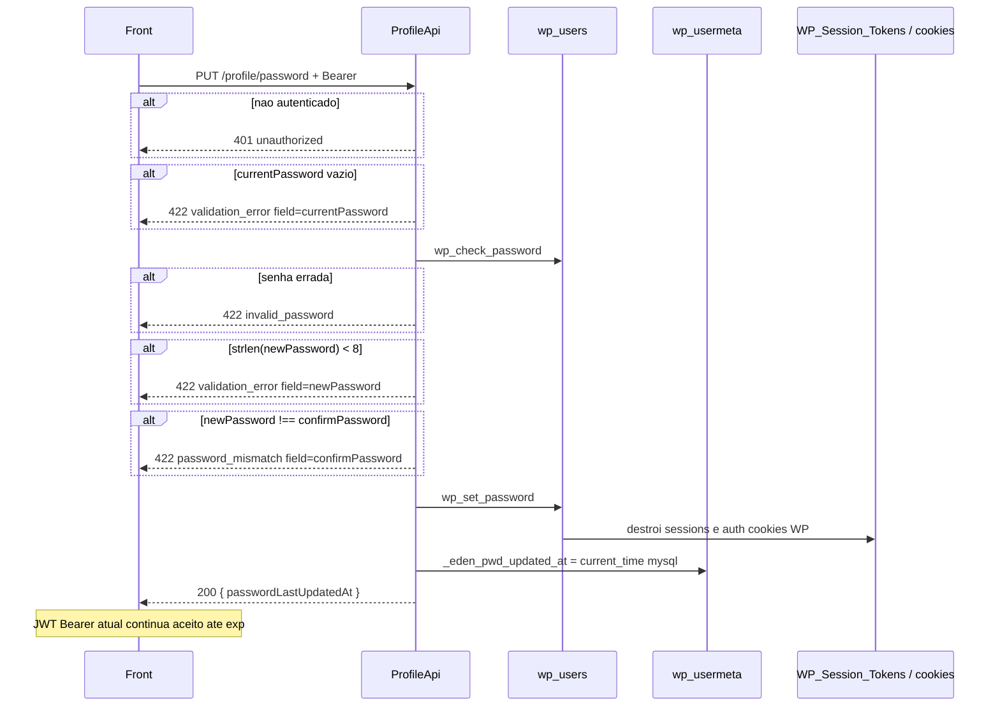

# PUT `/profile/password`

Documentacao da logica **atual** da troca de senha da conta autenticada.

Escopo: exigir senha atual, gravar hash novo via `wp_set_password` e timestamp `_eden_pwd_updated_at`. Nao emite JWT novo. Nao manda e-mail.

Plugin: `headless-secure-registration`.

Arquivos principais:

- `wp/wp-content/plugins/headless-secure-registration/src/class-profile-api.php` (`change_password`)
- login Node: `07-auth-signup-login-frontend.md` (`AuthService.authenticate` contra `wp_users.user_pass`)
- GET le a meta: `profile/01-get-profile.md` campo `passwordLastUpdatedAt`

Namespace REST: `custom/v1`  
Base: `{WP_URL}/wp-json`

---

## 1) Identidade da rota

```
PUT|PATCH|POST /wp-json/custom/v1/profile/password
```

| Item | Valor |
|---|---|
| Namespace WP | `custom/v1` |
| Metodo | `WP_REST_Server::EDITABLE` = POST + PUT + PATCH |
| Permission | `ProfileApi::require_auth` |
| Handler | `ProfileApi::change_password` |
| Rate limit | **nao** ha |
| Session token HSR | **nao** aceita |

Objetivo: rotacionar a senha da conta e expor `passwordLastUpdatedAt` para a UI.

Nao confundir com:

- `PUT /custom/v1/profile/email` — tambem pede `currentPassword`
- `POST /api/v1/auth/token` — login; nao troca senha
- `wp_update_user(['user_pass'])` — **nao** e o caminho; o HSR usa `wp_set_password`

Auth identica ao GET.

---

## 2) Fluxo completo



### 2.1 Camada REST (`change_password`)

1. Le `currentPassword`, `newPassword`, `confirmPassword` **crus** (sem `sanitize_text_field` — nao corromper a senha).
2. Validacoes na ordem da secao 3.
3. `wp_set_password($newPassword, $userId)`.
4. `$updatedAt = current_time('mysql')` (timezone do WP, nao UTC obrigatorio).
5. `update_user_meta($userId, '_eden_pwd_updated_at', $updatedAt)`.
6. HTTP 200. Retorno de `wp_set_password` (void) nao e testavel; se o update de meta falhar, ainda assim 200 com o timestamp gerado em memoria.

Nao chama `wp_update_user`. Por isso o filter `send_password_change_email` do core **nao** roda neste fluxo.

---

## 3) Validacoes

Ordem **exata**:

| # | Condicao | HTTP | `code` | `field` | Message |
|---|---|---|---|---|---|
| 1 | `currentPassword === ''` | 422 | `validation_error` | `currentPassword` | `Current password is required.` |
| 2 | `wp_check_password` falso | 422 | `invalid_password` | `currentPassword` | `Current password is incorrect.` |
| 3 | `strlen($newPassword) < 8` | 422 | `validation_error` | `newPassword` | `New password must be at least 8 characters.` |
| 4 | `newPassword !== confirmPassword` | 422 | `password_mismatch` | `confirmPassword` | `New passwords do not match.` |

`strlen` e **bytes** PHP, nao graphemes Unicode.

Nao exige:

- senha nova ≠ atual
- maiuscula / numero / simbolo
- `confirmPassword` presente como campo separado alem da igualdade (ausente vira `""` e falha no passo 4 se new tiver 8+ chars)

`newPassword` vazio cai no passo 3 (`< 8`), nao num code `required` proprio.

---

## 4) Dados lidos / gravados

### Lidos

- `WP_User->user_pass` (hash atual)
- `WP_User->ID`

### Gravados

| Destino | Valor |
|---|---|
| `wp_users.user_pass` | hash phpass gerado por `wp_set_password` / `wp_hash_password` |
| `wp_users.user_activation_key` | `wp_set_password` **zera** a activation key (comportamento core) |
| usermeta `_eden_pwd_updated_at` | datetime mysql `Y-m-d H:i:s` no tz do WP |

GET `/profile` expoe essa meta como `passwordLastUpdatedAt` (`null` se o usuario nunca passou por esta rota).

---

## 5) Chamadas a backends externos

**Nenhuma HTTP.** Sem e-mail, Stripe ou Node.

| "Servico" | Tipo | O que faz | Erro |
|---|---|---|---|
| WordPress users | DB | `wp_check_password` + `wp_set_password` | falha de DB nao tratada |
| WordPress usermeta | DB | timestamp | silencio |
| WP sessions | DB (`wp_usermeta` session tokens) | `WP_Session_Tokens::destroy_all($userId)` dentro de `wp_set_password` | — |

O Node **nao** e chamado para revogar `auth_refresh_tokens`. Os refresh tokens Node continuam validos.

---

## 6) Hooks / filters do WP envolvidos

| Hook | Origem | Papel |
|---|---|---|
| JWT `determine_current_user` / `rest_pre_dispatch` | jwt-auth | auth do request atual |
| `check_password` | `wp_check_password` | |
| `wp_hash_password` / `wp_set_password` (action, WP 6.2+) | `wp_set_password` | hash + pos-write |
| `send_password_change_email` | `wp_update_user` | **nao** dispara neste caminho |
| `updated_user_meta` | meta `_eden_pwd_updated_at` | |

`wp_set_password` no core tipicamente:

1. atualiza `user_pass` e limpa `user_activation_key`
2. limpa cache do user
3. destroi todas as sessoes (`WP_Session_Tokens`)
4. se o user atual for o alvo, `wp_clear_auth_cookie()` — relevante so para cookie WP, nao para Bearer

O plugin jwt-auth **nao** tem denylist. O Bearer deste request e os demais access tokens seguem validos ate `exp` (~900 s no Node).

---

## 7) Dependencias e efeitos colaterais

| Recurso | Efeito |
|---|---|
| Cookie WP / `wordpress_logged_in_*` | invalidados |
| JWT access atual | **permanece valido** |
| Refresh Node `eden_refresh_token` | **permanece valido** — o atacante com o cookie de refresh emite novos access tokens **sem** a senha nova |
| Proximo `POST /api/v1/auth/token` | exige a senha **nova** (phpass atualizado) |
| E-mail | nenhum |
| Rate limit | nenhum (brute force da senha atual) |

Este e o ponto de seguranca mais importante da familia profile: PHP "desloga" o mundo cookie, mas o mundo headless (JWT + refresh Node) nao.

---

## 8) Contrato

### Body

```json
{
  "currentPassword": "old-secret",
  "newPassword": "new-secret",
  "confirmPassword": "new-secret"
}
```

### Sucesso (200)

```json
{
  "success": true,
  "data": { "passwordLastUpdatedAt": "2026-08-19 12:00:00" }
}
```

Formato: `current_time('mysql')` = `Y-m-d H:i:s` no timezone configurado do WP (`timezone_string` / `gmt_offset`), **nao** ISO-8601, **nao** necessariamente UTC.

### Erros

| HTTP | `code` | `field` | Quando |
|---|---|---|---|
| 401 | `unauthorized` | — | sem login |
| 403 | `jwt_auth_*` | — | Bearer invalido |
| 422 | `validation_error` | `currentPassword` / `newPassword` | vazio / curta |
| 422 | `invalid_password` | `currentPassword` | senha atual errada |
| 422 | `password_mismatch` | `confirmPassword` | confirmacao diferente |

---

## 9) Pontos de atencao para Node

1. **Revogar refresh.** Ao trocar senha, invalidar a familia em `auth_refresh_tokens` (e opcionalmente recusar o access atual). Sem isso, a migracao copia o buraco.
2. Hash: continuar phpass enquanto `wp_users` for compartilhado; depois `password_hash` bcrypt/argon2 com verify dual.
3. Politica: so `>= 8` chars. Se o Node endurecer, e breaking.
4. `passwordLastUpdatedAt`: manter mysql-local ou migrar para ISO-8601 e alinhar o front.
5. Nao usar `wp_update_user` equivalente se quiser evitar e-mail automatico de "sua senha mudou"; se quiser o e-mail, implementar explicitamente.
6. Rate limit + lockout na prova de `currentPassword`.
7. Comparar senha nova vs atual (hoje permitido "trocar" para a mesma).
8. `strlen` vs `[...].length` Unicode — definir graphemes.
9. Testes: mismatch; 7 vs 8 chars; senha atual errada; persistencia do timestamp; (Node) refresh antigo rejeitado.

Rota alvo: `PATCH /api/v1/profile/password`.
